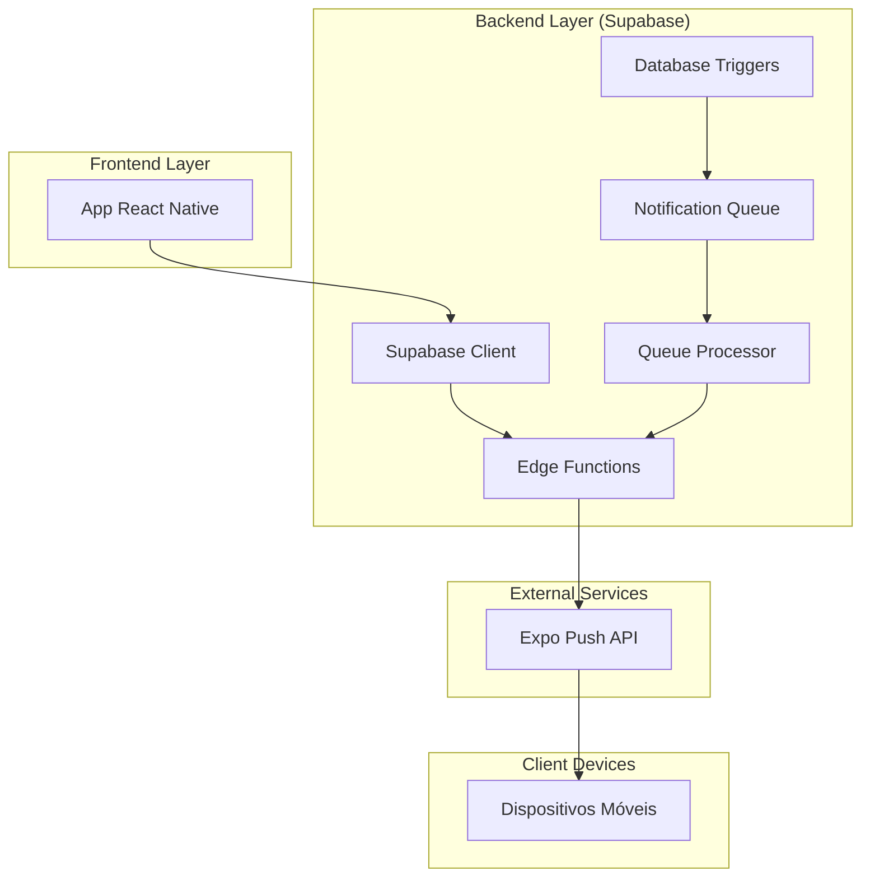

# Arquitetura Técnica - Sistema de Notificações Push

## 1. Arquitetura Geral do Sistema

### 1.1 Diagrama de Arquitetura



### 1.2 Tecnologias Utilizadas

- **Frontend**: React Native + Expo
- **Backend**: Supabase (PostgreSQL + Edge Functions)
- **Push Notifications**: Expo Push API
- **Real-time**: Supabase Realtime (WebSockets)

## 2. Estrutura de Dados

### 2.1 Tabelas Principais

#### user_notification_tokens
```sql
CREATE TABLE user_notification_tokens (
  id UUID PRIMARY KEY DEFAULT gen_random_uuid(),
  user_id UUID REFERENCES auth.users(id) ON DELETE CASCADE,
  notification_token TEXT NOT NULL,
  device_type TEXT CHECK (device_type IN ('ios', 'android', 'web')),
  device_info JSONB DEFAULT '{}',
  is_active BOOLEAN DEFAULT true,
  last_used_at TIMESTAMP WITH TIME ZONE DEFAULT NOW(),
  created_at TIMESTAMP WITH TIME ZONE DEFAULT NOW(),
  updated_at TIMESTAMP WITH TIME ZONE DEFAULT NOW(),
  
  UNIQUE(user_id, notification_token)
);

-- Índices para performance
CREATE INDEX idx_user_notification_tokens_user_id ON user_notification_tokens(user_id);
CREATE INDEX idx_user_notification_tokens_active ON user_notification_tokens(is_active) WHERE is_active = true;
```

#### notifications (Queue System)
```sql
CREATE TABLE notifications (
  id UUID PRIMARY KEY DEFAULT gen_random_uuid(),
  user_id UUID NOT NULL,
  title TEXT NOT NULL,
  body TEXT NOT NULL,
  type TEXT NOT NULL CHECK (type IN ('visitor_arrival', 'visitor_approval', 'delivery', 'communication', 'emergency', 'system')),
  data JSONB DEFAULT '{}',
  priority TEXT DEFAULT 'normal' CHECK (priority IN ('high', 'normal', 'low')),
  status TEXT DEFAULT 'pending' CHECK (status IN ('pending', 'processing', 'sent', 'failed', 'delivered', 'read')),
  retry_count INTEGER DEFAULT 0,
  max_retries INTEGER DEFAULT 3,
  scheduled_for TIMESTAMP WITH TIME ZONE DEFAULT NOW(),
  created_at TIMESTAMP WITH TIME ZONE DEFAULT NOW(),
  sent_at TIMESTAMP WITH TIME ZONE,
  delivered_at TIMESTAMP WITH TIME ZONE,
  read_at TIMESTAMP WITH TIME ZONE
);

-- Índices para queue processing
CREATE INDEX idx_notifications_status_priority ON notifications(status, priority DESC, created_at ASC);
CREATE INDEX idx_notifications_user_id ON notifications(user_id);
CREATE INDEX idx_notifications_scheduled ON notifications(scheduled_for) WHERE status = 'pending';
```

#### notification_logs
```sql
CREATE TABLE notification_logs (
  id UUID PRIMARY KEY DEFAULT gen_random_uuid(),
  notification_id UUID REFERENCES notifications(id) ON DELETE CASCADE,
  device_token TEXT NOT NULL,
  device_type TEXT,
  status TEXT NOT NULL CHECK (status IN ('sent', 'failed', 'delivered', 'read')),
  error_message TEXT,
  error_code TEXT,
  expo_receipt_id TEXT,
  response_data JSONB,
  processing_time_ms INTEGER,
  created_at TIMESTAMP WITH TIME ZONE DEFAULT NOW()
);

-- Índices para análise e cleanup
CREATE INDEX idx_notification_logs_notification_id ON notification_logs(notification_id);
CREATE INDEX idx_notification_logs_status ON notification_logs(status);
CREATE INDEX idx_notification_logs_created_at ON notification_logs(created_at);
```

### 2.2 Triggers Automáticos

#### Trigger para Chegada de Visitantes
```sql
CREATE OR REPLACE FUNCTION notify_resident_visitor_arrival()
RETURNS TRIGGER AS $$
DECLARE
  apartment_number TEXT;
  resident_user_id UUID;
BEGIN
  -- Apenas para logs de entrada de visitantes
  IF NEW.tipo_log = 'IN' AND NEW.entry_type = 'visitor' AND NEW.resident_response_by IS NOT NULL THEN
    
    -- Buscar número do apartamento
    SELECT number INTO apartment_number
    FROM apartments 
    WHERE id = NEW.apartment_id;
    
    -- Buscar user_id do morador
    SELECT user_id INTO resident_user_id
    FROM profiles 
    WHERE id = NEW.resident_response_by;
    
    -- Inserir notificação na queue
    INSERT INTO notifications (
      user_id,
      title,
      body,
      type,
      data,
      priority
    ) VALUES (
      resident_user_id,
      '🚪 Visitante Chegou',
      COALESCE(NEW.guest_name, 'Visitante') || ' chegou ao apartamento ' || COALESCE(apartment_number, 'N/A'),
      'visitor_arrival',
      jsonb_build_object(
        'visitor_name', NEW.guest_name,
        'visitor_log_id', NEW.id,
        'arrival_time', NEW.log_time,
        'apartment_id', NEW.apartment_id,
        'apartment_number', apartment_number,
        'visitor_photo', NEW.photo_url,
        'notification_type', 'visitor_arrival'
      ),
      'high'
    );
    
    -- Log da criação da notificação
    RAISE NOTICE 'Notificação de chegada criada para usuário % - Visitante: %', resident_user_id, NEW.guest_name;
    
  END IF;
  
  RETURN NEW;
END;
$$ LANGUAGE plpgsql;

-- Criar trigger
DROP TRIGGER IF EXISTS trigger_notify_resident_visitor_arrival ON visitor_logs;
CREATE TRIGGER trigger_notify_resident_visitor_arrival
  AFTER INSERT ON visitor_logs
  FOR EACH ROW
  EXECUTE FUNCTION notify_resident_visitor_arrival();
```

## 3. Edge Functions

### 3.1 send-push-notification (Melhorada)

```typescript
import { serve } from 'https://deno.land/std@0.168.0/http/server.ts';
import { createClient } from 'https://esm.sh/@supabase/supabase-js@2';

const EXPO_PUSH_API = 'https://exp.host/--/api/v2/push/send';

interface PushNotificationRequest {
  userIds?: string[];
  pushTokens?: string[];
  title: string;
  message: string;
  type: 'visitor' | 'delivery' | 'communication' | 'emergency';
  data?: Record<string, any>;
  priority?: 'high' | 'normal' | 'low';
  // Filtros alternativos
  userType?: 'admin' | 'porteiro' | 'morador';
  buildingId?: string;
  apartmentIds?: string[];
}

serve(async (req) => {
  const corsHeaders = {
    'Access-Control-Allow-Origin': '*',
    'Access-Control-Allow-Methods': 'POST, OPTIONS',
    'Access-Control-Allow-Headers': 'authorization, x-client-info, apikey, content-type',
  };

  if (req.method === 'OPTIONS') {
    return new Response('ok', { headers: corsHeaders });
  }

  const startTime = Date.now();
  
  try {
    // Validar autenticação
    const authHeader = req.headers.get('Authorization');
    if (!authHeader) {
      return new Response(JSON.stringify({ error: 'Unauthorized' }), {
        status: 401,
        headers: { ...corsHeaders, 'Content-Type': 'application/json' },
      });
    }

    const supabase = createClient(
      Deno.env.get('SUPABASE_URL') ?? '',
      Deno.env.get('SUPABASE_SERVICE_ROLE_KEY') ?? ''
    );

    const body: PushNotificationRequest = await req.json();
    const { title, message, type, data, userIds, pushTokens, priority = 'normal' } = body;

    // Validação
    if (!title || !message || !type) {
      return new Response(
        JSON.stringify({ error: 'Missing required fields: title, message, type' }),
        { status: 400, headers: { ...corsHeaders, 'Content-Type': 'application/json' } }
      );
    }

    // Buscar tokens de push
    let tokens: Array<{token: string, user_id: string, device_type: string}> = [];

    if (pushTokens && pushTokens.length > 0) {
      tokens = pushTokens.map(token => ({ token, user_id: '', device_type: 'unknown' }));
    } else if (userIds && userIds.length > 0) {
      // Buscar tokens na tabela unificada
      const { data: tokenData, error } = await supabase
        .from('user_notification_tokens')
        .select('notification_token, user_id, device_type')
        .in('user_id', userIds)
        .eq('is_active', true);

      if (error) {
        console.error('❌ Erro ao buscar tokens:', error);
      }

      tokens = (tokenData || []).map(t => ({
        token: t.notification_token,
        user_id: t.user_id,
        device_type: t.device_type
      }));

      // Fallback: buscar na tabela profiles
      if (tokens.length === 0) {
        const { data: profileTokens } = await supabase
          .from('profiles')
          .select('push_token, user_id')
          .in('user_id', userIds)
          .not('push_token', 'is', null);

        tokens = (profileTokens || []).map(p => ({
          token: p.push_token,
          user_id: p.user_id,
          device_type: 'unknown'
        }));
      }
    }

    if (tokens.length === 0) {
      return new Response(
        JSON.stringify({ 
          success: false, 
          error: 'No push tokens found',
          sent: 0, 
          failed: 0 
        }),
        { status: 200, headers: { ...corsHeaders, 'Content-Type': 'application/json' } }
      );
    }

    // Preparar mensagens para Expo
    const messages = tokens.map(({ token }) => ({
      to: token,
      sound: 'default',
      title,
      body: message,
      data: data || {},
      channelId: type,
      priority: priority === 'high' ? 'high' : 'default',
    }));

    // Enviar em lotes
    const batchSize = 100;
    let sentCount = 0;
    let failedCount = 0;
    const errors: any[] = [];

    for (let i = 0; i < messages.length; i += batchSize) {
      const batch = messages.slice(i, i + batchSize);
      
      try {
        const response = await fetch(EXPO_PUSH_API, {
          method: 'POST',
          headers: {
            'Accept': 'application/json',
            'Accept-encoding': 'gzip, deflate',
            'Content-Type': 'application/json',
          },
          body: JSON.stringify(batch),
        });

        const result = await response.json();

        if (result.data) {
          result.data.forEach((item: any, index: number) => {
            const tokenIndex = i + index;
            const tokenInfo = tokens[tokenIndex];
            
            if (item.status === 'ok') {
              sentCount++;
            } else {
              failedCount++;
              errors.push({
                token: tokenInfo.token,
                user_id: tokenInfo.user_id,
                error: item.message || 'Unknown error',
                details: item.details
              });
            }
          });
        }
      } catch (error) {
        failedCount += batch.length;
        errors.push({ error: error.message, batch_size: batch.length });
      }
    }

    const processingTime = Date.now() - startTime;

    return new Response(
      JSON.stringify({
        success: true,
        sent: sentCount,
        failed: failedCount,
        total: tokens.length,
        processing_time_ms: processingTime,
        errors: errors.length > 0 ? errors : undefined,
      }),
      { status: 200, headers: { ...corsHeaders, 'Content-Type': 'application/json' } }
    );

  } catch (error) {
    console.error('Error in send-push-notification:', error);
    
    return new Response(
      JSON.stringify({
        error: error.message || 'Internal server error',
        success: false,
        processing_time_ms: Date.now() - startTime
      }),
      { status: 500, headers: { ...corsHeaders, 'Content-Type': 'application/json' } }
    );
  }
});
```

### 3.2 process-notification-queue (Otimizada)

```typescript
import { serve } from 'https://deno.land/std@0.168.0/http/server.ts';
import { createClient } from 'https://esm.sh/@supabase/supabase-js@2';

serve(async (req) => {
  const corsHeaders = {
    'Access-Control-Allow-Origin': '*',
    'Access-Control-Allow-Headers': 'authorization, x-client-info, apikey, content-type',
  };

  if (req.method === 'OPTIONS') {
    return new Response('ok', { headers: corsHeaders });
  }

  const startTime = Date.now();

  try {
    const supabaseClient = createClient(
      Deno.env.get('SUPABASE_URL') ?? '',
      Deno.env.get('SUPABASE_SERVICE_ROLE_KEY') ?? ''
    );

    // Buscar notificações pendentes com priorização
    const { data: pendingNotifications, error: fetchError } = await supabaseClient
      .from('notifications')
      .select('*')
      .eq('status', 'pending')
      .lte('scheduled_for', new Date().toISOString())
      .lt('retry_count', supabaseClient.raw('max_retries'))
      .order('priority', { ascending: false })
      .order('created_at', { ascending: true })
      .limit(50);

    if (fetchError) {
      console.error('Error fetching pending notifications:', fetchError);
      return new Response(
        JSON.stringify({ error: 'Failed to fetch pending notifications' }),
        { status: 500, headers: { ...corsHeaders, 'Content-Type': 'application/json' } }
      );
    }

    if (!pendingNotifications || pendingNotifications.length === 0) {
      return new Response(
        JSON.stringify({ 
          success: true, 
          message: 'No pending notifications to process',
          processed_count: 0,
          processing_time_ms: Date.now() - startTime
        }),
        { status: 200, headers: { ...corsHeaders, 'Content-Type': 'application/json' } }
      );
    }

    console.log(`📱 Processing ${pendingNotifications.length} pending notifications`);

    const results = {
      processed: 0,
      successful: 0,
      failed: 0,
      errors: [] as string[]
    };

    // Processar notificações em paralelo (máximo 5 simultâneas)
    const processNotification = async (notification: any) => {
      try {
        results.processed++;

        // Marcar como processando
        await supabaseClient
          .from('notifications')
          .update({ 
            status: 'processing',
            retry_count: notification.retry_count + 1
          })
          .eq('id', notification.id);

        // Chamar send-push-notification
        const sendResponse = await fetch(`${Deno.env.get('SUPABASE_URL')}/functions/v1/send-push-notification`, {
          method: 'POST',
          headers: {
            'Authorization': `Bearer ${Deno.env.get('SUPABASE_SERVICE_ROLE_KEY')}`,
            'Content-Type': 'application/json',
          },
          body: JSON.stringify({
            userIds: [notification.user_id],
            title: notification.title,
            message: notification.body,
            type: notification.type,
            data: notification.data,
            priority: notification.priority
          })
        });

        const sendResult = await sendResponse.json();

        if (sendResult.success && sendResult.sent > 0) {
          results.successful++;
          
          // Marcar como enviada
          await supabaseClient
            .from('notifications')
            .update({ 
              status: 'sent',
              sent_at: new Date().toISOString()
            })
            .eq('id', notification.id);
            
          console.log(`✅ Notification ${notification.id} sent successfully`);
        } else {
          results.failed++;
          
          // Verificar se deve tentar novamente
          const shouldRetry = notification.retry_count < notification.max_retries;
          const newStatus = shouldRetry ? 'pending' : 'failed';
          const scheduledFor = shouldRetry 
            ? new Date(Date.now() + Math.pow(2, notification.retry_count) * 60000).toISOString() // Exponential backoff
            : null;
          
          await supabaseClient
            .from('notifications')
            .update({ 
              status: newStatus,
              ...(scheduledFor && { scheduled_for: scheduledFor })
            })
            .eq('id', notification.id);
            
          const errorMsg = `Failed to send notification ${notification.id}: ${sendResult.error || 'Unknown error'}`;
          results.errors.push(errorMsg);
          console.error(errorMsg);
        }

      } catch (error) {
        results.failed++;
        
        // Marcar como failed ou agendar retry
        const shouldRetry = notification.retry_count < notification.max_retries;
        const newStatus = shouldRetry ? 'pending' : 'failed';
        
        await supabaseClient
          .from('notifications')
          .update({ status: newStatus })
          .eq('id', notification.id);
          
        const errorMsg = `Error processing notification ${notification.id}: ${error.message}`;
        results.errors.push(errorMsg);
        console.error(errorMsg);
      }
    };

    // Processar em lotes de 5
    const batchSize = 5;
    for (let i = 0; i < pendingNotifications.length; i += batchSize) {
      const batch = pendingNotifications.slice(i, i + batchSize);
      await Promise.all(batch.map(processNotification));
    }

    // Cleanup de notificações antigas
    const cleanupDate = new Date();
    cleanupDate.setDate(cleanupDate.getDate() - 30);

    const { error: cleanupError } = await supabaseClient
      .from('notifications')
      .delete()
      .lt('created_at', cleanupDate.toISOString())
      .in('status', ['sent', 'delivered', 'read', 'failed']);

    if (cleanupError) {
      console.error('Error during cleanup:', cleanupError);
    }

    const processingTime = Date.now() - startTime;

    return new Response(
      JSON.stringify({
        success: true,
        message: `Processed ${results.processed} notifications`,
        results: {
          total_processed: results.processed,
          successful: results.successful,
          failed: results.failed,
          success_rate: results.processed > 0 ? (results.successful / results.processed * 100).toFixed(2) + '%' : '0%',
          processing_time_ms: processingTime
        },
        errors: results.errors.length > 0 ? results.errors : undefined
      }),
      { status: 200, headers: { ...corsHeaders, 'Content-Type': 'application/json' } }
    );

  } catch (error) {
    console.error('Unexpected error in queue processor:', error);
    return new Response(
      JSON.stringify({ 
        error: 'Internal server error',
        message: error.message,
        processing_time_ms: Date.now() - startTime
      }),
      { status: 500, headers: { ...corsHeaders, 'Content-Type': 'application/json' } }
    );
  }
});
```

## 4. Integração Frontend

### 4.1 Hook de Notificações

```typescript
// hooks/useNotifications.ts
import { useEffect, useState } from 'react';
import { supabase } from '../utils/supabase';
import * as Notifications from 'expo-notifications';

export const useNotifications = () => {
  const [notifications, setNotifications] = useState([]);
  const [unreadCount, setUnreadCount] = useState(0);

  // Configurar handler de notificações
  useEffect(() => {
    const subscription = Notifications.addNotificationReceivedListener(notification => {
      console.log('📱 Notificação recebida:', notification);
      
      // Atualizar lista local
      setNotifications(prev => [notification, ...prev]);
      setUnreadCount(prev => prev + 1);
      
      // Marcar como entregue no backend
      markAsDelivered(notification.request.content.data?.notificationId);
    });

    return () => subscription.remove();
  }, []);

  const markAsDelivered = async (notificationId: string) => {
    if (!notificationId) return;
    
    try {
      await supabase
        .from('notifications')
        .update({ 
          status: 'delivered',
          delivered_at: new Date().toISOString()
        })
        .eq('id', notificationId);
    } catch (error) {
      console.error('Erro ao marcar notificação como entregue:', error);
    }
  };

  const markAsRead = async (notificationId: string) => {
    try {
      await supabase
        .from('notifications')
        .update({ 
          status: 'read',
          read_at: new Date().toISOString()
        })
        .eq('id', notificationId);
        
      setUnreadCount(prev => Math.max(0, prev - 1));
    } catch (error) {
      console.error('Erro ao marcar notificação como lida:', error);
    }
  };

  return {
    notifications,
    unreadCount,
    markAsRead,
    markAsDelivered
  };
};
```

### 4.2 Configuração de Push Tokens

```typescript
// hooks/usePushNotifications.ts
import { useEffect } from 'react';
import * as Notifications from 'expo-notifications';
import * as Device from 'expo-device';
import { Platform } from 'react-native';
import { supabase } from '../utils/supabase';
import { useAuth } from './useAuth';

export const usePushNotifications = () => {
  const { user } = useAuth();

  useEffect(() => {
    registerForPushNotifications();
  }, [user]);

  const registerForPushNotifications = async () => {
    if (!Device.isDevice || !user?.id) {
      console.log('🔔 Push notifications não disponíveis');
      return;
    }

    try {
      // Verificar permissões
      const { status: existingStatus } = await Notifications.getPermissionsAsync();
      let finalStatus = existingStatus;

      if (existingStatus !== 'granted') {
        const { status } = await Notifications.requestPermissionsAsync();
        finalStatus = status;
      }

      if (finalStatus !== 'granted') {
        console.log('❌ Permissão de notificação negada');
        return;
      }

      // Obter token
      const token = (await Notifications.getExpoPushTokenAsync()).data;
      console.log('📱 Push token obtido:', token);

      // Registrar no backend
      await registerToken(token);

    } catch (error) {
      console.error('❌ Erro ao registrar push token:', error);
    }
  };

  const registerToken = async (token: string) => {
    try {
      const { error } = await supabase
        .from('user_notification_tokens')
        .upsert({
          user_id: user.id,
          notification_token: token,
          device_type: Platform.OS,
          device_info: {
            platform: Platform.OS,
            version: Platform.Version,
            model: Device.modelName
          },
          is_active: true,
          last_used_at: new Date().toISOString(),
          updated_at: new Date().toISOString()
        }, {
          onConflict: 'user_id,notification_token'
        });

      if (error) {
        console.error('❌ Erro ao salvar token:', error);
      } else {
        console.log('✅ Push token registrado com sucesso');
      }
    } catch (error) {
      console.error('❌ Erro ao registrar token:', error);
    }
  };

  return {
    registerForPushNotifications
  };
};
```

## 5. Monitoramento e Métricas

### 5.1 Dashboard de Métricas

```sql
-- View para métricas de notificações
CREATE OR REPLACE VIEW notification_metrics AS
SELECT 
  DATE(created_at) as date,
  type,
  status,
  COUNT(*) as count,
  AVG(EXTRACT(EPOCH FROM (sent_at - created_at))) as avg_processing_time_seconds
FROM notifications 
WHERE created_at >= NOW() - INTERVAL '30 days'
GROUP BY DATE(created_at), type, status
ORDER BY date DESC, type, status;

-- View para taxa de entrega
CREATE OR REPLACE VIEW delivery_rates AS
SELECT 
  type,
  COUNT(*) as total_sent,
  COUNT(CASE WHEN status IN ('delivered', 'read') THEN 1 END) as delivered,
  ROUND(
    COUNT(CASE WHEN status IN ('delivered', 'read') THEN 1 END) * 100.0 / COUNT(*), 
    2
  ) as delivery_rate_percent
FROM notifications 
WHERE status = 'sent' 
  AND created_at >= NOW() - INTERVAL '7 days'
GROUP BY type;
```

### 5.2 Alertas Automáticos

```typescript
// Edge Function: notification-health-check
const checkNotificationHealth = async () => {
  const supabase = createClient(/* ... */);
  
  // Verificar queue com muitas notificações pendentes
  const { count: pendingCount } = await supabase
    .from('notifications')
    .select('*', { count: 'exact', head: true })
    .eq('status', 'pending');
    
  if (pendingCount > 100) {
    // Enviar alerta para admins
    await sendAlert('Queue overload', `${pendingCount} notifications pending`);
  }
  
  // Verificar taxa de falha alta
  const { data: failureRate } = await supabase
    .rpc('get_failure_rate_last_hour');
    
  if (failureRate > 0.1) { // 10%
    await sendAlert('High failure rate', `${failureRate * 100}% failure rate`);
  }
};
```

## 6. Segurança e Performance

### 6.1 Rate Limiting

```sql
-- Tabela para controle de rate limiting
CREATE TABLE notification_rate_limits (
  user_id UUID PRIMARY KEY,
  notification_count INTEGER DEFAULT 0,
  window_start TIMESTAMP WITH TIME ZONE DEFAULT NOW(),
  FOREIGN KEY (user_id) REFERENCES auth.users(id)
);

-- Função para verificar rate limit
CREATE OR REPLACE FUNCTION check_rate_limit(p_user_id UUID, p_limit INTEGER DEFAULT 50)
RETURNS BOOLEAN AS $$
DECLARE
  current_count INTEGER;
  window_start TIMESTAMP WITH TIME ZONE;
BEGIN
  -- Buscar contadores atuais
  SELECT notification_count, window_start 
  INTO current_count, window_start
  FROM notification_rate_limits 
  WHERE user_id = p_user_id;
  
  -- Se não existe registro ou janela expirou (1 hora)
  IF current_count IS NULL OR window_start < NOW() - INTERVAL '1 hour' THEN
    INSERT INTO notification_rate_limits (user_id, notification_count, window_start)
    VALUES (p_user_id, 1, NOW())
    ON CONFLICT (user_id) 
    DO UPDATE SET 
      notification_count = 1,
      window_start = NOW();
    RETURN TRUE;
  END IF;
  
  -- Verificar se excedeu limite
  IF current_count >= p_limit THEN
    RETURN FALSE;
  END IF;
  
  -- Incrementar contador
  UPDATE notification_rate_limits 
  SET notification_count = notification_count + 1
  WHERE user_id = p_user_id;
  
  RETURN TRUE;
END;
$$ LANGUAGE plpgsql;
```

### 6.2 Limpeza Automática

```sql
-- Função para limpeza automática
CREATE OR REPLACE FUNCTION cleanup_old_notifications()
RETURNS INTEGER AS $$
DECLARE
  deleted_count INTEGER;
BEGIN
  -- Deletar notificações antigas (30 dias)
  DELETE FROM notifications 
  WHERE created_at < NOW() - INTERVAL '30 days'
    AND status IN ('sent', 'delivered', 'read', 'failed');
    
  GET DIAGNOSTICS deleted_count = ROW_COUNT;
  
  -- Deletar logs antigos (60 dias)
  DELETE FROM notification_logs 
  WHERE created_at < NOW() - INTERVAL '60 days';
  
  -- Limpar tokens inativos (90 dias)
  DELETE FROM user_notification_tokens 
  WHERE last_used_at < NOW() - INTERVAL '90 days'
    AND is_active = false;
    
  RETURN deleted_count;
END;
$$ LANGUAGE plpgsql;

-- Agendar limpeza diária
SELECT cron.schedule('cleanup-notifications', '0 2 * * *', 'SELECT cleanup_old_notifications();');
```

## 7. Testes e Validação

### 7.1 Testes Unitários

```typescript
// tests/notifications.test.ts
import { describe, it, expect } from '@jest/globals';
import { supabase } from '../utils/supabase';

describe('Notification System', () => {
  it('should create notification when visitor arrives', async () => {
    // Simular chegada de visitante
    const { data: visitorLog } = await supabase
      .from('visitor_logs')
      .insert({
        visitor_id: 'test-visitor',
        building_id: 'test-building',
        apartment_id: 'test-apartment',
        guest_name: 'João Silva',
        entry_type: 'visitor',
        tipo_log: 'IN',
        resident_response_by: 'test-resident'
      })
      .select()
      .single();

    // Aguardar trigger processar
    await new Promise(resolve => setTimeout(resolve, 1000));

    // Verificar se notificação foi criada
    const { data: notification } = await supabase
      .from('notifications')
      .select('*')
      .eq('type', 'visitor_arrival')
      .order('created_at', { ascending: false })
      .limit(1)
      .single();

    expect(notification).toBeTruthy();
    expect(notification.title).toBe('🚪 Visitante Chegou');
    expect(notification.body).toContain('João Silva');
  });

  it('should process notification queue', async () => {
    // Criar notificação pendente
    const { data: notification } = await supabase
      .from('notifications')
      .insert({
        user_id: 'test-user',
        title: 'Test Notification',
        body: 'Test message',
        type: 'system',
        status: 'pending'
      })
      .select()
      .single();

    // Processar queue
    const response = await fetch('/functions/v1/process-notification-queue', {
      method: 'POST',
      headers: { 'Authorization': 'Bearer test-token' }
    });

    const result = await response.json();
    expect(result.success).toBe(true);
    expect(result.results.total_processed).toBeGreaterThan(0);
  });
});
```

### 7.2 Testes de Integração

```typescript
// tests/integration/visitor-flow.test.ts
describe('Visitor Arrival Flow', () => {
  it('should complete full notification flow', async () => {
    // 1. Registrar token de push
    await registerPushToken('test-user', 'ExponentPushToken[test]');

    // 2. Simular chegada de visitante
    const visitorArrival = await simulateVisitorArrival({
      visitorName: 'Maria Santos',
      apartmentId: 'apt-101',
      residentId: 'test-user'
    });

    // 3. Verificar notificação criada
    const notification = await waitForNotification('visitor_arrival');
    expect(notification.data.visitor_name).toBe('Maria Santos');

    // 4. Processar queue
    await processNotificationQueue();

    // 5. Verificar status atualizado
    const updatedNotification = await getNotification(notification.id);
    expect(updatedNotification.status).toBe('sent');

    // 6. Verificar logs
    const logs = await getNotificationLogs(notification.id);
    expect(logs.length).toBeGreaterThan(0);
    expect(logs[0].status).toBe('sent');
  });
});
```

## 8. Deployment e Configuração

### 8.1 Variáveis de Ambiente

```bash
# .env
SUPABASE_URL=https://your-project.supabase.co
SUPABASE_SERVICE_ROLE_KEY=your-service-role-key
EXPO_PUSH_TOKEN=your-expo-access-token

# Rate limiting
NOTIFICATION_RATE_LIMIT_PER_HOUR=50
NOTIFICATION_BATCH_SIZE=100

# Queue processing
QUEUE_PROCESS_INTERVAL_MINUTES=5
MAX_RETRY_ATTEMPTS=3
RETRY_BACKOFF_MULTIPLIER=2
```

### 8.2 Deploy das Edge Functions

```bash
# Deploy individual
supabase functions deploy send-push-notification
supabase functions deploy send-notification  
supabase functions deploy process-notification-queue

# Deploy todas
supabase functions deploy

# Configurar secrets
supabase secrets set EXPO_PUSH_TOKEN=your-token
```

### 8.3 Configuração de Cron Jobs

```sql
-- Processar queue a cada 5 minutos
SELECT cron.schedule(
  'process-notification-queue',
  '*/5 * * * *',
  $$SELECT net.http_post(
    url := 'https://your-project.supabase.co/functions/v1/process-notification-queue',
    headers := '{"Authorization": "Bearer ' || current_setting('app.service_role_key') || '"}'::jsonb
  );$$
);

-- Limpeza diária às 2h
SELECT cron.schedule(
  'cleanup-notifications',
  '0 2 * * *',
  'SELECT cleanup_old_notifications();'
);
```

Esta arquitetura técnica fornece uma base sólida e escalável para o sistema de notificações push, com foco na confiabilidade, performance e facilidade de manutenção.