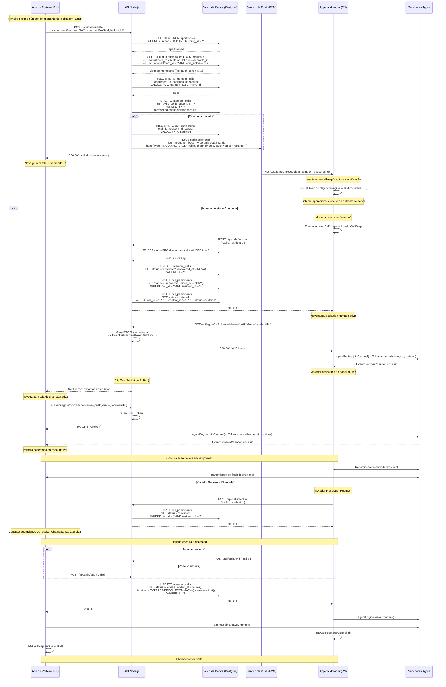

# Plano Técnico Completo: Sistema de Interfone com Agora Voice SDK

**Autor:** Manus AI  
**Data:** 21 de Outubro de 2025  
**Versão:** 1.0

---

## Sumário Executivo

Este documento apresenta um plano técnico detalhado e prático para implementar um sistema de chamadas de voz de aplicativo para aplicativo (app-to-app) utilizando o **Agora Voice SDK**, **React Native**, e **Node.js**. O sistema foi projetado especificamente para funcionar como um interfone digital, permitindo que porteiros iniciem chamadas para apartamentos e que moradores recebam, aceitem ou recusem essas chamadas através de uma interface nativa de telefone, proporcionando uma experiência de usuário familiar e intuitiva.

O sistema é composto por três componentes principais: um aplicativo móvel desenvolvido em React Native para porteiros e moradores, uma API de backend em Node.js que orquestra a lógica de negócios e gerencia o estado das chamadas, e os serviços de comunicação em tempo real da Agora, que transmitem o áudio entre os participantes. A arquitetura foi cuidadosamente desenhada para ser segura, escalável e aproveitar as tabelas existentes no banco de dados PostgreSQL do projeto.

---

## 1. Visão Geral da Solução

### 1.1 Objetivo

Criar um sistema de interfone digital que permita a comunicação por voz entre porteiros e moradores de um edifício, onde:

*   O **porteiro** digita o número do apartamento e inicia uma chamada.
*   Todos os **moradores** cadastrados no apartamento recebem uma notificação push instantânea.
*   O **primeiro morador** que aceitar a chamada estabelece a conexão de voz com o porteiro.
*   A comunicação ocorre em tempo real, com baixa latência e alta qualidade de áudio, como em uma chamada telefônica tradicional.
*   O sistema registra todas as chamadas, incluindo status, duração e participantes, no banco de dados para fins de auditoria e histórico.

### 1.2 Tecnologias Utilizadas

A solução integra tecnologias modernas e robustas para garantir desempenho e confiabilidade:

| Tecnologia | Função | Justificativa |
|---|---|---|
| **Agora Voice SDK** | Comunicação de voz em tempo real (RTC) | Plataforma líder em comunicação em tempo real, com baixa latência global e alta qualidade de áudio. Oferece SDKs nativos para React Native. |
| **React Native** | Desenvolvimento do aplicativo móvel | Framework multiplataforma que permite criar aplicativos nativos para iOS e Android com uma única base de código JavaScript/TypeScript. |
| **Node.js + Express** | Backend da API | Ambiente de execução JavaScript no servidor, ideal para aplicações I/O intensivas e em tempo real. Express é um framework web minimalista e flexível. |
| **PostgreSQL** | Banco de dados relacional | Sistema de gerenciamento de banco de dados robusto e de código aberto, já utilizado no projeto. |
| **Firebase Cloud Messaging (FCM)** | Notificações push | Serviço gratuito do Google para enviar notificações push para dispositivos Android e iOS, essencial para acordar o aplicativo em background. |
| **react-native-callkeep** | Interface de chamada nativa | Biblioteca que integra com CallKit (iOS) e ConnectionService (Android), exibindo a interface de chamada nativa do sistema operacional. |

### 1.3 Fluxo de Funcionamento Simplificado

1.  **Porteiro inicia a chamada:** O porteiro digita o número do apartamento no aplicativo e pressiona o botão "Ligar".
2.  **Backend processa a requisição:** A API busca os moradores associados ao apartamento no banco de dados, cria um registro da chamada e envia notificações push para todos os moradores.
3.  **Moradores recebem notificação:** Os aplicativos dos moradores, mesmo em background ou fechados, recebem a notificação e exibem uma tela de chamada recebida nativa (como uma chamada telefônica normal).
4.  **Morador aceita a chamada:** O primeiro morador que aceitar a chamada notifica o backend, que atualiza o status da chamada no banco de dados.
5.  **Conexão estabelecida:** Tanto o morador quanto o porteiro solicitam tokens de autenticação ao backend e se conectam ao mesmo canal de voz da Agora.
6.  **Comunicação de voz:** A conversa acontece em tempo real, com o áudio sendo transmitido diretamente entre os dispositivos através da infraestrutura global da Agora.
7.  **Encerramento:** Qualquer um dos participantes pode encerrar a chamada. O backend registra a duração e o status final no banco de dados.

---

## 2. Arquitetura do Sistema

### 2.1 Componentes Principais

A arquitetura do sistema é dividida em três camadas principais, cada uma com responsabilidades bem definidas:

#### 2.1.1 Aplicativo React Native (Cliente)

O aplicativo móvel serve como a interface principal para os usuários. Ele possui dois modos de operação, dependendo do tipo de usuário logado:

*   **Modo Porteiro:**
    *   Interface para digitar o número do apartamento.
    *   Botão para iniciar a chamada.
    *   Tela de "chamando..." enquanto aguarda o morador atender.
    *   Tela de chamada ativa com controles de áudio (mudo, alto-falante) e botão para encerrar.

*   **Modo Morador:**
    *   Recebe notificações push de chamadas recebidas.
    *   Exibe a interface de chamada nativa do sistema operacional (iOS CallKit ou Android ConnectionService) através da biblioteca `react-native-callkeep`.
    *   Permite aceitar ou recusar a chamada.
    *   Tela de chamada ativa com controles de áudio e botão para encerrar.

**Responsabilidades:**
*   Capturar as ações do usuário (iniciar, aceitar, recusar, encerrar chamada).
*   Comunicar-se com a API backend para orquestrar as chamadas.
*   Gerenciar a conexão com o canal de voz da Agora (inicializar o SDK, entrar e sair de canais).
*   Exibir a interface de usuário apropriada para cada estado da chamada.

#### 2.1.2 API de Backend (Node.js)

O backend atua como o cérebro do sistema, gerenciando toda a lógica de negócios e a persistência de dados.

**Responsabilidades:**
*   **Autenticação e Autorização:** Validar as requisições dos aplicativos e garantir que apenas usuários autorizados possam executar ações.
*   **Orquestração de Chamadas:**
    *   Receber requisições de início de chamada do porteiro.
    *   Buscar os moradores do apartamento no banco de dados.
    *   Criar registros de chamada e participantes no banco de dados.
    *   Enviar notificações push para os moradores.
    *   Receber confirmações de aceite/recusa dos moradores.
    *   Atualizar o status das chamadas no banco de dados.
*   **Geração de Tokens Seguros:** Gerar tokens de autenticação da Agora (RTC tokens) para permitir que os aplicativos se conectem aos canais de voz de forma segura. **Nunca expor o App Certificate da Agora no código do aplicativo.**
*   **Gerenciamento de Estado:** Manter o estado atual de cada chamada e notificar os participantes sobre mudanças de estado (ex: "chamada atendida").

#### 2.1.3 Serviços da Agora (Plataforma de Comunicação)

A Agora fornece a infraestrutura de comunicação em tempo real. Seus servidores globalmente distribuídos garantem baixa latência e alta qualidade de áudio.

**Responsabilidades:**
*   **Roteamento de Áudio:** Transmitir o áudio capturado pelo microfone de um usuário para o alto-falante do outro usuário em tempo real.
*   **Otimização de Rede:** Gerenciar a qualidade da conexão, adaptar-se a diferentes condições de rede e minimizar a perda de pacotes.
*   **Escalabilidade:** Suportar múltiplas chamadas simultâneas sem degradação de desempenho.

### 2.2 Diagrama de Sequência Detalhado

O diagrama abaixo ilustra a sequência completa de eventos e interações entre os componentes do sistema durante uma chamada, desde o momento em que o porteiro inicia a chamada até o seu encerramento.



**Legenda do Diagrama:**

*   **Linhas sólidas (→):** Requisições síncronas (o remetente aguarda a resposta).
*   **Linhas tracejadas (-->>):** Respostas ou notificações assíncronas.
*   **Caixas de Nota:** Explicações ou ações internas de um componente.
*   **Blocos `alt`:** Fluxos alternativos (ex: aceitar vs. recusar).
*   **Blocos `loop`:** Ações repetidas (ex: enviar notificação para cada morador).

### 2.3 Estrutura do Banco de Dados

O sistema utiliza as tabelas existentes no banco de dados PostgreSQL do projeto. As tabelas mais relevantes para o sistema de chamadas são detalhadas abaixo, com foco nos campos que serão utilizados e em como eles se relacionam.

#### Tabela: `intercom_calls`

Armazena o registro mestre de cada chamada de interfone.

| Campo | Tipo | Descrição | Uso no Sistema |
|---|---|---|---|
| `id` | UUID | Identificador único da chamada | **Chave primária.** Também usado como `channelName` da Agora para garantir unicidade. |
| `apartment_id` | UUID | Referência ao apartamento sendo chamado | Identifica qual apartamento o porteiro está tentando contatar. |
| `doorman_id` | UUID | Referência ao perfil do porteiro que iniciou a chamada | Identifica quem iniciou a chamada. |
| `status` | VARCHAR | Estado atual da chamada | Valores: `'calling'` (chamando), `'answered'` (atendida), `'ended'` (encerrada), `'missed'` (não atendida), `'declined'` (recusada). |
| `started_at` | TIMESTAMP | Data e hora em que a chamada foi iniciada | Registra quando o porteiro clicou em "Ligar". |
| `answered_at` | TIMESTAMP | Data e hora em que a chamada foi atendida | Registra quando um morador aceitou a chamada. |
| `ended_at` | TIMESTAMP | Data e hora em que a chamada foi encerrada | Registra quando a chamada terminou. |
| `duration` | INTEGER | Duração da chamada em segundos | Calculado como `ended_at - answered_at`. |
| `twilio_conference_sid` | VARCHAR | **Reutilizado para armazenar o `channelName` da Agora** | Armazena o UUID da chamada (`id`), que é usado como nome do canal de voz na Agora. |

#### Tabela: `call_participants`

Rastreia o estado de cada morador que foi convidado para a chamada. Um apartamento pode ter múltiplos moradores, e todos receberão a notificação.

| Campo | Tipo | Descrição | Uso no Sistema |
|---|---|---|---|
| `id` | UUID | Identificador único do participante | Chave primária. |
| `call_id` | UUID | Referência à chamada (`intercom_calls.id`) | Associa o participante a uma chamada específica. |
| `resident_id` | UUID | Referência ao perfil do morador (`profiles.id`) | Identifica qual morador é este participante. |
| `status` | VARCHAR | Estado do participante na chamada | Valores: `'notified'` (notificado), `'answered'` (atendeu), `'declined'` (recusou), `'missed'` (perdeu). |
| `joined_at` | TIMESTAMP | Data e hora em que o morador entrou na chamada | Registra quando o morador aceitou e se conectou ao canal de voz. |
| `left_at` | TIMESTAMP | Data e hora em que o morador saiu da chamada | Registra quando o morador encerrou a chamada. |

#### Tabela: `apartments`

Define os apartamentos do edifício.

| Campo | Tipo | Descrição | Uso no Sistema |
|---|---|---|---|
| `id` | UUID | Identificador único do apartamento | Chave primária. |
| `building_id` | UUID | Referência ao prédio | Garante que o porteiro só possa ligar para apartamentos do seu prédio. |
| `number` | TEXT | Número do apartamento | **O porteiro digita este valor.** Ex: "101", "202A". |

#### Tabela: `apartment_residents`

Relaciona moradores aos apartamentos. Um apartamento pode ter vários moradores (proprietário, familiares, inquilinos, etc.).

| Campo | Tipo | Descrição | Uso no Sistema |
|---|---|---|---|
| `id` | UUID | Identificador único da relação | Chave primária. |
| `apartment_id` | UUID | Referência ao apartamento | Identifica a qual apartamento o morador pertence. |
| `profile_id` | UUID | Referência ao perfil do morador (`profiles.id`) | Identifica o morador. |
| `is_active` | BOOLEAN | Se o morador está ativo | Apenas moradores ativos (`is_active = true`) receberão notificações de chamada. |
| `is_primary` | BOOLEAN | Se é o morador principal | Pode ser usado para ordenar a lista de moradores (ex: notificar o morador principal primeiro). |

#### Tabela: `profiles`

Armazena os perfis de todos os usuários do sistema (porteiros, moradores, administradores).

| Campo | Tipo | Descrição | Uso no Sistema |
|---|---|---|---|
| `id` | UUID | Identificador único do perfil | Chave primária. |
| `user_id` | UUID | Referência ao usuário de autenticação (`auth.users.id`) | Vincula o perfil a uma conta de login. |
| `full_name` | TEXT | Nome completo do usuário | Exibido na interface (ex: "João Silva está ligando"). |
| `push_token` | TEXT | **Token de notificação push do dispositivo** | **Campo crucial.** Usado para enviar notificações push via Firebase Cloud Messaging. |
| `building_id` | UUID | Referência ao prédio | Identifica a qual prédio o usuário pertence. |
| `role` | TEXT | Papel do usuário | Ex: "porteiro", "morador", "admin". |
| `notification_enabled` | BOOLEAN | Se o usuário habilitou notificações | Verifica se o usuário deseja receber notificações. |

---

## 3. Implementação Detalhada

Esta seção fornece guias passo a passo para a implementação de cada componente do sistema, incluindo exemplos de código completos e prontos para uso.

### 3.1 Backend (Node.js + Express)

#### 3.1.1 Configuração Inicial do Projeto

**Passo 1: Criar a estrutura de pastas**

```bash
mkdir interfone-backend
cd interfone-backend
npm init -y
```

**Passo 2: Instalar as dependências**

```bash
npm install express pg dotenv agora-access-token cors
```

*   **`express`**: Framework web para criar a API.
*   **`pg`**: Cliente PostgreSQL para Node.js.
*   **`dotenv`**: Carrega variáveis de ambiente de um arquivo `.env`.
*   **`agora-access-token`**: Biblioteca oficial da Agora para gerar tokens RTC.
*   **`cors`**: Middleware para habilitar CORS (Cross-Origin Resource Sharing), permitindo que o aplicativo React Native faça requisições para a API.

**Passo 3: Criar o arquivo `.env`**

Crie um arquivo chamado `.env` na raiz do projeto e adicione as seguintes variáveis:

```env
# Configurações do Banco de Dados PostgreSQL
DB_USER=seu_usuario_postgres
DB_HOST=localhost
DB_DATABASE=nome_do_seu_banco
DB_PASSWORD=sua_senha_postgres
DB_PORT=5432

# Credenciais da Agora (obtenha no console da Agora)
AGORA_APP_ID=seu_app_id_da_agora
AGORA_APP_CERTIFICATE=seu_app_certificate_da_agora

# Porta do servidor
PORT=3000
```

**Importante:** Substitua os valores de exemplo pelas suas credenciais reais. **Nunca comite o arquivo `.env` no controle de versão (Git).** Adicione `.env` ao seu arquivo `.gitignore`.

**Passo 4: Estrutura de pastas sugerida**

```
interfone-backend/
├── src/
│   ├── controllers/
│   │   ├── call.controller.js
│   │   └── token.controller.js
│   ├── routes/
│   │   ├── call.routes.js
│   │   └── token.routes.js
│   ├── services/
│   │   ├── db.service.js
│   │   └── push.service.js
│   └── index.js
├── .env
├── .gitignore
└── package.json
```

#### 3.1.2 Serviço de Banco de Dados

**Arquivo: `src/services/db.service.js`**

Este serviço encapsula a conexão com o banco de dados PostgreSQL.

```javascript
const { Pool } = require('pg');
require('dotenv').config();

const pool = new Pool({
    user: process.env.DB_USER,
    host: process.env.DB_HOST,
    database: process.env.DB_DATABASE,
    password: process.env.DB_PASSWORD,
    port: process.env.DB_PORT,
});

module.exports = {
    query: (text, params) => pool.query(text, params),
};
```

#### 3.1.3 Serviço de Notificações Push (Placeholder)

**Arquivo: `src/services/push.service.js`**

Este é um placeholder. Você precisará integrar com o Firebase Admin SDK para enviar notificações push reais. Consulte a documentação do Firebase para detalhes.

```javascript
// Placeholder para o serviço de notificações push
// Integre com o Firebase Admin SDK aqui

const sendNotification = async (pushToken, payload) => {
    console.log(`Enviando notificação para ${pushToken}:`, payload);
    // TODO: Implementar o envio real usando Firebase Admin SDK
    // Exemplo:
    // const admin = require('firebase-admin');
    // const message = {
    //     token: pushToken,
    //     notification: {
    //         title: payload.title,
    //         body: payload.body,
    //     },
    //     data: payload.data,
    // };
    // await admin.messaging().send(message);
    return Promise.resolve(); // Simula sucesso
};

module.exports = { sendNotification };
```

#### 3.1.4 Controller de Geração de Tokens

**Arquivo: `src/controllers/token.controller.js`**

Este controller é responsável por gerar os tokens RTC da Agora de forma segura.

```javascript
const { RtcTokenBuilder, RtcRole } = require('agora-access-token');
require('dotenv').config();

const generateRtcToken = (req, res) => {
    // Cabeçalhos para evitar cache e problemas de CORS
    res.header('Access-Control-Allow-Origin', '*');
    res.header('Cache-Control', 'private, no-cache, no-store, must-revalidate');
    res.header('Pragma', 'no-cache');
    res.header('Expires', '-1');

    const { channelName, uid } = req.query;

    // Validação dos parâmetros obrigatórios
    if (!channelName) {
        return res.status(400).json({ error: 'O parâmetro channelName é obrigatório' });
    }
    if (!uid) {
        return res.status(400).json({ error: 'O parâmetro uid é obrigatório' });
    }

    // Configurações do token
    const role = RtcRole.PUBLISHER; // Tanto porteiro quanto morador publicam áudio
    const expireTime = 3600; // Token válido por 1 hora (3600 segundos)
    const currentTime = Math.floor(Date.now() / 1000);
    const privilegeExpireTime = currentTime + expireTime;

    try {
        // Gera o token usando a biblioteca da Agora
        const token = RtcTokenBuilder.buildTokenWithUid(
            process.env.AGORA_APP_ID,
            process.env.AGORA_APP_CERTIFICATE,
            channelName,
            Number(uid), // uid deve ser um inteiro de 32 bits
            role,
            privilegeExpireTime
        );

        return res.json({ rtcToken: token });
    } catch (error) {
        console.error('Erro ao gerar token RTC:', error);
        return res.status(500).json({ error: 'Falha ao gerar o token RTC' });
    }
};

module.exports = { generateRtcToken };
```

#### 3.1.5 Controller de Orquestração de Chamadas

**Arquivo: `src/controllers/call.controller.js`**

Este é o coração da lógica de negócios do backend. Ele gerencia todo o ciclo de vida de uma chamada.

```javascript
const db = require('../services/db.service');
const push = require('../services/push.service');

// 1. Porteiro inicia a chamada
const initiateCall = async (req, res) => {
    const { apartmentNumber, doormanProfileId, buildingId } = req.body;

    // Validação dos parâmetros
    if (!apartmentNumber || !doormanProfileId || !buildingId) {
        return res.status(400).json({ error: 'Parâmetros obrigatórios faltando' });
    }

    try {
        // Passo 1: Encontrar o apartamento pelo número e prédio
        const apartmentRes = await db.query(
            'SELECT id FROM apartments WHERE number = $1 AND building_id = $2',
            [apartmentNumber, buildingId]
        );
        if (apartmentRes.rows.length === 0) {
            return res.status(404).json({ error: 'Apartamento não encontrado' });
        }
        const apartmentId = apartmentRes.rows[0].id;

        // Passo 2: Criar o registro da chamada no banco de dados
        const callRes = await db.query(
            'INSERT INTO intercom_calls (apartment_id, doorman_id, status, started_at) VALUES ($1, $2, $3, NOW()) RETURNING id',
            [apartmentId, doormanProfileId, 'calling']
        );
        const callId = callRes.rows[0].id;

        // O channelName será o UUID da chamada para garantir unicidade
        const channelName = callId;
        await db.query(
            'UPDATE intercom_calls SET twilio_conference_sid = $1 WHERE id = $2',
            [channelName, callId]
        );

        // Passo 3: Encontrar todos os moradores ativos do apartamento
        const residentsRes = await db.query(
            `SELECT p.id, p.push_token, p.notification_enabled 
             FROM profiles p 
             INNER JOIN apartment_residents ar ON p.id = ar.profile_id 
             WHERE ar.apartment_id = $1 AND ar.is_active = true
             ORDER BY ar.is_primary DESC`,
            [apartmentId]
        );
        const residents = residentsRes.rows;

        if (residents.length === 0) {
            // Nenhum morador ativo encontrado, marca a chamada como 'missed'
            await db.query('UPDATE intercom_calls SET status = $1 WHERE id = $2', ['missed', callId]);
            return res.status(404).json({ error: 'Nenhum morador ativo encontrado para este apartamento' });
        }

        // Passo 4: Registrar cada morador como participante e enviar notificações
        const notifications = [];
        for (const resident of residents) {
            // Insere o participante na tabela call_participants
            await db.query(
                'INSERT INTO call_participants (call_id, resident_id, status, created_at) VALUES ($1, $2, $3, NOW())',
                [callId, resident.id, 'notified']
            );

            // Envia notificação push se o morador tiver um push_token e notificações habilitadas
            if (resident.push_token && resident.notification_enabled) {
                notifications.push(
                    push.sendNotification(resident.push_token, {
                        title: 'Interfone',
                        body: 'A portaria está ligando.',
                        data: {
                            type: 'INCOMING_CALL',
                            callId: callId,
                            channelName: channelName,
                            callerName: 'Portaria'
                        }
                    })
                );
            }
        }

        // Aguarda o envio de todas as notificações
        await Promise.all(notifications);

        // Retorna sucesso para o app do porteiro
        res.status(200).json({ 
            message: 'Chamada iniciada com sucesso', 
            callId: callId, 
            channelName: channelName 
        });

    } catch (error) {
        console.error('Erro ao iniciar chamada:', error);
        res.status(500).json({ error: 'Erro interno do servidor' });
    }
};

// 2. Morador atende a chamada
const answerCall = async (req, res) => {
    const { callId, residentId } = req.body;

    if (!callId || !residentId) {
        return res.status(400).json({ error: 'Parâmetros obrigatórios faltando' });
    }

    try {
        // Verifica se a chamada ainda está no estado 'calling'
        const callStatusRes = await db.query(
            'SELECT status FROM intercom_calls WHERE id = $1',
            [callId]
        );
        if (callStatusRes.rows.length === 0) {
            return res.status(404).json({ error: 'Chamada não encontrada' });
        }
        if (callStatusRes.rows[0].status !== 'calling') {
            return res.status(409).json({ error: 'Chamada não está mais disponível para ser atendida' });
        }

        // Atualiza o status da chamada principal para 'answered'
        await db.query(
            'UPDATE intercom_calls SET status = $1, answered_at = NOW() WHERE id = $2',
            ['answered', callId]
        );

        // Atualiza o status do participante que atendeu para 'answered'
        await db.query(
            'UPDATE call_participants SET status = $1, joined_at = NOW() WHERE call_id = $2 AND resident_id = $3',
            ['answered', callId, residentId]
        );

        // Atualiza os outros moradores que foram notificados para 'missed'
        await db.query(
            'UPDATE call_participants SET status = $1 WHERE call_id = $2 AND resident_id != $3 AND status = $4',
            ['missed', callId, residentId, 'notified']
        );

        // TODO: Notificar o porteiro via WebSocket que a chamada foi atendida
        // Ex: io.to(doormanSocketId).emit('call_answered', { callId });

        res.status(200).json({ message: 'Chamada atendida com sucesso' });
    } catch (error) {
        console.error('Erro ao atender chamada:', error);
        res.status(500).json({ error: 'Erro interno do servidor' });
    }
};

// 3. Morador recusa a chamada
const declineCall = async (req, res) => {
    const { callId, residentId } = req.body;

    if (!callId || !residentId) {
        return res.status(400).json({ error: 'Parâmetros obrigatórios faltando' });
    }

    try {
        // Atualiza o status do participante para 'declined'
        await db.query(
            'UPDATE call_participants SET status = $1 WHERE call_id = $2 AND resident_id = $3',
            ['declined', callId, residentId]
        );

        // Verifica se todos os moradores recusaram ou perderam a chamada
        const participantsRes = await db.query(
            'SELECT status FROM call_participants WHERE call_id = $1',
            [callId]
        );
        const allDeclinedOrMissed = participantsRes.rows.every(
            row => row.status === 'declined' || row.status === 'missed'
        );

        if (allDeclinedOrMissed) {
            // Se todos recusaram/perderam, marca a chamada como 'missed'
            await db.query(
                'UPDATE intercom_calls SET status = $1, ended_at = NOW() WHERE id = $2',
                ['missed', callId]
            );
        }

        res.status(200).json({ message: 'Chamada recusada' });
    } catch (error) {
        console.error('Erro ao recusar chamada:', error);
        res.status(500).json({ error: 'Erro interno do servidor' });
    }
};

// 4. Encerrar a chamada
const endCall = async (req, res) => {
    const { callId } = req.body;

    if (!callId) {
        return res.status(400).json({ error: 'callId é obrigatório' });
    }

    try {
        // Tenta atualizar a chamada se ela foi atendida (calcula a duração)
        const result = await db.query(
            `UPDATE intercom_calls 
             SET status = 'ended', ended_at = NOW(), duration = EXTRACT(EPOCH FROM (NOW() - answered_at))::INTEGER
             WHERE id = $1 AND status = 'answered' 
             RETURNING id`,
            [callId]
        );

        // Se a chamada não foi atendida, apenas marca como 'ended'
        if (result.rows.length === 0) {
            await db.query(
                `UPDATE intercom_calls SET status = 'ended', ended_at = NOW() WHERE id = $1 AND status IN ('calling', 'missed')`,
                [callId]
            );
        }

        // Atualiza o participante que estava na chamada (se houver)
        await db.query(
            `UPDATE call_participants SET left_at = NOW() WHERE call_id = $1 AND status = 'answered'`,
            [callId]
        );

        res.status(200).json({ message: 'Chamada encerrada com sucesso' });
    } catch (error) {
        console.error('Erro ao encerrar chamada:', error);
        res.status(500).json({ error: 'Erro interno do servidor' });
    }
};

module.exports = { initiateCall, answerCall, declineCall, endCall };
```

#### 3.1.6 Rotas da API

**Arquivo: `src/routes/token.routes.js`**

```javascript
const express = require('express');
const router = express.Router();
const tokenController = require('../controllers/token.controller');

// Rota para gerar token RTC da Agora
router.get('/rtc', tokenController.generateRtcToken);

module.exports = router;
```

**Arquivo: `src/routes/call.routes.js`**

```javascript
const express = require('express');
const router = express.Router();
const callController = require('../controllers/call.controller');

// Rotas para orquestração de chamadas
router.post('/initiate', callController.initiateCall);
router.post('/answer', callController.answerCall);
router.post('/decline', callController.declineCall);
router.post('/end', callController.endCall);

module.exports = router;
```

#### 3.1.7 Arquivo Principal do Servidor

**Arquivo: `src/index.js`**

```javascript
const express = require('express');
const cors = require('cors');
require('dotenv').config();

const tokenRoutes = require('./routes/token.routes');
const callRoutes = require('./routes/call.routes');

const app = express();
const PORT = process.env.PORT || 3000;

// Middlewares
app.use(cors()); // Habilita CORS para todas as rotas
app.use(express.json()); // Parser de JSON no body das requisições

// Rotas
app.use('/api/agora', tokenRoutes);
app.use('/api/calls', callRoutes);

// Rota de teste
app.get('/ping', (req, res) => {
    res.json({ message: 'pong' });
});

// Inicia o servidor
app.listen(PORT, () => {
    console.log(`Servidor rodando na porta ${PORT}`);
});
```

#### 3.1.8 Executando o Backend

**Passo 1: Adicionar script de start no `package.json`**

Abra o arquivo `package.json` e adicione o seguinte script:

```json
{
  "scripts": {
    "start": "node src/index.js"
  }
}
```

**Passo 2: Iniciar o servidor**

```bash
npm start
```

Você deverá ver a mensagem: `Servidor rodando na porta 3000`.

**Passo 3: Testar os endpoints**

Use uma ferramenta como Postman, Insomnia ou cURL para testar os endpoints:

*   **Ping:**
    ```bash
    curl http://localhost:3000/ping
    ```
    Resposta esperada: `{"message":"pong"}`

*   **Gerar Token RTC:**
    ```bash
    curl "http://localhost:3000/api/agora/rtc?channelName=test-channel&uid=1234"
    ```
    Resposta esperada: `{"rtcToken":"006abc..."}`

---

### 3.2 Frontend (React Native)

#### 3.2.1 Configuração Inicial do Projeto

**Passo 1: Instalar as dependências**

Assumindo que você já tem um projeto React Native configurado:

```bash
npm install react-native-agora react-native-callkeep @react-native-firebase/app @react-native-firebase/messaging axios
```

*   **`react-native-agora`**: SDK da Agora para React Native.
*   **`react-native-callkeep`**: Para exibir a interface de chamada nativa.
*   **`@react-native-firebase/app` e `@react-native-firebase/messaging`**: Para notificações push.
*   **`axios`**: Cliente HTTP para fazer requisições à API.

**Passo 2: Configuração Nativa**

**Importante:** As bibliotecas `react-native-agora`, `react-native-callkeep` e Firebase requerem configuração nativa adicional para Android e iOS. Siga cuidadosamente as instruções de instalação de cada biblioteca:

*   **react-native-agora:** [https://docs.agora.io/en/voice-calling/get-started/get-started-sdk?platform=react-native](https://docs.agora.io/en/voice-calling/get-started/get-started-sdk?platform=react-native)
*   **react-native-callkeep:** [https://github.com/react-native-webrtc/react-native-callkeep](https://github.com/react-native-webrtc/react-native-callkeep)
*   **Firebase:** [https://rnfirebase.io/](https://rnfirebase.io/)

**Passo 3: Configurar Permissões**

**Android (`android/app/src/main/AndroidManifest.xml`):**

```xml
<uses-permission android:name="android.permission.INTERNET" />
<uses-permission android:name="android.permission.RECORD_AUDIO" />
<uses-permission android:name="android.permission.MODIFY_AUDIO_SETTINGS" />
<uses-permission android:name="android.permission.ACCESS_NETWORK_STATE" />
<uses-permission android:name="android.permission.BLUETOOTH" />
<uses-permission android:name="android.permission.WAKE_LOCK" />
<uses-permission android:name="android.permission.USE_FULL_SCREEN_INTENT" />
```

**iOS (`ios/YourProjectName/Info.plist`):**

```xml
<key>NSMicrophoneUsageDescription</key>
<string>Este aplicativo precisa acessar o microfone para chamadas de voz.</string>
```

#### 3.2.2 Configuração da API (Axios)

**Arquivo: `src/services/api.js`**

Crie uma instância do Axios com a URL base da sua API.

```javascript
import axios from 'axios';

const api = axios.create({
    baseURL: 'http://SEU_IP_DO_BACKEND:3000/api', // Substitua pelo IP do seu backend
    timeout: 10000,
});

export default api;
```

**Importante:** Substitua `SEU_IP_DO_BACKEND` pelo endereço IP real do seu servidor backend. Se estiver testando localmente, use o IP da sua máquina na rede local (não use `localhost` no dispositivo físico).

#### 3.2.3 Context API para Gerenciamento de Estado

**Arquivo: `src/context/CallContext.js`**

```javascript
import React, { createContext, useState, useContext } from 'react';

const CallContext = createContext();

export const CallProvider = ({ children }) => {
    const [callState, setCallState] = useState(null); 
    // callState: { callId, channelName, status: 'ringing' | 'connecting' | 'connected' }
    const [agoraEngine, setAgoraEngine] = useState(null);

    const value = {
        callState,
        setCallState,
        agoraEngine,
        setAgoraEngine,
    };

    return <CallContext.Provider value={value}>{children}</CallContext.Provider>;
};

export const useCall = () => {
    const context = useContext(CallContext);
    if (!context) {
        throw new Error('useCall deve ser usado dentro de um CallProvider');
    }
    return context;
};
```

**Envolver o App com o Provider:**

**Arquivo: `App.js`**

```javascript
import React from 'react';
import { CallProvider } from './src/context/CallContext';
import RootNavigator from './src/navigation/RootNavigator'; // Seu navegador principal

const App = () => {
    return (
        <CallProvider>
            <RootNavigator />
        </CallProvider>
    );
};

export default App;
```

#### 3.2.4 Hook Personalizado para a Agora

**Arquivo: `src/hooks/useAgora.js`**

Este hook encapsula toda a lógica de interação com o Agora Voice SDK.

```javascript
import { useRef, useEffect } from 'react';
import { Platform, PermissionsAndroid } from 'react-native';
import { 
    createAgoraRtcEngine, 
    ChannelProfileType, 
    ClientRoleType 
} from 'react-native-agora';
import RNCallKeep from 'react-native-callkeep';
import { useCall } from '../context/CallContext';
import api from '../services/api';

const AGORA_APP_ID = 'seu_app_id_da_agora'; // Substitua pelo seu App ID

export const useAgora = () => {
    const { callState, setCallState, agoraEngine, setAgoraEngine } = useCall();
    const isAgoraInitialized = useRef(false);

    // Solicita permissões de áudio (Android)
    const getPermission = async () => {
        if (Platform.OS === 'android') {
            await PermissionsAndroid.requestMultiple([
                PermissionsAndroid.PERMISSIONS.RECORD_AUDIO,
            ]);
        }
    };

    // Inicializa o motor da Agora
    useEffect(() => {
        const initAgora = async () => {
            if (isAgoraInitialized.current) return;
            try {
                await getPermission();
                const engine = createAgoraRtcEngine();
                await engine.initialize({ appId: AGORA_APP_ID });
                setAgoraEngine(engine);
                isAgoraInitialized.current = true;

                // Registra os event handlers da Agora
                engine.registerEventHandler({
                    onJoinChannelSuccess: (connection, elapsed) => {
                        console.log('Entrou no canal com sucesso:', connection.channelId);
                        setCallState(prev => ({ ...prev, status: 'connected' }));
                    },
                    onUserJoined: (connection, remoteUid, elapsed) => {
                        console.log('Usuário remoto entrou no canal:', remoteUid);
                    },
                    onUserOffline: (connection, remoteUid, reason) => {
                        console.log('Usuário remoto saiu do canal:', remoteUid);
                        // Pode encerrar a chamada automaticamente se o outro usuário sair
                        // endCall();
                    },
                    onError: (err, msg) => {
                        console.error('Erro da Agora:', err, msg);
                    },
                });
            } catch (e) {
                console.error('Erro ao inicializar Agora:', e);
            }
        };
        initAgora();

        // Cleanup ao desmontar o componente
        return () => {
            if (agoraEngine) {
                agoraEngine.release();
            }
        };
    }, []);

    // Função para entrar na chamada
    const joinCall = async (callId, channelName, userId) => {
        if (!agoraEngine) {
            console.error('Motor da Agora não está inicializado');
            return;
        }
        try {
            console.log('Solicitando token RTC...');
            // Busca o token no backend
            const { data } = await api.get(`/agora/rtc`, {
                params: { channelName, uid: userId }
            });
            const { rtcToken } = data;

            console.log('Token recebido, entrando no canal...');
            // Entra no canal de voz
            await agoraEngine.joinChannel(rtcToken, channelName, userId, {
                clientRoleType: ClientRoleType.ClientRoleBroadcaster,
                channelProfile: ChannelProfileType.ChannelProfileCommunication,
                publishMicrophoneTrack: true,
                autoSubscribeAudio: true,
            });
            setCallState({ callId, channelName, status: 'connecting' });
        } catch (e) {
            console.error('Erro ao entrar no canal:', e);
        }
    };

    // Função para encerrar a chamada
    const endCall = async () => {
        if (!agoraEngine || !callState) return;

        try {
            console.log('Saindo do canal...');
            await agoraEngine.leaveChannel();
            RNCallKeep.endCall(callState.callId);
            
            // Notifica o backend que a chamada terminou
            await api.post('/calls/end', { callId: callState.callId });
        } catch (e) {
            console.error('Erro ao sair do canal:', e);
        } finally {
            setCallState(null);
        }
    };

    return { joinCall, endCall };
};
```

#### 3.2.5 Configuração do CallKeep e Firebase Messaging

**Arquivo: `index.js` (na raiz do projeto React Native)**

Este arquivo é executado antes do componente `App` ser montado, tornando-o ideal para configurar listeners globais.

```javascript
import { AppRegistry } from 'react-native';
import messaging from '@react-native-firebase/messaging';
import RNCallKeep from 'react-native-callkeep';
import App from './App';
import { name as appName } from './app.json';

// Configuração do CallKeep
const callKeepOptions = {
    ios: {
        appName: 'Nome do Seu App',
    },
    android: {
        alertTitle: 'Permissões necessárias',
        alertDescription: 'Este aplicativo precisa acessar sua conta de telefone para exibir chamadas.',
        cancelButton: 'Cancelar',
        okButton: 'OK',
        imageName: 'phone_account_icon', // Ícone na pasta drawable (Android)
        additionalPermissions: [],
        foregroundService: {
            channelId: 'com.yourapp.calls',
            channelName: 'Chamadas de Interfone',
            notificationTitle: 'Chamada em andamento',
            notificationIcon: 'phone_account_icon',
        },
    }
};

RNCallKeep.setup(callKeepOptions).then(accepted => {
    console.log('CallKeep configurado:', accepted);
});

// Handler de notificações em background (app fechado ou em background)
messaging().setBackgroundMessageHandler(async remoteMessage => {
    console.log('Notificação recebida em background:', remoteMessage);
    const { type, callId, channelName, callerName } = remoteMessage.data;

    if (type === 'INCOMING_CALL') {
        // Exibe a UI de chamada nativa
        RNCallKeep.displayIncomingCall(
            callId,          // UUID único da chamada
            callerName,      // Nome de quem está ligando (ex: "Portaria")
            'Interfone',     // Nome local (nome do app)
            'generic',       // Tipo de chamada
            false            // Tem vídeo? (false para chamada de voz)
        );
    }
});

// Eventos do CallKeep
RNCallKeep.addEventListener('answerCall', ({ callUUID }) => {
    console.log('Usuário aceitou a chamada:', callUUID);
    // TODO: Navegar para a tela de chamada e iniciar a conexão com a Agora
    // Isso requer acesso ao sistema de navegação, que pode ser feito através de um NavigationService
    // ou usando um event emitter para comunicar com o componente principal.
});

RNCallKeep.addEventListener('endCall', ({ callUUID }) => {
    console.log('Usuário encerrou/recusou a chamada:', callUUID);
    // TODO: Chamar a função endCall do hook useAgora
});

RNCallKeep.addEventListener('didPerformSetMutedCallAction', ({ muted, callUUID }) => {
    console.log('Mudo alterado:', muted, callUUID);
    // TODO: Mutar/desmutar o microfone na Agora
});

AppRegistry.registerComponent(appName, () => App);
```

**Importante:** Para que a navegação funcione a partir do `index.js`, você precisará implementar um **NavigationService** ou usar um **event emitter** para comunicar o evento `answerCall` com o componente principal do app, que então navegará para a tela de chamada. Consulte a documentação do React Navigation para detalhes sobre como fazer isso.

#### 3.2.6 Tela do Porteiro

**Arquivo: `src/screens/DoormanScreen.js`**

```javascript
import React, { useState } from 'react';
import { View, Text, TextInput, Button, Alert, StyleSheet } from 'react-native';
import api from '../services/api';

const DoormanScreen = ({ navigation, route }) => {
    const [apartment, setApartment] = useState('');
    const doormanProfileId = route.params?.doormanProfileId; // Obter do estado de login
    const buildingId = route.params?.buildingId; // Obter do estado de login

    const handleInitiateCall = async () => {
        if (!apartment.trim()) {
            Alert.alert('Erro', 'Por favor, digite o número do apartamento.');
            return;
        }

        try {
            const { data } = await api.post('/calls/initiate', {
                apartmentNumber: apartment,
                doormanProfileId,
                buildingId
            });
            console.log('Chamada iniciada:', data);
            // Navega para a tela de "chamando..."
            navigation.navigate('CallingScreen', { 
                callId: data.callId, 
                channelName: data.channelName,
                userId: doormanProfileId // Usar um ID numérico único
            });
        } catch (error) {
            console.error('Erro ao iniciar chamada:', error);
            Alert.alert('Erro', error.response?.data?.error || 'Não foi possível iniciar a chamada');
        }
    };

    return (
        <View style={styles.container}>
            <Text style={styles.title}>Interfone - Portaria</Text>
            <TextInput
                style={styles.input}
                placeholder="Número do Apartamento"
                value={apartment}
                onChangeText={setApartment}
                keyboardType="numeric"
            />
            <Button title="Ligar" onPress={handleInitiateCall} />
        </View>
    );
};

const styles = StyleSheet.create({
    container: {
        flex: 1,
        justifyContent: 'center',
        alignItems: 'center',
        padding: 20,
    },
    title: {
        fontSize: 24,
        fontWeight: 'bold',
        marginBottom: 20,
    },
    input: {
        width: '100%',
        height: 50,
        borderColor: '#ccc',
        borderWidth: 1,
        borderRadius: 5,
        paddingHorizontal: 10,
        marginBottom: 20,
        fontSize: 18,
    },
});

export default DoormanScreen;
```

#### 3.2.7 Tela de Chamada Ativa

**Arquivo: `src/screens/CallScreen.js`**

Esta tela é exibida quando a chamada está conectada.

```javascript
import React, { useEffect, useState } from 'react';
import { View, Text, Button, StyleSheet } from 'react-native';
import { useAgora } from '../hooks/useAgora';
import { useCall } from '../context/CallContext';

const CallScreen = ({ route, navigation }) => {
    const { callId, channelName, userId, action } = route.params; 
    // action: 'initiate' (porteiro) ou 'answer' (morador)
    const { joinCall, endCall } = useAgora();
    const { callState } = useCall();
    const [timer, setTimer] = useState(0);

    useEffect(() => {
        // Se o morador aceitou a chamada, entra no canal imediatamente
        if (action === 'answer') {
            joinCall(callId, channelName, userId);
        }
        // O porteiro aguarda a notificação de que a chamada foi atendida
        // e então chama joinCall() (isso pode ser feito via WebSocket ou polling)
        
        // Timer da chamada
        const interval = setInterval(() => {
            if (callState?.status === 'connected') {
                setTimer(prev => prev + 1);
            }
        }, 1000);

        return () => clearInterval(interval);
    }, [action, callState?.status]);

    const handleEndCall = async () => {
        await endCall();
        navigation.goBack();
    };

    const formatTime = (seconds) => {
        const mins = Math.floor(seconds / 60);
        const secs = seconds % 60;
        return `${mins.toString().padStart(2, '0')}:${secs.toString().padStart(2, '0')}`;
    };

    return (
        <View style={styles.container}>
            <Text style={styles.title}>
                {callState?.status === 'connected' ? 'Conectado' : 'Conectando...'}
            </Text>
            <Text style={styles.subtitle}>Chamada com a Portaria</Text>
            {callState?.status === 'connected' && (
                <Text style={styles.timer}>{formatTime(timer)}</Text>
            )}
            <View style={styles.buttonContainer}>
                <Button title="Encerrar Chamada" onPress={handleEndCall} color="red" />
            </View>
        </View>
    );
};

const styles = StyleSheet.create({
    container: {
        flex: 1,
        justifyContent: 'center',
        alignItems: 'center',
        backgroundColor: '#1e1e1e',
    },
    title: {
        fontSize: 28,
        fontWeight: 'bold',
        color: '#fff',
        marginBottom: 10,
    },
    subtitle: {
        fontSize: 18,
        color: '#ccc',
        marginBottom: 20,
    },
    timer: {
        fontSize: 48,
        fontWeight: 'bold',
        color: '#fff',
        marginBottom: 40,
    },
    buttonContainer: {
        width: '80%',
    },
});

export default CallScreen;
```

#### 3.2.8 Navegação (Exemplo com React Navigation)

**Arquivo: `src/navigation/RootNavigator.js`**

```javascript
import React from 'react';
import { NavigationContainer } from '@react-navigation/native';
import { createStackNavigator } from '@react-navigation/stack';
import DoormanScreen from '../screens/DoormanScreen';
import CallScreen from '../screens/CallScreen';

const Stack = createStackNavigator();

const RootNavigator = () => {
    return (
        <NavigationContainer>
            <Stack.Navigator initialRouteName="DoormanScreen">
                <Stack.Screen 
                    name="DoormanScreen" 
                    component={DoormanScreen} 
                    options={{ title: 'Portaria' }}
                />
                <Stack.Screen 
                    name="CallScreen" 
                    component={CallScreen} 
                    options={{ title: 'Chamada', headerLeft: null }}
                />
            </Stack.Navigator>
        </NavigationContainer>
    );
};

export default RootNavigator;
```

---

## 4. Considerações de Segurança

A segurança é fundamental em qualquer sistema de comunicação. Abaixo estão as principais medidas de segurança que devem ser implementadas:

### 4.1 Tokens de Autenticação da Agora

**Nunca exponha o App Certificate da Agora no código do aplicativo.** O App Certificate é uma chave secreta que, se comprometida, permite que qualquer pessoa use sua conta da Agora e gere custos indevidos.

*   **Solução:** Gere os tokens RTC no backend (Node.js) usando a biblioteca `agora-access-token`. O aplicativo solicita um token ao backend antes de entrar em um canal.
*   **Validade do Token:** Configure um tempo de expiração razoável para os tokens (ex: 1 hora). Isso limita o tempo em que um token roubado pode ser usado.

### 4.2 Autenticação e Autorização da API

Todas as rotas da API backend devem ser protegidas por autenticação. Implemente um middleware de autenticação (ex: JWT - JSON Web Tokens) para verificar a identidade do usuário antes de processar qualquer requisição.

**Exemplo de middleware JWT (simplificado):**

```javascript
const jwt = require('jsonwebtoken');

const authMiddleware = (req, res, next) => {
    const token = req.headers['authorization'];
    if (!token) {
        return res.status(401).json({ error: 'Token de autenticação não fornecido' });
    }
    try {
        const decoded = jwt.verify(token, process.env.JWT_SECRET);
        req.userId = decoded.userId;
        next();
    } catch (error) {
        return res.status(401).json({ error: 'Token inválido' });
    }
};

// Aplicar o middleware nas rotas
router.post('/initiate', authMiddleware, callController.initiateCall);
```

### 4.3 Validação de Entrada

Sempre valide e sanitize os dados de entrada recebidos nas requisições da API para prevenir ataques de injeção SQL, XSS (Cross-Site Scripting) e outros.

*   Use bibliotecas como `express-validator` para validar os dados.
*   Use queries parametrizadas (prepared statements) ao interagir com o banco de dados (o módulo `pg` já faz isso automaticamente quando você usa `$1`, `$2`, etc.).

### 4.4 HTTPS

Em produção, **sempre use HTTPS** para criptografar a comunicação entre o aplicativo e o backend. Isso impede que atacantes interceptem dados sensíveis, como tokens de autenticação.

### 4.5 Controle de Acesso

Garanta que os usuários só possam executar ações para as quais têm permissão:

*   Um porteiro só deve poder iniciar chamadas para apartamentos do seu prédio.
*   Um morador só deve poder aceitar/recusar chamadas destinadas a ele.

Implemente verificações de autorização no backend antes de executar ações sensíveis.

---

## 5. Testes e Validação

### 5.1 Testes Unitários (Backend)

Escreva testes unitários para os controllers e serviços do backend usando frameworks como **Jest** ou **Mocha**.

**Exemplo de teste para o controller de geração de tokens:**

```javascript
const { generateRtcToken } = require('../src/controllers/token.controller');

describe('Token Controller', () => {
    it('deve gerar um token RTC válido', async () => {
        const req = {
            query: { channelName: 'test-channel', uid: '1234' }
        };
        const res = {
            header: jest.fn(),
            json: jest.fn(),
            status: jest.fn().mockReturnThis(),
        };

        await generateRtcToken(req, res);

        expect(res.json).toHaveBeenCalledWith(expect.objectContaining({
            rtcToken: expect.any(String)
        }));
    });

    it('deve retornar erro se channelName estiver faltando', async () => {
        const req = { query: { uid: '1234' } };
        const res = {
            header: jest.fn(),
            json: jest.fn(),
            status: jest.fn().mockReturnThis(),
        };

        await generateRtcToken(req, res);

        expect(res.status).toHaveBeenCalledWith(400);
        expect(res.json).toHaveBeenCalledWith({ error: expect.any(String) });
    });
});
```

### 5.2 Testes de Integração

Teste o fluxo completo de uma chamada, desde o início até o encerramento, usando ferramentas como **Supertest** para simular requisições HTTP.

### 5.3 Testes no Aplicativo

*   **Teste em dispositivos reais:** Simuladores/emuladores podem não suportar todas as funcionalidades, especialmente notificações push e CallKeep. Sempre teste em dispositivos físicos (Android e iOS).
*   **Teste em diferentes condições de rede:** Simule redes lentas ou instáveis para verificar como o sistema se comporta.
*   **Teste com múltiplos moradores:** Certifique-se de que apenas o primeiro morador a aceitar a chamada se conecta, e que os outros recebem a notificação de "chamada perdida".

### 5.4 Checklist de Validação

Antes de considerar o sistema pronto para produção, valide os seguintes pontos:

- [ ] O porteiro consegue iniciar uma chamada digitando o número do apartamento.
- [ ] Todos os moradores ativos do apartamento recebem a notificação push.
- [ ] A notificação exibe a interface de chamada nativa (CallKit/ConnectionService).
- [ ] O primeiro morador a aceitar a chamada se conecta ao canal de voz da Agora.
- [ ] Os outros moradores recebem a notificação de "chamada perdida".
- [ ] A qualidade do áudio é boa e a latência é baixa.
- [ ] O porteiro é notificado quando a chamada é atendida.
- [ ] Ambos os usuários podem encerrar a chamada.
- [ ] O status e a duração da chamada são registrados corretamente no banco de dados.
- [ ] O sistema funciona em background (app fechado ou minimizado).
- [ ] O sistema funciona tanto em Android quanto em iOS.
- [ ] Todas as rotas da API estão protegidas por autenticação.
- [ ] Os tokens da Agora são gerados no backend, não no aplicativo.

---

## 6. Próximos Passos e Melhorias Futuras

Após a implementação básica, considere as seguintes melhorias para tornar o sistema mais robusto e rico em funcionalidades:

### 6.1 Notificação em Tempo Real para o Porteiro (WebSockets)

Atualmente, o plano sugere que o porteiro seja notificado via WebSocket ou polling quando a chamada é atendida. Implemente uma solução de WebSocket usando **Socket.io** para notificações em tempo real.

**Exemplo de integração com Socket.io no backend:**

```javascript
const http = require('http');
const socketIo = require('socket.io');

const server = http.createServer(app);
const io = socketIo(server);

io.on('connection', (socket) => {
    console.log('Usuário conectado:', socket.id);
    
    socket.on('register', (userId) => {
        socket.join(userId); // Associa o socket ao ID do usuário
    });

    socket.on('disconnect', () => {
        console.log('Usuário desconectado:', socket.id);
    });
});

// No controller, quando a chamada é atendida:
io.to(doormanProfileId).emit('call_answered', { callId });
```

### 6.2 Histórico de Chamadas

Crie uma tela no aplicativo para exibir o histórico de chamadas (recebidas, perdidas, efetuadas) com informações como data, hora, duração e status.

### 6.3 Controles de Áudio Avançados

Adicione controles para:
*   **Mudo (Mute):** Permitir que o usuário silencie seu microfone.
*   **Alto-falante (Speaker):** Alternar entre o alto-falante do telefone e o fone de ouvido.
*   **Qualidade de Áudio:** Permitir que o usuário ajuste a qualidade do áudio (baixa, média, alta).

### 6.4 Gravação de Chamadas

Implemente a funcionalidade de gravação de chamadas para fins de auditoria ou segurança. A Agora oferece APIs para gravação de chamadas na nuvem.

### 6.5 Suporte a Múltiplos Porteiros

Se houver múltiplos porteiros, implemente uma lógica para gerenciar chamadas simultâneas e garantir que não haja conflitos.

### 6.6 Interface de Administração Web

Crie um painel web para administradores gerenciarem usuários, visualizarem relatórios de chamadas e configurarem o sistema.

### 6.7 Integração com Câmeras de Segurança

Integre o sistema com câmeras de segurança para que o morador possa ver quem está na portaria antes de aceitar a chamada (transformando em uma chamada de vídeo).

---

## 7. Referências

Este plano foi elaborado com base nas seguintes fontes e documentações oficiais:

1.  **Agora Voice Calling Quickstart - React Native**  
    [https://docs.agora.io/en/voice-calling/get-started/get-started-sdk?platform=react-native](https://docs.agora.io/en/voice-calling/get-started/get-started-sdk?platform=react-native)

2.  **Building a Token Server for Agora Applications using Node.js**  
    [https://www.agora.io/en/blog/how-to-build-a-token-server-for-agora-applications-using-nodejs/](https://www.agora.io/en/blog/how-to-build-a-token-server-for-agora-applications-using-nodejs/)

3.  **Agora Node Token Server (GitHub)**  
    [https://github.com/AgoraIO-Community/Agora-Node-TokenServer](https://github.com/AgoraIO-Community/Agora-Node-TokenServer)

4.  **react-native-callkeep (GitHub)**  
    [https://github.com/react-native-webrtc/react-native-callkeep](https://github.com/react-native-webrtc/react-native-callkeep)

5.  **React Native Firebase Documentation**  
    [https://rnfirebase.io/](https://rnfirebase.io/)

6.  **PostgreSQL Documentation**  
    [https://www.postgresql.org/docs/](https://www.postgresql.org/docs/)

7.  **Express.js Documentation**  
    [https://expressjs.com/](https://expressjs.com/)

8.  **React Native Documentation**  
    [https://reactnative.dev/](https://reactnative.dev/)

---

## 8. Conclusão

Este documento apresentou um plano técnico completo e detalhado para a implementação de um sistema de interfone digital usando o Agora Voice SDK, React Native e Node.js. A solução proposta é segura, escalável e oferece uma experiência de usuário nativa e intuitiva, aproveitando as interfaces de chamada do iOS e Android.

Ao seguir este plano, você será capaz de implementar um sistema funcional onde porteiros podem iniciar chamadas para apartamentos, moradores recebem notificações push instantâneas e podem aceitar ou recusar as chamadas, e a comunicação de voz acontece em tempo real com alta qualidade.

O sistema foi projetado para se integrar perfeitamente com a estrutura de banco de dados existente do seu projeto, reutilizando tabelas e campos já definidos. Todas as etapas de implementação foram detalhadas, incluindo exemplos de código completos para o backend e frontend, garantindo que você tenha tudo o que precisa para colocar o sistema em funcionamento.

Lembre-se de seguir as melhores práticas de segurança, testar o sistema em diferentes cenários e dispositivos, e considerar as melhorias futuras sugeridas para tornar o sistema ainda mais robusto e rico em funcionalidades.

**Boa sorte com a implementação!**

---

**Autor:** Manus AI  
**Data:** 21 de Outubro de 2025  
**Versão:** 1.0

