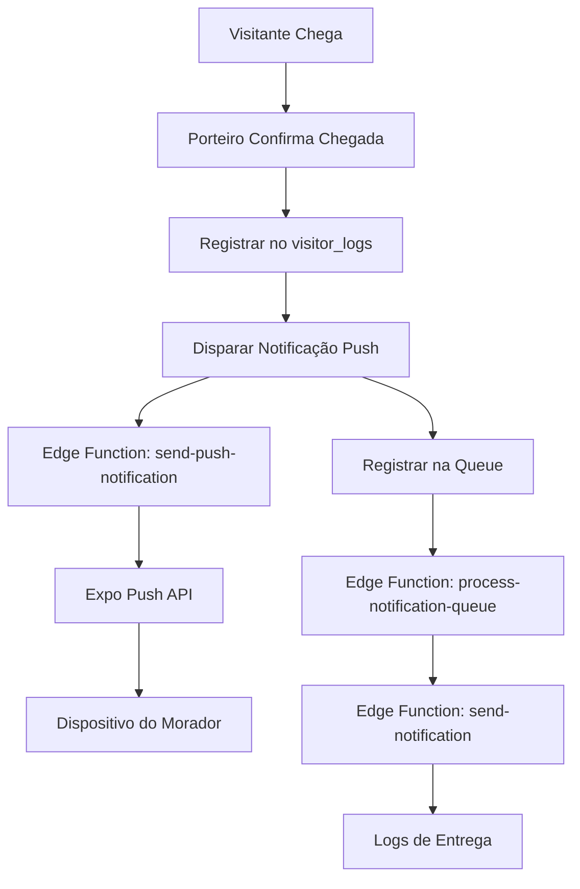

# Sistema de Notificações Push - Aplicativo Porteiro

## 1. Análise do Estado Atual

### 1.1 Situação Identificada
O sistema de notificações push do aplicativo Porteiro está **parcialmente desativado** com várias funcionalidades comentadas ou desabilitadas. As Edge Functions do Supabase estão implementadas mas não integradas adequadamente com o fluxo principal da aplicação.

### 1.2 Problemas Críticos Identificados

#### Push Notifications Desativadas
```typescript
// PUSH NOTIFICATIONS TEMPORARIAMENTE DESATIVADAS
const notifyPorteiros = async (message: string, data: any) => {
  console.log('📱 Push notifications desativadas - log atualizado sem notificação:', message);
  return;
}
```

#### Falta de Integração na Confirmação de Chegada
A função `confirmarChegada` em `AutorizacoesTab.tsx` registra a entrada do visitante mas **não dispara notificação** para o morador:

```typescript
// Linha 366 - Apenas registra no banco, sem notificação
resident_response_by: residentId,
```

#### Inconsistências nas Edge Functions
- `send-notification` usa tabela `user_notification_tokens`
- `send-push-notification` usa campo `push_token` nas tabelas `profiles`
- Estruturas de dados incompatíveis entre as funções

## 2. Arquitetura Proposta

### 2.1 Fluxo de Notificações Reativado



### 2.2 Estrutura de Dados Unificada

#### Tabela: user_notification_tokens
```sql
CREATE TABLE user_notification_tokens (
  id UUID PRIMARY KEY DEFAULT gen_random_uuid(),
  user_id UUID REFERENCES auth.users(id),
  notification_token TEXT NOT NULL,
  device_type TEXT CHECK (device_type IN ('ios', 'android', 'web')),
  is_active BOOLEAN DEFAULT true,
  created_at TIMESTAMP WITH TIME ZONE DEFAULT NOW(),
  updated_at TIMESTAMP WITH TIME ZONE DEFAULT NOW()
);
```

#### Tabela: notifications (Queue)
```sql
CREATE TABLE notifications (
  id UUID PRIMARY KEY DEFAULT gen_random_uuid(),
  user_id UUID NOT NULL,
  title TEXT NOT NULL,
  body TEXT NOT NULL,
  type TEXT NOT NULL,
  data JSONB DEFAULT '{}',
  priority TEXT DEFAULT 'normal' CHECK (priority IN ('high', 'normal', 'low')),
  status TEXT DEFAULT 'pending' CHECK (status IN ('pending', 'processing', 'sent', 'failed')),
  created_at TIMESTAMP WITH TIME ZONE DEFAULT NOW(),
  sent_at TIMESTAMP WITH TIME ZONE
);
```

## 3. Implementação Técnica

### 3.1 Correção da Função confirmarChegada

**Arquivo**: `app/porteiro/AutorizacoesTab.tsx`

```typescript
const confirmarChegada = async (visit) => {
  try {
    // ... código existente para registrar entrada ...

    // NOVA IMPLEMENTAÇÃO: Disparar notificação para o morador
    if (residentId) {
      await notifyResidentOfVisitorArrival({
        residentId,
        visitorName: visitorData.name,
        apartmentNumber: apartmentData?.number,
        visitTime: new Date().toISOString(),
        visitorData: {
          document: visitorData.document,
          photo_url: visitorData.photo_url
        }
      });
    }

    Alert.alert('Sucesso', 'Entrada registrada e morador notificado!');
  } catch (error) {
    console.error('Erro ao confirmar chegada:', error);
    Alert.alert('Erro', 'Falha ao processar chegada do visitante');
  }
};

// Nova função para notificar morador
const notifyResidentOfVisitorArrival = async ({
  residentId,
  visitorName,
  apartmentNumber,
  visitTime,
  visitorData
}) => {
  try {
    const { data, error } = await supabase.functions.invoke('send-push-notification', {
      body: {
        userIds: [residentId],
        title: '🚪 Visitante Chegou',
        message: `${visitorName} chegou ao seu apartamento ${apartmentNumber}`,
        type: 'visitor',
        data: {
          visitor_name: visitorName,
          apartment_number: apartmentNumber,
          arrival_time: visitTime,
          visitor_document: visitorData.document,
          visitor_photo: visitorData.photo_url,
          notification_type: 'visitor_arrival'
        }
      }
    });

    if (error) {
      console.error('❌ Erro ao enviar notificação:', error);
    } else {
      console.log('✅ Notificação enviada com sucesso:', data);
    }
  } catch (error) {
    console.error('❌ Erro na função de notificação:', error);
  }
};
```

### 3.2 Reativação do Sistema de Push Tokens

**Arquivo**: `hooks/useAuth.tsx`

```typescript
const updatePushToken = async (token: string) => {
  if (!user?.id || !token) return;

  try {
    // Registrar token na tabela unificada
    const { error } = await supabase
      .from('user_notification_tokens')
      .upsert({
        user_id: user.id,
        notification_token: token,
        device_type: Platform.OS,
        is_active: true,
        updated_at: new Date().toISOString()
      }, {
        onConflict: 'user_id,notification_token'
      });

    if (error) {
      console.error('❌ Erro ao atualizar push token:', error);
    } else {
      console.log('✅ Push token atualizado com sucesso');
    }
  } catch (error) {
    console.error('❌ Erro ao registrar push token:', error);
  }
};
```

### 3.3 Correção da Edge Function send-notification

**Arquivo**: `supabase/functions/send-notification/index.ts`

```typescript
// Correção: Buscar tokens da tabela correta
const { data: tokens, error: tokensError } = await supabaseClient
  .from('user_notification_tokens')
  .select('notification_token, device_type')
  .eq('user_id', user_id)
  .eq('is_active', true);

// Adicionar fallback para buscar na tabela profiles
if (!tokens || tokens.length === 0) {
  console.log('🔍 Tentando buscar token na tabela profiles...');
  
  const { data: profileTokens } = await supabaseClient
    .from('profiles')
    .select('push_token')
    .eq('user_id', user_id)
    .not('push_token', 'is', null)
    .single();

  if (profileTokens?.push_token) {
    tokens = [{
      notification_token: profileTokens.push_token,
      device_type: 'unknown'
    }];
  }
}
```

### 3.4 Implementação de Triggers Automáticos

**Arquivo**: `supabase/migrations/create_notification_triggers.sql`

```sql
-- Trigger para notificar morador quando visitante chega
CREATE OR REPLACE FUNCTION notify_resident_visitor_arrival()
RETURNS TRIGGER AS $$
BEGIN
  -- Apenas para logs de entrada (tipo_log = 'IN')
  IF NEW.tipo_log = 'IN' AND NEW.entry_type = 'visitor' THEN
    -- Inserir notificação na queue
    INSERT INTO notifications (
      user_id,
      title,
      body,
      type,
      data,
      priority
    ) VALUES (
      NEW.resident_response_by,
      '🚪 Visitante Chegou',
      NEW.guest_name || ' chegou ao seu apartamento',
      'visitor_arrival',
      jsonb_build_object(
        'visitor_name', NEW.guest_name,
        'visitor_log_id', NEW.id,
        'arrival_time', NEW.log_time,
        'apartment_id', NEW.apartment_id
      ),
      'high'
    );
  END IF;
  
  RETURN NEW;
END;
$$ LANGUAGE plpgsql;

-- Criar trigger
CREATE TRIGGER trigger_notify_resident_visitor_arrival
  AFTER INSERT ON visitor_logs
  FOR EACH ROW
  EXECUTE FUNCTION notify_resident_visitor_arrival();
```

## 4. Casos de Uso Específicos

### 4.1 Notificação de Chegada de Visitante Pré-Cadastrado

#### Fluxo Completo:
1. **Porteiro confirma chegada** → `confirmarChegada()`
2. **Registro no banco** → `visitor_logs` table
3. **Trigger automático** → Insere em `notifications`
4. **Queue processor** → Processa notificação pendente
5. **Edge Function** → Envia via Expo Push API
6. **Dispositivo** → Recebe notificação

#### Dados da Notificação:
```json
{
  "title": "🚪 Visitante Chegou",
  "body": "João Silva chegou ao seu apartamento 101",
  "data": {
    "visitor_name": "João Silva",
    "apartment_number": "101",
    "arrival_time": "2024-01-15T14:30:00Z",
    "visitor_document": "123.456.789-00",
    "visitor_photo": "https://...",
    "notification_type": "visitor_arrival"
  }
}
```

### 4.2 Notificação de Aprovação/Negação

#### Para Visitantes Aguardando Aprovação:
```typescript
const notifyVisitorApproval = async (visitorId: string, approved: boolean) => {
  await supabase.functions.invoke('send-push-notification', {
    body: {
      userIds: [visitorId],
      title: approved ? '✅ Acesso Aprovado' : '❌ Acesso Negado',
      message: approved 
        ? 'Seu acesso foi aprovado. Dirija-se à portaria.'
        : 'Seu acesso foi negado pelo morador.',
      type: 'visitor',
      data: {
        approval_status: approved ? 'approved' : 'denied',
        notification_type: 'visitor_approval'
      }
    }
  });
};
```

## 5. Sistema de Monitoramento e Logs

### 5.1 Logs de Execução

**Tabela**: `notification_logs`
```sql
CREATE TABLE notification_logs (
  id UUID PRIMARY KEY DEFAULT gen_random_uuid(),
  notification_id UUID REFERENCES notifications(id),
  device_token TEXT NOT NULL,
  device_type TEXT,
  status TEXT CHECK (status IN ('sent', 'failed', 'delivered', 'read')),
  error_message TEXT,
  expo_receipt_id TEXT,
  created_at TIMESTAMP WITH TIME ZONE DEFAULT NOW()
);
```

### 5.2 Métricas de Performance

```typescript
// Adicionar à Edge Function process-notification-queue
const metrics = {
  total_processed: results.processed,
  successful: results.successful,
  failed: results.failed,
  success_rate: (results.successful / results.processed * 100).toFixed(2) + '%',
  average_processing_time: averageTime,
  errors_by_type: errorsByType
};

console.log('📊 Métricas de processamento:', metrics);
```

## 6. Validação e Testes

### 6.1 Cenários de Teste

#### Teste 1: Chegada de Visitante Pré-Cadastrado
```typescript
// Cenário: Visitante João Silva chega ao apartamento 101
const testVisitorArrival = async () => {
  // 1. Simular confirmação de chegada
  await confirmarChegada({
    id: 'visitor-123',
    name: 'João Silva',
    apartment_id: 'apt-101'
  });
  
  // 2. Verificar se notificação foi criada
  const { data: notification } = await supabase
    .from('notifications')
    .select('*')
    .eq('type', 'visitor_arrival')
    .order('created_at', { ascending: false })
    .limit(1);
    
  // 3. Verificar se foi processada
  expect(notification.status).toBe('sent');
};
```

#### Teste 2: Token Push Inválido
```typescript
const testInvalidToken = async () => {
  // Simular token inválido
  const result = await supabase.functions.invoke('send-notification', {
    body: {
      user_id: 'user-123',
      title: 'Teste',
      body: 'Mensagem de teste',
      type: 'system'
    }
  });
  
  // Verificar tratamento de erro
  expect(result.data.success).toBe(false);
  expect(result.data.message).toContain('No active tokens');
};
```

### 6.2 Monitoramento em Produção

#### Dashboard de Métricas:
- Taxa de entrega de notificações
- Tempo médio de processamento
- Tokens inválidos/expirados
- Erros por tipo de notificação

#### Alertas Automáticos:
- Taxa de falha > 10%
- Queue com mais de 100 notificações pendentes
- Tempo de processamento > 30 segundos

## 7. Cronograma de Implementação

### Fase 1: Correções Críticas (1-2 dias)
- [ ] Reativar push notifications em `confirmarChegada`
- [ ] Corrigir Edge Function `send-notification`
- [ ] Implementar função `notifyResidentOfVisitorArrival`

### Fase 2: Triggers e Automação (2-3 dias)
- [ ] Criar triggers automáticos no banco
- [ ] Implementar sistema de queue
- [ ] Configurar processamento em lote

### Fase 3: Monitoramento e Testes (1-2 dias)
- [ ] Implementar logs detalhados
- [ ] Criar testes automatizados
- [ ] Configurar métricas de performance

### Fase 4: Validação Final (1 dia)
- [ ] Testes end-to-end
- [ ] Validação em ambiente de produção
- [ ] Documentação final

## 8. Considerações de Segurança

### 8.1 Validação de Tokens
- Verificar validade dos tokens Expo
- Remover tokens inválidos automaticamente
- Implementar rate limiting

### 8.2 Dados Sensíveis
- Não incluir informações pessoais desnecessárias
- Criptografar dados sensíveis em trânsito
- Implementar logs auditáveis

### 8.3 Autenticação
- Validar permissões antes de enviar notificações
- Verificar se usuário tem acesso ao prédio/apartamento
- Implementar controle de acesso por roles

## 9. Conclusão

A implementação proposta reativa completamente o sistema de notificações push, corrige os problemas identificados e estabelece uma base sólida para futuras expansões. O foco principal está na **notificação automática de chegada de visitantes pré-cadastrados**, garantindo que os moradores sejam informados em tempo real.

As Edge Functions existentes serão aproveitadas e corrigidas, mantendo a arquitetura serverless do Supabase e garantindo escalabilidade e performance adequadas.