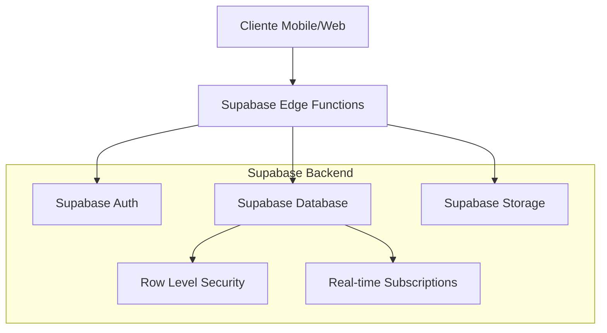
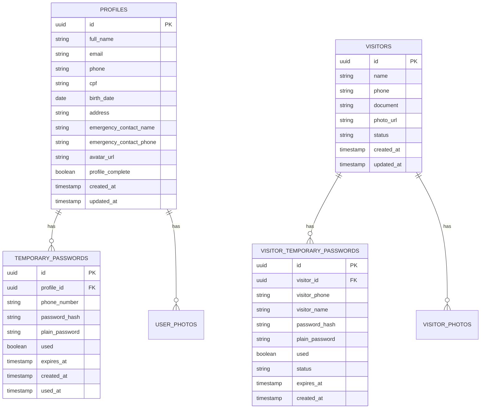

# Arquitetura Técnica - Correção das Rotas de Cadastro

## 1. Arquitetura de Design

```mermaid
graph TD
    A[App React Native] --> B[Expo Router]
    B --> C[Páginas de Cadastro]
    C --> D[Supabase Client]
    D --> E[Supabase Backend]
    
    F[Next.js Site] --> G[Next.js Router]
    G --> H[Páginas Web de Cadastro]
    H --> I[Supabase Client Web]
    I --> E
    
    subgraph "Frontend Mobile (React Native)"
        A
        B
        C
    end
    
    subgraph "Frontend Web (Next.js)"
        F
        G
        H
    end
    
    subgraph "Backend (Supabase)"
        E
        J[PostgreSQL Database]
        K[Storage (Fotos)]
        L[Auth System]
    end
    
    E --> J
    E --> K
    E --> L
```

## 2. Descrição da Tecnologia

* Frontend Mobile: React Native + Expo Router + TypeScript

* Frontend Web: Next.js 14 + TypeScript + Tailwind CSS

* Backend: Supabase (PostgreSQL + Auth + Storage)

* Upload de Arquivos: Supabase Storage

* Validações: Zod + validações customizadas

## 3. Definições de Rotas

### 3.1 Rotas do App React Native

| Rota                                    | Propósito                                          |
| --------------------------------------- | -------------------------------------------------- |
| `/cadastro/morador/completar/[token]`   | Página para morador completar cadastro via token   |
| `/cadastro/visitante/completar/[token]` | Página para visitante completar cadastro via token |
| `/cadastro/sucesso`                     | Página de confirmação após cadastro completo       |

### 3.2 Rotas do Site Next.js (Existentes)

| Rota                            | Propósito                                    |
| ------------------------------- | -------------------------------------------- |
| `/cadastro/morador/completar`   | Página web para morador completar cadastro   |
| `/cadastro/visitante/completar` | Página web para visitante completar cadastro |
| `/cadastro/sucesso`             | Página de confirmação web                    |

## 4. Definições de API

### 4.1 APIs do Supabase

**Busca de perfil por telefone**

```typescript
// Para moradores
GET /rest/v1/temporary_passwords
```

Parâmetros:

| Nome do Parâmetro | Tipo    | Obrigatório | Descrição                      |
| ----------------- | ------- | ----------- | ------------------------------ |
| phone\_number     | string  | true        | Número de telefone normalizado |
| used              | boolean | true        | Deve ser false                 |
| expires\_at       | string  | true        | Deve ser maior que data atual  |

Resposta:

| Nome do Parâmetro | Tipo   | Descrição                 |
| ----------------- | ------ | ------------------------- |
| profile\_id       | string | ID do perfil do morador   |
| plain\_password   | string | Senha temporária em texto |
| phone\_number     | string | Telefone cadastrado       |

**Busca de perfil de visitante**

```typescript
// Para visitantes
GET /rest/v1/visitor_temporary_passwords
```

Parâmetros:

| Nome do Parâmetro | Tipo    | Obrigatório | Descrição                       |
| ----------------- | ------- | ----------- | ------------------------------- |
| visitor\_phone    | string  | true        | Número de telefone do visitante |
| used              | boolean | true        | Deve ser false                  |
| status            | string  | true        | Deve ser 'active'               |

Resposta:

| Nome do Parâmetro | Tipo   | Descrição         |
| ----------------- | ------ | ----------------- |
| visitor\_id       | string | ID do visitante   |
| visitor\_name     | string | Nome do visitante |
| plain\_password   | string | Senha temporária  |

**Upload de foto**

```typescript
POST /storage/v1/object/user-photos
```

Parâmetros:

| Nome do Parâmetro | Tipo   | Obrigatório | Descrição                            |
| ----------------- | ------ | ----------- | ------------------------------------ |
| file              | File   | true        | Arquivo de imagem (JPG/PNG, max 5MB) |
| path              | string | true        | Caminho do arquivo no storage        |

Resposta:

| Nome do Parâmetro | Tipo   | Descrição             |
| ----------------- | ------ | --------------------- |
| publicUrl         | string | URL pública da imagem |

## 5. Arquitetura do Servidor



## 6. Modelo de Dados

### 6.1 Definição do Modelo de Dados



### 6.2 Linguagem de Definição de Dados

**Tabela de Senhas Temporárias para Moradores**

```sql
-- Criar tabela temporary_passwords (se não existir)
CREATE TABLE IF NOT EXISTS temporary_passwords (
    id UUID PRIMARY KEY DEFAULT gen_random_uuid(),
    profile_id UUID REFERENCES profiles(id) ON DELETE CASCADE,
    phone_number VARCHAR(20) NOT NULL,
    password_hash VARCHAR(255) NOT NULL,
    plain_password VARCHAR(10) NOT NULL,
    used BOOLEAN DEFAULT FALSE,
    expires_at TIMESTAMP WITH TIME ZONE NOT NULL,
    created_at TIMESTAMP WITH TIME ZONE DEFAULT NOW(),
    used_at TIMESTAMP WITH TIME ZONE
);

-- Criar índices
CREATE INDEX IF NOT EXISTS idx_temporary_passwords_profile_id ON temporary_passwords(profile_id);
CREATE INDEX IF NOT EXISTS idx_temporary_passwords_phone ON temporary_passwords(phone_number);
CREATE INDEX IF NOT EXISTS idx_temporary_passwords_used ON temporary_passwords(used);
CREATE INDEX IF NOT EXISTS idx_temporary_passwords_expires ON temporary_passwords(expires_at);

-- Políticas RLS
ALTER TABLE temporary_passwords ENABLE ROW LEVEL SECURITY;

-- Permitir leitura para usuários anônimos (necessário para busca por telefone)
CREATE POLICY "Allow anonymous read for active passwords" ON temporary_passwords
    FOR SELECT TO anon
    USING (used = false AND expires_at > NOW());

-- Permitir atualização para usuários autenticados
CREATE POLICY "Allow authenticated update" ON temporary_passwords
    FOR UPDATE TO authenticated
    USING (true);
```

**Tabela de Senhas Temporárias para Visitantes**

```sql
-- Criar tabela visitor_temporary_passwords (se não existir)
CREATE TABLE IF NOT EXISTS visitor_temporary_passwords (
    id UUID PRIMARY KEY DEFAULT gen_random_uuid(),
    visitor_id UUID REFERENCES visitors(id) ON DELETE CASCADE,
    visitor_phone VARCHAR(20) NOT NULL,
    visitor_name VARCHAR(255) NOT NULL,
    password_hash VARCHAR(255) NOT NULL,
    plain_password VARCHAR(10) NOT NULL,
    used BOOLEAN DEFAULT FALSE,
    status VARCHAR(20) DEFAULT 'active',
    expires_at TIMESTAMP WITH TIME ZONE NOT NULL,
    created_at TIMESTAMP WITH TIME ZONE DEFAULT NOW(),
    used_at TIMESTAMP WITH TIME ZONE
);

-- Criar índices
CREATE INDEX IF NOT EXISTS idx_visitor_temp_passwords_visitor_id ON visitor_temporary_passwords(visitor_id);
CREATE INDEX IF NOT EXISTS idx_visitor_temp_passwords_phone ON visitor_temporary_passwords(visitor_phone);
CREATE INDEX IF NOT EXISTS idx_visitor_temp_passwords_status ON visitor_temporary_passwords(status);

-- Políticas RLS
ALTER TABLE visitor_temporary_passwords ENABLE ROW LEVEL SECURITY;

-- Permitir leitura para usuários anônimos
CREATE POLICY "Allow anonymous read for active visitor passwords" ON visitor_temporary_passwords
    FOR SELECT TO anon
    USING (used = false AND status = 'active' AND expires_at > NOW());

-- Permitir atualização para usuários autenticados
CREATE POLICY "Allow authenticated update visitor passwords" ON visitor_temporary_passwords
    FOR UPDATE TO authenticated
    USING (true);
```

**Atualizar tabela de perfis**

```sql
-- Adicionar campos faltantes na tabela profiles
ALTER TABLE profiles 
ADD COLUMN IF NOT EXISTS cpf VARCHAR(14),
ADD COLUMN IF NOT EXISTS birth_date DATE,
ADD COLUMN IF NOT EXISTS address TEXT,
ADD COLUMN IF NOT EXISTS emergency_contact_name VARCHAR(255),
ADD COLUMN IF NOT EXISTS emergency_contact_phone VARCHAR(20),
ADD COLUMN IF NOT EXISTS avatar_url TEXT,
ADD COLUMN IF NOT EXISTS profile_complete BOOLEAN DEFAULT FALSE;

-- Políticas RLS para profiles
ALTER TABLE profiles ENABLE ROW LEVEL SECURITY;

-- Permitir leitura limitada para usuários anônimos (apenas dados básicos)
CREATE POLICY "Allow anonymous read basic profile data" ON profiles
    FOR SELECT TO anon
    USING (true);

-- Permitir todas as operações para usuários autenticados
CREATE POLICY "Allow authenticated full access to profiles" ON profiles
    FOR ALL TO authenticated
    USING (true);
```

**Configurar Storage para fotos**

```sql
-- Criar bucket para fotos de usuários (se não existir)
INSERT INTO storage.buckets (id, name, public)
VALUES ('user-photos', 'user-photos', true)
ON CONFLICT (id) DO NOTHING;

-- Políticas para o bucket user-photos
CREATE POLICY "Allow anonymous upload to user-photos" ON storage.objects
    FOR INSERT TO anon
    WITH CHECK (bucket_id = 'user-photos');

CREATE POLICY "Allow public read access to user-photos" ON storage.objects
    FOR SELECT TO public
    USING (bucket_id = 'user-photos');

CREATE POLICY "Allow authenticated delete from user-photos" ON storage.objects
    FOR DELETE TO authenticated
    USING (bucket_id = 'user-photos');
```

## 7. Implementação das Correções

### 7.1 Estrutura de Arquivos React Native

```
app/
├── cadastro/
│   ├── morador/
│   │   └── completar/
│   │       └── [token].tsx
│   ├── visitante/
│   │   └── completar/
│   │       └── [token].tsx
│   └── sucesso.tsx
├── components/
│   ├── CadastroForm.tsx
│   ├── PhotoUpload.tsx
│   ├── PhoneSearch.tsx
│   └── ValidationMessage.tsx
└── hooks/
    ├── useProfileSearch.ts
    ├── useFormValidation.ts
    └── usePhotoUpload.ts
```

### 7.2 Componentes Principais

**Hook de Busca de Perfil**

```typescript
// hooks/useProfileSearch.ts
export const useProfileSearch = (userType: 'morador' | 'visitante') => {
  const [isSearching, setIsSearching] = useState(false);
  const [profileFound, setProfileFound] = useState(false);
  const [profileData, setProfileData] = useState(null);
  
  const searchProfile = useCallback(
    debounce(async (phone: string) => {
      // Implementar busca com debounce de 1.5s
    }, 1500),
    [userType]
  );
  
  return { isSearching, profileFound, profileData, searchProfile };
};
```

**Componente de Validação**

```typescript
// components/ValidationMessage.tsx
interface ValidationMessageProps {
  error?: string;
  success?: string;
  loading?: boolean;
}

export const ValidationMessage: React.FC<ValidationMessageProps> = ({
  error,
  success,
  loading
}) => {
  // Implementar componente de feedback visual
};
```

### 7.3 Melhorias de Performance

* Implementar debounce na busca por telefone (1.5s)

* Cache local para dados do perfil

* Lazy loading para componentes pesados

* Otimização de imagens com compressão automática

* Retry automático para falhas de rede

### 7.4 Validações Implementadas

* Validação de CPF com algoritmo completo

* Validação de formato de telefone brasileiro

* Validação de senha temporária (6 dígitos)

* Validação de upload de foto (formato JPG/PNG, max 5MB)

* Prevenção de múltiplos envios com debounce

* Controle de estado dos botões baseado em validações

