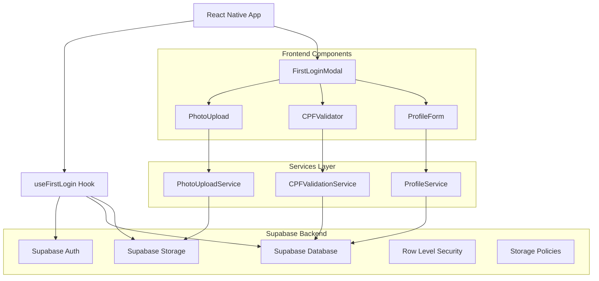
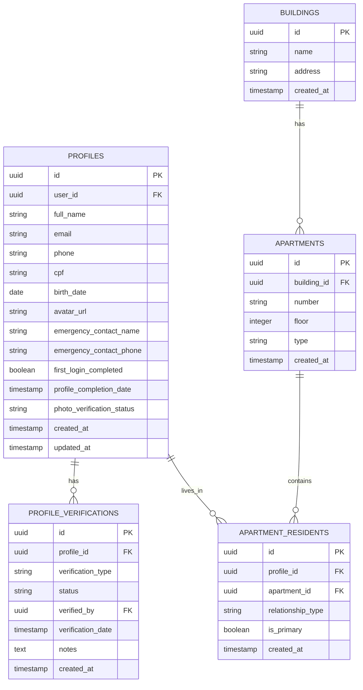
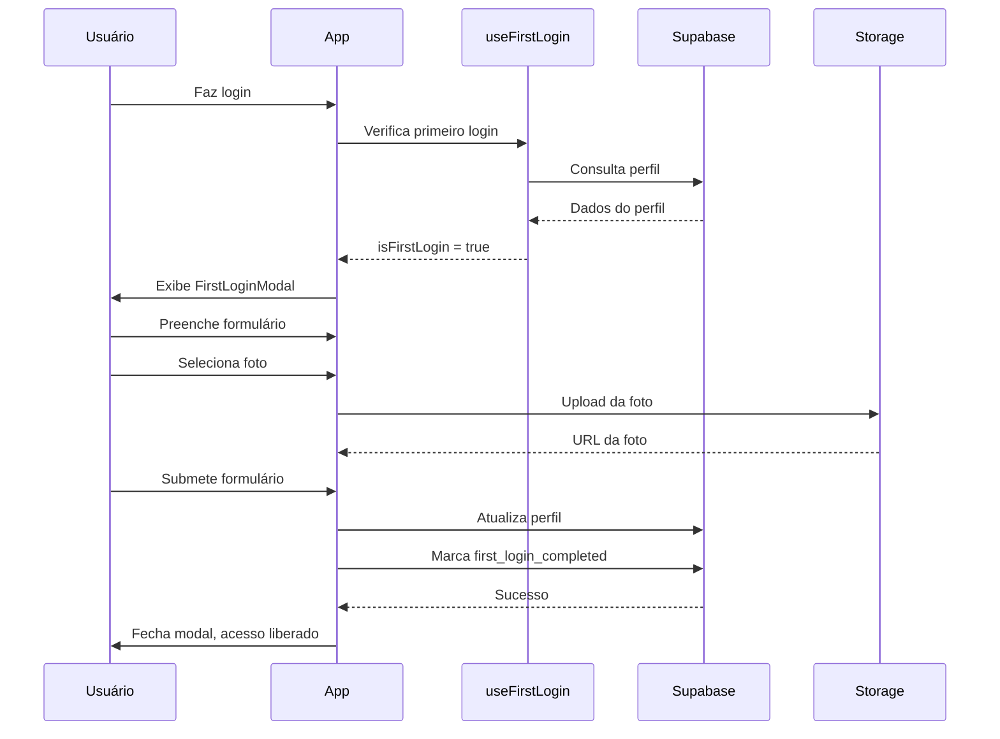
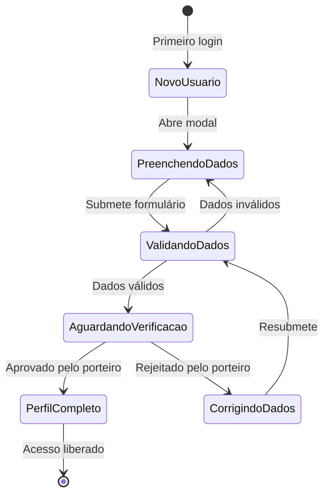

# Arquitetura Técnica - Sistema de Verificação de CPF no Primeiro Login

## 1. Arquitetura Geral



## 2. Tecnologias e Dependências

### Frontend

* React Native + Expo

* TypeScript

* Expo ImagePicker

* React Hook Form

* Yup (validação)

* @supabase/supabase-js

### Backend

* Supabase (PostgreSQL + Auth + Storage)

* Row Level Security (RLS)

* Storage Policies

### Validação

* cpf-cnpj-validator (biblioteca de CPF)

* Yup schema validation

* Custom validation hooks

## 3. Definições de Rotas

| Rota                           | Propósito                            |
| ------------------------------ | ------------------------------------ |
| /morador/first-login           | Modal de primeiro login (overlay)    |
| /morador/profile               | Perfil do morador (atualizado)       |
| /porteiro/verifications        | Lista de verificações pendentes      |
| /porteiro/resident-details/:id | Detalhes do morador para verificação |
| /admin/profile-management      | Gerenciamento de perfis              |

## 4. Definições de API e Tipos

### 4.1 Tipos TypeScript

```typescript
// types/profile.ts
export interface ProfileData {
  id: string;
  user_id: string;
  full_name: string;
  email: string;
  phone: string;
  cpf: string;
  birth_date: string;
  avatar_url: string;
  emergency_contact_name?: string;
  emergency_contact_phone?: string;
  first_login_completed: boolean;
  profile_completion_date?: string;
  photo_verification_status: 'pending' | 'approved' | 'rejected';
  created_at: string;
  updated_at: string;
}

export interface FirstLoginFormData {
  full_name: string;
  phone: string;
  cpf: string;
  birth_date: string;
  emergency_contact_name?: string;
  emergency_contact_phone?: string;
  avatar_file?: File;
  new_password?: string;
  confirm_password?: string;
}

export interface ProfileVerification {
  id: string;
  profile_id: string;
  verification_type: 'photo' | 'cpf' | 'data' | 'complete';
  status: 'pending' | 'approved' | 'rejected';
  verified_by?: string;
  verification_date?: string;
  notes?: string;
  created_at: string;
}
```

### 4.2 Serviços de API

#### Verificação de Primeiro Login

```typescript
// services/firstLoginService.ts
export class FirstLoginService {
  static async checkFirstLoginRequired(userId: string): Promise<boolean> {
    const { data, error } = await supabase
      .from('profiles')
      .select('cpf, first_login_completed, avatar_url')
      .eq('id', userId)
      .single();
    
    if (error) throw error;
    
    return !data.cpf || !data.first_login_completed || !data.avatar_url;
  }
  
  static async completeFirstLogin(userId: string, formData: FirstLoginFormData): Promise<void> {
    // Implementação completa
  }
}
```

#### Upload de Fotos

```typescript
// services/photoService.ts
export class PhotoService {
  static async uploadResidentPhoto(userId: string, file: File): Promise<string> {
    const fileName = `${userId}/${Date.now()}.jpg`;
    
    const { data, error } = await supabase.storage
      .from('resident-photos')
      .upload(fileName, file, {
        cacheControl: '3600',
        upsert: true
      });
    
    if (error) throw error;
    
    return supabase.storage
      .from('resident-photos')
      .getPublicUrl(data.path).data.publicUrl;
  }
  
  static async deleteResidentPhoto(photoUrl: string): Promise<void> {
    // Implementação de remoção
  }
}
```

#### Validação de CPF

```typescript
// services/cpfValidationService.ts
export class CPFValidationService {
  static validateFormat(cpf: string): boolean {
    return cpfValidator.isValid(cpf);
  }
  
  static async checkCPFExists(cpf: string, excludeUserId?: string): Promise<boolean> {
    let query = supabase
      .from('profiles')
      .select('id')
      .eq('cpf', cpf);
    
    if (excludeUserId) {
      query = query.neq('id', excludeUserId);
    }
    
    const { data, error } = await query;
    
    if (error) throw error;
    
    return data.length > 0;
  }
}
```

## 5. Estrutura de Componentes

### 5.1 Hook useFirstLogin

```typescript
// hooks/useFirstLogin.ts
export const useFirstLogin = () => {
  const [isFirstLogin, setIsFirstLogin] = useState(false);
  const [loading, setLoading] = useState(true);
  const { user } = useAuth();
  
  const checkFirstLogin = useCallback(async () => {
    if (!user?.id) return;
    
    try {
      const required = await FirstLoginService.checkFirstLoginRequired(user.id);
      setIsFirstLogin(required);
    } catch (error) {
      console.error('Erro ao verificar primeiro login:', error);
    } finally {
      setLoading(false);
    }
  }, [user?.id]);
  
  const completeFirstLogin = async (formData: FirstLoginFormData) => {
    if (!user?.id) throw new Error('Usuário não autenticado');
    
    await FirstLoginService.completeFirstLogin(user.id, formData);
    setIsFirstLogin(false);
  };
  
  useEffect(() => {
    checkFirstLogin();
  }, [checkFirstLogin]);
  
  return {
    isFirstLogin,
    loading,
    completeFirstLogin,
    recheckFirstLogin: checkFirstLogin
  };
};
```

### 5.2 Componente FirstLoginModal

```typescript
// components/FirstLoginModal.tsx
export const FirstLoginModal: React.FC<FirstLoginModalProps> = ({
  visible,
  onComplete,
  userEmail
}) => {
  const [formData, setFormData] = useState<FirstLoginFormData>({
    full_name: '',
    phone: '',
    cpf: '',
    birth_date: '',
    emergency_contact_name: '',
    emergency_contact_phone: ''
  });
  
  const [photoUploading, setPhotoUploading] = useState(false);
  const [avatarUrl, setAvatarUrl] = useState('');
  const [showPasswordSection, setShowPasswordSection] = useState(false);
  
  const handleSubmit = async () => {
    try {
      // Validações
      if (!validateForm()) return;
      
      // Upload da foto se necessário
      if (formData.avatar_file) {
        const photoUrl = await PhotoService.uploadResidentPhoto(
          user.id, 
          formData.avatar_file
        );
        setAvatarUrl(photoUrl);
      }
      
      // Completar primeiro login
      await completeFirstLogin({
        ...formData,
        avatar_url: avatarUrl
      });
      
      onComplete();
    } catch (error) {
      Alert.alert('Erro', 'Não foi possível completar o cadastro');
    }
  };
  
  return (
    <Modal visible={visible} animationType="slide" presentationStyle="pageSheet">
      <SafeAreaView style={styles.container}>
        <ScrollView>
          {/* Formulário completo */}
        </ScrollView>
      </SafeAreaView>
    </Modal>
  );
};
```

## 6. Modelo de Dados

### 6.1 Diagrama ER



### 6.2 DDL - Estrutura do Banco

```sql
-- Modificações na tabela profiles
ALTER TABLE profiles 
ADD COLUMN IF NOT EXISTS first_login_completed BOOLEAN DEFAULT FALSE,
ADD COLUMN IF NOT EXISTS profile_completion_date TIMESTAMP WITH TIME ZONE,
ADD COLUMN IF NOT EXISTS photo_verification_status VARCHAR(20) DEFAULT 'pending' CHECK (photo_verification_status IN ('pending', 'approved', 'rejected'));

-- Tabela de verificações
CREATE TABLE IF NOT EXISTS profile_verifications (
    id UUID PRIMARY KEY DEFAULT gen_random_uuid(),
    profile_id UUID NOT NULL REFERENCES profiles(id) ON DELETE CASCADE,
    verification_type VARCHAR(50) NOT NULL CHECK (verification_type IN ('photo', 'cpf', 'data', 'complete')),
    status VARCHAR(20) NOT NULL DEFAULT 'pending' CHECK (status IN ('pending', 'approved', 'rejected')),
    verified_by UUID REFERENCES profiles(id),
    verification_date TIMESTAMP WITH TIME ZONE,
    notes TEXT,
    created_at TIMESTAMP WITH TIME ZONE DEFAULT NOW()
);

-- Índices para performance
CREATE INDEX IF NOT EXISTS idx_profiles_cpf ON profiles(cpf) WHERE cpf IS NOT NULL;
CREATE INDEX IF NOT EXISTS idx_profiles_first_login ON profiles(first_login_completed);
CREATE INDEX IF NOT EXISTS idx_profiles_photo_status ON profiles(photo_verification_status);
CREATE INDEX IF NOT EXISTS idx_profile_verifications_profile_id ON profile_verifications(profile_id);
CREATE INDEX IF NOT EXISTS idx_profile_verifications_status ON profile_verifications(status);
CREATE INDEX IF NOT EXISTS idx_profile_verifications_date ON profile_verifications(verification_date DESC);

-- Constraint para CPF único
ALTER TABLE profiles ADD CONSTRAINT unique_cpf UNIQUE (cpf);

-- Trigger para atualizar updated_at
CREATE OR REPLACE FUNCTION update_updated_at_column()
RETURNS TRIGGER AS $$
BEGIN
    NEW.updated_at = NOW();
    RETURN NEW;
END;
$$ language 'plpgsql';

CREATE TRIGGER update_profiles_updated_at BEFORE UPDATE ON profiles
    FOR EACH ROW EXECUTE FUNCTION update_updated_at_column();
```

### 6.3 Políticas de Segurança (RLS)

```sql
-- Habilitar RLS
ALTER TABLE profiles ENABLE ROW LEVEL SECURITY;
ALTER TABLE profile_verifications ENABLE ROW LEVEL SECURITY;

-- Políticas para profiles
CREATE POLICY "Usuários podem ver seu próprio perfil"
ON profiles FOR SELECT
TO authenticated
USING (auth.uid() = id);

CREATE POLICY "Porteiros podem ver todos os perfis"
ON profiles FOR SELECT
TO authenticated
USING (
    EXISTS (
        SELECT 1 FROM profiles 
        WHERE id = auth.uid() 
        AND role IN ('porteiro', 'admin')
    )
);

CREATE POLICY "Usuários podem atualizar seu próprio perfil"
ON profiles FOR UPDATE
TO authenticated
USING (auth.uid() = id)
WITH CHECK (auth.uid() = id);

-- Políticas para verificações
CREATE POLICY "Usuários podem ver suas próprias verificações"
ON profile_verifications FOR SELECT
TO authenticated
USING (
    profile_id = auth.uid() OR
    EXISTS (
        SELECT 1 FROM profiles 
        WHERE id = auth.uid() 
        AND role IN ('porteiro', 'admin')
    )
);

CREATE POLICY "Apenas porteiros podem criar verificações"
ON profile_verifications FOR INSERT
TO authenticated
WITH CHECK (
    EXISTS (
        SELECT 1 FROM profiles 
        WHERE id = auth.uid() 
        AND role IN ('porteiro', 'admin')
    )
);
```

### 6.4 Storage - Bucket Configuration

```sql
-- Criar bucket para fotos dos moradores
INSERT INTO storage.buckets (id, name, public, file_size_limit, allowed_mime_types)
VALUES (
    'resident-photos',
    'resident-photos',
    false,
    5242880, -- 5MB
    ARRAY['image/jpeg', 'image/png', 'image/webp']
)
ON CONFLICT (id) DO NOTHING;

-- Políticas de storage
CREATE POLICY "Usuários podem fazer upload de suas próprias fotos"
ON storage.objects FOR INSERT
TO authenticated
WITH CHECK (
    bucket_id = 'resident-photos' AND
    auth.uid()::text = (storage.foldername(name))[1]
);

CREATE POLICY "Usuários e porteiros podem ver fotos"
ON storage.objects FOR SELECT
TO authenticated
USING (
    bucket_id = 'resident-photos' AND (
        auth.uid()::text = (storage.foldername(name))[1] OR
        EXISTS (
            SELECT 1 FROM profiles 
            WHERE id = auth.uid() 
            AND role IN ('porteiro', 'admin')
        )
    )
);

CREATE POLICY "Usuários podem atualizar suas próprias fotos"
ON storage.objects FOR UPDATE
TO authenticated
USING (
    bucket_id = 'resident-photos' AND
    auth.uid()::text = (storage.foldername(name))[1]
);

CREATE POLICY "Usuários podem deletar suas próprias fotos"
ON storage.objects FOR DELETE
TO authenticated
USING (
    bucket_id = 'resident-photos' AND
    auth.uid()::text = (storage.foldername(name))[1]
);
```

## 7. Fluxo de Dados Detalhado

### 7.1 Sequência de Primeiro Login



### 7.2 Estados do Perfil



## 8. Considerações de Performance

### 8.1 Otimizações de Banco

* Índices otimizados para consultas frequentes

* Particionamento da tabela de verificações por data

* Cache de consultas de CPF

### 8.2 Otimizações de Storage

* Compressão automática de imagens

* CDN para distribuição de fotos

* Limpeza automática de fotos antigas

### 8.3 Otimizações de Frontend

* Lazy loading do modal

* Debounce na validação de CPF

* Cache local de dados do perfil

## 9. Monitoramento e Logs

### 9.1 Métricas Importantes

* Taxa de conclusão do primeiro login

* Tempo médio de preenchimento

* Taxa de rejeição de fotos

* Erros de upload

### 9.2 Logs Estruturados

```typescript
// utils/logger.ts
export const logger = {
  firstLogin: {
    started: (userId: string) => console.log('FIRST_LOGIN_STARTED', { userId }),
    completed: (userId: string) => console.log('FIRST_LOGIN_COMPLETED', { userId }),
    failed: (userId: string, error: string) => console.log('FIRST_LOGIN_FAILED', { userId, error })
  },
  photo: {
    uploadStarted: (userId: string) => console.log('PHOTO_UPLOAD_STARTED', { userId }),
    uploadCompleted: (userId: string, url: string) => console.log('PHOTO_UPLOAD_COMPLETED', { userId, url }),
    uploadFailed: (userId: string, error: string) => console.log('PHOTO_UPLOAD_FAILED', { userId, error })
  }
};
```

## 10. Testes

### 10.1 Testes Unitários

* Validação de CPF

* Upload de fotos

* Hooks customizados

* Serviços de API

### 10.2 Testes de Integração

* Fluxo completo de primeiro login

* Integração com Supabase

* Políticas de segurança

### 10.3 Testes E2E

* Jornada completa do usuário

* Verificação pelo porteiro

* Cenários de erro

## 11. Deployment

### 11.1 Variáveis de Ambiente

```env
SUPABASE_URL=your_supabase_url
SUPABASE_ANON_KEY=your_supabase_anon_key
RESIDENT_PHOTOS_BUCKET=resident-photos
MAX_PHOTO_SIZE=5242880
```

### 11.2 Configuração de Produção

* Backup automático do bucket

* Monitoramento de performance

* Alertas de erro

* Rate limiting

## 12. Manutenção

### 12.1 Rotinas de Limpeza

* Remoção de fotos órfãs

* Limpeza de logs antigos

* Compactação de dados

### 12.2 Atualizações

* Versionamento de esquema

* Migração de dados

* Rollback de emergência

