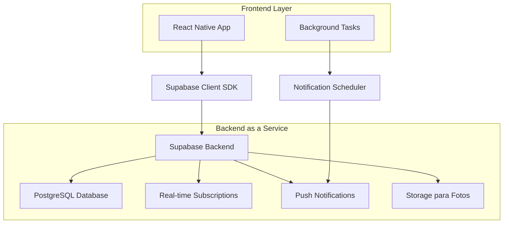
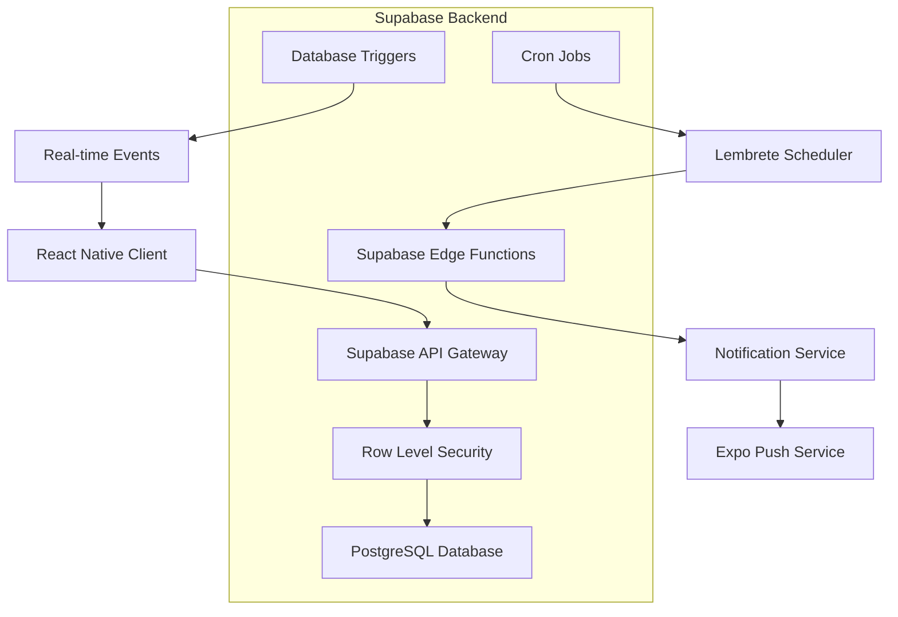
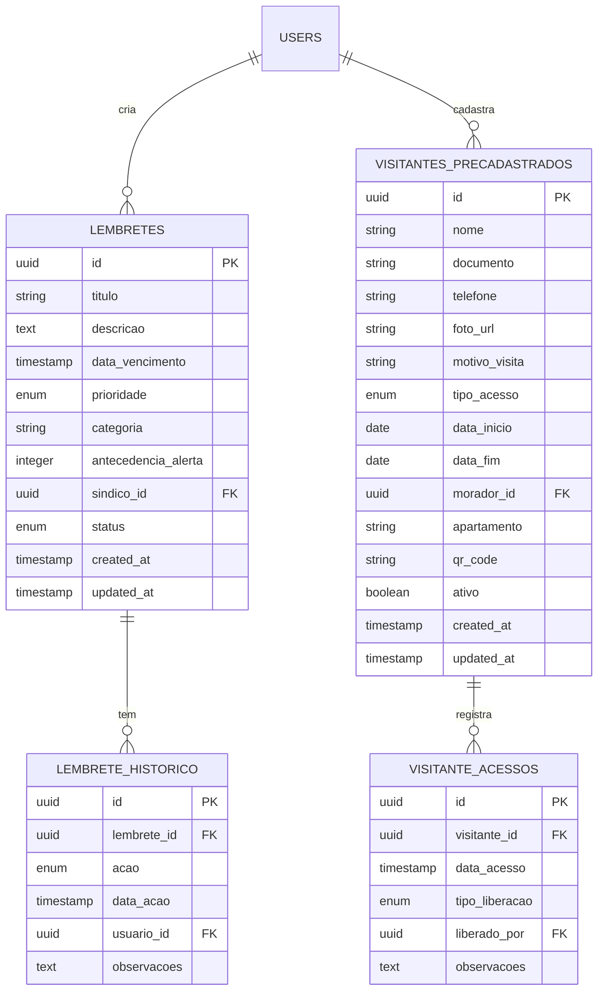

# Arquitetura Técnica - Sistema de Lembretes para Síndico e Pré-cadastro de Visitantes

## 1. Arquitetura do Sistema



## 2. Descrição das Tecnologias
- Frontend: React Native + TypeScript + Expo
- Backend: Supabase (PostgreSQL + Real-time + Auth + Storage)
- Notificações: Expo Notifications + Supabase Edge Functions
- Estado: Context API + AsyncStorage para persistência local
- Navegação: Expo Router (já existente no projeto)

## 3. Definições de Rotas
| Rota | Propósito |
|------|----------|
| /admin/lembretes | Página principal de gestão de lembretes do síndico |
| /admin/lembretes/novo | Formulário de criação de novo lembrete |
| /admin/lembretes/[id] | Edição de lembrete específico |
| /admin/lembretes/calendario | Vista de calendário dos lembretes |
| /morador/visitantes | Página de pré-cadastro de visitantes |
| /morador/visitantes/novo | Formulário de novo visitante |
| /morador/visitantes/[id] | Edição de visitante pré-cadastrado |
| /porteiro/visitantes-cadastrados | Lista de visitantes pré-cadastrados para o porteiro |

## 4. Definições de API

### 4.1 APIs Core - Lembretes

**Criar Lembrete**
```
POST /rest/v1/lembretes
```

Request:
| Param Name | Param Type | isRequired | Description |
|------------|------------|------------|-------------|
| titulo | string | true | Título do lembrete |
| descricao | string | false | Descrição detalhada |
| data_vencimento | timestamp | true | Data e hora do vencimento |
| prioridade | enum | true | baixa, media, alta, urgente |
| categoria | string | true | Categoria do lembrete |
| antecedencia_alerta | integer | true | Minutos de antecedência para alerta |
| sindico_id | uuid | true | ID do síndico responsável |

Response:
| Param Name | Param Type | Description |
|------------|------------|-------------|
| id | uuid | ID único do lembrete |
| status | string | Status da operação |

**Listar Lembretes**
```
GET /rest/v1/lembretes?sindico_id=eq.{id}&order=data_vencimento.asc
```

### 4.2 APIs Core - Visitantes Pré-cadastrados

**Criar Visitante Pré-cadastrado**
```
POST /rest/v1/visitantes_precadastrados
```

Request:
| Param Name | Param Type | isRequired | Description |
|------------|------------|------------|-------------|
| nome | string | true | Nome completo do visitante |
| documento | string | true | CPF ou RG |
| telefone | string | false | Telefone de contato |
| foto_url | string | false | URL da foto no Supabase Storage |
| motivo_visita | string | true | Motivo da visita |
| tipo_acesso | enum | true | direto, aprovacao |
| data_inicio | date | true | Data de início da validade |
| data_fim | date | true | Data de fim da validade |
| morador_id | uuid | true | ID do morador que cadastrou |
| apartamento | string | true | Número do apartamento |

Response:
| Param Name | Param Type | Description |
|------------|------------|-------------|
| id | uuid | ID único do visitante |
| qr_code | string | Código QR para acesso rápido |

## 5. Arquitetura do Servidor



## 6. Modelo de Dados

### 6.1 Definição do Modelo de Dados



### 6.2 Data Definition Language

**Tabela de Lembretes**
```sql
-- Criar tabela de lembretes
CREATE TABLE lembretes (
    id UUID PRIMARY KEY DEFAULT gen_random_uuid(),
    titulo VARCHAR(255) NOT NULL,
    descricao TEXT,
    data_vencimento TIMESTAMP WITH TIME ZONE NOT NULL,
    prioridade VARCHAR(20) CHECK (prioridade IN ('baixa', 'media', 'alta', 'urgente')) DEFAULT 'media',
    categoria VARCHAR(100) NOT NULL,
    antecedencia_alerta INTEGER DEFAULT 60, -- minutos
    sindico_id UUID REFERENCES auth.users(id) NOT NULL,
    status VARCHAR(20) CHECK (status IN ('pendente', 'concluido', 'cancelado')) DEFAULT 'pendente',
    created_at TIMESTAMP WITH TIME ZONE DEFAULT NOW(),
    updated_at TIMESTAMP WITH TIME ZONE DEFAULT NOW()
);

-- Criar índices
CREATE INDEX idx_lembretes_sindico_id ON lembretes(sindico_id);
CREATE INDEX idx_lembretes_data_vencimento ON lembretes(data_vencimento);
CREATE INDEX idx_lembretes_status ON lembretes(status);

-- Tabela de histórico de lembretes
CREATE TABLE lembrete_historico (
    id UUID PRIMARY KEY DEFAULT gen_random_uuid(),
    lembrete_id UUID REFERENCES lembretes(id) ON DELETE CASCADE,
    acao VARCHAR(50) NOT NULL, -- 'criado', 'editado', 'concluido', 'cancelado'
    data_acao TIMESTAMP WITH TIME ZONE DEFAULT NOW(),
    usuario_id UUID REFERENCES auth.users(id),
    observacoes TEXT
);

-- Tabela de visitantes pré-cadastrados
CREATE TABLE visitantes_precadastrados (
    id UUID PRIMARY KEY DEFAULT gen_random_uuid(),
    nome VARCHAR(255) NOT NULL,
    documento VARCHAR(20) NOT NULL,
    telefone VARCHAR(20),
    foto_url TEXT,
    motivo_visita TEXT NOT NULL,
    tipo_acesso VARCHAR(20) CHECK (tipo_acesso IN ('direto', 'aprovacao')) DEFAULT 'aprovacao',
    data_inicio DATE NOT NULL,
    data_fim DATE NOT NULL,
    morador_id UUID REFERENCES auth.users(id) NOT NULL,
    apartamento VARCHAR(10) NOT NULL,
    qr_code VARCHAR(255) UNIQUE,
    ativo BOOLEAN DEFAULT true,
    created_at TIMESTAMP WITH TIME ZONE DEFAULT NOW(),
    updated_at TIMESTAMP WITH TIME ZONE DEFAULT NOW()
);

-- Criar índices para visitantes
CREATE INDEX idx_visitantes_morador_id ON visitantes_precadastrados(morador_id);
CREATE INDEX idx_visitantes_documento ON visitantes_precadastrados(documento);
CREATE INDEX idx_visitantes_data_validade ON visitantes_precadastrados(data_inicio, data_fim);
CREATE INDEX idx_visitantes_qr_code ON visitantes_precadastrados(qr_code);

-- Tabela de acessos de visitantes
CREATE TABLE visitante_acessos (
    id UUID PRIMARY KEY DEFAULT gen_random_uuid(),
    visitante_id UUID REFERENCES visitantes_precadastrados(id) ON DELETE CASCADE,
    data_acesso TIMESTAMP WITH TIME ZONE DEFAULT NOW(),
    tipo_liberacao VARCHAR(20) CHECK (tipo_liberacao IN ('automatica', 'manual', 'aprovada', 'negada')) NOT NULL,
    liberado_por UUID REFERENCES auth.users(id),
    observacoes TEXT
);

-- Políticas RLS (Row Level Security)
ALTER TABLE lembretes ENABLE ROW LEVEL SECURITY;
ALTER TABLE lembrete_historico ENABLE ROW LEVEL SECURITY;
ALTER TABLE visitantes_precadastrados ENABLE ROW LEVEL SECURITY;
ALTER TABLE visitante_acessos ENABLE ROW LEVEL SECURITY;

-- Políticas para lembretes
CREATE POLICY "Síndicos podem gerenciar seus lembretes" ON lembretes
    FOR ALL USING (auth.uid() = sindico_id);

-- Políticas para visitantes pré-cadastrados
CREATE POLICY "Moradores podem gerenciar seus visitantes" ON visitantes_precadastrados
    FOR ALL USING (auth.uid() = morador_id);

CREATE POLICY "Porteiros podem visualizar visitantes ativos" ON visitantes_precadastrados
    FOR SELECT USING (ativo = true AND CURRENT_DATE BETWEEN data_inicio AND data_fim);

-- Função para gerar QR Code
CREATE OR REPLACE FUNCTION generate_qr_code()
RETURNS TRIGGER AS $$
BEGIN
    NEW.qr_code := 'VIS_' || UPPER(SUBSTRING(NEW.id::text, 1, 8)) || '_' || EXTRACT(EPOCH FROM NOW())::bigint;
    RETURN NEW;
END;
$$ LANGUAGE plpgsql;

-- Trigger para gerar QR Code automaticamente
CREATE TRIGGER trigger_generate_qr_code
    BEFORE INSERT ON visitantes_precadastrados
    FOR EACH ROW
    EXECUTE FUNCTION generate_qr_code();

-- Dados iniciais para categorias de lembretes
INSERT INTO lembretes (titulo, descricao, data_vencimento, categoria, sindico_id) VALUES
('Exemplo: Limpeza da Caixa D''Água', 'Limpeza semestral obrigatória da caixa d''água do prédio', NOW() + INTERVAL '30 days', 'Manutenção', (SELECT id FROM auth.users WHERE email LIKE '%admin%' LIMIT 1))
ON CONFLICT DO NOTHING;
```