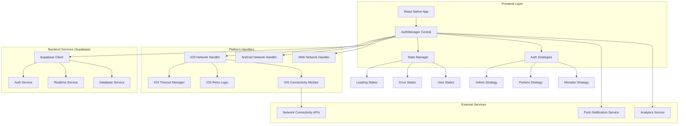
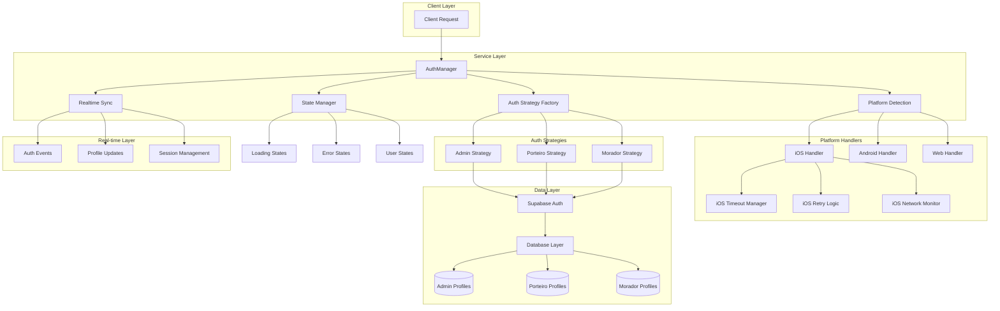
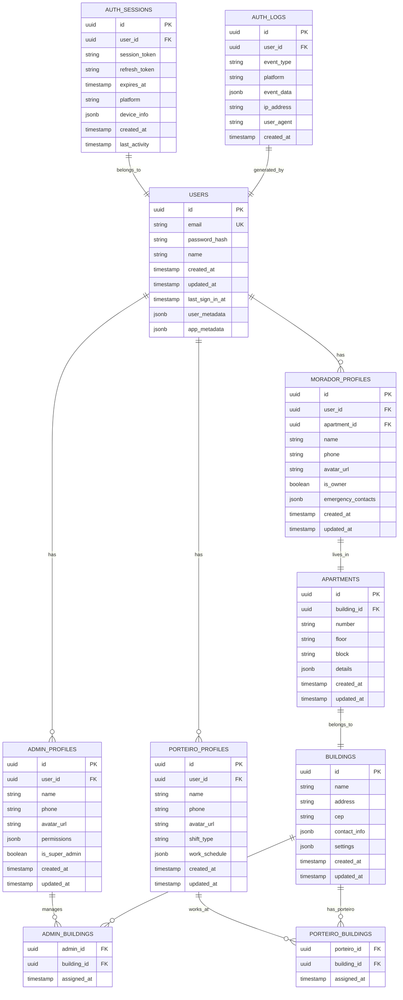

# Arquitetura Técnica - Sistema de Login Robusto iOS

## 1. Arquitetura Design



## 2. Technology Description

- **Frontend**: React Native@0.72 + TypeScript@5.0 + React@18
- **State Management**: Context API + Custom Hooks
- **Backend**: Supabase (PostgreSQL + Auth + Realtime)
- **Network**: @react-native-async-storage/async-storage + @react-native-netinfo/netinfo
- **Platform Detection**: react-native Platform API
- **Logging**: Custom structured logger
- **Testing**: Jest + React Native Testing Library

## 3. Route Definitions

| Route | Purpose | Auth Required | User Types |
|-------|---------|---------------|------------|
| /login | Tela de login unificada | No | All |
| /admin/dashboard | Dashboard administrativo | Yes | Admin |
| /admin/buildings | Gerenciamento de prédios | Yes | Admin |
| /admin/users | Gerenciamento de usuários | Yes | Admin |
| /porteiro/dashboard | Dashboard do porteiro | Yes | Porteiro |
| /porteiro/visitors | Controle de visitantes | Yes | Porteiro |
| /porteiro/deliveries | Controle de entregas | Yes | Porteiro |
| /morador/dashboard | Dashboard do morador | Yes | Morador |
| /morador/visitors | Autorização de visitantes | Yes | Morador |
| /morador/profile | Perfil do morador | Yes | Morador |
| /profile | Perfil comum | Yes | All |
| /settings | Configurações | Yes | All |

## 4. API Definitions

### 4.1 Core Authentication API

**Unified Login**
```typescript
POST /auth/login
```

Request:
| Param Name | Param Type | isRequired | Description |
|------------|------------|------------|-------------|
| email | string | true | Email do usuário |
| password | string | true | Senha do usuário |
| userType | 'admin' \| 'porteiro' \| 'morador' | true | Tipo de usuário |
| platform | 'ios' \| 'android' \| 'web' | true | Plataforma do cliente |
| deviceInfo | DeviceInfo | false | Informações do dispositivo |

Response:
| Param Name | Param Type | Description |
|------------|------------|-------------|
| success | boolean | Status da autenticação |
| user | AuthUser \| null | Dados do usuário autenticado |
| session | Session \| null | Sessão de autenticação |
| error | string \| null | Mensagem de erro se houver |
| metrics | AuthMetrics | Métricas da operação |

Example Request:
```json
{
  "email": "admin@dev.com",
  "password": "123456",
  "userType": "admin",
  "platform": "ios",
  "deviceInfo": {
    "model": "iPhone 14",
    "osVersion": "17.0",
    "appVersion": "1.0.0"
  }
}
```

Example Response:
```json
{
  "success": true,
  "user": {
    "id": "a7cc5c49-10d9-4fa2-aced-35c2f2199ad5",
    "email": "admin@dev.com",
    "name": "Administrador",
    "role": "admin",
    "profile": {
      "adminId": "11111111-1111-1111-1111-111111111111",
      "permissions": ["manage_users", "manage_buildings"]
    }
  },
  "session": {
    "access_token": "eyJhbGciOiJIUzI1NiIs...",
    "refresh_token": "y7shrd5kvbu5",
    "expires_at": 1756106345
  },
  "error": null,
  "metrics": {
    "duration": 1250,
    "attempts": 1,
    "platform": "ios"
  }
}
```

**Session Validation**
```typescript
GET /auth/session
```

Response:
| Param Name | Param Type | Description |
|------------|------------|-------------|
| valid | boolean | Se a sessão é válida |
| user | AuthUser \| null | Dados do usuário se válido |
| expiresAt | number | Timestamp de expiração |

**Logout**
```typescript
POST /auth/logout
```

Request:
| Param Name | Param Type | isRequired | Description |
|------------|------------|------------|-------------|
| sessionId | string | true | ID da sessão a ser encerrada |
| platform | string | true | Plataforma do cliente |

### 4.2 Profile Management API

**Get User Profile**
```typescript
GET /api/profile/{userType}/{userId}
```

Response:
| Param Name | Param Type | Description |
|------------|------------|-------------|
| profile | UserProfile | Dados do perfil do usuário |
| permissions | string[] | Lista de permissões |
| buildings | Building[] | Prédios associados (se aplicável) |

**Update Profile**
```typescript
PUT /api/profile/{userType}/{userId}
```

Request:
| Param Name | Param Type | isRequired | Description |
|------------|------------|------------|-------------|
| name | string | false | Nome do usuário |
| phone | string | false | Telefone do usuário |
| avatar | string | false | URL do avatar |
| preferences | object | false | Preferências do usuário |

### 4.3 Network Monitoring API

**Network Status**
```typescript
GET /api/network/status
```

Response:
| Param Name | Param Type | Description |
|------------|------------|-------------|
| isConnected | boolean | Status de conectividade |
| isInternetReachable | boolean \| null | Se a internet está acessível |
| type | string | Tipo de conexão (wifi, cellular, etc.) |
| details | object | Detalhes específicos da conexão |
| timestamp | number | Timestamp da verificação |

**Connectivity Test**
```typescript
POST /api/network/test
```

Request:
| Param Name | Param Type | isRequired | Description |
|------------|------------|------------|-------------|
| platform | string | true | Plataforma do cliente |
| timeout | number | false | Timeout para o teste (ms) |

Response:
| Param Name | Param Type | Description |
|------------|------------|-------------|
| success | boolean | Se o teste foi bem-sucedido |
| duration | number | Duração do teste em ms |
| details | object | Detalhes do teste |

## 5. Server Architecture Diagram



## 6. Data Model

### 6.1 Data Model Definition



### 6.2 Data Definition Language

**Users Table (Supabase Auth)**
```sql
-- Supabase auth.users table is managed automatically
-- We extend it with our profile tables

-- Enable RLS
ALTER TABLE auth.users ENABLE ROW LEVEL SECURITY;

-- Create policies
CREATE POLICY "Users can view own profile" ON auth.users
    FOR SELECT USING (auth.uid() = id);

CREATE POLICY "Users can update own profile" ON auth.users
    FOR UPDATE USING (auth.uid() = id);
```

**Admin Profiles Table**
```sql
-- Create admin_profiles table
CREATE TABLE admin_profiles (
    id UUID PRIMARY KEY DEFAULT gen_random_uuid(),
    user_id UUID REFERENCES auth.users(id) ON DELETE CASCADE,
    name VARCHAR(255) NOT NULL,
    phone VARCHAR(20),
    avatar_url TEXT,
    permissions JSONB DEFAULT '[]'::jsonb,
    is_super_admin BOOLEAN DEFAULT false,
    created_at TIMESTAMP WITH TIME ZONE DEFAULT NOW(),
    updated_at TIMESTAMP WITH TIME ZONE DEFAULT NOW()
);

-- Create indexes
CREATE UNIQUE INDEX idx_admin_profiles_user_id ON admin_profiles(user_id);
CREATE INDEX idx_admin_profiles_created_at ON admin_profiles(created_at DESC);

-- Enable RLS
ALTER TABLE admin_profiles ENABLE ROW LEVEL SECURITY;

-- Create policies
CREATE POLICY "Admins can view all admin profiles" ON admin_profiles
    FOR SELECT USING (
        EXISTS (
            SELECT 1 FROM admin_profiles ap 
            WHERE ap.user_id = auth.uid()
        )
    );

CREATE POLICY "Admins can update own profile" ON admin_profiles
    FOR UPDATE USING (user_id = auth.uid());

CREATE POLICY "Super admins can manage all profiles" ON admin_profiles
    FOR ALL USING (
        EXISTS (
            SELECT 1 FROM admin_profiles ap 
            WHERE ap.user_id = auth.uid() AND ap.is_super_admin = true
        )
    );

-- Grant permissions
GRANT SELECT ON admin_profiles TO anon;
GRANT ALL PRIVILEGES ON admin_profiles TO authenticated;
```

**Porteiro Profiles Table**
```sql
-- Create porteiro_profiles table
CREATE TABLE porteiro_profiles (
    id UUID PRIMARY KEY DEFAULT gen_random_uuid(),
    user_id UUID REFERENCES auth.users(id) ON DELETE CASCADE,
    name VARCHAR(255) NOT NULL,
    phone VARCHAR(20),
    avatar_url TEXT,
    shift_type VARCHAR(20) CHECK (shift_type IN ('morning', 'afternoon', 'night', 'full_time')),
    work_schedule JSONB DEFAULT '{}'::jsonb,
    created_at TIMESTAMP WITH TIME ZONE DEFAULT NOW(),
    updated_at TIMESTAMP WITH TIME ZONE DEFAULT NOW()
);

-- Create indexes
CREATE UNIQUE INDEX idx_porteiro_profiles_user_id ON porteiro_profiles(user_id);
CREATE INDEX idx_porteiro_profiles_shift ON porteiro_profiles(shift_type);
CREATE INDEX idx_porteiro_profiles_created_at ON porteiro_profiles(created_at DESC);

-- Enable RLS
ALTER TABLE porteiro_profiles ENABLE ROW LEVEL SECURITY;

-- Create policies
CREATE POLICY "Porteiros can view own profile" ON porteiro_profiles
    FOR SELECT USING (user_id = auth.uid());

CREATE POLICY "Porteiros can update own profile" ON porteiro_profiles
    FOR UPDATE USING (user_id = auth.uid());

CREATE POLICY "Admins can view all porteiro profiles" ON porteiro_profiles
    FOR SELECT USING (
        EXISTS (
            SELECT 1 FROM admin_profiles ap 
            WHERE ap.user_id = auth.uid()
        )
    );

CREATE POLICY "Admins can manage porteiro profiles" ON porteiro_profiles
    FOR ALL USING (
        EXISTS (
            SELECT 1 FROM admin_profiles ap 
            WHERE ap.user_id = auth.uid()
        )
    );

-- Grant permissions
GRANT SELECT ON porteiro_profiles TO anon;
GRANT ALL PRIVILEGES ON porteiro_profiles TO authenticated;
```

**Morador Profiles Table**
```sql
-- Create morador_profiles table
CREATE TABLE morador_profiles (
    id UUID PRIMARY KEY DEFAULT gen_random_uuid(),
    user_id UUID REFERENCES auth.users(id) ON DELETE CASCADE,
    apartment_id UUID REFERENCES apartments(id) ON DELETE SET NULL,
    name VARCHAR(255) NOT NULL,
    phone VARCHAR(20),
    avatar_url TEXT,
    is_owner BOOLEAN DEFAULT false,
    emergency_contacts JSONB DEFAULT '[]'::jsonb,
    created_at TIMESTAMP WITH TIME ZONE DEFAULT NOW(),
    updated_at TIMESTAMP WITH TIME ZONE DEFAULT NOW()
);

-- Create indexes
CREATE UNIQUE INDEX idx_morador_profiles_user_id ON morador_profiles(user_id);
CREATE INDEX idx_morador_profiles_apartment ON morador_profiles(apartment_id);
CREATE INDEX idx_morador_profiles_created_at ON morador_profiles(created_at DESC);

-- Enable RLS
ALTER TABLE morador_profiles ENABLE ROW LEVEL SECURITY;

-- Create policies
CREATE POLICY "Moradores can view own profile" ON morador_profiles
    FOR SELECT USING (user_id = auth.uid());

CREATE POLICY "Moradores can update own profile" ON morador_profiles
    FOR UPDATE USING (user_id = auth.uid());

CREATE POLICY "Porteiros can view moradores in their buildings" ON morador_profiles
    FOR SELECT USING (
        EXISTS (
            SELECT 1 FROM porteiro_profiles pp
            JOIN porteiro_buildings pb ON pp.id = pb.porteiro_id
            JOIN apartments a ON a.building_id = pb.building_id
            WHERE pp.user_id = auth.uid() AND a.id = apartment_id
        )
    );

CREATE POLICY "Admins can view all morador profiles" ON morador_profiles
    FOR SELECT USING (
        EXISTS (
            SELECT 1 FROM admin_profiles ap 
            WHERE ap.user_id = auth.uid()
        )
    );

-- Grant permissions
GRANT SELECT ON morador_profiles TO anon;
GRANT ALL PRIVILEGES ON morador_profiles TO authenticated;
```

**Buildings Table**
```sql
-- Create buildings table
CREATE TABLE buildings (
    id UUID PRIMARY KEY DEFAULT gen_random_uuid(),
    name VARCHAR(255) NOT NULL,
    address TEXT NOT NULL,
    cep VARCHAR(10),
    contact_info JSONB DEFAULT '{}'::jsonb,
    settings JSONB DEFAULT '{}'::jsonb,
    created_at TIMESTAMP WITH TIME ZONE DEFAULT NOW(),
    updated_at TIMESTAMP WITH TIME ZONE DEFAULT NOW()
);

-- Create indexes
CREATE INDEX idx_buildings_name ON buildings(name);
CREATE INDEX idx_buildings_cep ON buildings(cep);
CREATE INDEX idx_buildings_created_at ON buildings(created_at DESC);

-- Enable RLS
ALTER TABLE buildings ENABLE ROW LEVEL SECURITY;

-- Create policies
CREATE POLICY "Authenticated users can view buildings" ON buildings
    FOR SELECT USING (auth.role() = 'authenticated');

CREATE POLICY "Admins can manage buildings" ON buildings
    FOR ALL USING (
        EXISTS (
            SELECT 1 FROM admin_profiles ap 
            WHERE ap.user_id = auth.uid()
        )
    );

-- Grant permissions
GRANT SELECT ON buildings TO anon;
GRANT ALL PRIVILEGES ON buildings TO authenticated;
```

**Apartments Table**
```sql
-- Create apartments table
CREATE TABLE apartments (
    id UUID PRIMARY KEY DEFAULT gen_random_uuid(),
    building_id UUID REFERENCES buildings(id) ON DELETE CASCADE,
    number VARCHAR(10) NOT NULL,
    floor VARCHAR(10),
    block VARCHAR(10),
    details JSONB DEFAULT '{}'::jsonb,
    created_at TIMESTAMP WITH TIME ZONE DEFAULT NOW(),
    updated_at TIMESTAMP WITH TIME ZONE DEFAULT NOW()
);

-- Create indexes
CREATE INDEX idx_apartments_building ON apartments(building_id);
CREATE INDEX idx_apartments_number ON apartments(building_id, number);
CREATE INDEX idx_apartments_floor ON apartments(building_id, floor);

-- Create unique constraint
ALTER TABLE apartments ADD CONSTRAINT unique_apartment_per_building 
    UNIQUE (building_id, number, block);

-- Enable RLS
ALTER TABLE apartments ENABLE ROW LEVEL SECURITY;

-- Create policies
CREATE POLICY "Authenticated users can view apartments" ON apartments
    FOR SELECT USING (auth.role() = 'authenticated');

CREATE POLICY "Admins can manage apartments" ON apartments
    FOR ALL USING (
        EXISTS (
            SELECT 1 FROM admin_profiles ap 
            WHERE ap.user_id = auth.uid()
        )
    );

-- Grant permissions
GRANT SELECT ON apartments TO anon;
GRANT ALL PRIVILEGES ON apartments TO authenticated;
```

**Auth Sessions Table**
```sql
-- Create auth_sessions table
CREATE TABLE auth_sessions (
    id UUID PRIMARY KEY DEFAULT gen_random_uuid(),
    user_id UUID REFERENCES auth.users(id) ON DELETE CASCADE,
    session_token TEXT NOT NULL,
    refresh_token TEXT,
    expires_at TIMESTAMP WITH TIME ZONE NOT NULL,
    platform VARCHAR(20) NOT NULL,
    device_info JSONB DEFAULT '{}'::jsonb,
    created_at TIMESTAMP WITH TIME ZONE DEFAULT NOW(),
    last_activity TIMESTAMP WITH TIME ZONE DEFAULT NOW()
);

-- Create indexes
CREATE INDEX idx_auth_sessions_user_id ON auth_sessions(user_id);
CREATE INDEX idx_auth_sessions_token ON auth_sessions(session_token);
CREATE INDEX idx_auth_sessions_expires ON auth_sessions(expires_at);
CREATE INDEX idx_auth_sessions_platform ON auth_sessions(platform);

-- Enable RLS
ALTER TABLE auth_sessions ENABLE ROW LEVEL SECURITY;

-- Create policies
CREATE POLICY "Users can view own sessions" ON auth_sessions
    FOR SELECT USING (user_id = auth.uid());

CREATE POLICY "Users can manage own sessions" ON auth_sessions
    FOR ALL USING (user_id = auth.uid());

-- Grant permissions
GRANT SELECT ON auth_sessions TO anon;
GRANT ALL PRIVILEGES ON auth_sessions TO authenticated;
```

**Auth Logs Table**
```sql
-- Create auth_logs table
CREATE TABLE auth_logs (
    id UUID PRIMARY KEY DEFAULT gen_random_uuid(),
    user_id UUID REFERENCES auth.users(id) ON DELETE SET NULL,
    event_type VARCHAR(50) NOT NULL,
    platform VARCHAR(20) NOT NULL,
    event_data JSONB DEFAULT '{}'::jsonb,
    ip_address INET,
    user_agent TEXT,
    created_at TIMESTAMP WITH TIME ZONE DEFAULT NOW()
);

-- Create indexes
CREATE INDEX idx_auth_logs_user_id ON auth_logs(user_id);
CREATE INDEX idx_auth_logs_event_type ON auth_logs(event_type);
CREATE INDEX idx_auth_logs_platform ON auth_logs(platform);
CREATE INDEX idx_auth_logs_created_at ON auth_logs(created_at DESC);

-- Enable RLS
ALTER TABLE auth_logs ENABLE ROW LEVEL SECURITY;

-- Create policies
CREATE POLICY "Users can view own logs" ON auth_logs
    FOR SELECT USING (user_id = auth.uid());

CREATE POLICY "Admins can view all logs" ON auth_logs
    FOR SELECT USING (
        EXISTS (
            SELECT 1 FROM admin_profiles ap 
            WHERE ap.user_id = auth.uid()
        )
    );

-- Grant permissions
GRANT SELECT ON auth_logs TO anon;
GRANT ALL PRIVILEGES ON auth_logs TO authenticated;
```

**Junction Tables**
```sql
-- Create admin_buildings junction table
CREATE TABLE admin_buildings (
    admin_id UUID REFERENCES admin_profiles(id) ON DELETE CASCADE,
    building_id UUID REFERENCES buildings(id) ON DELETE CASCADE,
    assigned_at TIMESTAMP WITH TIME ZONE DEFAULT NOW(),
    PRIMARY KEY (admin_id, building_id)
);

-- Create porteiro_buildings junction table
CREATE TABLE porteiro_buildings (
    porteiro_id UUID REFERENCES porteiro_profiles(id) ON DELETE CASCADE,
    building_id UUID REFERENCES buildings(id) ON DELETE CASCADE,
    assigned_at TIMESTAMP WITH TIME ZONE DEFAULT NOW(),
    PRIMARY KEY (porteiro_id, building_id)
);

-- Create indexes
CREATE INDEX idx_admin_buildings_admin ON admin_buildings(admin_id);
CREATE INDEX idx_admin_buildings_building ON admin_buildings(building_id);
CREATE INDEX idx_porteiro_buildings_porteiro ON porteiro_buildings(porteiro_id);
CREATE INDEX idx_porteiro_buildings_building ON porteiro_buildings(building_id);

-- Enable RLS
ALTER TABLE admin_buildings ENABLE ROW LEVEL SECURITY;
ALTER TABLE porteiro_buildings ENABLE ROW LEVEL SECURITY;

-- Grant permissions
GRANT SELECT ON admin_buildings TO anon;
GRANT ALL PRIVILEGES ON admin_buildings TO authenticated;
GRANT SELECT ON porteiro_buildings TO anon;
GRANT ALL PRIVILEGES ON porteiro_buildings TO authenticated;
```

**Initial Data**
```sql
-- Insert initial admin user (run after user is created via Supabase Auth)
INSERT INTO admin_profiles (user_id, name, permissions, is_super_admin)
VALUES (
    'a7cc5c49-10d9-4fa2-aced-35c2f2199ad5', -- Replace with actual user ID
    'Super Administrador',
    '["manage_users", "manage_buildings", "manage_system", "view_logs"]'::jsonb,
    true
);

-- Insert sample building
INSERT INTO buildings (name, address, cep, contact_info)
VALUES (
    'Edifício Exemplo',
    'Rua das Flores, 123 - Centro',
    '12345-678',
    '{"phone": "+55 11 1234-5678", "email": "contato@edificio.com"}'::jsonb
);
```

## 7. TypeScript Type Definitions

```typescript
// types/auth.ts
export interface AuthUser {
  id: string;
  email: string;
  name: string;
  role: 'admin' | 'porteiro' | 'morador';
  profile: AdminProfile | PorteiroProfile | MoradorProfile;
  session?: AuthSession;
}

export interface AuthSession {
  access_token: string;
  refresh_token: string;
  expires_at: number;
  user: SupabaseUser;
}

export interface AdminProfile {
  id: string;
  user_id: string;
  name: string;
  phone?: string;
  avatar_url?: string;
  permissions: string[];
  is_super_admin: boolean;
  buildings?: Building[];
}

export interface PorteiroProfile {
  id: string;
  user_id: string;
  name: string;
  phone?: string;
  avatar_url?: string;
  shift_type: 'morning' | 'afternoon' | 'night' | 'full_time';
  work_schedule: Record<string, any>;
  buildings?: Building[];
}

export interface MoradorProfile {
  id: string;
  user_id: string;
  apartment_id?: string;
  name: string;
  phone?: string;
  avatar_url?: string;
  is_owner: boolean;
  emergency_contacts: EmergencyContact[];
  apartment?: Apartment;
}

export interface Building {
  id: string;
  name: string;
  address: string;
  cep?: string;
  contact_info: Record<string, any>;
  settings: Record<string, any>;
}

export interface Apartment {
  id: string;
  building_id: string;
  number: string;
  floor?: string;
  block?: string;
  details: Record<string, any>;
  building?: Building;
}

export interface AuthResult {
  success: boolean;
  user?: AuthUser;
  session?: AuthSession;
  error?: string;
  metrics?: AuthMetrics;
}

export interface AuthMetrics {
  duration: number;
  attempts: number;
  platform: string;
  networkStatus?: ConnectivityStatus;
}

export interface ConnectivityStatus {
  isConnected: boolean;
  isInternetReachable: boolean | null;
  type: string;
  details?: Record<string, any>;
  timestamp: number;
}

export interface DeviceInfo {
  model: string;
  osVersion: string;
  appVersion: string;
  platform: 'ios' | 'android' | 'web';
}

export interface LoginCredentials {
  email: string;
  password: string;
  userType: 'admin' | 'porteiro' | 'morador';
  platform: 'ios' | 'android' | 'web';
  deviceInfo?: DeviceInfo;
}
```

## 8. Platform-Specific Configurations

### 8.1 iOS Configuration

```typescript
// config/ios.config.ts
export const iOSConfig = {
  timeouts: {
    auth: 25000,        // 25s para autenticação
    profile: 20000,     // 20s para buscar perfil
    network: 8000,      // 8s para testes de rede
    session: 15000,     // 15s para validação de sessão
  },
  retries: {
    max: 4,             // Máximo 4 tentativas
    backoff: 2000,      // 2s base para backoff
    jitter: 1000,       // 1s de jitter aleatório
  },
  network: {
    testUrls: [
      'https://www.google.com/favicon.ico',
      'https://httpbin.org/status/200',
      'https://jsonplaceholder.typicode.com/posts/1'
    ],
    testTimeout: 5000,
    monitorInterval: 10000,
  },
  supabase: {
    realtime: {
      heartbeatIntervalMs: 30000,
      reconnectAfterMs: (tries: number) => Math.min(tries * 3000, 15000),
      timeout: 25000,
    },
    auth: {
      flowType: 'pkce',
      autoRefreshToken: true,
      persistSession: true,
      storageKey: 'sb-auth-token-ios',
    }
  }
};
```

### 8.2 Android Configuration

```typescript
// config/android.config.ts
export const androidConfig = {
  timeouts: {
    auth: 15000,        // 15s para autenticação
    profile: 12000,     // 12s para buscar perfil
    network: 5000,      // 5s para testes de rede
    session: 10000,     // 10s para validação de sessão
  },
  retries: {
    max: 3,             // Máximo 3 tentativas
    backoff: 1500,      // 1.5s base para backoff
    jitter: 500,        // 0.5s de jitter aleatório
  },
  network: {
    testUrls: [
      'https://www.google.com/favicon.ico',
      'https://httpbin.org/status/200'
    ],
    testTimeout: 3000,
    monitorInterval: 5000,
  },
  supabase: {
    realtime: {
      heartbeatIntervalMs: 15000,
      reconnectAfterMs: (tries: number) => Math.min(tries * 2000, 10000),
      timeout: 15000,
    },
    auth: {
      flowType: 'implicit',
      autoRefreshToken: true,
      persistSession: true,
      storageKey: 'sb-auth-token-android',
    }
  }
};
```

## 9. Error Handling Strategy

### 9.1 Error Types

```typescript
// types/errors.ts
export enum AuthErrorType {
  NETWORK_ERROR = 'NETWORK_ERROR',
  TIMEOUT_ERROR = 'TIMEOUT_ERROR',
  INVALID_CREDENTIALS = 'INVALID_CREDENTIALS',
  USER_NOT_FOUND = 'USER_NOT_FOUND',
  PROFILE_NOT_FOUND = 'PROFILE_NOT_FOUND',
  PERMISSION_DENIED = 'PERMISSION_DENIED',
  SESSION_EXPIRED = 'SESSION_EXPIRED',
  PLATFORM_ERROR = 'PLATFORM_ERROR',
  UNKNOWN_ERROR = 'UNKNOWN_ERROR'
}

export interface AuthError {
  type: AuthErrorType;
  message: string;
  platform: string;
  timestamp: number;
  details?: Record<string, any>;
  retryable: boolean;
  userMessage: string;
}

export class AuthErrorHandler {
  static createError(
    type: AuthErrorType,
    originalError: any,
    platform: string,
    context?: string
  ): AuthError {
    const baseError: AuthError = {
      type,
      message: originalError?.message || 'Erro desconhecido',
      platform,
      timestamp: Date.now(),
      details: {
        originalError: originalError?.toString(),
        context,
        stack: originalError?.stack
      },
      retryable: false,
      userMessage: 'Ocorreu um erro inesperado'
    };

    switch (type) {
      case AuthErrorType.NETWORK_ERROR:
        return {
          ...baseError,
          retryable: true,
          userMessage: 'Problema de conexão. Verifique sua internet e tente novamente.'
        };
      
      case AuthErrorType.TIMEOUT_ERROR:
        return {
          ...baseError,
          retryable: true,
          userMessage: platform === 'ios' 
            ? 'A operação está demorando mais que o esperado. Tentando novamente...'
            : 'Tempo limite excedido. Tente novamente.'
        };
      
      case AuthErrorType.INVALID_CREDENTIALS:
        return {
          ...baseError,
          retryable: false,
          userMessage: 'Email ou senha incorretos.'
        };
      
      case AuthErrorType.PROFILE_NOT_FOUND:
        return {
          ...baseError,
          retryable: false,
          userMessage: 'Usuário não tem permissão para este tipo de acesso.'
        };
      
      default:
        return baseError;
    }
  }
}
```

## 10. Performance Monitoring

### 10.1 Metrics Collection

```typescript
// services/MetricsCollector.ts
export interface PerformanceMetric {
  operation: string;
  platform: string;
  duration: number;
  success: boolean;
  timestamp: number;
  userType?: string;
  networkType?: string;
  deviceModel?: string;
}

export class MetricsCollector {
  private metrics: PerformanceMetric[] = [];
  private maxMetrics = 1000;
  
  recordMetric(metric: PerformanceMetric): void {
    this.metrics.push(metric);
    
    if (this.metrics.length > this.maxMetrics) {
      this.metrics = this.metrics.slice(-this.maxMetrics);
    }
    
    // Log métricas críticas
    if (!metric.success || metric.duration > 10000) {
      console.warn('🚨 Critical Metric:', metric);
    }
  }
  
  getMetricsSummary(timeWindow: number = 3600000): MetricsSummary {
    const cutoff = Date.now() - timeWindow;
    const recentMetrics = this.metrics.filter(m => m.timestamp > cutoff);
    
    if (recentMetrics.length === 0) {
      return this.getEmptySummary();
    }
    
    const successful = recentMetrics.filter(m => m.success);
    const failed = recentMetrics.filter(m => !m.success);
    
    return {
      totalOperations: recentMetrics.length,
      successRate: (successful.length / recentMetrics.length) * 100,
      averageDuration: this.calculateAverage(successful.map(m => m.duration)),
      failureRate: (failed.length / recentMetrics.length) * 100,
      platformBreakdown: this.groupByPlatform(recentMetrics),
      operationBreakdown: this.groupByOperation(recentMetrics),
      timeWindow
    };
  }
}
```

Este documento de arquitetura técnica fornece uma base sólida para implementar o sistema de login robusto e resolver os problemas de timeout no iOS, mantendo a simplicidade e profissionalismo solicitados.