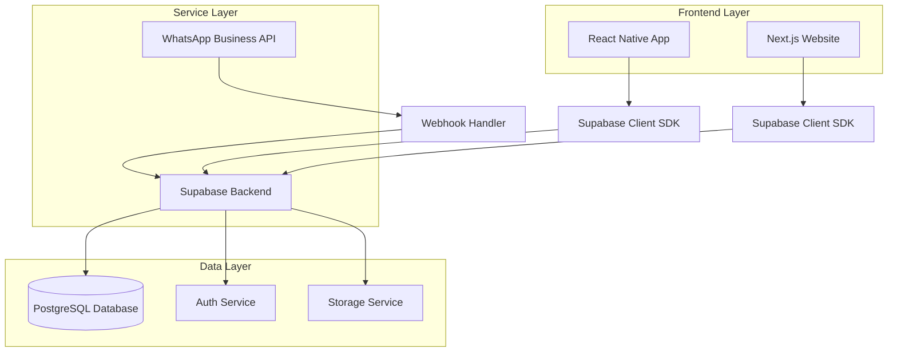
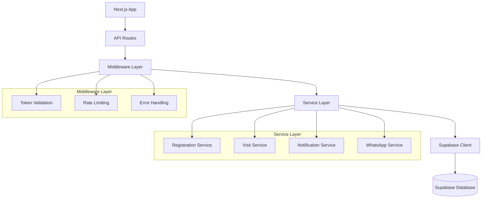
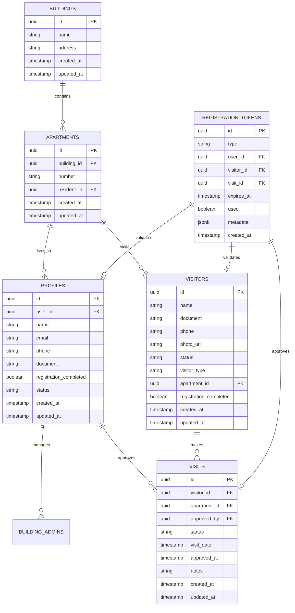

# Arquitetura Técnica: Sistema de Cadastro Integrado

## 1. Arquitetura Geral



## 2. Descrição das Tecnologias

### Frontend
- **React Native App**: Expo SDK 51+ com TypeScript
- **Next.js Website**: Next.js 15.5.0 com TypeScript e Tailwind CSS
- **Supabase Client**: @supabase/supabase-js para ambas as plataformas

### Backend
- **Supabase**: Backend-as-a-Service completo
- **PostgreSQL**: Database gerenciado pelo Supabase
- **Supabase Auth**: Sistema de autenticação integrado
- **Supabase Storage**: Armazenamento de arquivos (fotos de visitantes)

### Serviços Externos
- **WhatsApp Business API**: Para envio de mensagens e links
- **Vercel**: Hospedagem do site Next.js

## 3. Definições de Rotas

### Rotas do Site Next.js

| Rota | Propósito | Parâmetros |
|------|-----------|------------|
| `/` | Página inicial do site | - |
| `/cadastro/morador/[token]` | Finalização de cadastro de morador | token: string |
| `/cadastro/visitante/[token]` | Finalização de cadastro de visitante | token: string |
| `/visita/[token]` | Aprovação/rejeição de visita | token: string |
| `/cadastro/sucesso` | Página de confirmação de cadastro | - |
| `/visita/processada` | Página de confirmação de ação na visita | - |
| `/erro/token-invalido` | Página de erro para tokens inválidos | - |

### Rotas da API (Next.js API Routes)

| Rota | Método | Propósito |
|------|--------|----------|
| `/api/validate-token` | POST | Validar token de registro/aprovação |
| `/api/complete-registration` | POST | Finalizar cadastro de usuário |
| `/api/process-visit` | POST | Processar aprovação/rejeição de visita |
| `/api/webhook/whatsapp` | POST | Webhook para respostas do WhatsApp |

## 4. Definições de API

### 4.1 API de Validação de Token

**Validar Token de Registro**
```
POST /api/validate-token
```

Request:
| Param Name | Param Type | isRequired | Description |
|------------|------------|------------|-------------|
| token | string | true | Token de validação |
| type | string | true | Tipo do token (user_registration, visitor_registration, visit_approval) |

Response:
| Param Name | Param Type | Description |
|------------|------------|-------------|
| valid | boolean | Se o token é válido |
| data | object | Dados associados ao token |
| error | string | Mensagem de erro (se aplicável) |

Example Request:
```json
{
  "token": "550e8400-e29b-41d4-a716-446655440000",
  "type": "user_registration"
}
```

Example Response:
```json
{
  "valid": true,
  "data": {
    "id": "550e8400-e29b-41d4-a716-446655440000",
    "type": "user_registration",
    "user_id": "123e4567-e89b-12d3-a456-426614174000",
    "expires_at": "2024-01-15T10:30:00Z",
    "metadata": {
      "apartment_number": "101",
      "building_id": "building-123"
    }
  }
}
```

### 4.2 API de Finalização de Cadastro

**Completar Cadastro de Usuário**
```
POST /api/complete-registration
```

Request:
| Param Name | Param Type | isRequired | Description |
|------------|------------|------------|-------------|
| token | string | true | Token de validação |
| name | string | true | Nome completo |
| email | string | true | Email do usuário |
| phone | string | true | Telefone |
| document | string | true | CPF/documento |
| photo | string | false | Base64 da foto (para visitantes) |

Response:
| Param Name | Param Type | Description |
|------------|------------|-------------|
| success | boolean | Status da operação |
| user_id | string | ID do usuário criado |
| message | string | Mensagem de confirmação |

Example Request:
```json
{
  "token": "550e8400-e29b-41d4-a716-446655440000",
  "name": "João Silva",
  "email": "joao@email.com",
  "phone": "+5511999999999",
  "document": "12345678901"
}
```

### 4.3 API de Processamento de Visita

**Processar Aprovação/Rejeição de Visita**
```
POST /api/process-visit
```

Request:
| Param Name | Param Type | isRequired | Description |
|------------|------------|------------|-------------|
| token | string | true | Token de aprovação |
| action | string | true | 'approve' ou 'reject' |
| notes | string | false | Observações do morador |

Response:
| Param Name | Param Type | Description |
|------------|------------|-------------|
| success | boolean | Status da operação |
| visit_id | string | ID da visita processada |
| status | string | Status final da visita |

## 5. Arquitetura do Servidor



## 6. Modelo de Dados

### 6.1 Diagrama de Entidades



### 6.2 Definições DDL

**Tabela de Tokens de Registro**
```sql
-- Criar tabela de tokens de registro
CREATE TABLE registration_tokens (
    id UUID PRIMARY KEY DEFAULT gen_random_uuid(),
    type VARCHAR(50) NOT NULL CHECK (type IN ('user_registration', 'visitor_registration', 'visit_approval')),
    user_id UUID REFERENCES profiles(id) ON DELETE CASCADE,
    visitor_id UUID REFERENCES visitors(id) ON DELETE CASCADE,
    visit_id UUID REFERENCES visits(id) ON DELETE CASCADE,
    expires_at TIMESTAMP WITH TIME ZONE NOT NULL,
    used BOOLEAN DEFAULT FALSE,
    metadata JSONB DEFAULT '{}',
    created_at TIMESTAMP WITH TIME ZONE DEFAULT NOW()
);

-- Índices para performance
CREATE INDEX idx_registration_tokens_type ON registration_tokens(type);
CREATE INDEX idx_registration_tokens_expires_at ON registration_tokens(expires_at);
CREATE INDEX idx_registration_tokens_used ON registration_tokens(used);
CREATE INDEX idx_registration_tokens_user_id ON registration_tokens(user_id);
CREATE INDEX idx_registration_tokens_visitor_id ON registration_tokens(visitor_id);
CREATE INDEX idx_registration_tokens_visit_id ON registration_tokens(visit_id);
```

**Atualizar Tabela de Profiles**
```sql
-- Adicionar campos necessários na tabela profiles
ALTER TABLE profiles ADD COLUMN IF NOT EXISTS registration_completed BOOLEAN DEFAULT FALSE;
ALTER TABLE profiles ADD COLUMN IF NOT EXISTS status VARCHAR(50) DEFAULT 'pending';

-- Índice para status
CREATE INDEX IF NOT EXISTS idx_profiles_status ON profiles(status);
CREATE INDEX IF NOT EXISTS idx_profiles_registration_completed ON profiles(registration_completed);
```

**Atualizar Tabela de Visitors**
```sql
-- Adicionar campos necessários na tabela visitors
ALTER TABLE visitors ADD COLUMN IF NOT EXISTS registration_completed BOOLEAN DEFAULT FALSE;
ALTER TABLE visitors ADD COLUMN IF NOT EXISTS registration_token UUID;

-- Índices
CREATE INDEX IF NOT EXISTS idx_visitors_registration_completed ON visitors(registration_completed);
CREATE INDEX IF NOT EXISTS idx_visitors_registration_token ON visitors(registration_token);
```

**Tabela de Visitas (se não existir)**
```sql
-- Criar tabela de visitas
CREATE TABLE IF NOT EXISTS visits (
    id UUID PRIMARY KEY DEFAULT gen_random_uuid(),
    visitor_id UUID NOT NULL REFERENCES visitors(id) ON DELETE CASCADE,
    apartment_id UUID NOT NULL REFERENCES apartments(id) ON DELETE CASCADE,
    approved_by UUID REFERENCES profiles(id) ON DELETE SET NULL,
    status VARCHAR(50) DEFAULT 'pending' CHECK (status IN ('pending', 'approved', 'rejected', 'completed')),
    visit_date TIMESTAMP WITH TIME ZONE,
    approved_at TIMESTAMP WITH TIME ZONE,
    notes TEXT,
    created_at TIMESTAMP WITH TIME ZONE DEFAULT NOW(),
    updated_at TIMESTAMP WITH TIME ZONE DEFAULT NOW()
);

-- Índices
CREATE INDEX idx_visits_visitor_id ON visits(visitor_id);
CREATE INDEX idx_visits_apartment_id ON visits(apartment_id);
CREATE INDEX idx_visits_status ON visits(status);
CREATE INDEX idx_visits_visit_date ON visits(visit_date);
```

**Políticas de Segurança RLS (Row Level Security)**
```sql
-- Habilitar RLS nas tabelas
ALTER TABLE registration_tokens ENABLE ROW LEVEL SECURITY;
ALTER TABLE visits ENABLE ROW LEVEL SECURITY;

-- Política para tokens - apenas o próprio usuário pode acessar
CREATE POLICY "Users can access their own tokens" ON registration_tokens
    FOR ALL USING (
        auth.uid() = user_id OR 
        visitor_id IN (SELECT id FROM visitors WHERE apartment_id IN (
            SELECT id FROM apartments WHERE resident_id IN (
                SELECT id FROM profiles WHERE user_id = auth.uid()
            )
        ))
    );

-- Política para visitas - moradores podem ver visitas do seu apartamento
CREATE POLICY "Residents can manage their apartment visits" ON visits
    FOR ALL USING (
        apartment_id IN (
            SELECT id FROM apartments WHERE resident_id IN (
                SELECT id FROM profiles WHERE user_id = auth.uid()
            )
        )
    );

-- Permitir acesso anônimo para validação de tokens
GRANT SELECT ON registration_tokens TO anon;
GRANT SELECT, UPDATE ON visits TO anon;
GRANT SELECT, UPDATE ON visitors TO anon;
GRANT SELECT, INSERT, UPDATE ON profiles TO anon;

-- Acesso completo para usuários autenticados
GRANT ALL PRIVILEGES ON registration_tokens TO authenticated;
GRANT ALL PRIVILEGES ON visits TO authenticated;
```

**Funções de Limpeza Automática**
```sql
-- Função para limpar tokens expirados
CREATE OR REPLACE FUNCTION cleanup_expired_tokens()
RETURNS void AS $$
BEGIN
    DELETE FROM registration_tokens 
    WHERE expires_at < NOW() AND used = FALSE;
    
    -- Log da limpeza
    INSERT INTO system_logs (action, details, created_at)
    VALUES ('cleanup_tokens', 'Expired tokens cleaned', NOW());
END;
$$ LANGUAGE plpgsql SECURITY DEFINER;

-- Agendar limpeza automática (executar via cron job)
-- SELECT cron.schedule('cleanup-tokens', '0 2 * * *', 'SELECT cleanup_expired_tokens();');
```

**Triggers para Auditoria**
```sql
-- Trigger para atualizar updated_at automaticamente
CREATE OR REPLACE FUNCTION update_updated_at_column()
RETURNS TRIGGER AS $$
BEGIN
    NEW.updated_at = NOW();
    RETURN NEW;
END;
$$ LANGUAGE plpgsql;

-- Aplicar trigger nas tabelas relevantes
CREATE TRIGGER update_profiles_updated_at
    BEFORE UPDATE ON profiles
    FOR EACH ROW EXECUTE FUNCTION update_updated_at_column();

CREATE TRIGGER update_visitors_updated_at
    BEFORE UPDATE ON visitors
    FOR EACH ROW EXECUTE FUNCTION update_updated_at_column();

CREATE TRIGGER update_visits_updated_at
    BEFORE UPDATE ON visits
    FOR EACH ROW EXECUTE FUNCTION update_updated_at_column();
```

## 7. Configurações de Deployment

### 7.1 Variáveis de Ambiente

**Next.js (.env.local)**
```env
# Supabase
NEXT_PUBLIC_SUPABASE_URL=https://ycamhxzumzkpxuhtugxc.supabase.co
NEXT_PUBLIC_SUPABASE_ANON_KEY=eyJhbGciOiJIUzI1NiIsInR5cCI6IkpXVCJ9...
SUPABASE_SERVICE_ROLE_KEY=eyJhbGciOiJIUzI1NiIsInR5cCI6IkpXVCJ9...

# Site
NEXT_PUBLIC_SITE_URL=https://porteiro-site.vercel.app

# WhatsApp
WHATSAPP_API_URL=https://api.whatsapp.com/send
WHATSAPP_BUSINESS_API_TOKEN=your_token_here

# Security
JWT_SECRET=your_jwt_secret_here
ENCRYPTION_KEY=your_encryption_key_here
```

### 7.2 Configuração do Vercel

**vercel.json**
```json
{
  "framework": "nextjs",
  "buildCommand": "npm run build",
  "devCommand": "npm run dev",
  "installCommand": "npm install",
  "env": {
    "NEXT_PUBLIC_SUPABASE_URL": "@supabase-url",
    "NEXT_PUBLIC_SUPABASE_ANON_KEY": "@supabase-anon-key",
    "SUPABASE_SERVICE_ROLE_KEY": "@supabase-service-key"
  },
  "functions": {
    "app/api/**/*.ts": {
      "maxDuration": 30
    }
  },
  "headers": [
    {
      "source": "/api/(.*)",
      "headers": [
        {
          "key": "Access-Control-Allow-Origin",
          "value": "*"
        },
        {
          "key": "Access-Control-Allow-Methods",
          "value": "GET, POST, PUT, DELETE, OPTIONS"
        },
        {
          "key": "Access-Control-Allow-Headers",
          "value": "Content-Type, Authorization"
        }
      ]
    }
  ]
}
```

## 8. Monitoramento e Logs

### 8.1 Métricas de Performance
- Tempo de resposta das APIs
- Taxa de sucesso de validação de tokens
- Taxa de conclusão de cadastros
- Tempo médio de carregamento das páginas

### 8.2 Logs de Auditoria
- Todas as ações de cadastro
- Validações de token
- Tentativas de acesso inválido
- Erros de sistema

### 8.3 Alertas
- Taxa de erro acima de 5%
- Tokens expirados não utilizados
- Tentativas de acesso suspeitas
- Falhas na integração WhatsApp

Esta arquitetura técnica fornece uma base sólida para implementar o sistema de cadastro integrado, garantindo escalabilidade, segurança e manutenibilidade.