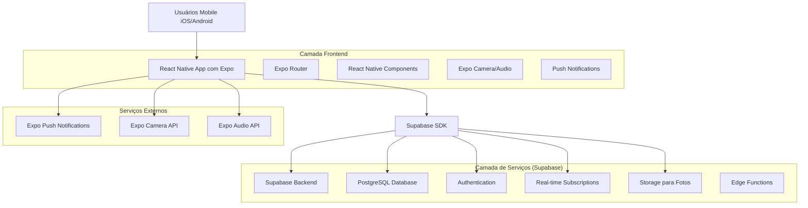
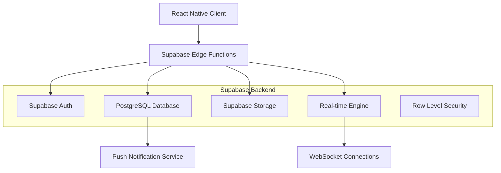
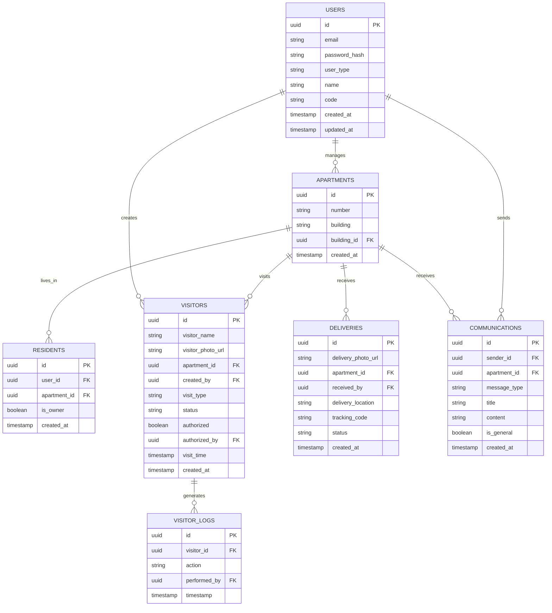

# Documento de Arquitetura Técnica - PorteiroApp

## 1. Design da Arquitetura



## 2. Descrição das Tecnologias

* **Frontend**: React Native\@0.79 + Expo\@53 + Expo Router\@5 + TypeScript\@5.8

* **Backend**: Supabase (PostgreSQL + Auth + Real-time + Storage)

* **Notificações**: Expo Push Notifications

* **Mídia**: Expo Camera + Expo Audio

* **Estado**: React Context API + AsyncStorage

## 3. Definições de Rotas

| Rota                   | Propósito                                                             |
| ---------------------- | --------------------------------------------------------------------- |
| /                      | Tela inicial com seleção de perfil (Porteiro/Morador/Visitante/Admin) |
| /admin                 | Dashboard administrativo com gestão de usuários e comunicados         |
| /admin/users           | Cadastro e gerenciamento de porteiros e moradores                     |
| /admin/logs            | Visualização completa de logs do sistema                              |
| /admin/communications  | Envio de avisos e alertas                                             |
| /porteiro              | Dashboard do porteiro após login                                      |
| /porteiro/login        | Tela de autenticação do porteiro                                      |
| /porteiro/visitor      | Gestão de visitantes e solicitação de autorização                     |
| /porteiro/delivery     | Gestão de encomendas e definição de entrega                           |
| /porteiro/logs         | Histórico de atividades do porteiro                                   |
| /morador               | Dashboard do morador                                                  |
| /morador/notifications | Notificações de visitantes e encomendas                               |
| /morador/authorize     | Tela de autorização com foto do visitante                             |
| /morador/preregister   | Pré-cadastro de visitantes esperados                                  |
| /morador/logs          | Histórico de atividades do apartamento                                |
| /visitante             | Interface para visitantes sem porteiro                                |
| /visitante/select-unit | Seleção do apartamento de destino                                     |
| /visitante/identify    | Identificação e captura de foto                                       |
| /visitante/wait        | Tela de aguardo da autorização                                        |

## 4. Definições de API

### 4.1 APIs Principais

**Autenticação de Usuários**

```
POST /auth/signin
```

Request:

| Nome do Parâmetro | Tipo   | Obrigatório | Descrição                            |
| ----------------- | ------ | ----------- | ------------------------------------ |
| email             | string | true        | Email ou código do usuário           |
| password          | string | true        | Senha do usuário                     |
| user\_type        | string | true        | Tipo: 'admin', 'porteiro', 'morador' |

Response:

| Nome do Parâmetro | Tipo   | Descrição                    |
| ----------------- | ------ | ---------------------------- |
| user              | object | Dados do usuário autenticado |
| session           | object | Token de sessão              |

**Gestão de Visitantes**

```
POST /api/visitors
```

Request:

| Nome do Parâmetro | Tipo   | Obrigatório | Descrição                              |
| ----------------- | ------ | ----------- | -------------------------------------- |
| visitor\_name     | string | true        | Nome do visitante                      |
| apartment\_id     | string | true        | ID do apartamento                      |
| visitor\_photo    | file   | false       | Foto do visitante                      |
| visit\_type       | string | true        | Tipo: 'visitor', 'delivery', 'service' |
| porteiro\_id      | string | false       | ID do porteiro (se aplicável)          |

Response:

| Nome do Parâmetro | Tipo   | Descrição             |
| ----------------- | ------ | --------------------- |
| visitor\_id       | string | ID único da visita    |
| status            | string | Status da solicitação |

**Autorização de Acesso**

```
PUT /api/visitors/{visitor_id}/authorize
```

Request:

| Nome do Parâmetro | Tipo    | Obrigatório | Descrição                       |
| ----------------- | ------- | ----------- | ------------------------------- |
| authorized        | boolean | true        | Autorização concedida ou negada |
| morador\_id       | string  | true        | ID do morador que autorizou     |

Response:

| Nome do Parâmetro | Tipo   | Descrição             |
| ----------------- | ------ | --------------------- |
| status            | string | Status da autorização |
| timestamp         | string | Horário da decisão    |

## 5. Diagrama da Arquitetura do Servidor



## 6. Modelo de Dados

### 6.1 Definição do Modelo de Dados



### 6.2 Linguagem de Definição de Dados

**Tabela de Usuários (users)**

```sql
-- Criar tabela
CREATE TABLE users (
    id UUID PRIMARY KEY DEFAULT gen_random_uuid(),
    email VARCHAR(255) UNIQUE NOT NULL,
    password_hash VARCHAR(255) NOT NULL,
    user_type VARCHAR(20) NOT NULL CHECK (user_type IN ('admin', 'porteiro', 'morador')),
    name VARCHAR(100) NOT NULL,
    code VARCHAR(20) UNIQUE,
    created_at TIMESTAMP WITH TIME ZONE DEFAULT NOW(),
    updated_at TIMESTAMP WITH TIME ZONE DEFAULT NOW()
);

-- Criar índices
CREATE INDEX idx_users_email ON users(email);
CREATE INDEX idx_users_code ON users(code);
CREATE INDEX idx_users_type ON users(user_type);

-- Políticas RLS
ALTER TABLE users ENABLE ROW LEVEL SECURITY;
GRANT SELECT ON users TO anon;
GRANT ALL PRIVILEGES ON users TO authenticated;
```

**Tabela de Apartamentos (apartments)**

```sql
-- Criar tabela
CREATE TABLE apartments (
    id UUID PRIMARY KEY DEFAULT gen_random_uuid(),
    number VARCHAR(10) NOT NULL,
    building VARCHAR(50),
    building_id UUID,
    created_at TIMESTAMP WITH TIME ZONE DEFAULT NOW()
);

-- Criar índices
CREATE INDEX idx_apartments_number ON apartments(number);
CREATE INDEX idx_apartments_building ON apartments(building_id);

-- Políticas RLS
ALTER TABLE apartments ENABLE ROW LEVEL SECURITY;
GRANT SELECT ON apartments TO anon;
GRANT ALL PRIVILEGES ON apartments TO authenticated;
```

**Tabela de Visitantes (visitors)**

```sql
-- Criar tabela
CREATE TABLE visitors (
    id UUID PRIMARY KEY DEFAULT gen_random_uuid(),
    visitor_name VARCHAR(100) NOT NULL,
    visitor_photo_url TEXT,
    apartment_id UUID REFERENCES apartments(id),
    created_by UUID REFERENCES users(id),
    visit_type VARCHAR(20) CHECK (visit_type IN ('visitor', 'delivery', 'service')),
    status VARCHAR(20) DEFAULT 'pending' CHECK (status IN ('pending', 'authorized', 'denied', 'completed')),
    authorized BOOLEAN DEFAULT FALSE,
    authorized_by UUID REFERENCES users(id),
    visit_time TIMESTAMP WITH TIME ZONE DEFAULT NOW(),
    created_at TIMESTAMP WITH TIME ZONE DEFAULT NOW()
);

-- Criar índices
CREATE INDEX idx_visitors_apartment ON visitors(apartment_id);
CREATE INDEX idx_visitors_status ON visitors(status);
CREATE INDEX idx_visitors_created_at ON visitors(created_at DESC);

-- Políticas RLS
ALTER TABLE visitors ENABLE ROW LEVEL SECURITY;
GRANT SELECT ON visitors TO anon;
GRANT ALL PRIVILEGES ON visitors TO authenticated;

-- Dados iniciais
INSERT INTO apartments (number, building) VALUES 
('101', 'Bloco A'),
('102', 'Bloco A'),
('201', 'Bloco A'),
('202', 'Bloco A');
```

