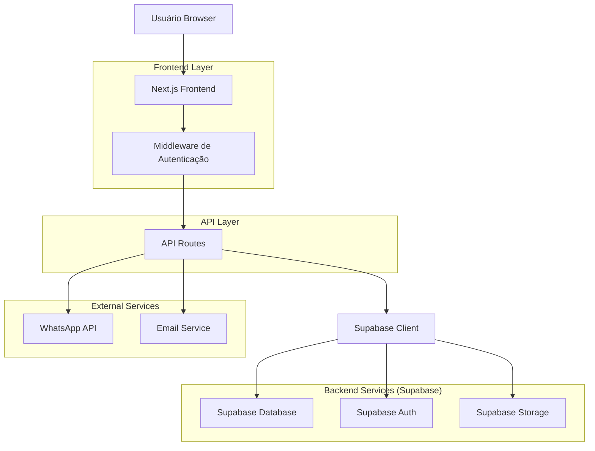
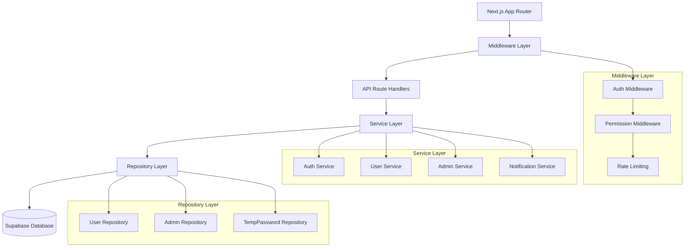
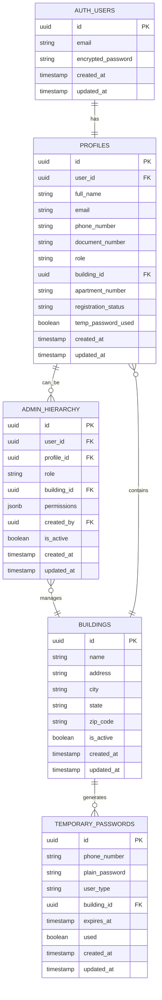

# Arquitetura Técnica - Porteiro Site

## 1. Arquitetura Geral



## 2. Tecnologias Utilizadas

- **Frontend**: Next.js 14 + TypeScript + Tailwind CSS
- **Backend**: Supabase (PostgreSQL + Auth + Storage)
- **Autenticação**: Supabase Auth + JWT
- **Validação**: Zod
- **Testes**: Vitest + Testing Library
- **Deploy**: Vercel

## 3. Definições de Rotas

| Rota | Propósito | Proteção |
|------|-----------|----------|
| `/` | Página inicial pública | Nenhuma |
| `/login` | Login de administradores | Redirect se autenticado |
| `/cadastro/visitante/completar` | Completar cadastro de visitante | Token temporário |
| `/cadastro/morador/completar` | Completar cadastro de morador | Token temporário |
| `/admin` | Dashboard administrativo | Admin+ apenas |
| `/admin/gestao-administradores` | Gestão de administradores | Super Admin apenas |
| `/admin/usuarios` | Gestão de usuários | Admin+ |
| `/admin/predios` | Gestão de prédios | Super Admin apenas |
| `/unauthorized` | Página de acesso negado | Nenhuma |

## 4. Definições de API

### 4.1 Autenticação e Cadastro

#### Validar Senha Temporária
```
POST /api/auth/validate-temp-password
```

**Request:**
| Param | Type | Required | Description |
|-------|------|----------|-------------|
| phone_number | string | true | Número de telefone |
| plain_password | string | true | Senha temporária |
| user_type | string | true | Tipo: 'visitante' ou 'morador' |

**Response:**
| Param | Type | Description |
|-------|------|-------------|
| valid | boolean | Se a senha é válida |
| temp_password_id | string | ID da senha temporária |
| building_info | object | Informações do prédio (se morador) |

**Exemplo:**
```json
{
  "phone_number": "+5511999999999",
  "plain_password": "ABC12345",
  "user_type": "visitante"
}
```

#### Completar Cadastro
```
POST /api/auth/complete-registration
```

**Request:**
| Param | Type | Required | Description |
|-------|------|----------|-------------|
| temp_password_id | string | true | ID da senha temporária |
| full_name | string | true | Nome completo |
| email | string | true | Email |
| document_number | string | true | CPF/RG |
| password | string | true | Nova senha |
| apartment_number | string | false | Número do apartamento (morador) |

**Response:**
| Param | Type | Description |
|-------|------|-------------|
| success | boolean | Status do cadastro |
| user_id | string | ID do usuário criado |
| session | object | Dados da sessão |

### 4.2 Gestão de Administradores

#### Listar Administradores
```
GET /api/admin/administrators
```

**Response:**
| Param | Type | Description |
|-------|------|-------------|
| administrators | array | Lista de administradores |
| total | number | Total de registros |

#### Criar Administrador
```
POST /api/admin/administrators
```

**Request:**
| Param | Type | Required | Description |
|-------|------|----------|-------------|
| email | string | true | Email do novo admin |
| full_name | string | true | Nome completo |
| role | string | true | Papel: 'admin' ou 'sindico' |
| building_id | string | false | ID do prédio (se sindico) |
| permissions | object | false | Permissões customizadas |

### 4.3 Gestão de Senhas Temporárias

#### Criar Senha Temporária
```
POST /api/admin/temp-passwords
```

**Request:**
| Param | Type | Required | Description |
|-------|------|----------|-------------|
| phone_number | string | true | Número de telefone |
| user_type | string | true | Tipo: 'visitante' ou 'morador' |
| building_id | string | false | ID do prédio (se morador) |
| expires_hours | number | false | Horas para expirar (padrão: 24) |

**Response:**
| Param | Type | Description |
|-------|------|-------------|
| temp_password | string | Senha temporária gerada |
| expires_at | string | Data de expiração |

## 5. Arquitetura do Servidor



## 6. Modelo de Dados

### 6.1 Diagrama ER



### 6.2 DDL (Data Definition Language)

#### Tabela: temporary_passwords
```sql
CREATE TABLE IF NOT EXISTS temporary_passwords (
  id UUID PRIMARY KEY DEFAULT gen_random_uuid(),
  phone_number VARCHAR(20) NOT NULL,
  plain_password VARCHAR(50) NOT NULL,
  user_type VARCHAR(20) NOT NULL CHECK (user_type IN ('visitante', 'morador')),
  building_id UUID REFERENCES buildings(id) ON DELETE CASCADE,
  expires_at TIMESTAMP WITH TIME ZONE NOT NULL,
  used BOOLEAN DEFAULT FALSE,
  created_at TIMESTAMP WITH TIME ZONE DEFAULT NOW(),
  updated_at TIMESTAMP WITH TIME ZONE DEFAULT NOW()
);

-- Índices
CREATE UNIQUE INDEX idx_temp_passwords_phone_active ON temporary_passwords(phone_number) 
WHERE used = FALSE AND expires_at > NOW();

CREATE INDEX idx_temp_passwords_expires ON temporary_passwords(expires_at);
CREATE INDEX idx_temp_passwords_building ON temporary_passwords(building_id);

-- RLS Policies
ALTER TABLE temporary_passwords ENABLE ROW LEVEL SECURITY;

CREATE POLICY "temp_passwords_select_policy" ON temporary_passwords
  FOR SELECT USING (TRUE);

CREATE POLICY "temp_passwords_insert_policy" ON temporary_passwords
  FOR INSERT WITH CHECK (
    EXISTS (
      SELECT 1 FROM admin_hierarchy ah
      JOIN profiles p ON p.id = ah.profile_id
      WHERE p.user_id = auth.uid()
      AND ah.role IN ('super_admin', 'admin', 'sindico')
      AND ah.is_active = TRUE
      AND (ah.building_id = temporary_passwords.building_id OR ah.role = 'super_admin')
    )
  );

CREATE POLICY "temp_passwords_update_policy" ON temporary_passwords
  FOR UPDATE USING (
    -- Permitir marcar como usado durante o cadastro
    used = FALSE AND expires_at > NOW()
  );
```

#### Tabela: admin_hierarchy
```sql
CREATE TABLE IF NOT EXISTS admin_hierarchy (
  id UUID PRIMARY KEY DEFAULT gen_random_uuid(),
  user_id UUID NOT NULL REFERENCES auth.users(id) ON DELETE CASCADE,
  profile_id UUID NOT NULL REFERENCES profiles(id) ON DELETE CASCADE,
  role VARCHAR(20) NOT NULL CHECK (role IN ('super_admin', 'admin', 'sindico')),
  building_id UUID REFERENCES buildings(id) ON DELETE CASCADE,
  permissions JSONB DEFAULT '{}',
  created_by UUID REFERENCES profiles(id),
  is_active BOOLEAN DEFAULT TRUE,
  created_at TIMESTAMP WITH TIME ZONE DEFAULT NOW(),
  updated_at TIMESTAMP WITH TIME ZONE DEFAULT NOW(),
  
  -- Constraints
  CONSTRAINT admin_hierarchy_building_check CHECK (
    (role = 'super_admin' AND building_id IS NULL) OR
    (role IN ('admin', 'sindico') AND building_id IS NOT NULL)
  )
);

-- Índices
CREATE UNIQUE INDEX idx_admin_hierarchy_user_building ON admin_hierarchy(user_id, building_id)
WHERE is_active = TRUE;

CREATE INDEX idx_admin_hierarchy_role ON admin_hierarchy(role);
CREATE INDEX idx_admin_hierarchy_building ON admin_hierarchy(building_id);

-- RLS Policies
ALTER TABLE admin_hierarchy ENABLE ROW LEVEL SECURITY;

CREATE POLICY "admin_hierarchy_select_policy" ON admin_hierarchy
  FOR SELECT USING (
    user_id = auth.uid()
    OR EXISTS (
      SELECT 1 FROM admin_hierarchy ah
      JOIN profiles p ON p.id = ah.profile_id
      WHERE p.user_id = auth.uid()
      AND ah.role = 'super_admin'
      AND ah.is_active = TRUE
    )
  );

CREATE POLICY "admin_hierarchy_insert_policy" ON admin_hierarchy
  FOR INSERT WITH CHECK (
    EXISTS (
      SELECT 1 FROM admin_hierarchy ah
      JOIN profiles p ON p.id = ah.profile_id
      WHERE p.user_id = auth.uid()
      AND ah.role = 'super_admin'
      AND ah.is_active = TRUE
    )
  );
```

#### Atualização da tabela profiles
```sql
-- Adicionar campos necessários
ALTER TABLE profiles ADD COLUMN IF NOT EXISTS registration_status VARCHAR(20) DEFAULT 'pending' 
CHECK (registration_status IN ('pending', 'completed', 'rejected'));

ALTER TABLE profiles ADD COLUMN IF NOT EXISTS registration_token VARCHAR(100);
ALTER TABLE profiles ADD COLUMN IF NOT EXISTS temp_password_used BOOLEAN DEFAULT FALSE;
ALTER TABLE profiles ADD COLUMN IF NOT EXISTS apartment_number VARCHAR(20);

-- Índices adicionais
CREATE INDEX IF NOT EXISTS idx_profiles_registration_status ON profiles(registration_status);
CREATE INDEX IF NOT EXISTS idx_profiles_building_apartment ON profiles(building_id, apartment_number);
```

#### Funções auxiliares
```sql
-- Função para limpar senhas temporárias expiradas
CREATE OR REPLACE FUNCTION cleanup_expired_temp_passwords()
RETURNS INTEGER AS $$
DECLARE
  deleted_count INTEGER;
BEGIN
  DELETE FROM temporary_passwords 
  WHERE expires_at < NOW() OR (used = TRUE AND created_at < NOW() - INTERVAL '7 days');
  
  GET DIAGNOSTICS deleted_count = ROW_COUNT;
  RETURN deleted_count;
END;
$$ LANGUAGE plpgsql SECURITY DEFINER;

-- Função para validar permissões de admin
CREATE OR REPLACE FUNCTION check_admin_permission(
  user_uuid UUID,
  required_role TEXT,
  target_building_id UUID DEFAULT NULL
)
RETURNS BOOLEAN AS $$
DECLARE
  admin_record RECORD;
BEGIN
  SELECT ah.role, ah.building_id, ah.is_active
  INTO admin_record
  FROM admin_hierarchy ah
  JOIN profiles p ON p.id = ah.profile_id
  WHERE p.user_id = user_uuid
  AND ah.is_active = TRUE;
  
  IF NOT FOUND THEN
    RETURN FALSE;
  END IF;
  
  -- Super admin tem acesso total
  IF admin_record.role = 'super_admin' THEN
    RETURN TRUE;
  END IF;
  
  -- Verificar role específica
  IF required_role = 'admin' AND admin_record.role IN ('admin', 'super_admin') THEN
    -- Se especificou building, verificar se tem acesso
    IF target_building_id IS NOT NULL THEN
      RETURN admin_record.building_id = target_building_id OR admin_record.role = 'super_admin';
    END IF;
    RETURN TRUE;
  END IF;
  
  IF required_role = 'sindico' AND admin_record.role IN ('sindico', 'admin', 'super_admin') THEN
    IF target_building_id IS NOT NULL THEN
      RETURN admin_record.building_id = target_building_id OR admin_record.role IN ('admin', 'super_admin');
    END IF;
    RETURN TRUE;
  END IF;
  
  RETURN FALSE;
END;
$$ LANGUAGE plpgsql SECURITY DEFINER;

-- Trigger para atualizar updated_at
CREATE OR REPLACE FUNCTION update_updated_at_column()
RETURNS TRIGGER AS $$
BEGIN
    NEW.updated_at = NOW();
    RETURN NEW;
END;
$$ LANGUAGE plpgsql;

CREATE TRIGGER update_temp_passwords_updated_at
    BEFORE UPDATE ON temporary_passwords
    FOR EACH ROW
    EXECUTE FUNCTION update_updated_at_column();

CREATE TRIGGER update_admin_hierarchy_updated_at
    BEFORE UPDATE ON admin_hierarchy
    FOR EACH ROW
    EXECUTE FUNCTION update_updated_at_column();
```

#### Dados iniciais
```sql
-- Inserir super admin inicial (ajustar conforme necessário)
INSERT INTO admin_hierarchy (user_id, profile_id, role, permissions, is_active)
SELECT 
  p.user_id,
  p.id,
  'super_admin',
  '{
    "can_create_buildings": true,
    "can_manage_users": true,
    "can_create_temp_passwords": true,
    "can_view_all_logs": true,
    "can_manage_admins": true,
    "buildings_access": ["*"]
  }'::jsonb,
  true
FROM profiles p
WHERE p.email = 'admin@porteiroapp.com' -- Ajustar email
AND NOT EXISTS (
  SELECT 1 FROM admin_hierarchy ah WHERE ah.profile_id = p.id
);
```

Esta arquitetura técnica fornece uma base sólida e escalável para o sistema porteiro-site, com foco em segurança, performance e manutenibilidade.