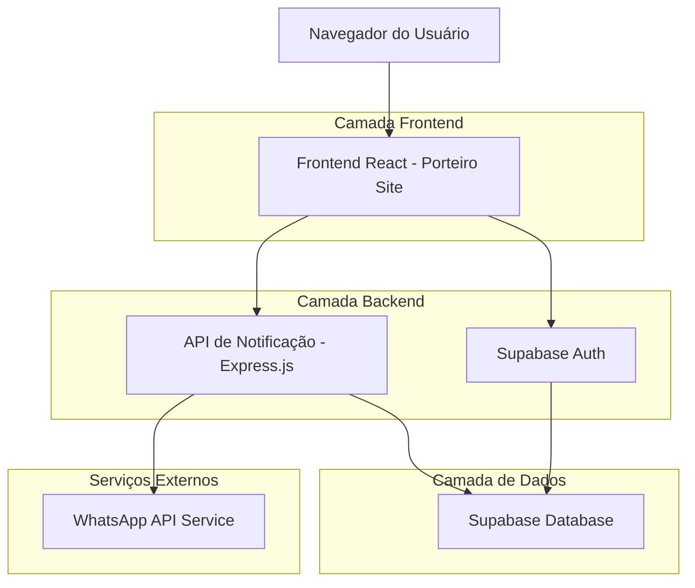
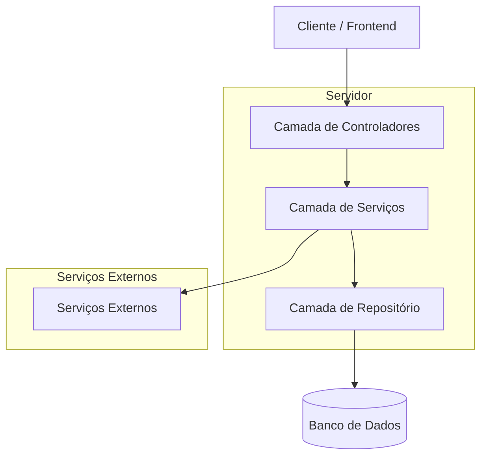
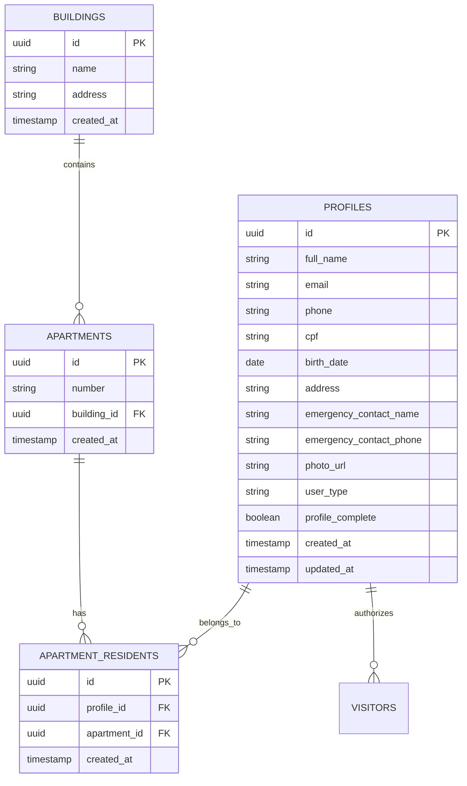

# Documento de Arquitetura Técnica - Simplificação do Cadastro de Moradores

## 1. Design da Arquitetura



## 2. Descrição das Tecnologias

- Frontend: React@18 + Next.js@14 + TailwindCSS@3 + TypeScript
- Backend: Express.js@4 + Supabase (PostgreSQL)
- Autenticação: Supabase Auth
- Notificações: WhatsApp Business API
- Upload de Arquivos: Supabase Storage

## 3. Definições de Rotas

| Rota | Propósito |
|------|----------|
| /cadastro | Página de cadastro inicial simplificado (sem token) |
| /cadastro/completar | Página para completar dados pessoais e criar nova senha |
| /cadastro/sucesso | Página de confirmação de cadastro realizado |
| /login | Página de login para moradores |
| /morador | Área restrita do morador (após login) |

## 4. Definições de API

### 4.1 APIs Principais

**Cadastro inicial de morador**
```
POST /api/register-resident
```

Request:
| Nome do Parâmetro | Tipo | Obrigatório | Descrição |
|-------------------|------|-------------|----------|
| full_name | string | true | Nome completo do morador |
| email | string | true | Email válido |
| phone | string | true | Telefone no formato brasileiro |
| building_id | string | true | ID do prédio |
| apartment_number | string | true | Número do apartamento |

Response:
| Nome do Parâmetro | Tipo | Descrição |
|-------------------|------|----------|
| success | boolean | Status da operação |
| user_id | string | ID do usuário criado |
| temporary_password | string | Senha temporária gerada |
| whatsapp_sent | boolean | Se a notificação foi enviada |

Exemplo:
```json
{
  "full_name": "João Silva",
  "email": "joao@email.com",
  "phone": "11999999999",
  "building_id": "uuid-building",
  "apartment_number": "101"
}
```

**Completar cadastro**
```
POST /api/complete-profile
```

Request:
| Nome do Parâmetro | Tipo | Obrigatório | Descrição |
|-------------------|------|-------------|----------|
| user_id | string | true | ID do usuário |
| cpf | string | true | CPF válido |
| birth_date | string | false | Data de nascimento (YYYY-MM-DD) |
| address | string | false | Endereço completo |
| emergency_contact_name | string | false | Nome do contato de emergência |
| emergency_contact_phone | string | false | Telefone do contato de emergência |
| new_password | string | true | Nova senha escolhida pelo usuário |
| photo_url | string | false | URL da foto de perfil |

Response:
| Nome do Parâmetro | Tipo | Descrição |
|-------------------|------|----------|
| success | boolean | Status da operação |
| profile_complete | boolean | Se o perfil está completo |

**Upload de foto**
```
POST /api/upload-profile-photo
```

Request: FormData com arquivo de imagem

Response:
| Nome do Parâmetro | Tipo | Descrição |
|-------------------|------|----------|
| success | boolean | Status do upload |
| photo_url | string | URL da foto enviada |

## 5. Arquitetura do Servidor



## 6. Modelo de Dados

### 6.1 Definição do Modelo de Dados



### 6.2 Linguagem de Definição de Dados

**Atualização da tabela profiles**
```sql
-- Adicionar colunas para o novo fluxo
ALTER TABLE profiles ADD COLUMN IF NOT EXISTS profile_complete BOOLEAN DEFAULT FALSE;
ALTER TABLE profiles ADD COLUMN IF NOT EXISTS emergency_contact_name VARCHAR(255);
ALTER TABLE profiles ADD COLUMN IF NOT EXISTS emergency_contact_phone VARCHAR(20);
ALTER TABLE profiles ADD COLUMN IF NOT EXISTS temporary_password_used BOOLEAN DEFAULT FALSE;

-- Índices para melhor performance
CREATE INDEX IF NOT EXISTS idx_profiles_email ON profiles(email);
CREATE INDEX IF NOT EXISTS idx_profiles_phone ON profiles(phone);
CREATE INDEX IF NOT EXISTS idx_profiles_profile_complete ON profiles(profile_complete);

-- Políticas RLS para Supabase
ALTER TABLE profiles ENABLE ROW LEVEL SECURITY;

-- Permitir leitura básica para usuários anônimos (necessário para cadastro)
CREATE POLICY "Allow anonymous read for registration" ON profiles
    FOR SELECT USING (true);

-- Permitir inserção para usuários anônimos (cadastro inicial)
CREATE POLICY "Allow anonymous insert for registration" ON profiles
    FOR INSERT WITH CHECK (true);

-- Permitir atualização apenas para o próprio usuário autenticado
CREATE POLICY "Allow users to update own profile" ON profiles
    FOR UPDATE USING (auth.uid() = id);

-- Permitir acesso completo para usuários autenticados
CREATE POLICY "Allow authenticated users full access" ON profiles
    FOR ALL USING (auth.role() = 'authenticated');
```

**Função para gerar senha aleatória (seguindo padrão do admin)**
```sql
-- Função para gerar senha aleatória de 6 dígitos numéricos
CREATE OR REPLACE FUNCTION generate_random_password()
RETURNS TEXT AS $$
DECLARE
    digits TEXT := '0123456789';
    result TEXT := '';
    i INTEGER;
BEGIN
    FOR i IN 1..6 LOOP
        result := result || substr(digits, floor(random() * length(digits) + 1)::integer, 1);
    END LOOP;
    RETURN result;
END;
$$ LANGUAGE plpgsql;
```

**Tabela para controle de senhas temporárias**
```sql
-- Tabela para rastrear senhas temporárias
CREATE TABLE IF NOT EXISTS temporary_passwords (
    id UUID PRIMARY KEY DEFAULT gen_random_uuid(),
    user_id UUID REFERENCES profiles(id) ON DELETE CASCADE,
    password_hash TEXT NOT NULL,
    used_at TIMESTAMP WITH TIME ZONE,
    expires_at TIMESTAMP WITH TIME ZONE DEFAULT (NOW() + INTERVAL '24 hours'),
    created_at TIMESTAMP WITH TIME ZONE DEFAULT NOW()
);

-- Índices
CREATE INDEX idx_temporary_passwords_user_id ON temporary_passwords(user_id);
CREATE INDEX idx_temporary_passwords_expires_at ON temporary_passwords(expires_at);

-- RLS
ALTER TABLE temporary_passwords ENABLE ROW LEVEL SECURITY;

CREATE POLICY "Allow service role full access" ON temporary_passwords
    FOR ALL USING (auth.role() = 'service_role');
```