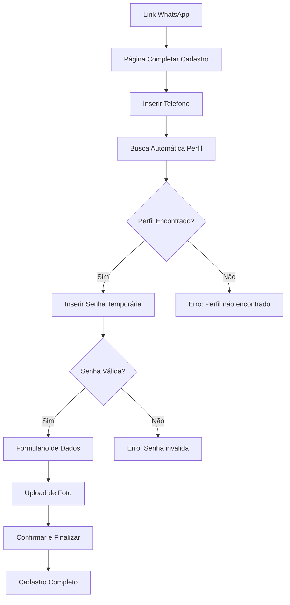

# Correção das Rotas de Completar Cadastro - Documento de Requisitos

## 1. Visão Geral do Produto

Este documento detalha as correções necessárias para as funcionalidades de completar cadastro de visitantes e moradores no sistema PorteiroApp. O problema principal identificado é a inconsistência entre as rotas do app React Native e do site Next.js, além de problemas na busca de perfil por número de celular e design não profissional das páginas.

## 2. Funcionalidades Principais

### 2.1 Papéis de Usuário

| Papel     | Método de Registro                      | Permissões Principais                             |
| --------- | --------------------------------------- | ------------------------------------------------- |
| Visitante | Link de completar cadastro via WhatsApp | Pode completar cadastro com CPF e foto            |
| Morador   | Link de completar cadastro via WhatsApp | Pode completar perfil completo com dados pessoais |

### 2.2 Módulos de Funcionalidade

Nossas correções consistem nas seguintes páginas principais:

1. **Página de Completar Cadastro de Visitante**: autenticação por telefone, validação de CPF, upload de foto
2. **Página de Completar Cadastro de Morador**: autenticação por telefone, formulário completo de perfil, upload de foto
3. **Sistema de Busca de Perfil**: busca automática por número de celular com debounce
4. **Validações de Formulário**: validação em tempo real e controle de estado dos botões

### 2.3 Detalhes das Páginas

| Nome da Página               | Nome do Módulo      | Descrição da Funcionalidade                                                                        |
| ---------------------------- | ------------------- | -------------------------------------------------------------------------------------------------- |
| Completar Cadastro Visitante | Autenticação        | Buscar perfil por telefone, validar senha temporária, manter botão desativado até perfil carregado |
| Completar Cadastro Visitante | Formulário CPF      | Validar CPF em tempo real, formatação automática, mensagens de erro claras                         |
| Completar Cadastro Visitante | Upload de Foto      | Capturar ou selecionar foto, validar formato e tamanho, preview da imagem                          |
| Completar Cadastro Morador   | Autenticação        | Buscar perfil por telefone com debounce, validar senha temporária, feedback visual                 |
| Completar Cadastro Morador   | Formulário Completo | Dados pessoais, contato de emergência, validação em tempo real                                     |
| Completar Cadastro Morador   | Upload de Foto      | Capturar ou selecionar foto, validar formato e tamanho, preview da imagem                          |
| Sistema de Busca             | Busca por Telefone  | Debounce de 1.5s, busca automática, feedback visual de carregamento                                |
| Validações                   | Controle de Estado  | Botões desativados até validação completa, mensagens de erro contextuais                           |

## 3. Processo Principal

### Fluxo do Visitante:

1. Visitante recebe link via WhatsApp
2. Acessa página de completar cadastro
3. Insere telefone (busca automática do perfil)
4. Insere senha temporária
5. Preenche CPF (com validação)
6. Faz upload da foto
7. Confirma dados e finaliza cadastro

### Fluxo do Morador:

1. Morador recebe link via WhatsApp
2. Acessa página de completar cadastro
3. Insere telefone (busca automática do perfil)
4. Insere senha temporária
5. Preenche formulário completo (dados pessoais, emergência)
6. Faz upload da foto
7. Confirma dados e finaliza cadastro

## 4. Design da Interface do Usuário

### 4.1 Estilo de Design

* **Cores Primárias**: Azul #2563EB (primária), Cinza #6B7280 (secundária)

* **Estilo dos Botões**: Arredondados com sombra sutil, estados visuais claros (ativo/desativo)

* **Fonte**: Inter ou system font, tamanhos 14px (corpo), 18px (títulos), 24px (cabeçalhos)

* **Layout**: Card-based com espaçamento generoso, design mobile-first

* **Ícones**: Lucide React ou Ionicons, estilo outline, tamanho 20px-24px

### 4.2 Visão Geral do Design das Páginas

| Nome da Página               | Nome do Módulo      | Elementos da UI                                                                   |
| ---------------------------- | ------------------- | --------------------------------------------------------------------------------- |
| Completar Cadastro Visitante | Cabeçalho           | Logo JAMES AVISA, título "Complete seu Cadastro", indicador de progresso          |
| Completar Cadastro Visitante | Formulário de Login | Campos telefone e senha com formatação automática, botão desativado até validação |
| Completar Cadastro Visitante | Feedback Visual     | Spinner de carregamento, mensagens de sucesso/erro com cores apropriadas          |
| Completar Cadastro Visitante | Formulário CPF      | Campo CPF com máscara, validação em tempo real, mensagens de erro contextuais     |
| Completar Cadastro Visitante | Upload de Foto      | Área de drop/click, preview da imagem, botões câmera/galeria                      |
| Completar Cadastro Morador   | Formulário Completo | Campos organizados em seções, validação em tempo real, indicadores visuais        |
| Completar Cadastro Morador   | Navegação           | Botões voltar/avançar, indicador de progresso, salvamento automático              |

### 4.3 Responsividade

O produto é mobile-first com adaptação para desktop. Inclui otimização para toque e gestos nativos em dispositivos móveis.

## 5. Problemas Identificados e Soluções

### 5.1 Problemas Técnicos

1. **Rotas inexistentes no app React Native**

   * Problema: Rotas `/cadastro/morador/completar` e `/cadastro/visitante/completar` existem apenas no Next.js

   * Solução: Criar rotas correspondentes no app React Native

2. **Busca de perfil por telefone falha**

   * Problema: Busca não funciona corretamente, comparação de números inconsistente

   * Solução: Implementar busca com debounce, normalização de números, feedback visual

3. **Validação de formulários inadequada**

   * Problema: Botões permanecem ativos mesmo sem dados válidos

   * Solução: Implementar validação em tempo real, controle de estado dos botões

### 5.2 Problemas de UX/UI

1. **Design não profissional**

   * Problema: Interface básica, sem feedback visual adequado

   * Solução: Redesign com componentes modernos, cores consistentes, animações sutis

2. **Falta de feedback para o usuário**

   * Problema: Usuário não sabe se ações estão sendo processadas

   * Solução: Adicionar spinners, mensagens de status, indicadores de progresso

3. **Experiência de upload de foto ruim**

   * Problema: Interface confusa para upload de fotos

   * Solução: Interface intuitiva com preview, opções claras (câmera/galeria)

## 6. Melhorias Propostas

### 6.1 Melhorias Técnicas

* Implementar debounce de 1.5s na busca por telefone

* Adicionar normalização de números de telefone (remover caracteres especiais)

* Implementar cache local para dados do perfil

* Adicionar retry automático para falhas de rede

* Validação de CPF com algoritmo completo

* Upload de foto com compressão automática

### 6.2 Melhorias de UX/UI

* Design system consistente com cores e tipografia definidas

* Animações de transição suaves entre estados

* Feedback visual imediato para todas as ações

* Mensagens de erro contextuais e acionáveis

* Indicadores de progresso claros

* Interface responsiva e acessível

### 6.3 Validações Implementadas

* Botão "Entrar" desativado até perfil ser encontrado

* Validação de CPF em tempo real

* Validação de formato de telefone

* Validação de senha temporária (6 dígitos)

* Validação de upload de foto (formato e tamanho)

* Prevenção de múltiplos envios (debounce em botões)

