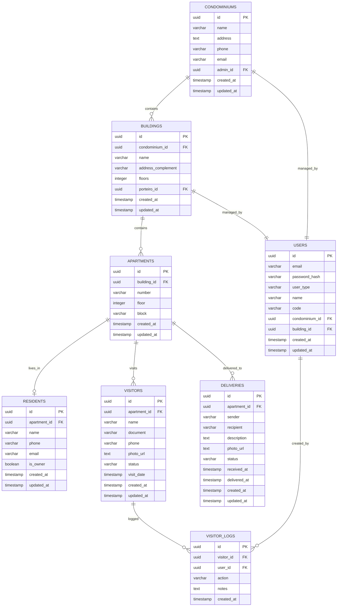

# Arquitetura de Banco de Dados - PorteiroApp
## Estrutura Hierárquica Multi-Condomínio

## 1. Visão Geral da Arquitetura

Este documento define a nova estrutura hierárquica do banco de dados para suportar múltiplos condomínios e prédios:

**Hierarquia:** `Condomínio` → `Prédios` → `Apartamentos` → `Morador`

## 2. Modelo de Dados

### 2.1 Diagrama Entidade-Relacionamento



### 2.2 Scripts SQL de Criação

#### Tabela Condominiums
```sql
CREATE TABLE condominiums (
    id UUID PRIMARY KEY DEFAULT gen_random_uuid(),
    name VARCHAR(255) NOT NULL,
    address TEXT NOT NULL,
    phone VARCHAR(20),
    email VARCHAR(255),
    admin_id UUID,
    created_at TIMESTAMP WITH TIME ZONE DEFAULT NOW(),
    updated_at TIMESTAMP WITH TIME ZONE DEFAULT NOW()
);

-- Índices
CREATE INDEX idx_condominiums_admin_id ON condominiums(admin_id);
CREATE INDEX idx_condominiums_name ON condominiums(name);
```

#### Tabela Buildings
```sql
CREATE TABLE buildings (
    id UUID PRIMARY KEY DEFAULT gen_random_uuid(),
    condominium_id UUID NOT NULL REFERENCES condominiums(id) ON DELETE CASCADE,
    name VARCHAR(255) NOT NULL,
    address_complement VARCHAR(255),
    floors INTEGER DEFAULT 1,
    porteiro_id UUID,
    created_at TIMESTAMP WITH TIME ZONE DEFAULT NOW(),
    updated_at TIMESTAMP WITH TIME ZONE DEFAULT NOW()
);

-- Índices
CREATE INDEX idx_buildings_condominium_id ON buildings(condominium_id);
CREATE INDEX idx_buildings_porteiro_id ON buildings(porteiro_id);
CREATE INDEX idx_buildings_name ON buildings(name);
```

#### Tabela Apartments
```sql
CREATE TABLE apartments (
    id UUID PRIMARY KEY DEFAULT gen_random_uuid(),
    building_id UUID NOT NULL REFERENCES buildings(id) ON DELETE CASCADE,
    number VARCHAR(10) NOT NULL,
    floor INTEGER NOT NULL,
    block VARCHAR(10),
    created_at TIMESTAMP WITH TIME ZONE DEFAULT NOW(),
    updated_at TIMESTAMP WITH TIME ZONE DEFAULT NOW(),
    UNIQUE(building_id, number)
);

-- Índices
CREATE INDEX idx_apartments_building_id ON apartments(building_id);
CREATE INDEX idx_apartments_number ON apartments(number);
CREATE INDEX idx_apartments_floor ON apartments(floor);
```

#### Tabela Residents
```sql
CREATE TABLE residents (
    id UUID PRIMARY KEY DEFAULT gen_random_uuid(),
    apartment_id UUID NOT NULL REFERENCES apartments(id) ON DELETE CASCADE,
    name VARCHAR(255) NOT NULL,
    phone VARCHAR(20),
    email VARCHAR(255),
    is_owner BOOLEAN DEFAULT FALSE,
    created_at TIMESTAMP WITH TIME ZONE DEFAULT NOW(),
    updated_at TIMESTAMP WITH TIME ZONE DEFAULT NOW()
);

-- Índices
CREATE INDEX idx_residents_apartment_id ON residents(apartment_id);
CREATE INDEX idx_residents_name ON residents(name);
CREATE INDEX idx_residents_email ON residents(email);
```

#### Tabela Users (Atualizada)
```sql
-- Remover tabela existente se necessário
DROP TABLE IF EXISTS users CASCADE;

CREATE TABLE users (
    id UUID PRIMARY KEY DEFAULT gen_random_uuid(),
    email VARCHAR(255) UNIQUE NOT NULL,
    password_hash VARCHAR(255) NOT NULL,
    user_type VARCHAR(20) NOT NULL CHECK (user_type IN ('admin', 'porteiro', 'morador')),
    name VARCHAR(255) NOT NULL,
    code VARCHAR(10),
    condominium_id UUID REFERENCES condominiums(id) ON DELETE SET NULL,
    building_id UUID REFERENCES buildings(id) ON DELETE SET NULL,
    created_at TIMESTAMP WITH TIME ZONE DEFAULT NOW(),
    updated_at TIMESTAMP WITH TIME ZONE DEFAULT NOW()
);

-- Índices
CREATE INDEX idx_users_email ON users(email);
CREATE INDEX idx_users_user_type ON users(user_type);
CREATE INDEX idx_users_condominium_id ON users(condominium_id);
CREATE INDEX idx_users_building_id ON users(building_id);
CREATE INDEX idx_users_code ON users(code);
```

#### Tabela Visitors (Atualizada)
```sql
-- Remover tabela existente se necessário
DROP TABLE IF EXISTS visitors CASCADE;

CREATE TABLE visitors (
    id UUID PRIMARY KEY DEFAULT gen_random_uuid(),
    apartment_id UUID NOT NULL REFERENCES apartments(id) ON DELETE CASCADE,
    name VARCHAR(255) NOT NULL,
    document VARCHAR(50),
    phone VARCHAR(20),
    photo_url TEXT,
    status VARCHAR(20) DEFAULT 'pending' CHECK (status IN ('pending', 'approved', 'denied', 'completed')),
    visit_date TIMESTAMP WITH TIME ZONE,
    created_at TIMESTAMP WITH TIME ZONE DEFAULT NOW(),
    updated_at TIMESTAMP WITH TIME ZONE DEFAULT NOW()
);

-- Índices
CREATE INDEX idx_visitors_apartment_id ON visitors(apartment_id);
CREATE INDEX idx_visitors_status ON visitors(status);
CREATE INDEX idx_visitors_visit_date ON visitors(visit_date);
CREATE INDEX idx_visitors_name ON visitors(name);
```

#### Tabela Deliveries (Atualizada)
```sql
-- Remover tabela existente se necessário
DROP TABLE IF EXISTS deliveries CASCADE;

CREATE TABLE deliveries (
    id UUID PRIMARY KEY DEFAULT gen_random_uuid(),
    apartment_id UUID NOT NULL REFERENCES apartments(id) ON DELETE CASCADE,
    sender VARCHAR(255),
    recipient VARCHAR(255) NOT NULL,
    description TEXT,
    photo_url TEXT,
    status VARCHAR(20) DEFAULT 'received' CHECK (status IN ('received', 'delivered', 'returned')),
    received_at TIMESTAMP WITH TIME ZONE DEFAULT NOW(),
    delivered_at TIMESTAMP WITH TIME ZONE,
    created_at TIMESTAMP WITH TIME ZONE DEFAULT NOW(),
    updated_at TIMESTAMP WITH TIME ZONE DEFAULT NOW()
);

-- Índices
CREATE INDEX idx_deliveries_apartment_id ON deliveries(apartment_id);
CREATE INDEX idx_deliveries_status ON deliveries(status);
CREATE INDEX idx_deliveries_received_at ON deliveries(received_at);
CREATE INDEX idx_deliveries_recipient ON deliveries(recipient);
```

#### Tabela Visitor_Logs (Atualizada)
```sql
-- Remover tabela existente se necessário
DROP TABLE IF EXISTS visitor_logs CASCADE;

CREATE TABLE visitor_logs (
    id UUID PRIMARY KEY DEFAULT gen_random_uuid(),
    visitor_id UUID NOT NULL REFERENCES visitors(id) ON DELETE CASCADE,
    user_id UUID NOT NULL REFERENCES users(id) ON DELETE CASCADE,
    action VARCHAR(50) NOT NULL,
    notes TEXT,
    created_at TIMESTAMP WITH TIME ZONE DEFAULT NOW()
);

-- Índices
CREATE INDEX idx_visitor_logs_visitor_id ON visitor_logs(visitor_id);
CREATE INDEX idx_visitor_logs_user_id ON visitor_logs(user_id);
CREATE INDEX idx_visitor_logs_action ON visitor_logs(action);
CREATE INDEX idx_visitor_logs_created_at ON visitor_logs(created_at DESC);
```

### 2.3 Constraints e Relacionamentos

#### Foreign Keys
```sql
-- Adicionar foreign keys após criação das tabelas
ALTER TABLE condominiums ADD CONSTRAINT fk_condominiums_admin 
    FOREIGN KEY (admin_id) REFERENCES users(id) ON DELETE SET NULL;

ALTER TABLE buildings ADD CONSTRAINT fk_buildings_porteiro 
    FOREIGN KEY (porteiro_id) REFERENCES users(id) ON DELETE SET NULL;
```

#### Triggers para Updated_At
```sql
-- Função para atualizar timestamp
CREATE OR REPLACE FUNCTION update_updated_at_column()
RETURNS TRIGGER AS $$
BEGIN
    NEW.updated_at = NOW();
    RETURN NEW;
END;
$$ language 'plpgsql';

-- Triggers para cada tabela
CREATE TRIGGER update_condominiums_updated_at BEFORE UPDATE ON condominiums 
    FOR EACH ROW EXECUTE FUNCTION update_updated_at_column();

CREATE TRIGGER update_buildings_updated_at BEFORE UPDATE ON buildings 
    FOR EACH ROW EXECUTE FUNCTION update_updated_at_column();

CREATE TRIGGER update_apartments_updated_at BEFORE UPDATE ON apartments 
    FOR EACH ROW EXECUTE FUNCTION update_updated_at_column();

CREATE TRIGGER update_residents_updated_at BEFORE UPDATE ON residents 
    FOR EACH ROW EXECUTE FUNCTION update_updated_at_column();

CREATE TRIGGER update_users_updated_at BEFORE UPDATE ON users 
    FOR EACH ROW EXECUTE FUNCTION update_updated_at_column();

CREATE TRIGGER update_visitors_updated_at BEFORE UPDATE ON visitors 
    FOR EACH ROW EXECUTE FUNCTION update_updated_at_column();

CREATE TRIGGER update_deliveries_updated_at BEFORE UPDATE ON deliveries 
    FOR EACH ROW EXECUTE FUNCTION update_updated_at_column();
```

## 3. Políticas de Segurança (RLS)

### 3.1 Habilitação do RLS
```sql
-- Habilitar RLS em todas as tabelas
ALTER TABLE condominiums ENABLE ROW LEVEL SECURITY;
ALTER TABLE buildings ENABLE ROW LEVEL SECURITY;
ALTER TABLE apartments ENABLE ROW LEVEL SECURITY;
ALTER TABLE residents ENABLE ROW LEVEL SECURITY;
ALTER TABLE users ENABLE ROW LEVEL SECURITY;
ALTER TABLE visitors ENABLE ROW LEVEL SECURITY;
ALTER TABLE deliveries ENABLE ROW LEVEL SECURITY;
ALTER TABLE visitor_logs ENABLE ROW LEVEL SECURITY;
```

### 3.2 Políticas por Tabela

#### Condominiums
```sql
-- Admins podem ver apenas seu condomínio
CREATE POLICY "Admins can view their condominium" ON condominiums
    FOR SELECT USING (
        auth.jwt() ->> 'user_type' = 'admin' AND 
        admin_id = (auth.jwt() ->> 'sub')::uuid
    );

-- Admins podem atualizar seu condomínio
CREATE POLICY "Admins can update their condominium" ON condominiums
    FOR UPDATE USING (
        auth.jwt() ->> 'user_type' = 'admin' AND 
        admin_id = (auth.jwt() ->> 'sub')::uuid
    );
```

#### Buildings
```sql
-- Admins podem ver prédios do seu condomínio
CREATE POLICY "Admins can view buildings in their condominium" ON buildings
    FOR SELECT USING (
        auth.jwt() ->> 'user_type' = 'admin' AND 
        condominium_id IN (
            SELECT id FROM condominiums WHERE admin_id = (auth.jwt() ->> 'sub')::uuid
        )
    );

-- Porteiros podem ver apenas seu prédio
CREATE POLICY "Porteiros can view their building" ON buildings
    FOR SELECT USING (
        auth.jwt() ->> 'user_type' = 'porteiro' AND 
        porteiro_id = (auth.jwt() ->> 'sub')::uuid
    );
```

#### Apartments
```sql
-- Admins podem ver apartamentos do seu condomínio
CREATE POLICY "Admins can view apartments in their condominium" ON apartments
    FOR SELECT USING (
        auth.jwt() ->> 'user_type' = 'admin' AND 
        building_id IN (
            SELECT b.id FROM buildings b 
            JOIN condominiums c ON b.condominium_id = c.id 
            WHERE c.admin_id = (auth.jwt() ->> 'sub')::uuid
        )
    );

-- Porteiros podem ver apartamentos do seu prédio
CREATE POLICY "Porteiros can view apartments in their building" ON apartments
    FOR SELECT USING (
        auth.jwt() ->> 'user_type' = 'porteiro' AND 
        building_id IN (
            SELECT id FROM buildings WHERE porteiro_id = (auth.jwt() ->> 'sub')::uuid
        )
    );
```

#### Visitors
```sql
-- Porteiros podem gerenciar visitantes do seu prédio
CREATE POLICY "Porteiros can manage visitors in their building" ON visitors
    FOR ALL USING (
        auth.jwt() ->> 'user_type' = 'porteiro' AND 
        apartment_id IN (
            SELECT a.id FROM apartments a 
            JOIN buildings b ON a.building_id = b.id 
            WHERE b.porteiro_id = (auth.jwt() ->> 'sub')::uuid
        )
    );

-- Admins podem ver visitantes do seu condomínio
CREATE POLICY "Admins can view visitors in their condominium" ON visitors
    FOR SELECT USING (
        auth.jwt() ->> 'user_type' = 'admin' AND 
        apartment_id IN (
            SELECT a.id FROM apartments a 
            JOIN buildings b ON a.building_id = b.id 
            JOIN condominiums c ON b.condominium_id = c.id 
            WHERE c.admin_id = (auth.jwt() ->> 'sub')::uuid
        )
    );
```

## 4. Dados de Exemplo

```sql
-- Inserir condomínio exemplo
INSERT INTO condominiums (id, name, address, phone, email) VALUES 
('550e8400-e29b-41d4-a716-446655440001', 'Residencial Jardim das Flores', 'Rua das Flores, 123', '(11) 1234-5678', 'admin@jardimflores.com.br');

-- Inserir admin
INSERT INTO users (id, email, password_hash, user_type, name, code, condominium_id) VALUES 
('550e8400-e29b-41d4-a716-446655440002', 'admin@jardimflores.com.br', '$2b$10$hash', 'admin', 'João Silva', 'ADM001', '550e8400-e29b-41d4-a716-446655440001');

-- Atualizar admin_id no condomínio
UPDATE condominiums SET admin_id = '550e8400-e29b-41d4-a716-446655440002' WHERE id = '550e8400-e29b-41d4-a716-446655440001';

-- Inserir prédio
INSERT INTO buildings (id, condominium_id, name, floors) VALUES 
('550e8400-e29b-41d4-a716-446655440003', '550e8400-e29b-41d4-a716-446655440001', 'Bloco A', 10);

-- Inserir porteiro
INSERT INTO users (id, email, password_hash, user_type, name, code, condominium_id, building_id) VALUES 
('550e8400-e29b-41d4-a716-446655440004', 'porteiro@jardimflores.com.br', '$2b$10$hash', 'porteiro', 'Carlos Santos', 'POR001', '550e8400-e29b-41d4-a716-446655440001', '550e8400-e29b-41d4-a716-446655440003');

-- Atualizar porteiro_id no prédio
UPDATE buildings SET porteiro_id = '550e8400-e29b-41d4-a716-446655440004' WHERE id = '550e8400-e29b-41d4-a716-446655440003';

-- Inserir apartamentos
INSERT INTO apartments (building_id, number, floor, block) VALUES 
('550e8400-e29b-41d4-a716-446655440003', '101', 1, 'A'),
('550e8400-e29b-41d4-a716-446655440003', '102', 1, 'A'),
('550e8400-e29b-41d4-a716-446655440003', '201', 2, 'A');
```

## 5. Migração dos Dados Existentes

### 5.1 Script de Migração
```sql
-- 1. Criar condomínio padrão para dados existentes
INSERT INTO condominiums (id, name, address) VALUES 
('00000000-0000-0000-0000-000000000001', 'Condomínio Principal', 'Endereço Principal');

-- 2. Criar prédio padrão
INSERT INTO buildings (id, condominium_id, name) VALUES 
('00000000-0000-0000-0000-000000000002', '00000000-0000-0000-0000-000000000001', 'Prédio Principal');

-- 3. Migrar apartamentos existentes
INSERT INTO apartments (id, building_id, number, floor)
SELECT 
    id,
    '00000000-0000-0000-0000-000000000002',
    number,
    COALESCE(floor, 1)
FROM apartments_old;

-- 4. Atualizar usuários com condomínio/prédio padrão
UPDATE users SET 
    condominium_id = '00000000-0000-0000-0000-000000000001',
    building_id = CASE 
        WHEN user_type = 'porteiro' THEN '00000000-0000-0000-0000-000000000002'
        ELSE NULL 
    END;
```

## 6. Performance e Otimização

### 6.1 Índices Compostos
```sql
-- Índice composto para busca de apartamentos por prédio e número
CREATE INDEX idx_apartments_building_number ON apartments(building_id, number);

-- Índice composto para visitantes por apartamento e status
CREATE INDEX idx_visitors_apartment_status ON visitors(apartment_id, status);

-- Índice composto para entregas por apartamento e status
CREATE INDEX idx_deliveries_apartment_status ON deliveries(apartment_id, status);
```

### 6.2 Views para Consultas Complexas
```sql
-- View para informações completas de apartamentos
CREATE VIEW apartment_details AS
SELECT 
    a.id,
    a.number,
    a.floor,
    a.block,
    b.name as building_name,
    c.name as condominium_name,
    r.name as resident_name,
    r.phone as resident_phone
FROM apartments a
JOIN buildings b ON a.building_id = b.id
JOIN condominiums c ON b.condominium_id = c.id
LEFT JOIN residents r ON a.id = r.apartment_id;

-- View para estatísticas de visitantes
CREATE VIEW visitor_statistics AS
SELECT 
    c.name as condominium_name,
    b.name as building_name,
    COUNT(v.id) as total_visitors,
    COUNT(CASE WHEN v.status = 'approved' THEN 1 END) as approved_visitors,
    COUNT(CASE WHEN v.status = 'denied' THEN 1 END) as denied_visitors
FROM condominiums c
JOIN buildings b ON c.id = b.condominium_id
JOIN apartments a ON b.id = a.building_id
JOIN visitors v ON a.id = v.apartment_id
GROUP BY c.id, c.name, b.id, b.name;
```

## 7. Considerações de Implementação

### 7.1 Alterações no Frontend
- Atualizar contexto de autenticação para incluir `condominium_id` e `building_id`
- Modificar telas para filtrar dados por hierarquia
- Implementar seleção de condomínio/prédio para super admins

### 7.2 Alterações no Backend
- Atualizar queries para respeitar hierarquia
- Implementar middleware de autorização por nível
- Adicionar validações de integridade referencial

### 7.3 Testes
- Testes unitários para cada política RLS
- Testes de integração para fluxos completos
- Testes de performance com dados em volume

Esta arquitetura garante escalabilidade, segurança e manutenibilidade para o sistema PorteiroApp com múltiplos condomínios e prédios.