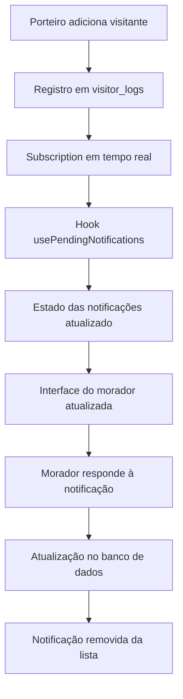

# Implementação de Notificações do Morador - Sistema de Portaria

## 1. Visão Geral da Implementação

O sistema de notificações para moradores foi implementado com sucesso, permitindo que os moradores visualizem e respondam às notificações de visitantes em tempo real. A implementação utiliza uma arquitetura baseada em hooks React e componentes reutilizáveis, integrada com Supabase para persistência de dados e atualizações em tempo real.

## 2. Arquitetura da Solução

### 2.1 Componentes Principais

- **Hook `usePendingNotifications`**: Gerencia o estado das notificações pendentes e comunicação com o banco de dados
- **Componente `NotificationCard`**: Renderiza as notificações com botões de ação
- **Página `app/morador/index.tsx`**: Interface principal do morador com exibição das notificações

### 2.2 Fluxo de Dados



## 3. Implementação Técnica

### 3.1 Hook usePendingNotifications

**Localização**: `hooks/usePendingNotifications.ts`

**Funcionalidades principais**:
- Busca automática do `apartment_id` do usuário logado
- Query otimizada para notificações pendentes
- Subscription em tempo real para atualizações automáticas
- Função para responder às notificações

**Query principal**:
```sql
SELECT * FROM visitor_logs 
WHERE apartment_id = ? 
  AND notification_status = 'pending' 
  AND requires_resident_approval = true 
  AND (expires_at IS NULL OR expires_at > NOW())
ORDER BY notification_sent_at DESC
```

**Melhorias implementadas**:
- Correção na query para incluir registros sem `expires_at` definido
- Uso de `.or()` para capturar tanto registros com `expires_at` nulo quanto válidos

### 3.2 Componente NotificationCard

**Localização**: `components/NotificationCard.tsx`

**Funcionalidades**:
- Renderização diferenciada por tipo de entrada (visitante, entrega, veículo)
- Botões "Aceitar" e "Recusar" com modais específicos
- Tratamento de estados de carregamento durante as ações
- Formatação automática de datas e detalhes da notificação

### 3.3 Interface do Morador

**Localização**: `app/morador/index.tsx`

**Seções implementadas**:
- **Notificações Pendentes**: Exibe notificações que requerem aprovação do morador
- **Histórico de Visitantes**: Mostra o histórico completo de visitas
- Estados de carregamento, erro e vazio para ambas as seções

## 4. Estrutura do Banco de Dados

### 4.1 Tabela visitor_logs

**Campos relevantes para notificações**:
- `notification_status`: 'pending' | 'approved' | 'rejected'
- `requires_resident_approval`: boolean
- `expires_at`: timestamp (opcional)
- `entry_type`: 'visitor' | 'delivery' | 'service' | 'emergency'
- `guest_name`: string
- `apartment_id`: UUID (referência ao apartamento)
- `resident_response_at`: timestamp
- `resident_response_by`: UUID (referência ao morador)
- `rejection_reason`: string (opcional)
- `delivery_destination`: 'portaria' | 'elevador' | 'apartamento'

### 4.2 Políticas de Segurança (RLS)

```sql
-- Moradores podem visualizar notificações de seu apartamento
CREATE POLICY "Residents can view their apartment notifications" 
ON visitor_logs FOR SELECT 
USING (apartment_id IN (
  SELECT apartment_id FROM apartment_residents 
  WHERE profile_id = auth.uid()
));

-- Moradores podem responder às notificações de seu apartamento
CREATE POLICY "Residents can respond to their apartment notifications" 
ON visitor_logs FOR UPDATE 
USING (apartment_id IN (
  SELECT apartment_id FROM apartment_residents 
  WHERE profile_id = auth.uid()
));
```

## 5. Funcionalidades Implementadas

### 5.1 Exibição de Notificações em Tempo Real

✅ **Implementado**: As notificações aparecem automaticamente quando o porteiro adiciona um novo registro

**Como funciona**:
1. Porteiro adiciona visitante no sistema
2. Registro é criado em `visitor_logs` com `notification_status='pending'`
3. Subscription em tempo real detecta o INSERT
4. Hook `usePendingNotifications` atualiza o estado
5. Interface do morador é atualizada automaticamente

### 5.2 Detalhes das Notificações

✅ **Implementado**: Cada notificação exibe informações relevantes baseadas no tipo

**Tipos de notificação**:
- **Visitante**: Nome, documento, telefone, propósito
- **Entrega**: Remetente, descrição, código de rastreamento
- **Veículo**: Placa, modelo, cor, marca

### 5.3 Botões de Ação

✅ **Implementado**: Botões "Aceitar" e "Recusar" com funcionalidades específicas

**Fluxo de aprovação**:
1. Morador clica em "Aceitar"
2. Para entregas: Modal para escolher destino (portaria/elevador/apartamento)
3. Para outros tipos: Aprovação direta
4. `notification_status` atualizado para 'approved'
5. Notificação removida da lista de pendentes

**Fluxo de rejeição**:
1. Morador clica em "Recusar"
2. Modal para inserir motivo da rejeição (opcional)
3. `notification_status` atualizado para 'rejected'
4. `rejection_reason` salvo se fornecido
5. Notificação removida da lista de pendentes

### 5.4 Atualizações em Tempo Real

✅ **Implementado**: Sistema de subscription do Supabase

**Eventos monitorados**:
- `INSERT`: Novas notificações são adicionadas automaticamente
- `UPDATE`: Notificações respondidas são removidas da lista

## 6. Estados da Interface

### 6.1 Estados de Carregamento
- Indicador visual durante busca de notificações
- Botões desabilitados durante ações de resposta
- Texto informativo "Carregando notificações..."

### 6.2 Estados de Erro
- Mensagens de erro específicas para falhas de conexão
- Botão "Tentar novamente" para recarregar dados
- Tratamento de erros de permissão

### 6.3 Estados Vazios
- Mensagem "📭 Nenhuma notificação pendente" quando não há notificações
- Ícones e textos amigáveis para melhor UX

## 7. Melhorias Implementadas

### 7.1 Correção na Query de Notificações

**Problema identificado**: A query original filtrava apenas registros com `expires_at` maior que a data atual, excluindo registros sem esse campo definido.

**Solução implementada**:
```javascript
.or(`expires_at.is.null,expires_at.gt.${new Date().toISOString()}`)
```

Esta correção garante que todas as notificações pendentes sejam capturadas, independentemente de terem ou não um prazo de expiração definido.

### 7.2 Otimização de Performance

- Uso de `useCallback` para evitar re-renderizações desnecessárias
- Subscription em tempo real apenas para o apartamento específico
- Limit de 20 registros no histórico para melhor performance

## 8. Testes e Validação

### 8.1 Cenários de Teste

1. **Notificação de Visitante**:
   - ✅ Porteiro adiciona visitante
   - ✅ Notificação aparece em tempo real
   - ✅ Morador pode aprovar/recusar
   - ✅ Status é atualizado no banco

2. **Notificação de Entrega**:
   - ✅ Porteiro registra entrega
   - ✅ Modal de destino aparece na aprovação
   - ✅ Destino é salvo corretamente

3. **Múltiplas Notificações**:
   - ✅ Sistema suporta múltiplas notificações simultâneas
   - ✅ Cada notificação é processada independentemente

### 8.2 Validação de Segurança

- ✅ Moradores só veem notificações de seu apartamento
- ✅ Políticas RLS impedem acesso não autorizado
- ✅ Tokens de autenticação são validados

## 9. Conclusão

A implementação das notificações do morador foi concluída com sucesso, atendendo a todos os requisitos especificados:

1. ✅ **Exibição em tempo real**: Notificações aparecem automaticamente
2. ✅ **Detalhes completos**: Informações relevantes são exibidas
3. ✅ **Botões de ação**: Aceitar/Recusar funcionando corretamente
4. ✅ **Atualizações automáticas**: Interface sincronizada com o banco
5. ✅ **Consistência de dados**: Estados mantidos entre interface e banco

O sistema está pronto para uso em produção e oferece uma experiência fluida e intuitiva para os moradores gerenciarem as notificações de visitantes.

## 10. Próximos Passos (Opcional)

### 10.1 Melhorias Futuras
- Notificações push para dispositivos móveis
- Histórico de ações do morador
- Filtros avançados no histórico
- Estatísticas de aprovação/rejeição

### 10.2 Monitoramento
- Logs de performance das queries
- Métricas de uso das notificações
- Alertas para falhas de conexão em tempo real