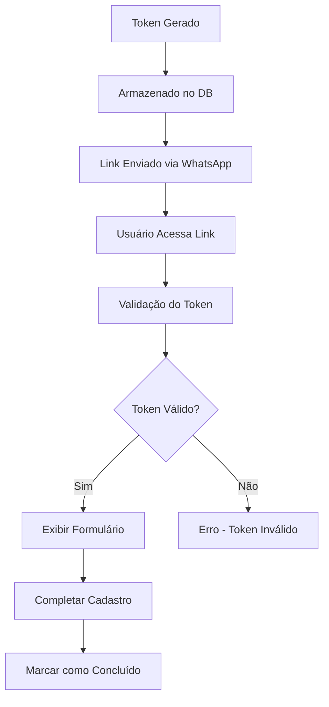

# Planejamento Técnico - Sistema de Cadastro via Site Next.js

## 1. ANÁLISE DOS PROBLEMAS ATUAIS

### 1.1 Problemas Identificados em `users.tsx`

**Problemas no fluxo de cadastro:**
- Geração de tokens de validação não está sendo implementada corretamente
- Falta de integração com o sistema de envio de links dinâmicos
- Processo de cadastro não finaliza adequadamente antes do redirecionamento
- Validação de dados incompleta antes do envio do link

**Correções necessárias:**
```typescript
// Adicionar geração de token seguro
const generateValidationToken = (): string => {
  return crypto.randomBytes(32).toString('hex');
};

// Adicionar expiração de token (24 horas)
const getTokenExpiration = (): string => {
  const now = new Date();
  now.setHours(now.getHours() + 24);
  return now.toISOString();
};
```

### 1.2 Problemas Identificados em `VisitantesTab.tsx`

**Problemas no fluxo de pré-cadastro:**
- Token de registro não está sendo gerado corretamente
- Validação de token com expiração de apenas 10 minutos é muito restritiva
- Falta de integração adequada com o site para completar cadastro
- Sistema de notificação WhatsApp não está enviando links corretos

**Correções necessárias:**
```typescript
// Melhorar geração de token
const generateRegistrationToken = (): string => {
  const chars = '0123456789abcdefghijklmnopqrstuvwxyzABCDEFGHIJKLMNOPQRSTUVWXYZ';
  let token = '';
  for (let i = 0; i < 64; i++) {
    token += chars[Math.floor(Math.random() * chars.length)];
  }
  return token;
};

// Estender tempo de expiração para 24 horas
const getTokenExpirationDate = (): string => {
  const now = new Date();
  now.setHours(now.getHours() + 24);
  return now.toISOString();
};
```

## 2. ARQUITETURA DA SOLUÇÃO

### 2.1 Estrutura do Site Next.js

```
porteiro-site/
├── src/
│   ├── app/
│   │   ├── cadastro/
│   │   │   ├── morador/
│   │   │   │   └── [token]/
│   │   │   │       └── page.tsx
│   │   │   └── visitante/
│   │   │       └── [token]/
│   │   │           └── page.tsx
│   │   ├── visita/
│   │   │   └── [token]/
│   │   │       └── page.tsx
│   │   └── api/
│   │       ├── validate-token/
│   │       │   └── route.ts
│   │       ├── complete-registration/
│   │       │   └── route.ts
│   │       └── visit-response/
│   │           └── route.ts
│   ├── components/
│   │   ├── forms/
│   │   │   ├── MoradorForm.tsx
│   │   │   ├── VisitanteForm.tsx
│   │   │   └── VisitApprovalForm.tsx
│   │   └── ui/
│   │       ├── LoadingSpinner.tsx
│   │       └── StatusMessage.tsx
│   └── lib/
│       ├── supabase.ts
│       ├── validation.ts
│       └── utils.ts
```

### 2.2 Integração com Supabase Existente

**Configuração do cliente Supabase:**
```typescript
// lib/supabase.ts
import { createClient } from '@supabase/supabase-js'

const supabaseUrl = process.env.NEXT_PUBLIC_SUPABASE_URL!
const supabaseAnonKey = process.env.NEXT_PUBLIC_SUPABASE_ANON_KEY!

export const supabase = createClient(supabaseUrl, supabaseAnonKey)
```

**Tabelas necessárias (já existentes):**
- `profiles` - dados dos usuários
- `visitors` - dados dos visitantes
- `apartments` - apartamentos
- `buildings` - prédios
- `visitor_logs` - logs de visitas

**Novas colunas necessárias:**
```sql
-- Adicionar colunas para tokens de validação
ALTER TABLE profiles ADD COLUMN validation_token VARCHAR(128);
ALTER TABLE profiles ADD COLUMN token_expires_at TIMESTAMP WITH TIME ZONE;
ALTER TABLE profiles ADD COLUMN registration_completed BOOLEAN DEFAULT FALSE;

ALTER TABLE visitors ADD COLUMN validation_token VARCHAR(128);
ALTER TABLE visitors ADD COLUMN token_expires_at TIMESTAMP WITH TIME ZONE;
ALTER TABLE visitors ADD COLUMN registration_completed BOOLEAN DEFAULT FALSE;
```

### 2.3 Sistema de Tokens de Validação

**Estrutura do Token:**
- Comprimento: 64 caracteres alfanuméricos
- Expiração: 24 horas
- Único por usuário/visitante
- Criptograficamente seguro

**Fluxo de Validação:**


## 3. IMPLEMENTAÇÃO TÉCNICA

### 3.1 Página de Cadastro do Morador

**Rota:** `/cadastro/morador/[token]`

```typescript
// app/cadastro/morador/[token]/page.tsx
import { Suspense } from 'react'
import MoradorForm from '@/components/forms/MoradorForm'
import { validateToken } from '@/lib/validation'

interface PageProps {
  params: { token: string }
}

export default async function CadastroMoradorPage({ params }: PageProps) {
  const { token } = params
  
  // Validar token no servidor
  const validation = await validateToken(token, 'morador')
  
  if (!validation.valid) {
    return (
      <div className="min-h-screen flex items-center justify-center">
        <div className="text-center">
          <h1 className="text-2xl font-bold text-red-600 mb-4">
            Token Inválido ou Expirado
          </h1>
          <p className="text-gray-600">
            O link de cadastro não é válido ou já expirou.
          </p>
        </div>
      </div>
    )
  }
  
  return (
    <div className="min-h-screen bg-gray-50 py-12">
      <div className="max-w-md mx-auto">
        <div className="bg-white rounded-lg shadow-md p-6">
          <h1 className="text-2xl font-bold text-center mb-6">
            Complete seu Cadastro
          </h1>
          <Suspense fallback={<div>Carregando...</div>}>
            <MoradorForm 
              token={token} 
              userData={validation.userData}
            />
          </Suspense>
        </div>
      </div>
    </div>
  )
}
```

### 3.2 Página de Cadastro do Visitante

**Rota:** `/cadastro/visitante/[token]`

```typescript
// app/cadastro/visitante/[token]/page.tsx
import { Suspense } from 'react'
import VisitanteForm from '@/components/forms/VisitanteForm'
import { validateVisitorToken } from '@/lib/validation