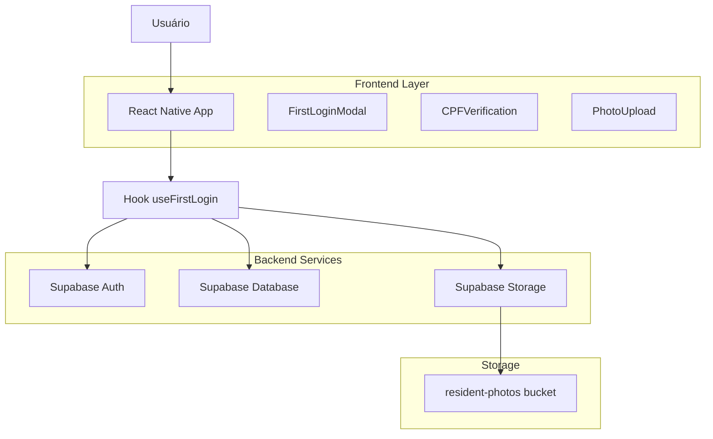
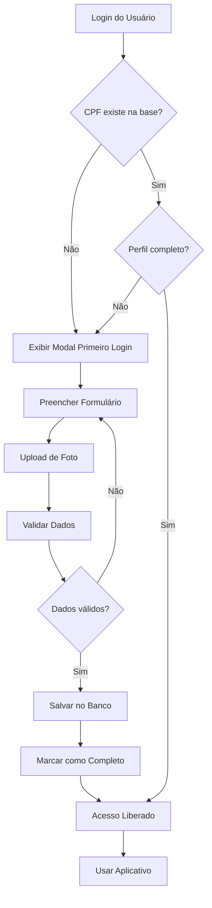

# Plano de Implementação - Sistema de Verificação de CPF no Primeiro Login

## 1. Visão Geral do Projeto

Este documento apresenta o plano de implementação para um sistema de verificação de CPF no primeiro login, garantindo que todos os moradores completem seu cadastro antes de acessar o aplicativo. O sistema incluirá validação obrigatória de dados, upload de foto e medidas de segurança para prevenir fraudes.

## 2. Requisitos Funcionais

### 2.1 Verificação de CPF no Primeiro Login

* Verificar se o CPF do usuário existe na tabela `profiles.cpf`

* Exibir modal de primeiro login obrigatório quando CPF não estiver registrado

* Bloquear acesso ao aplicativo até completar o cadastro

### 2.2 Formulário de Primeiro Login

* Campos obrigatórios: nome completo, telefone, CPF, data de nascimento, foto

* Campos opcionais: contato de emergência

* Upload de foto obrigatório

* Opção para alteração de senha

* Email não editável (somente leitura)

### 2.3 Fluxo de Acesso Controlado

* Validação completa antes de permitir acesso

* Verificação de integridade dos dados

* Confirmação de upload de foto

## 3. Arquitetura Técnica

### 3.1 Diagrama de Arquitetura



### 3.2 Tecnologias Utilizadas

* **Frontend**: React Native + Expo

* **Backend**: Supabase (Auth, Database, Storage)

* **Validação**: Bibliotecas de validação de CPF

* **Upload**: Expo ImagePicker + Supabase Storage

## 4. Estrutura de Banco de Dados

### 4.1 Modificações na Tabela Profiles

```sql
-- Adicionar campos de controle
ALTER TABLE profiles ADD COLUMN IF NOT EXISTS first_login_completed BOOLEAN DEFAULT FALSE;
ALTER TABLE profiles ADD COLUMN IF NOT EXISTS profile_completion_date TIMESTAMP WITH TIME ZONE;
ALTER TABLE profiles ADD COLUMN IF NOT EXISTS photo_verification_status VARCHAR(20) DEFAULT 'pending';

-- Índices para performance
CREATE INDEX IF NOT EXISTS idx_profiles_cpf ON profiles(cpf);
CREATE INDEX IF NOT EXISTS idx_profiles_first_login ON profiles(first_login_completed);
```

### 4.2 Tabela de Log de Verificações

```sql
-- Tabela para auditoria de verificações
CREATE TABLE IF NOT EXISTS profile_verifications (
    id UUID PRIMARY KEY DEFAULT gen_random_uuid(),
    profile_id UUID REFERENCES profiles(id),
    verification_type VARCHAR(50) NOT NULL,
    status VARCHAR(20) NOT NULL,
    verified_by UUID REFERENCES profiles(id),
    verification_date TIMESTAMP WITH TIME ZONE DEFAULT NOW(),
    notes TEXT,
    created_at TIMESTAMP WITH TIME ZONE DEFAULT NOW()
);

-- Índices
CREATE INDEX idx_profile_verifications_profile_id ON profile_verifications(profile_id);
CREATE INDEX idx_profile_verifications_date ON profile_verifications(verification_date DESC);
```

## 5. Configuração do Storage (Bucket)

### 5.1 Criação do Bucket

```sql
-- Criar bucket para fotos dos moradores
INSERT INTO storage.buckets (id, name, public, file_size_limit, allowed_mime_types)
VALUES (
    'resident-photos',
    'resident-photos',
    false,
    5242880, -- 5MB
    ARRAY['image/jpeg', 'image/png', 'image/webp']
);
```

### 5.2 Políticas de Segurança

```sql
-- Política para upload (apenas usuários autenticados)
CREATE POLICY "Usuários podem fazer upload de suas próprias fotos"
ON storage.objects FOR INSERT
TO authenticated
WITH CHECK (
    bucket_id = 'resident-photos' AND
    auth.uid()::text = (storage.foldername(name))[1]
);

-- Política para visualização (porteiros e próprio usuário)
CREATE POLICY "Porteiros e usuários podem ver fotos"
ON storage.objects FOR SELECT
TO authenticated
USING (
    bucket_id = 'resident-photos' AND (
        auth.uid()::text = (storage.foldername(name))[1] OR
        EXISTS (
            SELECT 1 FROM profiles 
            WHERE id = auth.uid() 
            AND role IN ('porteiro', 'admin')
        )
    )
);

-- Política para atualização (apenas próprio usuário)
CREATE POLICY "Usuários podem atualizar suas próprias fotos"
ON storage.objects FOR UPDATE
TO authenticated
USING (
    bucket_id = 'resident-photos' AND
    auth.uid()::text = (storage.foldername(name))[1]
);
```

## 6. Componentes React Native

### 6.1 Hook useFirstLogin

```typescript
// hooks/useFirstLogin.ts
export interface FirstLoginData {
  isFirstLogin: boolean;
  profileComplete: boolean;
  missingFields: string[];
  checkFirstLogin: () => Promise<void>;
  completeFirstLogin: (data: ProfileData) => Promise<boolean>;
}

export const useFirstLogin = (): FirstLoginData => {
  // Implementação do hook
};
```

### 6.2 Componente FirstLoginModal

```typescript
// components/FirstLoginModal.tsx
interface FirstLoginModalProps {
  visible: boolean;
  onComplete: () => void;
  userEmail: string;
}

export const FirstLoginModal: React.FC<FirstLoginModalProps> = ({
  visible,
  onComplete,
  userEmail
}) => {
  // Implementação do modal
};
```

### 6.3 Componente PhotoUpload

```typescript
// components/PhotoUpload.tsx
interface PhotoUploadProps {
  onPhotoUploaded: (url: string) => void;
  required?: boolean;
  currentPhoto?: string;
}

export const PhotoUpload: React.FC<PhotoUploadProps> = ({
  onPhotoUploaded,
  required = false,
  currentPhoto
}) => {
  // Implementação do upload
};
```

## 7. Fluxo de Dados

### 7.1 Diagrama de Fluxo



### 7.2 Estados do Sistema

1. **Usuário Novo**: CPF não existe na base
2. **Perfil Incompleto**: CPF existe mas dados faltando
3. **Aguardando Verificação**: Dados completos, aguardando aprovação
4. **Perfil Completo**: Acesso liberado
5. **Perfil Rejeitado**: Necessita correção

## 8. Medidas de Segurança

### 8.1 Validação de CPF

* Validação de formato e dígitos verificadores

* Verificação de CPF já cadastrado

* Log de tentativas de cadastro

### 8.2 Verificação de Fotos

* Validação de formato e tamanho

* Detecção de fotos duplicadas

* Análise de qualidade da imagem

### 8.3 Auditoria

* Log de todas as ações de verificação

* Rastreamento de alterações no perfil

* Histórico de uploads de foto

### 8.4 Prevenção de Fraudes

* Limite de tentativas de cadastro por IP

* Verificação de dados duplicados

* Validação cruzada com outras bases

## 9. Interface do Porteiro

### 9.1 Funcionalidades

* Visualizar perfis pendentes de verificação

* Aprovar/rejeitar cadastros

* Visualizar fotos dos moradores

* Histórico de verificações

### 9.2 Tela de Verificação

* Lista de perfis pendentes

* Detalhes do morador

* Foto em alta resolução

* Botões de aprovação/rejeição

* Campo para observações

## 10. Cronograma de Implementação

### Fase 1: Infraestrutura (Semana 1-2)

* [ ] Configurar bucket de storage

* [ ] Implementar políticas de segurança

* [ ] Modificar estrutura do banco

* [ ] Criar tabelas de auditoria

### Fase 2: Backend Logic (Semana 2-3)

* [ ] Implementar hook useFirstLogin

* [ ] Criar serviços de validação

* [ ] Implementar upload de fotos

* [ ] Configurar logs de auditoria

### Fase 3: Interface do Usuário (Semana 3-4)

* [ ] Criar FirstLoginModal

* [ ] Implementar PhotoUpload component

* [ ] Integrar validação de CPF

* [ ] Implementar fluxo de primeiro login

### Fase 4: Interface do Porteiro (Semana 4-5)

* [ ] Criar tela de verificação

* [ ] Implementar aprovação/rejeição

* [ ] Adicionar histórico de verificações

* [ ] Integrar com sistema existente

### Fase 5: Testes e Segurança (Semana 5-6)

* [ ] Testes de segurança

* [ ] Testes de performance

* [ ] Validação de fluxos

* [ ] Correção de bugs

### Fase 6: Deploy e Monitoramento (Semana 6)

* [ ] Deploy em produção

* [ ] Configurar monitoramento

* [ ] Treinamento da equipe

* [ ] Documentação final

## 11. Considerações de Performance

### 11.1 Otimizações

* Cache de validações de CPF

* Compressão de imagens

* Lazy loading de componentes

* Índices otimizados no banco

### 11.2 Monitoramento

* Tempo de upload de fotos

* Taxa de conclusão do primeiro login

* Erros de validação

* Performance das queries

## 12. Manutenção e Suporte

### 12.1 Logs e Debugging

* Logs estruturados para todas as operações

* Alertas para falhas críticas

* Dashboard de métricas

### 12.2 Backup e Recovery

* Backup automático das fotos

* Versionamento de dados

* Plano de recuperação de desastres

## 13. Conclusão

Este plano de implementação garante um sistema robusto e seguro para verificação de CPF no primeiro login, com foco na experiência do usuário e segurança dos dados. A implementação em fases permite validação contínua e ajustes conforme necessário.

### Próximos Passos

1. Aprovação do plano pela equipe
2. Início da Fase 1 - Infraestrutura
3. Definição de responsá

