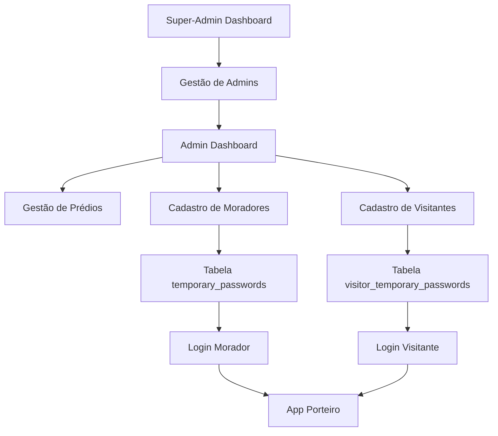

# Plano de Integração Porteiro-Site com Supabase

## 1. Visão Geral do Projeto

Este documento detalha o plano de integração das funcionalidades do porteiro-site com Supabase, implementando um sistema simplificado de gestão de visitantes, moradores e administração com hierarquia clara de permissões.

- **Objetivo Principal**: Integrar sistema de cadastro de visitantes e moradores com autenticação segura via Supabase
- **Hierarquia Simplificada**: Super-admin gerencia admins, admins gerenciam prédios e moradores
- **Cadastro Direto**: Acesso direto às tabelas do banco sem tokens temporários

## 2. Funcionalidades Principais

### 2.1 Hierarquia de Usuários

| Papel | Método de Registro | Permissões Principais |
|-------|-------------------|----------------------|
| Super-Admin | Criação manual no sistema | Visualizar dados do sistema, adicionar/remover admins |
| Admin Regular | Adicionado pelo Super-Admin | Gerenciar prédios, adicionar/remover moradores, gerenciar visitantes |
| Morador | Cadastrado pelo Admin via temporary_passwords | Acesso ao app, receber notificações, gerenciar visitantes |
| Visitante | Cadastrado pelo Admin via visitor_temporary_passwords | Acesso temporário ao sistema |

### 2.2 Módulos do Sistema

Nosso sistema de integração consiste nas seguintes páginas principais:

1. **Dashboard Super-Admin**: visualização de dados do sistema, gestão de admins
2. **Dashboard Admin**: gestão de prédios, moradores e visitantes
3. **Sistema de Cadastro de Moradores**: interface para criação de senhas temporárias
4. **Sistema de Cadastro de Visitantes**: interface para criação de acessos temporários
5. **Painel de Autenticação**: login unificado para todos os tipos de usuário
6. **Relatórios e Monitoramento**: visualização de atividades e estatísticas

### 2.3 Detalhes das Páginas

| Nome da Página | Nome do Módulo | Descrição da Funcionalidade |
|----------------|----------------|-----------------------------|
| Dashboard Super-Admin | Visão Geral do Sistema | Exibir estatísticas gerais, lista de admins ativos, logs de atividades |
| Dashboard Super-Admin | Gestão de Admins | Adicionar novos admins, desativar admins existentes, definir permissões |
| Dashboard Admin | Gestão de Prédios | Criar, editar e remover prédios, definir configurações específicas |
| Dashboard Admin | Gestão de Moradores | Cadastrar moradores, gerar senhas temporárias, gerenciar status |
| Dashboard Admin | Gestão de Visitantes | Criar acessos temporários para visitantes, definir validade |
| Cadastro de Moradores | Formulário de Registro | Coletar dados do morador, gerar entrada na tabela temporary_passwords |
| Cadastro de Moradores | Geração de Senha | Criar senha temporária com hash, definir prazo de validade |
| Cadastro de Visitantes | Formulário de Acesso | Coletar dados do visitante, criar entrada na tabela visitor_temporary_passwords |
| Painel de Autenticação | Login Unificado | Autenticar usuários via Supabase Auth, verificar senhas temporárias |
| Relatórios | Monitoramento de Atividades | Exibir logs de acesso, estatísticas de uso, relatórios de segurança |

## 3. Fluxo Principal de Operações

### Fluxo do Super-Admin:
1. Login no sistema via Supabase Auth
2. Acesso ao dashboard com visão geral do sistema
3. Visualização de estatísticas e dados gerais
4. Adição de novos admins regulares
5. Monitoramento de atividades dos admins

### Fluxo do Admin Regular:
1. Login no sistema (adicionado pelo Super-Admin)
2. Acesso ao dashboard de gestão
3. Criação e gestão de prédios
4. Cadastro de moradores com geração de senhas temporárias
5. Criação de acessos temporários para visitantes
6. Monitoramento de atividades do prédio

### Fluxo de Cadastro de Morador:
1. Admin acessa formulário de cadastro
2. Preenchimento dos dados do morador
3. Sistema gera entrada na tabela temporary_passwords
4. Morador recebe credenciais para primeiro acesso
5. Morador faz login e define senha permanente

### Fluxo de Cadastro de Visitante:
1. Admin ou morador solicita acesso para visitante
2. Preenchimento dos dados do visitante
3. Sistema gera entrada na tabela visitor_temporary_passwords
4. Visitante recebe credenciais temporárias
5. Acesso limitado por período definido



## 4. Design da Interface

### 4.1 Estilo de Design

- **Cores Primárias**: #2563eb (azul principal), #1e40af (azul escuro)
- **Cores Secundárias**: #f8fafc (cinza claro), #64748b (cinza médio)
- **Estilo de Botões**: Arredondados com sombra sutil, efeito hover
- **Fonte**: Inter ou system-ui, tamanhos 14px (corpo), 18px (títulos), 24px (cabeçalhos)
- **Layout**: Design baseado em cards, navegação lateral para dashboards
- **Ícones**: Lucide React ou Heroicons, estilo outline

### 4.2 Visão Geral do Design das Páginas

| Nome da Página | Nome do Módulo | Elementos da UI |
|----------------|----------------|----------------|
| Dashboard Super-Admin | Visão Geral | Cards com estatísticas, gráficos simples, tabela de admins com ações |
| Dashboard Admin | Gestão de Prédios | Lista de prédios em cards, botão de adicionar, modais para edição |
| Cadastro de Moradores | Formulário | Formulário em steps, campos validados, botão de gerar senha |
| Cadastro de Visitantes | Formulário | Formulário compacto, seletor de validade, preview das credenciais |
| Painel de Autenticação | Login | Formulário centralizado, logo, campos de email/telefone e senha |
| Relatórios | Tabelas e Gráficos | Tabelas responsivas, filtros, exportação, gráficos de atividade |

### 4.3 Responsividade

O sistema será desenvolvido com abordagem mobile-first, garantindo funcionamento otimizado em dispositivos móveis e tablets, com navegação adaptativa e componentes touch-friendly.

## 5. Estrutura das Tabelas do Banco de Dados

### 5.1 Tabela visitor_temporary_passwords

```sql
create table public.visitor_temporary_passwords (
  id uuid not null default gen_random_uuid(),
  visitor_name text not null,
  visitor_phone text not null,
  plain_password text not null,
  hashed_password text not null,
  created_at timestamp with time zone null default timezone('utc'::text, now()),
  expires_at timestamp with time zone null default (
    timezone('utc'::text, now()) + '7 days'::interval
  ),
  used boolean null default false,
  used_at timestamp with time zone null,
  status text null default 'active'::text,
  visitor_id uuid null,
  constraint visitor_temporary_passwords_pkey primary key (id),
  constraint visitor_temporary_passwords_visitor_id_fkey foreign key (visitor_id) references visitors (id)
);
```

### 5.2 Tabela temporary_passwords

```sql
create table public.temporary_passwords (
  id uuid not null default gen_random_uuid(),
  profile_id uuid null,
  password_hash text not null,
  plain_password text not null,
  used boolean null default false,
  created_at timestamp with time zone null default timezone('utc'::text, now()),
  used_at timestamp with time zone null,
  expires_at timestamp with time zone null default (
    timezone('utc'::text, now()) + '7 days'::interval
  ),
  phone_number text null,
  status text null default 'active'::text,
  hashed_password text null,
  constraint temporary_passwords_pkey primary key (id),
  constraint temporary_passwords_profile_id_fkey foreign key (profile_id) references profiles (id) on delete cascade
);
```

## 6. Requisitos Técnicos de Implementação

### 6.1 Autenticação e Segurança
- Integração com Supabase Auth para autenticação principal
- Verificação de senhas temporárias nas tabelas específicas
- Implementação de Row Level Security (RLS) no Supabase
- Hash seguro de senhas usando bcrypt ou similar
- Expiração automática de credenciais temporárias

### 6.2 Gestão de Dados
- Sincronização em tempo real com Supabase Realtime
- Validação de dados no frontend e backend
- Limpeza automática de registros expirados
- Backup e recuperação de dados críticos
- Logs de auditoria para ações administrativas

### 6.3 Performance e Escalabilidade
- Paginação para listas grandes de dados
- Cache de consultas frequentes
- Otimização de queries com índices apropriados
- Compressão de imagens e assets
- Monitoramento de performance

### 6.4 Testes e Qualidade
- Testes unitários para funções críticas
- Testes de integração com Supabase
- Testes de segurança e penetração
- Testes de usabilidade em dispositivos móveis
- Documentação técnica completa

## 7. Cronograma de Implementação

### Fase 1 (Semanas 1-2): Configuração Base
- Configuração do ambiente Supabase
- Criação das tabelas e índices
- Implementação da autenticação básica
- Setup do projeto React/Next.js

### Fase 2 (Semanas 3-4): Sistema de Administração
- Dashboard do Super-Admin
- Gestão de admins regulares
- Sistema de permissões
- Interface de monitoramento

### Fase 3 (Semanas 5-6): Gestão de Moradores
- Dashboard do Admin
- Cadastro de moradores
- Geração de senhas temporárias
- Sistema de notificações

### Fase 4 (Semanas 7-8): Sistema de Visitantes
- Cadastro de visitantes
- Gestão de acessos temporários
- Integração com app do porteiro
- Relatórios de atividade

### Fase 5 (Semanas 9-10): Testes e Refinamentos
- Testes completos do sistema
- Correções e otimizações
- Documentação final
- Deploy em produção

## 8. Considerações de Segurança

- **Criptografia**: Todas as senhas devem ser hasheadas com salt
- **Validação**: Validação rigorosa de inputs no frontend e backend
- **Auditoria**: Log de todas as ações administrativas
- **Expiração**: Limpeza automática de credenciais expiradas
- **Permissões**: RLS configurado para cada tipo de usuário
- **Monitoramento**: Alertas para atividades suspeitas

## 9. Métricas de Sucesso

- **Performance**: Tempo de resposta < 2 segundos
- **Disponibilidade**: Uptime > 99.5%
- **Segurança**: Zero incidentes de segurança
- **Usabilidade**: Taxa de erro de usuário < 5%
- **Adoção**: 90% dos admins utilizando o sistema em 30 dias