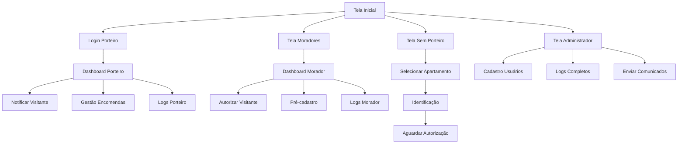

# Documento de Requisitos do Produto - PorteiroApp

## 1. Visão Geral do Produto
Aplicativo mobile iOS/Android para comunicação entre porteiros e moradores em prédios residenciais, com interface visual e intuitiva usando ícones grandes e emojis.
- Soluciona a comunicação eficiente entre portaria e apartamentos, permitindo autorização de visitantes, gestão de encomendas e comunicação por voz.
- Destinado a porteiros, moradores, visitantes/prestadores de serviço e administradores prediais.
- Objetivo: digitalizar e otimizar a gestão de acesso e comunicação em edifícios residenciais.

## 2. Funcionalidades Principais

### 2.1 Perfis de Usuário
| Perfil | Método de Registro | Permissões Principais |
|--------|-------------------|----------------------|
| Administrador | Acesso master do sistema | Cadastro de usuários, logs completos, envio de comunicados gerais |
| Porteiro | Código e senha fornecidos pelo admin | Comunicação com moradores, registro de visitantes/encomendas, logs próprios |
| Morador | Cadastro por apartamento | Acesso apenas ao próprio apartamento, autorização de visitantes/encomendas |
| Visitante/Prestador | Acesso público (sem login) | Comunicação direta com moradores via interfone digital |

### 2.2 Módulos de Páginas
Nosso aplicativo de portaria consiste nas seguintes telas principais:
1. **Tela Administrador**: cadastro de usuários, logs completos, envio de comunicados, chamadas por voz.
2. **Tela Porteiro**: login, notificação de visitantes/encomendas, captura de fotos, chamadas por voz, logs e avisos.
3. **Tela Moradores**: recebimento de notificações, autorização de acesso, pré-cadastro de visitantes, chamadas por voz, logs e avisos.
4. **Tela Sem Porteiro**: seleção de apartamento, comunicação direta, captura de fotos, chamadas por voz.

### 2.3 Detalhes das Páginas
| Nome da Página | Nome do Módulo | Descrição da Funcionalidade |
|----------------|----------------|-----------------------------|
| Tela Administrador | Sistema de Cadastro | Cadastrar porteiros e moradores com códigos de acesso |
| Tela Administrador | Logs Completos | Visualizar histórico completo de todas as atividades do prédio |
| Tela Administrador | Central de Comunicados | Enviar avisos e alertas para moradores específicos ou gerais |
| Tela Administrador | Chamadas por Voz | Realizar chamadas de voz para qualquer usuário do sistema |
| Tela Porteiro | Sistema de Login | Autenticar com código e senha pessoal |
| Tela Porteiro | Gestão de Visitantes | Notificar moradores sobre visitantes, capturar fotos, solicitar autorização |
| Tela Porteiro | Gestão de Encomendas | Notificar sobre encomendas, capturar fotos, definir local de entrega |
| Tela Porteiro | Chamadas por Voz | Comunicar-se por voz com moradores, registrar tipo de solicitação |
| Tela Porteiro | Logs e Histórico | Visualizar histórico de atividades próprias (autorizações, horários) |
| Tela Porteiro | Avisos e Alertas | Receber e visualizar comunicados da administração |
| Tela Porteiro | Calendário | Visualizar cronograma de manutenções e eventos |
| Tela Moradores | Recebimento de Notificações | Receber alertas sobre visitantes e encomendas com fotos e dados |
| Tela Moradores | Sistema de Autorização | Autorizar ou negar entrada de visitantes e recebimento de encomendas |
| Tela Moradores | Pré-cadastro | Cadastrar visitantes esperados com dados antecipados |
| Tela Moradores | Chamadas por Voz | Comunicar-se por voz com portaria |
| Tela Moradores | Logs Pessoais | Visualizar histórico de atividades do próprio apartamento |
| Tela Moradores | Avisos e Alertas | Receber comunicados da administração |
| Tela Moradores | Calendário | Visualizar eventos e manutenções programadas |
| Tela Sem Porteiro | Seleção de Apartamento | Escolher unidade para comunicação direta |
| Tela Sem Porteiro | Identificação | Inserir dados pessoais e capturar foto |
| Tela Sem Porteiro | Tipo de Solicitação | Selecionar tipo de visita (entrega, visita, serviço) |
| Tela Sem Porteiro | Chamadas por Voz | Comunicar-se diretamente com morador por voz |
| Tela Sem Porteiro | Aguardo de Resposta | Interface de espera para autorização do morador |

## 3. Processo Principal
O fluxo principal envolve três cenários: **Com Porteiro**, **Sem Porteiro** e **Gestão Administrativa**.

**Fluxo Com Porteiro:**
1. Porteiro faz login → Visitante chega → Porteiro notifica morador → Morador autoriza/nega → Porteiro libera acesso
2. Encomenda chega → Porteiro fotografa → Notifica morador → Morador define local de entrega → Porteiro executa

**Fluxo Sem Porteiro:**
1. Visitante acessa app → Seleciona apartamento → Identifica-se → Morador recebe notificação → Autoriza/nega acesso

**Fluxo Administrativo:**
1. Admin cadastra usuários → Envia comunicados → Monitora logs → Gerencia sistema

## 4. Design da Interface do Usuário
### 4.1 Estilo de Design
- **Cores Primárias**: Azul (#2196F3) para elementos principais, Verde (#4CAF50) para aprovações
- **Cores Secundárias**: Vermelho (#F44336) para negações, Cinza (#757575) para elementos neutros
- **Estilo de Botões**: Botões arredondados com sombra suave, ícones grandes (24px+)
- **Fonte**: Roboto, tamanhos 16px (corpo), 20px (títulos), 14px (legendas)
- **Layout**: Design baseado em cards com navegação por abas inferiores
- **Ícones e Emojis**: Material Icons com emojis grandes para facilitar identificação visual

### 4.2 Visão Geral do Design das Páginas
| Nome da Página | Nome do Módulo | Elementos da UI |
|----------------|----------------|----------------|
| Tela Administrador | Dashboard Admin | Cards grandes com ícones, lista de usuários, botões de ação coloridos |
| Tela Administrador | Logs Completos | Timeline com filtros, cards de atividades com timestamps |
| Tela Porteiro | Login | Campos grandes, teclado numérico, botão de acesso destacado |
| Tela Porteiro | Notificações | Cards de visitantes com fotos, botões Aprovar/Negar grandes |
| Tela Moradores | Dashboard | Cards de notificações, botões de resposta rápida com ícones |
| Tela Moradores | Autorização | Tela full-screen com foto do visitante, botões grandes |
| Tela Sem Porteiro | Seleção Apartamento | Grid de apartamentos com números grandes, busca visual |
| Tela Sem Porteiro | Identificação | Campos de texto grandes, botão de câmera destacado |

### 4.3 Responsividade
Aplicativo mobile-first otimizado para smartphones iOS e Android, com suporte a interação por toque e gestos nativos. Interface adaptável para diferentes tamanhos de tela (5" a 7").