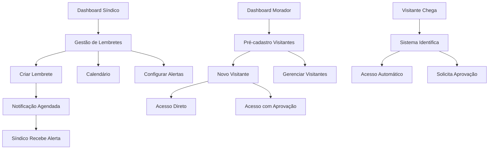

# Documento de Requisitos do Produto - Sistema de Lembretes para Síndico e Pré-cadastro de Visitantes

## 1. Visão Geral do Produto
Expansão do PorteiroApp com duas novas funcionalidades essenciais: sistema de lembretes para síndicos e pré-cadastro aprimorado de visitantes.
- Soluciona a gestão proativa de tarefas administrativas prediais e otimiza o fluxo de autorização de visitantes.
- Destinado principalmente a síndicos/administradores e moradores do condomínio.
- Objetivo: aumentar a eficiência operacional e melhorar a experiência do usuário no controle de acesso.

## 2. Funcionalidades Principais

### 2.1 Perfis de Usuário
| Perfil | Método de Registro | Permissões Principais |
|--------|-------------------|----------------------|
| Síndico/Administrador | Acesso master existente | Gestão completa de lembretes, visualização de histórico, configuração de alertas |
| Morador | Cadastro por apartamento existente | Pré-cadastro de visitantes, definição de tipos de acesso, recebimento de notificações |
| Porteiro | Código e senha existentes | Visualização de visitantes pré-cadastrados, execução de liberações automáticas |

### 2.2 Módulos de Páginas
Nossas novas funcionalidades consistem nas seguintes páginas principais:
1. **Página de Lembretes do Síndico**: gestão de tarefas, calendário de atividades, configuração de alertas.
2. **Página de Pré-cadastro de Visitantes**: formulário completo, configuração de acesso, histórico de visitantes.
3. **Dashboard de Notificações Aprimorado**: alertas de lembretes, notificações de visitantes pré-cadastrados.

### 2.3 Detalhes das Páginas
| Nome da Página | Nome do Módulo | Descrição da Funcionalidade |
|----------------|----------------|-----------------------------||
| Lembretes do Síndico | Gestão de Tarefas | Criar, editar, excluir lembretes com título, descrição, data/hora, prioridade e categoria |
| Lembretes do Síndico | Calendário de Atividades | Visualizar lembretes organizados por data, filtros por categoria e status |
| Lembretes do Síndico | Configuração de Alertas | Definir antecedência de notificações (1h, 1 dia, 1 semana), tipos de alerta |
| Lembretes do Síndico | Histórico de Atividades | Visualizar tarefas concluídas, relatórios de cumprimento, estatísticas |
| Pré-cadastro Visitantes | Formulário de Cadastro | Inserir dados completos: nome, documento, telefone, foto, motivo da visita, período de validade |
| Pré-cadastro Visitantes | Configuração de Acesso | Definir tipo de acesso: direto (sem aprovação) ou via notificação para aprovação |
| Pré-cadastro Visitantes | Gestão de Visitantes | Listar, editar, desativar visitantes pré-cadastrados, histórico de acessos |
| Dashboard Notificações | Alertas de Lembretes | Receber push notifications de tarefas próximas ao vencimento |
| Dashboard Notificações | Notificações de Visitantes | Alertas de chegada de visitantes pré-cadastrados, solicitações de aprovação |
| Portaria | Visitantes Pré-cadastrados | Visualizar lista de visitantes autorizados, executar liberação automática ou manual |

## 3. Processo Principal
O fluxo principal envolve dois cenários: **Gestão de Lembretes** e **Pré-cadastro de Visitantes**.

**Fluxo de Lembretes:**
1. Síndico acessa sistema → Cria lembrete com detalhes → Define alertas → Sistema notifica conforme configuração → Síndico marca como concluído

**Fluxo de Pré-cadastro:**
1. Morador acessa pré-cadastro → Insere dados do visitante → Define tipo de acesso → Visitante chega → Sistema identifica e processa conforme configuração

**Fluxo de Acesso Direto:**
1. Visitante pré-cadastrado chega → Porteiro consulta lista → Libera acesso automaticamente → Sistema registra entrada

**Fluxo de Acesso com Aprovação:**
1. Visitante pré-cadastrado chega → Sistema notifica morador → Morador aprova/nega → Porteiro executa decisão

## 4. Design da Interface do Usuário
### 4.1 Estilo de Design
- **Cores Primárias**: Azul (#2196F3) para elementos principais, Verde (#4CAF50) para aprovações, Laranja (#FF9800) para lembretes
- **Cores Secundárias**: Vermelho (#F44336) para urgente/negações, Cinza (#757575) para elementos neutros
- **Estilo de Botões**: Botões arredondados com sombra suave, ícones grandes (24px+), FAB para ações principais
- **Fonte**: Roboto, tamanhos 16px (corpo), 20px (títulos), 14px (legendas)
- **Layout**: Design baseado em cards com navegação por abas, calendário visual para lembretes
- **Ícones e Emojis**: Material Icons com emojis para categorias de lembretes (🔧 manutenção, 💧 limpeza, 📋 administrativo)

### 4.2 Visão Geral do Design das Páginas
| Nome da Página | Nome do Módulo | Elementos da UI |
|----------------|----------------|-----------------|
| Lembretes do Síndico | Gestão de Tarefas | Cards de lembretes com cores por prioridade, FAB para novo lembrete, badges de status |
| Lembretes do Síndico | Calendário | Vista mensal/semanal, dots coloridos por categoria, modal de detalhes |
| Pré-cadastro Visitantes | Formulário | Campos grandes com validação, upload de foto, toggle para tipo de acesso |
| Pré-cadastro Visitantes | Lista de Visitantes | Cards com foto, dados principais, status de acesso, botões de ação |
| Dashboard Notificações | Alertas | Cards de notificação com ícones distintos, botões de ação rápida |
| Portaria | Visitantes Pré-cadastrados | Lista com busca, filtros por status, botões de liberação destacados |

### 4.3 Responsividade
Mantém o padrão mobile-first do PorteiroApp, otimizado para smartphones iOS e Android, com suporte a interação por toque e gestos nativos. Interface adaptável para diferentes tamanhos de tela (5" a 7"), com layouts específicos para tablets quando necessário.