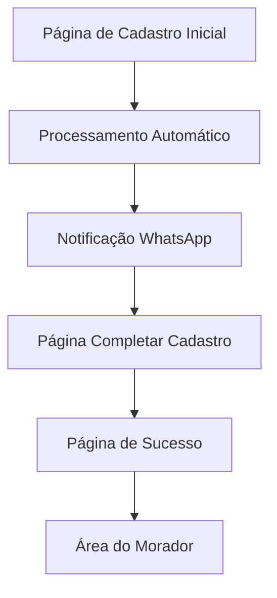

# Documento de Requisitos do Produto - Simplificação do Cadastro de Moradores

## 1. Visão Geral do Produto

Este documento especifica as mudanças necessárias para simplificar o processo de cadastro de moradores no sistema James Avisa, removendo a verificação por tokens e implementando um fluxo mais direto e automatizado.

O objetivo é criar um processo de cadastro mais eficiente onde os moradores podem se registrar diretamente, receber credenciais automáticas via WhatsApp e completar seu perfil posteriormente.

## 2. Funcionalidades Principais

### 2.1 Papéis de Usuário

| Papel | Método de Registro | Permissões Principais |
|-------|-------------------|----------------------|
| Morador | Cadastro direto sem token | Pode completar cadastro, acessar área do morador, gerenciar visitantes |
| Administrador | Acesso existente | Gerencia moradores, visualiza relatórios, configura sistema |

### 2.2 Módulos de Funcionalidade

Nossos requisitos de simplificação consistem nas seguintes páginas principais:

1. **Página de Cadastro Inicial**: formulário simplificado, geração automática de credenciais, notificação WhatsApp
2. **Página de Completar Cadastro**: upload de foto, dados pessoais completos, criação de nova senha
3. **Página de Sucesso**: confirmação de cadastro, instruções de acesso

### 2.3 Detalhes das Páginas

| Nome da Página | Nome do Módulo | Descrição da Funcionalidade |
|----------------|----------------|-----------------------------|
| Cadastro Inicial | Formulário de Registro | Capturar dados básicos (nome, telefone, email), validar informações, gerar senha automática de 6 dígitos numéricos |
| Cadastro Inicial | Sistema de Notificação | Enviar WhatsApp com login, senha temporária e link para https://jamesavisa.jamesconcierge.com/ |
| Completar Cadastro | Upload de Foto | Permitir upload de foto do perfil com validação de formato e tamanho |
| Completar Cadastro | Dados Pessoais | Coletar CPF, data de nascimento, endereço, contato de emergência |
| Completar Cadastro | Nova Senha | Exigir criação de nova senha personalizada, validar força da senha |
| Sucesso | Confirmação | Exibir mensagem de sucesso, instruções de acesso, botão para área do morador |

## 3. Processo Principal

### Fluxo do Morador

1. **Cadastro Inicial**: Morador acessa página de cadastro e preenche dados básicos (nome, telefone, email)
2. **Processamento Automático**: Sistema gera senha aleatória de 6 dígitos numéricos e cria conta automaticamente
3. **Notificação WhatsApp**: Sistema envia mensagem com login, senha temporária e link do site
4. **Completar Cadastro**: Morador acessa link, faz login e completa dados (foto, CPF, nova senha)
5. **Confirmação**: Sistema confirma cadastro completo e direciona para área do morador

## 4. Design da Interface do Usuário

### 4.1 Estilo de Design

- **Cores Primárias**: Azul (#3B82F6) e Verde (#10B981) seguindo identidade da home page
- **Cores Secundárias**: Cinza (#6B7280) para textos e Branco (#FFFFFF) para fundos
- **Estilo de Botões**: Arredondados com gradiente, efeito hover e sombra
- **Fonte**: Sistema padrão com tamanhos 14px (corpo), 18px (subtítulos), 24px (títulos)
- **Layout**: Design responsivo com cards centralizados, espaçamento generoso
- **Ícones**: Ícones SVG minimalistas, emojis para elementos promocionais

### 4.2 Visão Geral do Design das Páginas

| Nome da Página | Nome do Módulo | Elementos da UI |
|----------------|----------------|----------------|
| Cadastro Inicial | Header | Logo James Avisa, título "Cadastro de Morador", gradiente azul-verde no fundo |
| Cadastro Inicial | Formulário | Card branco centralizado, campos com bordas arredondadas, botão com gradiente verde |
| Completar Cadastro | Upload de Foto | Área de drag-and-drop circular, preview da imagem, botão "Selecionar Foto" |
| Completar Cadastro | Formulário de Dados | Grid responsivo 2 colunas, validação em tempo real, indicador de progresso |
| Sucesso | Confirmação | Ícone de check verde, mensagem de sucesso, botão CTA para área do morador |

### 4.3 Responsividade

O produto é mobile-first com adaptação para desktop, incluindo otimização para interação touch em dispositivos móveis.