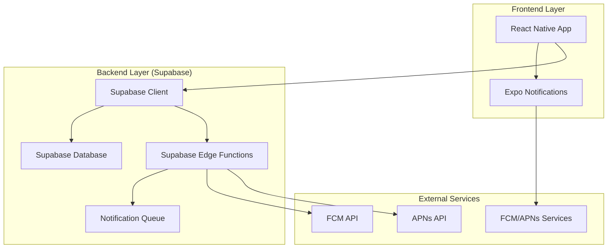
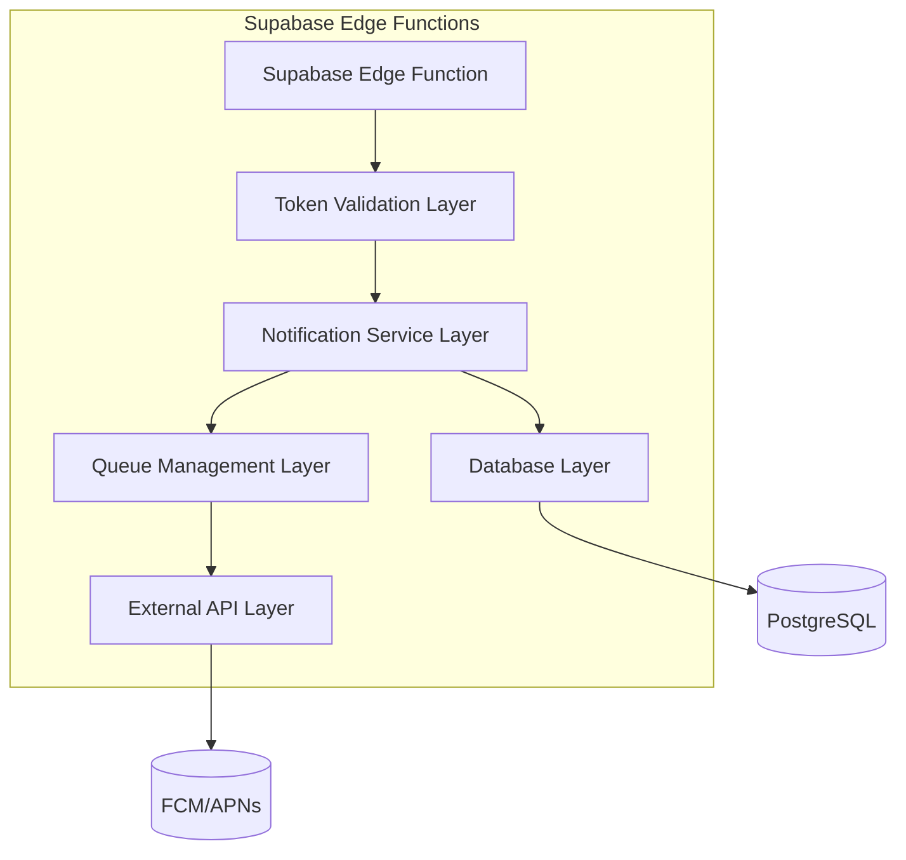
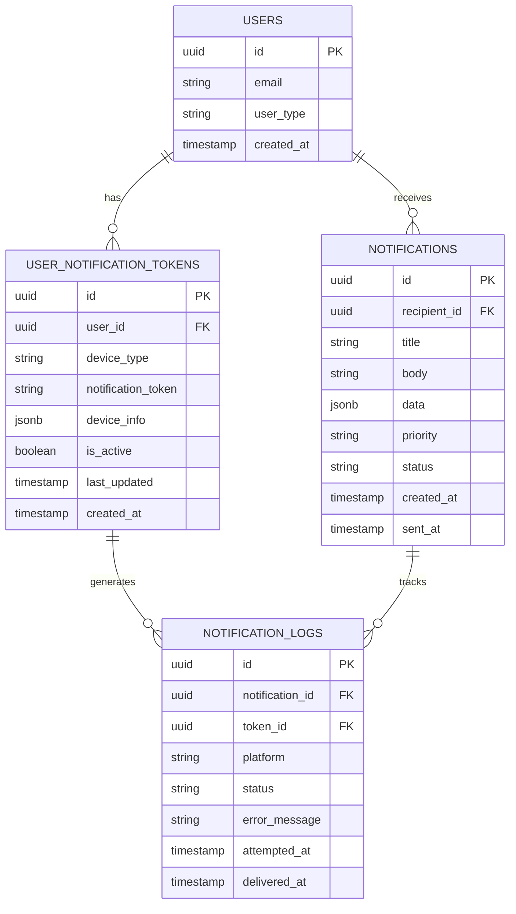

# Arquitetura Técnica - Sistema de Push Notifications

## 1. Arquitetura do Sistema



## 2. Descrição das Tecnologias

- **Frontend**: React Native + Expo SDK 49+ + Expo Notifications
- **Backend**: Supabase (PostgreSQL + Edge Functions)
- **Push Services**: Firebase Cloud Messaging (Android) + Apple Push Notification Service (iOS)
- **Queue System**: Supabase Edge Functions + PostgreSQL
- **Monitoring**: Supabase Analytics + Custom Logging

## 3. Definições de Rotas

| Rota | Propósito |
|------|----------|
| /notifications/settings | Configurações de notificação do usuário |
| /notifications/history | Histórico de notificações recebidas |
| /admin/notifications | Dashboard administrativo de monitoramento |
| /admin/tokens | Gerenciamento de tokens de dispositivos |

## 4. Definições de API

### 4.1 APIs Principais

**Registro de Token de Dispositivo**
```
POST /api/notifications/register-token
```

Request:
| Nome do Parâmetro | Tipo | Obrigatório | Descrição |
|-------------------|------|-------------|----------|
| user_id | UUID | true | ID do usuário autenticado |
| device_token | string | true | Token FCM/APNs do dispositivo |
| device_type | string | true | 'android' ou 'ios' |
| device_info | object | false | Informações adicionais do dispositivo |

Response:
| Nome do Parâmetro | Tipo | Descrição |
|-------------------|------|----------|
| success | boolean | Status da operação |
| token_id | UUID | ID do token registrado |

Exemplo:
```json
{
  "user_id": "123e4567-e89b-12d3-a456-426614174000",
  "device_token": "fGzJ8K9L...",
  "device_type": "android",
  "device_info": {
    "model": "Pixel 7",
    "os_version": "13"
  }
}
```

**Envio de Notificação**
```
POST /api/notifications/send
```

Request:
| Nome do Parâmetro | Tipo | Obrigatório | Descrição |
|-------------------|------|-------------|----------|
| recipient_id | UUID | true | ID do usuário destinatário |
| title | string | true | Título da notificação |
| body | string | true | Corpo da mensagem |
| data | object | false | Dados adicionais |
| priority | string | false | 'high', 'normal', 'low' |

**Atualização de Status**
```
PATCH /api/notifications/{notification_id}/status
```

Request:
| Nome do Parâmetro | Tipo | Obrigatório | Descrição |
|-------------------|------|-------------|----------|
| status | string | true | 'delivered', 'read', 'failed' |
| timestamp | timestamp | true | Momento da atualização |

## 5. Arquitetura do Servidor



## 6. Modelo de Dados

### 6.1 Definição do Modelo de Dados



### 6.2 Linguagem de Definição de Dados

**Tabela de Tokens de Notificação (user_notification_tokens)**
```sql
-- Criar tabela
CREATE TABLE user_notification_tokens (
    id UUID PRIMARY KEY DEFAULT gen_random_uuid(),
    user_id UUID NOT NULL REFERENCES users(id) ON DELETE CASCADE,
    device_type VARCHAR(10) NOT NULL CHECK (device_type IN ('android', 'ios')),
    notification_token TEXT NOT NULL,
    device_info JSONB DEFAULT '{}',
    is_active BOOLEAN DEFAULT true,
    last_updated TIMESTAMP WITH TIME ZONE DEFAULT NOW(),
    created_at TIMESTAMP WITH TIME ZONE DEFAULT NOW(),
    UNIQUE(user_id, notification_token)
);

-- Criar índices
CREATE INDEX idx_user_notification_tokens_user_id ON user_notification_tokens(user_id);
CREATE INDEX idx_user_notification_tokens_active ON user_notification_tokens(is_active) WHERE is_active = true;
CREATE INDEX idx_user_notification_tokens_device_type ON user_notification_tokens(device_type);
CREATE INDEX idx_user_notification_tokens_updated ON user_notification_tokens(last_updated DESC);

-- Função para atualizar timestamp
CREATE OR REPLACE FUNCTION update_notification_token_timestamp()
RETURNS TRIGGER AS $$
BEGIN
    NEW.last_updated = NOW();
    RETURN NEW;
END;
$$ LANGUAGE plpgsql;

-- Trigger para atualização automática
CREATE TRIGGER update_notification_token_timestamp_trigger
    BEFORE UPDATE ON user_notification_tokens
    FOR EACH ROW
    EXECUTE FUNCTION update_notification_token_timestamp();
```

**Tabela de Notificações (notifications)**
```sql
-- Criar tabela
CREATE TABLE notifications (
    id UUID PRIMARY KEY DEFAULT gen_random_uuid(),
    recipient_id UUID NOT NULL REFERENCES users(id) ON DELETE CASCADE,
    title VARCHAR(255) NOT NULL,
    body TEXT NOT NULL,
    data JSONB DEFAULT '{}',
    priority VARCHAR(10) DEFAULT 'normal' CHECK (priority IN ('high', 'normal', 'low')),
    status VARCHAR(20) DEFAULT 'pending' CHECK (status IN ('pending', 'sent', 'delivered', 'failed', 'read')),
    created_at TIMESTAMP WITH TIME ZONE DEFAULT NOW(),
    sent_at TIMESTAMP WITH TIME ZONE,
    expires_at TIMESTAMP WITH TIME ZONE DEFAULT (NOW() + INTERVAL '24 hours')
);

-- Criar índices
CREATE INDEX idx_notifications_recipient ON notifications(recipient_id);
CREATE INDEX idx_notifications_status ON notifications(status);
CREATE INDEX idx_notifications_created_at ON notifications(created_at DESC);
CREATE INDEX idx_notifications_expires_at ON notifications(expires_at) WHERE status = 'pending';
```

**Tabela de Logs de Notificação (notification_logs)**
```sql
-- Criar tabela
CREATE TABLE notification_logs (
    id UUID PRIMARY KEY DEFAULT gen_random_uuid(),
    notification_id UUID NOT NULL REFERENCES notifications(id) ON DELETE CASCADE,
    token_id UUID REFERENCES user_notification_tokens(id) ON DELETE SET NULL,
    platform VARCHAR(10) NOT NULL CHECK (platform IN ('android', 'ios')),
    status VARCHAR(20) NOT NULL CHECK (status IN ('sent', 'delivered', 'failed', 'expired')),
    error_message TEXT,
    response_data JSONB,
    attempted_at TIMESTAMP WITH TIME ZONE DEFAULT NOW(),
    delivered_at TIMESTAMP WITH TIME ZONE
);

-- Criar índices
CREATE INDEX idx_notification_logs_notification_id ON notification_logs(notification_id);
CREATE INDEX idx_notification_logs_status ON notification_logs(status);
CREATE INDEX idx_notification_logs_attempted_at ON notification_logs(attempted_at DESC);
CREATE INDEX idx_notification_logs_platform ON notification_logs(platform);
```

**Políticas RLS (Row Level Security)**
```sql
-- Habilitar RLS
ALTER TABLE user_notification_tokens ENABLE ROW LEVEL SECURITY;
ALTER TABLE notifications ENABLE ROW LEVEL SECURITY;
ALTER TABLE notification_logs ENABLE ROW LEVEL SECURITY;

-- Políticas para user_notification_tokens
CREATE POLICY "Users can manage their own tokens" ON user_notification_tokens
    FOR ALL USING (auth.uid() = user_id);

CREATE POLICY "Porteiros can view all tokens" ON user_notification_tokens
    FOR SELECT USING (
        EXISTS (
            SELECT 1 FROM users 
            WHERE users.id = auth.uid() 
            AND users.user_type = 'porteiro'
        )
    );

-- Políticas para notifications
CREATE POLICY "Users can view their notifications" ON notifications
    FOR SELECT USING (auth.uid() = recipient_id);

CREATE POLICY "Porteiros can create notifications" ON notifications
    FOR INSERT WITH CHECK (
        EXISTS (
            SELECT 1 FROM users 
            WHERE users.id = auth.uid() 
            AND users.user_type = 'porteiro'
        )
    );

-- Políticas para notification_logs
CREATE POLICY "System can manage logs" ON notification_logs
    FOR ALL USING (true);

-- Grants para roles
GRANT SELECT ON user_notification_tokens TO anon;
GRANT ALL PRIVILEGES ON user_notification_tokens TO authenticated;
GRANT SELECT ON notifications TO anon;
GRANT ALL PRIVILEGES ON notifications TO authenticated;
GRANT ALL PRIVILEGES ON notification_logs TO authenticated;
```

**Dados Iniciais para Teste**
```sql
-- Inserir tokens de teste (após ter usuários criados)
INSERT INTO user_notification_tokens (user_id, device_type, notification_token, device_info)
SELECT 
    u.id,
    'android',
    'test_token_android_' || u.id,
    '{"model": "Test Device", "os_version": "13"}'
FROM users u 
WHERE u.user_type = 'morador'
LIMIT 3;

INSERT INTO user_notification_tokens (user_id, device_type, notification_token, device_info)
SELECT 
    u.id,
    'ios',
    'test_token_ios_' || u.id,
    '{"model": "iPhone 14", "os_version": "16.0"}'
FROM users u 
WHERE u.user_type = 'morador'
LIMIT 2;

-- Inserir notificações de teste
INSERT INTO notifications (recipient_id, title, body, data, priority)
SELECT 
    u.id,
    'Visitante Aguardando',
    'João Silva está aguardando autorização para entrar.',
    '{"visitor_id": "123", "apartment": "101", "type": "visitor_approval"}',
    'high'
FROM users u 
WHERE u.user_type = 'morador'
LIMIT 1;
```