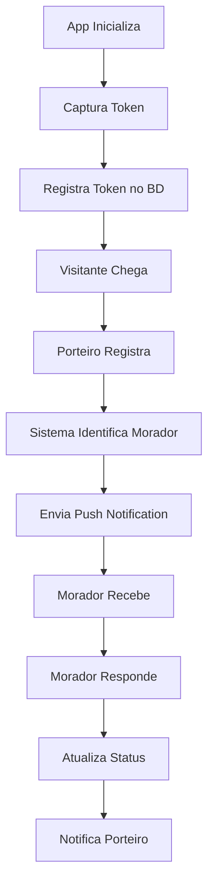

# Sistema de Push Notifications - Documentação Técnica

## 1. Visão Geral do Produto

Sistema completo de push notifications para aplicativo de portaria digital, permitindo notificações em tempo real para dispositivos Android (FCM) e iOS (APNs). O sistema integra-se perfeitamente com a funcionalidade existente de notificações de visitantes, expandindo a capacidade de comunicação instantânea entre porteiros e moradores.

## 2. Funcionalidades Principais

### 2.1 Papéis de Usuário

| Papel | Método de Registro | Permissões Principais |
|-------|-------------------|----------------------|
| Morador | Registro por email/apartamento | Recebe notificações de visitantes, pode responder aprovações |
| Porteiro | Login com credenciais específicas | Envia notificações para moradores, registra visitantes |
| Administrador | Acesso administrativo | Gerencia configurações de notificação, monitora sistema |

### 2.2 Módulos de Funcionalidade

Nosso sistema de push notifications consiste nas seguintes páginas principais:

1. **Configuração de Notificações**: gerenciamento de tokens, preferências de usuário, configurações de dispositivo
2. **Dashboard de Monitoramento**: métricas de entrega, logs de falhas, estatísticas de performance
3. **Administração de Tokens**: limpeza automática, validação de tokens, gestão de dispositivos

### 2.3 Detalhes das Páginas

| Nome da Página | Nome do Módulo | Descrição da Funcionalidade |
|----------------|----------------|-----------------------------|
| Configuração de Notificações | Gerenciamento de Tokens | Capturar e registrar tokens FCM/APNs, atualizar tokens expirados, sincronizar com backend |
| Configuração de Notificações | Preferências do Usuário | Configurar tipos de notificação, horários permitidos, sons personalizados |
| Dashboard de Monitoramento | Métricas de Entrega | Exibir taxa de sucesso, falhas por plataforma, tempo de resposta médio |
| Dashboard de Monitoramento | Logs de Sistema | Rastrear entregas, identificar tokens inválidos, monitorar performance |
| Administração de Tokens | Limpeza Automática | Remover tokens expirados, validar tokens ativos, otimizar base de dados |

## 3. Processo Principal

**Fluxo do Morador:**
1. Abre o aplicativo → Sistema captura token do dispositivo
2. Token é registrado no banco de dados com informações do usuário
3. Recebe notificação de visitante → Pode aprovar/rejeitar diretamente
4. Sistema atualiza status e notifica porteiro

**Fluxo do Porteiro:**
1. Registra visitante no sistema
2. Sistema identifica morador do apartamento
3. Envia push notification via FCM/APNs
4. Recebe resposta do morador em tempo real

## 4. Design da Interface do Usuário

### 4.1 Estilo de Design

- **Cores primárias**: #2563eb (azul principal), #1e40af (azul secundário)
- **Cores de status**: #10b981 (sucesso), #ef4444 (erro), #f59e0b (aviso)
- **Estilo de botões**: Arredondados com sombra sutil, efeito de hover
- **Fonte**: Inter, tamanhos 14px (corpo), 16px (títulos), 12px (legendas)
- **Layout**: Design baseado em cards, navegação superior fixa
- **Ícones**: Lucide React para consistência, estilo outline

### 4.2 Visão Geral do Design das Páginas

| Nome da Página | Nome do Módulo | Elementos da UI |
|----------------|----------------|----------------|
| Configuração de Notificações | Gerenciamento de Tokens | Cards com status de conexão, indicadores visuais de sincronização, botões de atualização manual |
| Dashboard de Monitoramento | Métricas de Entrega | Gráficos em tempo real, tabelas de dados, filtros por período, cores de status intuitivas |
| Administração de Tokens | Limpeza Automática | Lista de dispositivos, badges de status, ações em lote, confirmações de segurança |

### 4.3 Responsividade

O sistema é mobile-first com adaptação completa para desktop, otimizado para interação touch em dispositivos móveis e suporte a gestos nativos do sistema operacional.