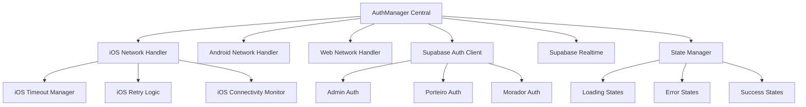

# Sistema de Login Robusto e Profissional - Solução para Problemas de Timeout iOS

## 1. Análise dos Problemas Atuais

### 1.1 Problemas Identificados nos Logs

**Timeout no iOS:**
- Erro: `Timeout: Operação demorou mais que 8000ms (Platform: ios, Elapsed: 8041ms)`
- Status da rede: Conectado mas `isInternetReachable: null`
- Durante timeout: `isConnected: false`

**Comportamento Inconsistente:**
- Android: Funciona perfeitamente (logs mostram sucesso)
- iOS: Timeouts frequentes mesmo com rede estável
- Autenticação Supabase: Sucesso (token gerado) mas timeout na verificação de perfil

**Problemas de Estado:**
- Loading states ficam travados
- Múltiplos timeouts de segurança ativados
- Estados de loading não sincronizados entre componentes

### 1.2 Causas Raiz

1. **Timeouts muito agressivos para iOS** (8000ms vs 15000ms)
2. **Verificação de rede inadequada** (`isInternetReachable: null`)
3. **Falta de retry inteligente** para falhas de rede temporárias
4. **Estados de loading não centralizados**
5. **Ausência de fallbacks específicos para iOS**

## 2. Arquitetura do Sistema de Login Robusto

### 2.1 Visão Geral da Arquitetura



### 2.2 Componentes Principais

#### AuthManager Central
- Gerenciador único para todos os tipos de login
- Detecção automática de plataforma
- Coordenação de estados globais
- Integração com Supabase Realtime

#### Network Handler por Plataforma
- **iOS**: Timeouts adaptativos, retry exponencial, monitoramento de conectividade
- **Android**: Configurações otimizadas padrão
- **Web**: Fallbacks para diferentes navegadores

#### State Manager
- Estados centralizados e sincronizados
- Prevenção de race conditions
- Cleanup automático de timeouts

## 3. Implementação Detalhada

### 3.1 AuthManager Central

```typescript
// services/AuthManager.ts
interface AuthConfig {
  platform: 'ios' | 'android' | 'web';
  timeouts: {
    auth: number;
    profile: number;
    network: number;
  };
  retries: {
    max: number;
    backoff: number;
  };
}

class AuthManager {
  private config: AuthConfig;
  private networkMonitor: NetworkMonitor;
  private stateManager: AuthStateManager;
  private realtimeSubscription: RealtimeChannel | null = null;
  
  constructor() {
    this.config = this.getPlatformConfig();
    this.networkMonitor = new NetworkMonitor(this.config.platform);
    this.stateManager = new AuthStateManager();
    this.setupRealtimeConnection();
  }
  
  private getPlatformConfig(): AuthConfig {
    const platform = Platform.OS as 'ios' | 'android' | 'web';
    
    const configs = {
      ios: {
        platform: 'ios' as const,
        timeouts: { auth: 20000, profile: 15000, network: 5000 },
        retries: { max: 4, backoff: 2000 }
      },
      android: {
        platform: 'android' as const,
        timeouts: { auth: 12000, profile: 8000, network: 3000 },
        retries: { max: 3, backoff: 1000 }
      },
      web: {
        platform: 'web' as const,
        timeouts: { auth: 10000, profile: 6000, network: 2000 },
        retries: { max: 2, backoff: 500 }
      }
    };
    
    return configs[platform];
  }
}
```

### 3.2 iOS Network Handler Especializado

```typescript
// services/iOSNetworkHandler.ts
class iOSNetworkHandler {
  private connectivityMonitor: ConnectivityMonitor;
  private timeoutManager: TimeoutManager;
  
  constructor() {
    this.connectivityMonitor = new ConnectivityMonitor();
    this.timeoutManager = new TimeoutManager();
  }
  
  async executeWithRetry<T>(
    operation: () => Promise<T>,
    context: string
  ): Promise<T> {
    const maxRetries = 4;
    const baseDelay = 2000;
    
    for (let attempt = 1; attempt <= maxRetries; attempt++) {
      try {
        // Verificar conectividade antes de cada tentativa
        await this.ensureConnectivity();
        
        // Executar operação com timeout adaptativo
        const timeout = this.calculateAdaptiveTimeout(attempt, context);
        return await this.timeoutManager.withTimeout(operation(), timeout);
        
      } catch (error) {
        console.log(`🔄 iOS Retry ${attempt}/${maxRetries} for ${context}:`, {
          error: error.message,
          connectivity: await this.connectivityMonitor.getStatus()
        });
        
        if (attempt === maxRetries) {
          throw this.enhanceError(error, context);
        }
        
        // Backoff exponencial com jitter
        const delay = baseDelay * Math.pow(2, attempt - 1) + Math.random() * 1000;
        await this.delay(delay);
      }
    }
  }
  
  private calculateAdaptiveTimeout(attempt: number, context: string): number {
    const baseTimeouts = {
      auth: 20000,
      profile: 15000,
      network: 5000
    };
    
    const base = baseTimeouts[context] || 10000;
    // Aumentar timeout a cada retry
    return base + (attempt - 1) * 5000;
  }
  
  private async ensureConnectivity(): Promise<void> {
    const status = await this.connectivityMonitor.getStatus();
    
    if (!status.isConnected) {
      throw new Error('Sem conectividade de rede');
    }
    
    // Para iOS, verificar se realmente consegue fazer requests
    if (status.isInternetReachable === null) {
      console.log('🔍 iOS: Verificando conectividade real...');
      const canReach = await this.testConnectivity();
      if (!canReach) {
        throw new Error('Internet não acessível');
      }
    }
  }
  
  private async testConnectivity(): Promise<boolean> {
    try {
      const response = await fetch('https://www.google.com/favicon.ico', {
        method: 'HEAD',
        cache: 'no-cache',
        signal: AbortSignal.timeout(3000)
      });
      return response.ok;
    } catch {
      return false;
    }
  }
}
```

### 3.3 State Manager Centralizado

```typescript
// services/AuthStateManager.ts
interface AuthState {
  isLoading: boolean;
  isCheckingAuth: boolean;
  user: AuthUser | null;
  error: string | null;
  lastActivity: number;
}

class AuthStateManager {
  private state: AuthState;
  private listeners: Set<(state: AuthState) => void>;
  private timeouts: Map<string, NodeJS.Timeout>;
  
  constructor() {
    this.state = {
      isLoading: false,
      isCheckingAuth: false,
      user: null,
      error: null,
      lastActivity: Date.now()
    };
    this.listeners = new Set();
    this.timeouts = new Map();
  }
  
  setState(updates: Partial<AuthState>): void {
    this.state = { ...this.state, ...updates, lastActivity: Date.now() };
    this.notifyListeners();
  }
  
  setLoadingWithTimeout(loading: boolean, timeoutMs?: number): void {
    this.clearTimeout('loading');
    this.setState({ isLoading: loading });
    
    if (loading && timeoutMs) {
      const timeout = setTimeout(() => {
        console.warn('⏰ Loading timeout ativado, resetando estado');
        this.setState({ isLoading: false, error: 'Operação demorou muito para responder' });
      }, timeoutMs);
      
      this.timeouts.set('loading', timeout);
    }
  }
  
  clearTimeout(key: string): void {
    const timeout = this.timeouts.get(key);
    if (timeout) {
      clearTimeout(timeout);
      this.timeouts.delete(key);
    }
  }
  
  cleanup(): void {
    this.timeouts.forEach(timeout => clearTimeout(timeout));
    this.timeouts.clear();
    this.listeners.clear();
  }
}
```

### 3.4 Integração com Supabase Realtime

```typescript
// services/RealtimeAuthSync.ts
class RealtimeAuthSync {
  private channel: RealtimeChannel | null = null;
  private authManager: AuthManager;
  
  constructor(authManager: AuthManager) {
    this.authManager = authManager;
  }
  
  setupAuthSync(): void {
    this.channel = supabase.channel('auth-sync')
      .on('presence', { event: 'sync' }, () => {
        console.log('🔄 Realtime: Auth sync');
      })
      .on('broadcast', { event: 'auth-update' }, (payload) => {
        console.log('📡 Realtime: Auth update received', payload);
        this.handleAuthUpdate(payload);
      })
      .subscribe((status) => {
        console.log('📡 Realtime connection status:', status);
      });
  }
  
  private handleAuthUpdate(payload: any): void {
    // Sincronizar estado de autenticação via realtime
    if (payload.type === 'logout') {
      this.authManager.handleRemoteLogout();
    } else if (payload.type === 'profile-update') {
      this.authManager.refreshUserProfile();
    }
  }
  
  broadcastAuthEvent(event: string, data: any): void {
    if (this.channel) {
      this.channel.send({
        type: 'broadcast',
        event: 'auth-update',
        payload: { type: event, data }
      });
    }
  }
}
```

## 4. Implementação dos 3 Tipos de Login

### 4.1 Fluxo Unificado de Autenticação

```typescript
// hooks/useUnifiedAuth.ts
interface LoginCredentials {
  email: string;
  password: string;
  userType: 'admin' | 'porteiro' | 'morador';
}

export function useUnifiedAuth() {
  const authManager = useRef(new AuthManager()).current;
  const [state, setState] = useState(authManager.getState());
  
  useEffect(() => {
    const unsubscribe = authManager.subscribe(setState);
    return unsubscribe;
  }, []);
  
  const signIn = async (credentials: LoginCredentials): Promise<AuthResult> => {
    try {
      authManager.setLoadingWithTimeout(true, 25000); // Timeout global
      
      // Estratégia específica por tipo de usuário
      const strategy = getAuthStrategy(credentials.userType);
      const result = await strategy.authenticate(credentials);
      
      if (result.success) {
        authManager.setState({ user: result.user, error: null });
        authManager.broadcastAuthEvent('login', { userType: credentials.userType });
      }
      
      return result;
    } catch (error) {
      const enhancedError = authManager.enhanceError(error);
      authManager.setState({ error: enhancedError.message });
      throw enhancedError;
    } finally {
      authManager.setLoadingWithTimeout(false);
    }
  };
  
  return {
    ...state,
    signIn,
    signOut: authManager.signOut.bind(authManager),
    refreshAuth: authManager.refreshAuth.bind(authManager)
  };
}
```

### 4.2 Estratégias de Autenticação por Tipo

```typescript
// strategies/AuthStrategies.ts
abstract class AuthStrategy {
  protected networkHandler: NetworkHandler;
  
  constructor(networkHandler: NetworkHandler) {
    this.networkHandler = networkHandler;
  }
  
  abstract authenticate(credentials: LoginCredentials): Promise<AuthResult>;
}

class AdminAuthStrategy extends AuthStrategy {
  async authenticate(credentials: LoginCredentials): Promise<AuthResult> {
    return this.networkHandler.executeWithRetry(async () => {
      // Autenticação Supabase
      const authResult = await supabase.auth.signInWithPassword({
        email: credentials.email,
        password: credentials.password
      });
      
      if (authResult.error) throw authResult.error;
      
      // Verificar perfil admin
      const adminProfile = await this.getAdminProfile(authResult.data.user.id);
      if (!adminProfile) {
        throw new Error('Usuário não é administrador');
      }
      
      return {
        success: true,
        user: this.mapToAuthUser(authResult.data.user, adminProfile, 'admin')
      };
    }, 'admin-auth');
  }
}

class PorteiroAuthStrategy extends AuthStrategy {
  async authenticate(credentials: LoginCredentials): Promise<AuthResult> {
    return this.networkHandler.executeWithRetry(async () => {
      // Lógica específica para porteiro
      const authResult = await supabase.auth.signInWithPassword({
        email: credentials.email,
        password: credentials.password
      });
      
      if (authResult.error) throw authResult.error;
      
      const porteiroProfile = await this.getPorteiroProfile(authResult.data.user.id);
      if (!porteiroProfile) {
        throw new Error('Usuário não é porteiro');
      }
      
      return {
        success: true,
        user: this.mapToAuthUser(authResult.data.user, porteiroProfile, 'porteiro')
      };
    }, 'porteiro-auth');
  }
}

class MoradorAuthStrategy extends AuthStrategy {
  async authenticate(credentials: LoginCredentials): Promise<AuthResult> {
    return this.networkHandler.executeWithRetry(async () => {
      // Lógica específica para morador
      const authResult = await supabase.auth.signInWithPassword({
        email: credentials.email,
        password: credentials.password
      });
      
      if (authResult.error) throw authResult.error;
      
      const moradorProfile = await this.getMoradorProfile(authResult.data.user.id);
      if (!moradorProfile) {
        throw new Error('Usuário não é morador');
      }
      
      return {
        success: true,
        user: this.mapToAuthUser(authResult.data.user, moradorProfile, 'morador')
      };
    }, 'morador-auth');
  }
}
```

## 5. Melhorias Específicas para iOS

### 5.1 Configurações de Rede Otimizadas

```typescript
// config/iOSOptimizations.ts
export const iOSSupabaseConfig = {
  auth: {
    storage: AsyncStorage,
    autoRefreshToken: true,
    persistSession: true,
    detectSessionInUrl: false,
    flowType: 'pkce',
    debug: __DEV__,
    // Configurações específicas para iOS
    storageKey: 'sb-auth-token-ios',
    cookieOptions: {
      name: 'sb-auth-token-ios',
      lifetime: 60 * 60 * 24 * 7, // 7 dias
      domain: undefined,
      path: '/',
      sameSite: 'lax'
    }
  },
  realtime: {
    params: {
      eventsPerSecond: 1, // Reduzido para iOS
      heartbeatIntervalMs: 30000, // Aumentado para iOS
      reconnectAfterMs: (tries) => Math.min(tries * 2000, 10000)
    },
    transport: 'websocket',
    timeout: 20000 // Timeout maior para iOS
  },
  global: {
    headers: {
      'X-Client-Info': 'supabase-js-ios',
      'X-Platform': 'ios',
      'Cache-Control': 'no-cache',
      'Pragma': 'no-cache'
    },
    fetch: (url, options = {}) => {
      // Configurações específicas de fetch para iOS
      return fetch(url, {
        ...options,
        cache: 'no-cache',
        credentials: 'include',
        headers: {
          ...options.headers,
          'User-Agent': 'JamesAvisa-iOS/1.0'
        }
      });
    }
  }
};
```

### 5.2 Monitoramento de Conectividade iOS

```typescript
// services/iOSConnectivityMonitor.ts
class iOSConnectivityMonitor {
  private netInfo: any;
  private listeners: Set<(status: ConnectivityStatus) => void>;
  private lastStatus: ConnectivityStatus | null = null;
  
  constructor() {
    this.listeners = new Set();
    this.setupNetInfoListener();
  }
  
  private setupNetInfoListener(): void {
    this.netInfo = NetInfo.addEventListener(state => {
      const status: ConnectivityStatus = {
        isConnected: state.isConnected ?? false,
        isInternetReachable: state.isInternetReachable,
        type: state.type,
        details: state.details,
        timestamp: Date.now()
      };
      
      // Log detalhado para iOS
      console.log('📶 iOS Network Status Update:', {
        ...status,
        changed: this.hasStatusChanged(status)
      });
      
      this.lastStatus = status;
      this.notifyListeners(status);
    });
  }
  
  async getDetailedStatus(): Promise<ConnectivityStatus> {
    const netState = await NetInfo.fetch();
    
    const status: ConnectivityStatus = {
      isConnected: netState.isConnected ?? false,
      isInternetReachable: netState.isInternetReachable,
      type: netState.type,
      details: netState.details,
      timestamp: Date.now()
    };
    
    // Para iOS, fazer teste adicional se isInternetReachable for null
    if (Platform.OS === 'ios' && status.isInternetReachable === null && status.isConnected) {
      console.log('🔍 iOS: Testando conectividade real...');
      status.isInternetReachable = await this.testRealConnectivity();
    }
    
    return status;
  }
  
  private async testRealConnectivity(): Promise<boolean> {
    const testUrls = [
      'https://www.google.com/favicon.ico',
      'https://httpbin.org/status/200',
      'https://jsonplaceholder.typicode.com/posts/1'
    ];
    
    for (const url of testUrls) {
      try {
        const controller = new AbortController();
        const timeoutId = setTimeout(() => controller.abort(), 3000);
        
        const response = await fetch(url, {
          method: 'HEAD',
          cache: 'no-cache',
          signal: controller.signal
        });
        
        clearTimeout(timeoutId);
        
        if (response.ok) {
          console.log('✅ iOS: Conectividade confirmada via', url);
          return true;
        }
      } catch (error) {
        console.log('❌ iOS: Falha no teste de conectividade via', url, error.message);
      }
    }
    
    return false;
  }
}
```

## 6. Sistema de Monitoramento e Logs

### 6.1 Logger Estruturado

```typescript
// services/AuthLogger.ts
interface LogEntry {
  timestamp: number;
  level: 'info' | 'warn' | 'error' | 'debug';
  platform: string;
  context: string;
  message: string;
  data?: any;
  sessionId: string;
}

class AuthLogger {
  private logs: LogEntry[] = [];
  private maxLogs = 1000;
  private sessionId: string;
  
  constructor() {
    this.sessionId = this.generateSessionId();
  }
  
  log(level: LogEntry['level'], context: string, message: string, data?: any): void {
    const entry: LogEntry = {
      timestamp: Date.now(),
      level,
      platform: Platform.OS,
      context,
      message,
      data,
      sessionId: this.sessionId
    };
    
    this.logs.push(entry);
    
    // Manter apenas os logs mais recentes
    if (this.logs.length > this.maxLogs) {
      this.logs = this.logs.slice(-this.maxLogs);
    }
    
    // Console log formatado
    const emoji = this.getEmojiForLevel(level);
    const prefix = `${emoji} [${context}]`;
    
    if (data) {
      console[level](prefix, message, data);
    } else {
      console[level](prefix, message);
    }
  }
  
  getLogsForDebugging(): LogEntry[] {
    return this.logs.filter(log => 
      log.level === 'error' || 
      log.context.includes('timeout') ||
      log.context.includes('network')
    );
  }
  
  exportLogs(): string {
    return JSON.stringify({
      sessionId: this.sessionId,
      platform: Platform.OS,
      timestamp: Date.now(),
      logs: this.logs
    }, null, 2);
  }
}
```

### 6.2 Métricas de Performance

```typescript
// services/AuthMetrics.ts
interface AuthMetric {
  operation: string;
  startTime: number;
  endTime?: number;
  duration?: number;
  success: boolean;
  error?: string;
  platform: string;
  attempt: number;
}

class AuthMetrics {
  private metrics: AuthMetric[] = [];
  private activeOperations: Map<string, AuthMetric> = new Map();
  
  startOperation(operation: string, attempt: number = 1): string {
    const operationId = `${operation}-${Date.now()}-${Math.random()}`;
    
    const metric: AuthMetric = {
      operation,
      startTime: Date.now(),
      success: false,
      platform: Platform.OS,
      attempt
    };
    
    this.activeOperations.set(operationId, metric);
    return operationId;
  }
  
  endOperation(operationId: string, success: boolean, error?: string): void {
    const metric = this.activeOperations.get(operationId);
    if (!metric) return;
    
    metric.endTime = Date.now();
    metric.duration = metric.endTime - metric.startTime;
    metric.success = success;
    metric.error = error;
    
    this.metrics.push(metric);
    this.activeOperations.delete(operationId);
    
    // Log métricas importantes
    if (metric.duration > 5000 || !success) {
      console.log('📊 Auth Metric:', {
        operation: metric.operation,
        duration: metric.duration,
        success: metric.success,
        platform: metric.platform,
        attempt: metric.attempt,
        error: metric.error
      });
    }
  }
  
  getMetricsSummary(): any {
    const summary = {
      totalOperations: this.metrics.length,
      successRate: 0,
      averageDuration: 0,
      platformBreakdown: {},
      operationBreakdown: {},
      errorBreakdown: {}
    };
    
    if (this.metrics.length === 0) return summary;
    
    const successful = this.metrics.filter(m => m.success).length;
    summary.successRate = (successful / this.metrics.length) * 100;
    
    const totalDuration = this.metrics.reduce((sum, m) => sum + (m.duration || 0), 0);
    summary.averageDuration = totalDuration / this.metrics.length;
    
    return summary;
  }
}
```

## 7. Testes e Validação

### 7.1 Testes de Conectividade

```typescript
// tests/ConnectivityTests.ts
class ConnectivityTests {
  private authManager: AuthManager;
  private logger: AuthLogger;
  
  constructor(authManager: AuthManager) {
    this.authManager = authManager;
    this.logger = new AuthLogger();
  }
  
  async runConnectivityTests(): Promise<TestResults> {
    const results: TestResults = {
      platform: Platform.OS,
      timestamp: Date.now(),
      tests: []
    };
    
    // Teste 1: Conectividade básica
    results.tests.push(await this.testBasicConnectivity());
    
    // Teste 2: Supabase Auth
    results.tests.push(await this.testSupabaseAuth());
    
    // Teste 3: Timeout handling
    results.tests.push(await this.testTimeoutHandling());
    
    // Teste 4: Retry logic
    results.tests.push(await this.testRetryLogic());
    
    return results;
  }
  
  private async testBasicConnectivity(): Promise<TestResult> {
    try {
      const start = Date.now();
      const response = await fetch('https://httpbin.org/status/200', {
        method: 'HEAD',
        cache: 'no-cache',
        signal: AbortSignal.timeout(5000)
      });
      const duration = Date.now() - start;
      
      return {
        name: 'Basic Connectivity',
        success: response.ok,
        duration,
        details: { status: response.status }
      };
    } catch (error) {
      return {
        name: 'Basic Connectivity',
        success: false,
        duration: 5000,
        error: error.message
      };
    }
  }
  
  private async testSupabaseAuth(): Promise<TestResult> {
    try {
      const start = Date.now();
      const { data, error } = await supabase.auth.getSession();
      const duration = Date.now() - start;
      
      return {
        name: 'Supabase Auth Session',
        success: !error,
        duration,
        details: { hasSession: !!data.session }
      };
    } catch (error) {
      return {
        name: 'Supabase Auth Session',
        success: false,
        duration: 0,
        error: error.message
      };
    }
  }
}
```

### 7.2 Testes de Timeout

```typescript
// tests/TimeoutTests.ts
class TimeoutTests {
  async testTimeoutScenarios(): Promise<TestResults> {
    const scenarios = [
      { name: 'Fast Response', delay: 100, timeout: 5000, shouldSucceed: true },
      { name: 'Slow Response', delay: 3000, timeout: 5000, shouldSucceed: true },
      { name: 'Timeout Scenario', delay: 8000, timeout: 5000, shouldSucceed: false },
      { name: 'iOS Long Timeout', delay: 12000, timeout: 20000, shouldSucceed: true }
    ];
    
    const results: TestResults = {
      platform: Platform.OS,
      timestamp: Date.now(),
      tests: []
    };
    
    for (const scenario of scenarios) {
      const result = await this.runTimeoutScenario(scenario);
      results.tests.push(result);
    }
    
    return results;
  }
  
  private async runTimeoutScenario(scenario: any): Promise<TestResult> {
    try {
      const start = Date.now();
      
      const delayPromise = new Promise(resolve => 
        setTimeout(resolve, scenario.delay)
      );
      
      const timeoutPromise = new Promise((_, reject) => 
        setTimeout(() => reject(new Error('Timeout')), scenario.timeout)
      );
      
      await Promise.race([delayPromise, timeoutPromise]);
      
      const duration = Date.now() - start;
      const success = scenario.shouldSucceed;
      
      return {
        name: scenario.name,
        success,
        duration,
        details: { expectedTimeout: scenario.timeout, actualDelay: scenario.delay }
      };
    } catch (error) {
      const duration = Date.now() - start;
      const success = !scenario.shouldSucceed; // Timeout era esperado
      
      return {
        name: scenario.name,
        success,
        duration,
        error: error.message
      };
    }
  }
}
```

## 8. Plano de Implementação

### 8.1 Fase 1: Fundação (Semana 1)

**Objetivos:**
- Implementar AuthManager central
- Criar NetworkHandler específico para iOS
- Implementar StateManager centralizado

**Entregáveis:**
- `services/AuthManager.ts`
- `services/iOSNetworkHandler.ts`
- `services/AuthStateManager.ts`
- Testes básicos de conectividade

### 8.2 Fase 2: Estratégias de Auth (Semana 2)

**Objetivos:**
- Implementar estratégias para os 3 tipos de login
- Integrar com Supabase Realtime
- Criar hook unificado useUnifiedAuth

**Entregáveis:**
- `strategies/AuthStrategies.ts`
- `services/RealtimeAuthSync.ts`
- `hooks/useUnifiedAuth.ts`
- Migração dos componentes de login existentes

### 8.3 Fase 3: Otimizações iOS (Semana 3)

**Objetivos:**
- Implementar melhorias específicas para iOS
- Sistema de monitoramento e métricas
- Testes abrangentes

**Entregáveis:**
- `config/iOSOptimizations.ts`
- `services/iOSConnectivityMonitor.ts`
- `services/AuthLogger.ts`
- `services/AuthMetrics.ts`
- Suite de testes completa

### 8.4 Fase 4: Validação e Deploy (Semana 4)

**Objetivos:**
- Testes em dispositivos reais
- Ajustes finais baseados em feedback
- Deploy e monitoramento

**Entregáveis:**
- Testes em iPhone/iPad reais
- Documentação de troubleshooting
- Dashboard de métricas
- Deploy para produção

## 9. Critérios de Sucesso

### 9.1 Métricas Técnicas

- **Taxa de sucesso de login iOS**: > 95%
- **Tempo médio de login iOS**: < 3 segundos
- **Taxa de timeout iOS**: < 2%
- **Tempo de recuperação de falhas**: < 5 segundos

### 9.2 Experiência do Usuário

- **Feedback visual**: Estados de loading claros e informativos
- **Mensagens de erro**: Específicas e acionáveis
- **Recuperação automática**: Retry transparente para o usuário
- **Consistência**: Comportamento idêntico entre plataformas

### 9.3 Monitoramento

- **Logs estruturados**: Para debugging eficiente
- **Métricas em tempo real**: Dashboard de saúde do sistema
- **Alertas automáticos**: Para problemas críticos
- **Relatórios de performance**: Análise semanal de métricas

## 10. Considerações de Manutenção

### 10.1 Monitoramento Contínuo

- Implementar alertas para taxas de falha > 5%
- Monitorar tempos de resposta por plataforma
- Análise semanal de logs de erro
- Feedback automático de usuários sobre problemas de login

### 10.2 Atualizações e Melhorias

- Revisão mensal das configurações de timeout
- Testes regulares em novos dispositivos iOS
- Atualização das estratégias baseada em métricas
- Documentação de novos cenários de erro

### 10.3 Escalabilidade

- Preparação para novos tipos de usuário
- Suporte a múltiplos métodos de autenticação
- Integração com sistemas externos
- Otimizações baseadas em crescimento de usuários

Este sistema robusto resolverá os problemas de timeout no iOS mantendo simplicidade e profissionalismo, garantindo uma experiência de login confiável para todos os tipos de usuário.