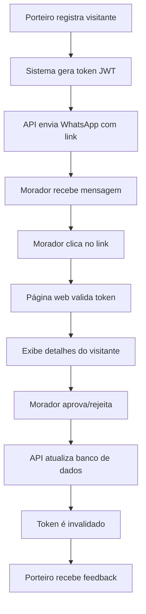
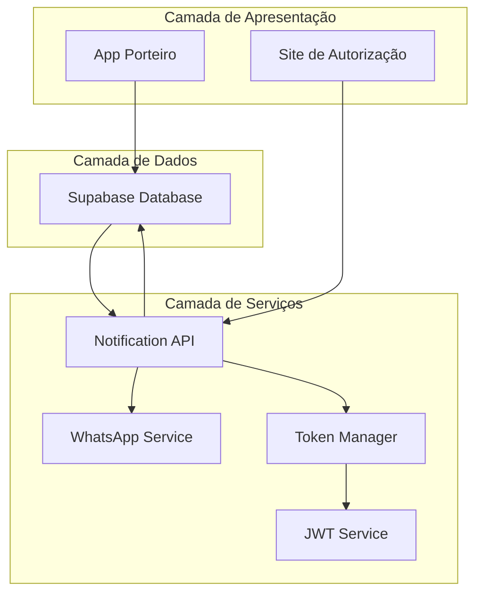
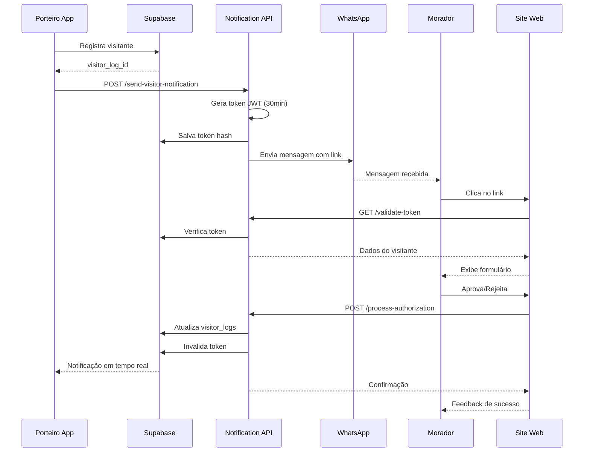

# Sistema de Notificações via API com Token de Autorização

## 1. Visão Geral do Produto

Sistema complementar de notificações que permite aos moradores receber e responder solicitações de acesso através de uma API dedicada, sem necessidade obrigatória do aplicativo móvel. O sistema gera tokens únicos com validade de 30 minutos e envia links personalizados via WhatsApp, oferecendo uma alternativa web para aprovação/rejeição de visitantes.

## 2. Funcionalidades Principais

### 2.1 Papéis de Usuário

| Papel | Método de Acesso | Permissões Principais |
|-------|------------------|----------------------|
| Morador | Link com token via WhatsApp | Aprovar/rejeitar solicitações via web |
| Porteiro | Sistema existente | Registrar visitantes e disparar notificações |
| Sistema | Automático | Gerar tokens, enviar notificações, validar respostas |

### 2.2 Módulos de Funcionalidade

O sistema de notificações via API consiste nos seguintes componentes principais:

1. **Geração de Tokens**: criação de tokens únicos, validação temporal, associação com solicitações
2. **API de Notificações**: endpoints para envio, validação de tokens, processamento de respostas
3. **Interface Web**: página de aprovação/rejeição, validação de tokens, feedback ao usuário

### 2.3 Detalhes dos Módulos

| Módulo | Componente | Descrição da Funcionalidade |
|--------|------------|-----------------------------|
| Geração de Tokens | Token Manager | Gerar tokens JWT com 30min de validade, associar com visitor_log_id, validar expiração |
| API de Notificações | Endpoint de Envio | Receber dados do visitante, gerar token, enviar WhatsApp com link personalizado |
| API de Notificações | Endpoint de Validação | Validar token, retornar dados da solicitação, verificar se ainda está pendente |
| API de Notificações | Endpoint de Resposta | Processar aprovação/rejeição, atualizar banco de dados, invalidar token |
| Interface Web | Página de Autorização | Exibir detalhes do visitante, botões aprovar/rejeitar, feedback de sucesso/erro |

## 3. Processo Principal

**Fluxo Completo do Sistema:**
1. Porteiro registra visitante no app → Sistema cria registro em visitor_logs
2. Sistema gera token único com validade de 30 minutos
3. API envia WhatsApp para morador com link contendo token
4. Morador clica no link → Página web valida token e exibe solicitação
5. Morador aprova/rejeita → Sistema atualiza banco e invalida token
6. Porteiro recebe feedback em tempo real no aplicativo



## 4. Arquitetura Técnica

### 4.1 Diagrama de Arquitetura



### 4.2 Tecnologias Utilizadas

- **API Backend**: Node.js + Express (notification-api-main existente)
- **Autenticação**: JWT para tokens de autorização
- **Banco de Dados**: Supabase (PostgreSQL)
- **Mensageria**: WhatsApp Business API
- **Frontend Web**: React + Next.js (a ser criado)

### 4.3 Novos Endpoints da API

#### 4.3.1 Envio de Notificação com Token

```
POST /api/send-visitor-notification
```

**Request:**
| Parâmetro | Tipo | Obrigatório | Descrição |
|-----------|------|-------------|----------|
| visitor_log_id | string | true | ID do registro de visitante |
| resident_phone | string | true | Telefone do morador |
| resident_name | string | true | Nome do morador |
| visitor_name | string | true | Nome do visitante |
| visitor_type | string | true | Tipo: visitor, delivery, service |
| building_name | string | true | Nome do prédio |
| apartment | string | true | Número do apartamento |
| site_url | string | true | URL base do site de autorização |

**Response:**
```json
{
  "success": true,
  "token": "eyJhbGciOiJIUzI1NiIsInR5cCI6IkpXVCJ9...",
  "authorization_url": "https://site.com/authorize?token=...",
  "whatsapp_sent": true,
  "expires_at": "2024-01-15T15:30:00Z",
  "message_id": "whatsapp_msg_123"
}
```

#### 4.3.2 Validação de Token

```
GET /api/validate-token/:token
```

**Response:**
```json
{
  "valid": true,
  "visitor_data": {
    "visitor_log_id": "uuid",
    "visitor_name": "João Silva",
    "visitor_type": "visitor",
    "visitor_document": "123.456.789-00",
    "visitor_phone": "+5511999999999",
    "building_name": "Edifício Central",
    "apartment": "101",
    "created_at": "2024-01-15T15:00:00Z",
    "expires_at": "2024-01-15T15:30:00Z"
  }
}
```

#### 4.3.3 Processamento de Resposta

```
POST /api/process-authorization
```

**Request:**
| Parâmetro | Tipo | Obrigatório | Descrição |
|-----------|------|-------------|----------|
| token | string | true | Token JWT da solicitação |
| action | string | true | "approve" ou "reject" |
| rejection_reason | string | false | Motivo da rejeição (se aplicável) |
| delivery_destination | string | false | Para entregas: "portaria", "elevador", "apartamento" |

**Response:**
```json
{
  "success": true,
  "action": "approve",
  "visitor_log_id": "uuid",
  "updated_at": "2024-01-15T15:15:00Z",
  "notification_sent_to_doorman": true
}
```

## 5. Estrutura do Token JWT

### 5.1 Payload do Token

```json
{
  "visitor_log_id": "uuid-do-registro",
  "resident_phone": "+5511999999999",
  "visitor_name": "João Silva",
  "visitor_type": "visitor",
  "building_id": "uuid-do-predio",
  "apartment_id": "uuid-do-apartamento",
  "iat": 1642248000,
  "exp": 1642249800,
  "iss": "porteiro-app",
  "aud": "resident-authorization"
}
```

### 5.2 Configurações de Segurança

- **Algoritmo**: HS256
- **Validade**: 30 minutos (1800 segundos)
- **Secret**: Variável de ambiente `JWT_SECRET`
- **Issuer**: "porteiro-app"
- **Audience**: "resident-authorization"

## 6. Modificações no Banco de Dados

### 6.1 Nova Tabela: authorization_tokens

```sql
CREATE TABLE authorization_tokens (
    id UUID PRIMARY KEY DEFAULT gen_random_uuid(),
    visitor_log_id UUID NOT NULL REFERENCES visitor_logs(id),
    token_hash VARCHAR(255) NOT NULL UNIQUE,
    resident_phone VARCHAR(20) NOT NULL,
    created_at TIMESTAMP WITH TIME ZONE DEFAULT NOW(),
    expires_at TIMESTAMP WITH TIME ZONE NOT NULL,
    used_at TIMESTAMP WITH TIME ZONE NULL,
    is_active BOOLEAN DEFAULT true,
    
    INDEX idx_token_hash (token_hash),
    INDEX idx_visitor_log_id (visitor_log_id),
    INDEX idx_expires_at (expires_at)
);
```

### 6.2 Modificações na Tabela visitor_logs

```sql
ALTER TABLE visitor_logs ADD COLUMN IF NOT EXISTS (
    api_notification_sent BOOLEAN DEFAULT false,
    api_notification_sent_at TIMESTAMP WITH TIME ZONE NULL,
    authorization_token_id UUID NULL REFERENCES authorization_tokens(id),
    web_response_at TIMESTAMP WITH TIME ZONE NULL,
    web_response_method VARCHAR(10) NULL -- 'web' ou 'app'
);
```

### 6.3 Políticas de Segurança (RLS)

```sql
-- Tokens só podem ser acessados pelo sistema
CREATE POLICY "System access only" ON authorization_tokens
FOR ALL USING (false);

-- Permitir acesso via service_role
ALTER TABLE authorization_tokens ENABLE ROW LEVEL SECURITY;
GRANT ALL ON authorization_tokens TO service_role;
```

## 7. Integração com Sistema Existente

### 7.1 Modificações no App Porteiro

**Arquivo**: `components/porteiro/RegistrarVisitante.tsx`

```typescript
// Adicionar após registro bem-sucedido
const sendApiNotification = async (visitorLogId: string, residentData: any) => {
  try {
    const response = await fetch(`${API_BASE_URL}/api/send-visitor-notification`, {
      method: 'POST',
      headers: { 'Content-Type': 'application/json' },
      body: JSON.stringify({
        visitor_log_id: visitorLogId,
        resident_phone: residentData.phone,
        resident_name: residentData.name,
        visitor_name: formData.guest_name,
        visitor_type: formData.entry_type,
        building_name: building.name,
        apartment: apartment.number,
        site_url: process.env.EXPO_PUBLIC_SITE_URL
      })
    });
    
    const result = await response.json();
    if (result.success) {
      console.log('Notificação API enviada:', result.message_id);
    }
  } catch (error) {
    console.error('Erro ao enviar notificação API:', error);
    // Não falha o processo principal
  }
};
```

### 7.2 Modificações no Hook de Notificações

**Arquivo**: `hooks/usePendingNotifications.ts`

```typescript
// Adicionar campo para identificar origem da resposta
const subscription = supabase
  .channel('visitor_logs_changes')
  .on('postgres_changes', {
    event: 'UPDATE',
    schema: 'public',
    table: 'visitor_logs',
    filter: `apartment_id=eq.${apartmentId}`
  }, (payload) => {
    const updatedRecord = payload.new;
    
    // Verificar se foi respondido via web ou app
    if (updatedRecord.web_response_method === 'web') {
      // Mostrar notificação de que foi respondido via web
      showWebResponseNotification(updatedRecord);
    }
    
    // Atualizar lista normalmente
    setNotifications(prev => 
      prev.filter(n => n.id !== updatedRecord.id)
    );
  })
  .subscribe();
```

## 8. Mensagem WhatsApp Personalizada

### 8.1 Template da Mensagem

```javascript
const generateAuthorizationMessage = (visitorData, authorizationUrl) => {
  const { visitor_name, visitor_type, building_name, apartment, resident_name } = visitorData;
  
  const typeMessages = {
    visitor: `👤 *Visitante aguardando autorização*`,
    delivery: `📦 *Entrega aguardando autorização*`,
    service: `🔧 *Prestador de serviço aguardando autorização*`
  };
  
  return `${typeMessages[visitor_type]}

🏢 *Prédio:* ${building_name}
🚪 *Apartamento:* ${apartment}
👋 *Olá, ${resident_name}!*

${visitor_type === 'visitor' ? '👤' : visitor_type === 'delivery' ? '📦' : '🔧'} *Nome:* ${visitor_name}
⏰ *Horário:* ${new Date().toLocaleString('pt-BR')}

🔗 *Clique no link abaixo para autorizar ou recusar:*
${authorizationUrl}

⚠️ *Este link expira em 30 minutos*

---
_PorteiroApp - Facilite sua vida_`;
};
```

## 9. Fluxo de Dados Detalhado

### 9.1 Sequência de Eventos



## 10. Tratamento de Erros e Edge Cases

### 10.1 Cenários de Erro

| Cenário | Tratamento |
|---------|------------|
| Token expirado | Exibir mensagem "Link expirado, solicite novo acesso" |
| Token já usado | Exibir "Esta solicitação já foi processada" |
| Visitante já processado | Verificar status atual e exibir resultado |
| Falha no WhatsApp | Log do erro, continuar processo normal do app |
| Site indisponível | Fallback para notificação push no app |

### 10.2 Validações de Segurança

- Verificar se token não foi adulterado (assinatura JWT)
- Validar se visitor_log ainda está pendente
- Confirmar se morador tem permissão para o apartamento
- Rate limiting nos endpoints (max 10 req/min por IP)
- Sanitização de inputs para prevenir XSS

## 11. Monitoramento e Métricas

### 11.1 Métricas a Acompanhar

- Taxa de sucesso de envio de WhatsApp
- Tempo médio de resposta dos moradores
- Percentual de tokens que expiram sem uso
- Comparação entre respostas via app vs web
- Erros de validação de token

### 11.2 Logs Importantes

```javascript
// Estrutura de log padronizada
const logEvent = {
  timestamp: new Date().toISOString(),
  event_type: 'token_generated|token_validated|authorization_processed',
  visitor_log_id: 'uuid',
  token_id: 'uuid',
  resident_phone: '+5511999999999',
  success: true,
  error_message: null,
  response_time_ms: 150
};
```

## 12. Configurações de Deploy

### 12.1 Variáveis de Ambiente

```env
# JWT Configuration
JWT_SECRET=sua_chave_secreta_super_forte
JWT_EXPIRATION=1800 # 30 minutos

# Site Configuration
SITE_BASE_URL=https://seu-site.com
AUTHORIZATION_PATH=/authorize

# API Configuration
API_BASE_URL=https://api.seu-dominio.com
SUPABASE_URL=sua_url_supabase
SUPABASE_SERVICE_KEY=sua_service_key

# WhatsApp Configuration
WHATSAPP_API_URL=sua_api_whatsapp
WHATSAPP_TOKEN=seu_token_whatsapp
```

### 12.2 Dependências Adicionais

```json
{
  "dependencies": {
    "jsonwebtoken": "^9.0.0",
    "crypto": "^1.0.1",
    "express-rate-limit": "^6.7.0",
    "helmet": "^6.1.5"
  }
}
```

Este documento fornece a base completa para implementação do sistema de notificações via API com token de autorização, mantendo compatibilidade com o sistema existente e oferecendo uma alternativa web para os moradores.