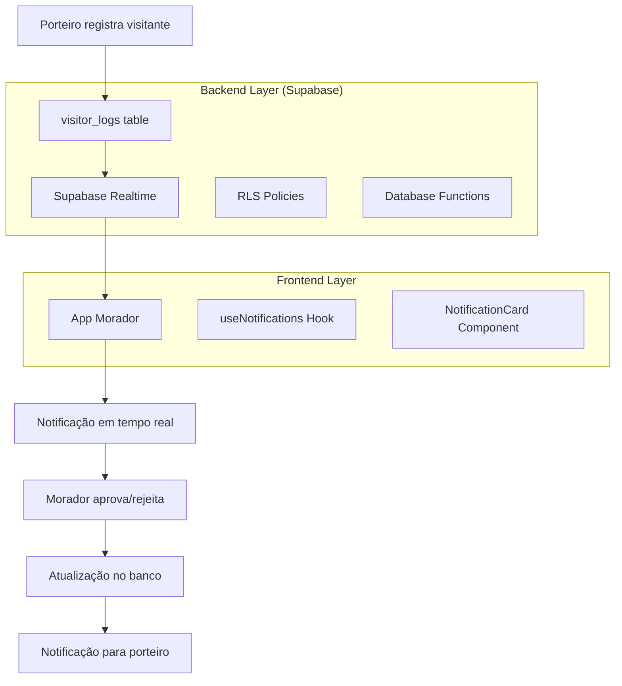

# Sistema de Notificações em Tempo Real para Moradores

## 1. Visão Geral

Este documento detalha a implementação de um sistema de notificações em tempo real para moradores usando Supabase Realtime, permitindo que recebam e respondam a solicitações de visitantes, encomendas e veículos instantaneamente.

## 2. Arquitetura do Sistema



## 3. Estrutura de Dados

### 3.1 Tabela visitor_logs (Existente - Modificações)

A tabela `visitor_logs` já possui os campos necessários:

```sql
-- Campos relevantes para notificações
notification_status VARCHAR -- 'pending', 'approved', 'rejected', 'expired'
notification_sent_at TIMESTAMPTZ -- Quando foi enviada
resident_response_at TIMESTAMPTZ -- Quando o morador respondeu
expires_at TIMESTAMPTZ -- Quando expira (24h padrão)
requires_resident_approval BOOLEAN -- Se precisa aprovação
entry_type VARCHAR -- 'visitor', 'delivery', 'vehicle'
rejection_reason TEXT -- Motivo da rejeição
```

### 3.2 Interface TypeScript

```typescript
interface PendingNotification {
  id: string;
  entry_type: 'visitor' | 'delivery' | 'vehicle';
  notification_status: 'pending' | 'approved' | 'rejected' | 'expired';
  notification_sent_at: string;
  expires_at: string;
  apartment_id: string;
  
  // Dados do visitante
  guest_name?: string;
  purpose?: string;
  visitor_id?: string;
  
  // Dados da encomenda
  delivery_sender?: string;
  delivery_description?: string;
  delivery_tracking_code?: string;
  
  // Dados do veículo
  license_plate?: string;
  vehicle_model?: string;
  vehicle_color?: string;
  vehicle_brand?: string;
  
  // Metadados
  building_id: string;
  created_at: string;
  log_time: string;
}

interface NotificationResponse {
  action: 'approve' | 'reject';
  reason?: string;
  delivery_destination?: 'portaria' | 'elevador' | 'apartamento';
}
```

## 4. Implementação do Supabase Realtime

### 4.1 Hook useNotifications

```typescript
// hooks/useNotifications.ts
import { useState, useEffect, useCallback } from 'react';
import { supabase } from '../utils/supabase';
import { useAuth } from './useAuth';

export const useNotifications = () => {
  const { user } = useAuth();
  const [notifications, setNotifications] = useState<PendingNotification[]>([]);
  const [loading, setLoading] = useState(false);
  const [error, setError] = useState<string | null>(null);
  const [apartmentId, setApartmentId] = useState<string | null>(null);

  // Buscar apartment_id do usuário
  const fetchApartmentId = useCallback(async () => {
    if (!user?.id) return;
    
    try {
      const { data, error } = await supabase
        .from('apartment_residents')
        .select('apartment_id')
        .eq('profile_id', user.id)
        .single();
      
      if (error) throw error;
      setApartmentId(data.apartment_id);
    } catch (err) {
      console.error('Erro ao buscar apartment_id:', err);
      setError('Erro ao identificar apartamento');
    }
  }, [user?.id]);

  // Buscar notificações pendentes
  const fetchPendingNotifications = useCallback(async () => {
    if (!apartmentId) return;
    
    try {
      setLoading(true);
      setError(null);
      
      const { data, error } = await supabase
        .from('visitor_logs')
        .select(`
          id,
          entry_type,
          notification_status,
          notification_sent_at,
          expires_at,
          apartment_id,
          guest_name,
          purpose,
          visitor_id,
          delivery_sender,
          delivery_description,
          delivery_tracking_code,
          license_plate,
          vehicle_model,
          vehicle_color,
          vehicle_brand,
          building_id,
          created_at,
          log_time,
          visitors (
            name,
            document,
            phone
          )
        `)
        .eq('apartment_id', apartmentId)
        .eq('notification_status', 'pending')
        .eq('requires_resident_approval', true)
        .gt('expires_at', new Date().toISOString())
        .order('notification_sent_at', { ascending: false });
      
      if (error) throw error;
      
      const mappedNotifications = data.map(item => ({
        ...item,
        guest_name: item.guest_name || item.visitors?.name || 'Visitante não identificado'
      }));
      
      setNotifications(mappedNotifications);
    } catch (err) {
      console.error('Erro ao buscar notificações:', err);
      setError('Erro ao carregar notificações');
    } finally {
      setLoading(false);
    }
  }, [apartmentId]);

  // Configurar Realtime subscription
  useEffect(() => {
    if (!apartmentId) return;
    
    const channel = supabase
      .channel('visitor_notifications')
      .on(
        'postgres_changes',
        {
          event: '*',
          schema: 'public',
          table: 'visitor_logs',
          filter: `apartment_id=eq.${apartmentId}`
        },
        (payload) => {
          console.log('Realtime notification:', payload);
          
          if (payload.eventType === 'INSERT') {
            const newLog = payload.new as any;
            if (newLog.notification_status === 'pending' && 
                newLog.requires_resident_approval) {
              // Adicionar nova notificação
              fetchPendingNotifications();
            }
          } else if (payload.eventType === 'UPDATE') {
            const updatedLog = payload.new as any;
            if (updatedLog.notification_status !== 'pending') {
              // Remover notificação respondida
              setNotifications(prev => 
                prev.filter(n => n.id !== updatedLog.id)
              );
            }
          }
        }
      )
      .subscribe();

    return () => {
      supabase.removeChannel(channel);
    };
  }, [apartmentId, fetchPendingNotifications]);

  // Responder à notificação
  const respondToNotification = useCallback(async (
    notificationId: string, 
    response: NotificationResponse
  ) => {
    try {
      const updateData: any = {
        notification_status: response.action === 'approve' ? 'approved' : 'rejected',
        resident_response_at: new Date().toISOString(),
      };
      
      if (response.reason) {
        updateData.rejection_reason = response.reason;
      }
      
      if (response.delivery_destination) {
        updateData.delivery_destination = response.delivery_destination;
      }
      
      const { error } = await supabase
        .from('visitor_logs')
        .update(updateData)
        .eq('id', notificationId);
      
      if (error) throw error;
      
      // Remover da lista local
      setNotifications(prev => prev.filter(n => n.id !== notificationId));
      
      return { success: true };
    } catch (err) {
      console.error('Erro ao responder notificação:', err);
      return { success: false, error: err.message };
    }
  }, []);

  // Inicializar
  useEffect(() => {
    fetchApartmentId();
  }, [fetchApartmentId]);

  useEffect(() => {
    if (apartmentId) {
      fetchPendingNotifications();
    }
  }, [apartmentId, fetchPendingNotifications]);

  return {
    notifications,
    loading,
    error,
    respondToNotification,
    refreshNotifications: fetchPendingNotifications
  };
};
```

### 4.2 Componente NotificationCard

```typescript
// components/NotificationCard.tsx
import React, { useState } from 'react';
import {
  View,
  Text,
  TouchableOpacity,
  StyleSheet,
  Alert,
  Modal,
  TextInput
} from 'react-native';
import { Ionicons } from '@expo/vector-icons';

interface NotificationCardProps {
  notification: PendingNotification;
  onRespond: (id: string, response: NotificationResponse) => Promise<{success: boolean; error?: string}>;
}

export const NotificationCard: React.FC<NotificationCardProps> = ({
  notification,
  onRespond
}) => {
  const [responding, setResponding] = useState(false);
  const [showRejectModal, setShowRejectModal] = useState(false);
  const [rejectReason, setRejectReason] = useState('');
  const [showDeliveryModal, setShowDeliveryModal] = useState(false);

  const getTimeAgo = (dateString: string) => {
    const now = new Date();
    const sent = new Date(dateString);
    const diffMinutes = Math.floor((now.getTime() - sent.getTime()) / (1000 * 60));
    
    if (diffMinutes < 1) return 'agora';
    if (diffMinutes < 60) return `há ${diffMinutes} min`;
    
    const diffHours = Math.floor(diffMinutes / 60);
    if (diffHours < 24) return `há ${diffHours}h`;
    
    const diffDays = Math.floor(diffHours / 24);
    return `há ${diffDays} dias`;
  };

  const getNotificationTitle = () => {
    switch (notification.entry_type) {
      case 'visitor':
        return `👤 ${notification.guest_name} quer subir`;
      case 'delivery':
        return `📦 Encomenda de ${notification.delivery_sender || 'remetente desconhecido'}`;
      case 'vehicle':
        return `🚗 Veículo ${notification.license_plate} quer entrar`;
      default:
        return '📬 Nova notificação';
    }
  };

  const getNotificationDetails = () => {
    switch (notification.entry_type) {
      case 'visitor':
        return notification.purpose || 'Visita';
      case 'delivery':
        return notification.delivery_description || 'Encomenda chegou';
      case 'vehicle':
        return `${notification.vehicle_brand || ''} ${notification.vehicle_model || ''} ${notification.vehicle_color || ''}`.trim();
      default:
        return '';
    }
  };

  const handleApprove = async () => {
    if (notification.entry_type === 'delivery') {
      setShowDeliveryModal(true);
      return;
    }
    
    setResponding(true);
    const result = await onRespond(notification.id, { action: 'approve' });
    
    if (!result.success) {
      Alert.alert('Erro', 'Não foi possível aprovar a solicitação');
    }
    setResponding(false);
  };

  const handleReject = () => {
    setShowRejectModal(true);
  };

  const confirmReject = async () => {
    setResponding(true);
    const result = await onRespond(notification.id, {
      action: 'reject',
      reason: rejectReason || 'Não autorizado'
    });
    
    if (!result.success) {
      Alert.alert('Erro', 'Não foi possível recusar a solicitação');
    }
    
    setShowRejectModal(false);
    setRejectReason('');
    setResponding(false);
  };

  const handleDeliveryDestination = async (destination: 'portaria' | 'elevador' | 'apartamento') => {
    setResponding(true);
    const result = await onRespond(notification.id, {
      action: 'approve',
      delivery_destination: destination
    });
    
    if (!result.success) {
      Alert.alert('Erro', 'Não foi possível processar a encomenda');
    }
    
    setShowDeliveryModal(false);
    setResponding(false);
  };

  return (
    <View style={styles.notificationCard}>
      <View style={styles.notificationHeader}>
        <Text style={styles.notificationTitle}>{getNotificationTitle()}</Text>
        <Text style={styles.notificationTime}>
          {getTimeAgo(notification.notification_sent_at)}
        </Text>
      </View>
      
      {getNotificationDetails() && (
        <Text style={styles.notificationDetails}>{getNotificationDetails()}</Text>
      )}
      
      <View style={styles.notificationActions}>
        {notification.entry_type === 'delivery' ? (
          <>
            <TouchableOpacity 
              style={[styles.actionButton, styles.approveButton]}
              onPress={handleApprove}
              disabled={responding}
            >
              <Text style={styles.actionButtonText}>📦 Processar</Text>
            </TouchableOpacity>
            <TouchableOpacity 
              style={[styles.actionButton, styles.denyButton]}
              onPress={handleReject}
              disabled={responding}
            >
              <Text style={styles.actionButtonText}>❌ Recusar</Text>
            </TouchableOpacity>
          </>
        ) : (
          <>
            <TouchableOpacity 
              style={[styles.actionButton, styles.approveButton]}
              onPress={handleApprove}
              disabled={responding}
            >
              <Text style={styles.actionButtonText}>✅ Aprovar</Text>
            </TouchableOpacity>
            <TouchableOpacity 
              style={[styles.actionButton, styles.denyButton]}
              onPress={handleReject}
              disabled={responding}
            >
              <Text style={styles.actionButtonText}>❌ Recusar</Text>
            </TouchableOpacity>
          </>
        )}
      </View>

      {/* Modal de rejeição */}
      <Modal
        visible={showRejectModal}
        transparent
        animationType="fade"
        onRequestClose={() => setShowRejectModal(false)}
      >
        <View style={styles.modalOverlay}>
          <View style={styles.modalContent}>
            <Text style={styles.modalTitle}>Motivo da recusa</Text>
            <TextInput
              style={styles.textInput}
              placeholder="Digite o motivo (opcional)"
              value={rejectReason}
              onChangeText={setRejectReason}
              multiline
            />
            <View style={styles.modalActions}>
              <TouchableOpacity
                style={[styles.modalButton, styles.cancelButton]}
                onPress={() => setShowRejectModal(false)}
              >
                <Text style={styles.cancelButtonText}>Cancelar</Text>
              </TouchableOpacity>
              <TouchableOpacity
                style={[styles.modalButton, styles.confirmButton]}
                onPress={confirmReject}
                disabled={responding}
              >
                <Text style={styles.confirmButtonText}>Recusar</Text>
              </TouchableOpacity>
            </View>
          </View>
        </View>
      </Modal>

      {/* Modal de destino da encomenda */}
      <Modal
        visible={showDeliveryModal}
        transparent
        animationType="fade"
        onRequestClose={() => setShowDeliveryModal(false)}
      >
        <View style={styles.modalOverlay}>
          <View style={styles.modalContent}>
            <Text style={styles.modalTitle}>Onde deixar a encomenda?</Text>
            <TouchableOpacity
              style={[styles.deliveryOption, styles.porterButton]}
              onPress={() => handleDeliveryDestination('portaria')}
              disabled={responding}
            >
              <Text style={styles.deliveryOptionText}>🏢 Deixar na portaria</Text>
            </TouchableOpacity>
            <TouchableOpacity
              style={[styles.deliveryOption, styles.elevatorButton]}
              onPress={() => handleDeliveryDestination('elevador')}
              disabled={responding}
            >
              <Text style={styles.deliveryOptionText}>🛗 Colocar no elevador</Text>
            </TouchableOpacity>
            <TouchableOpacity
              style={[styles.deliveryOption, styles.apartmentButton]}
              onPress={() => handleDeliveryDestination('apartamento')}
              disabled={responding}
            >
              <Text style={styles.deliveryOptionText}>🚪 Trazer ao apartamento</Text>
            </TouchableOpacity>
            <TouchableOpacity
              style={[styles.modalButton, styles.cancelButton]}
              onPress={() => setShowDeliveryModal(false)}
            >
              <Text style={styles.cancelButtonText}>Cancelar</Text>
            </TouchableOpacity>
          </View>
        </View>
      </Modal>
    </View>
  );
};

const styles = StyleSheet.create({
  notificationCard: {
    backgroundColor: '#fff',
    borderRadius: 12,
    padding: 16,
    marginBottom: 12,
    shadowColor: '#000',
    shadowOffset: { width: 0, height: 2 },
    shadowOpacity: 0.1,
    shadowRadius: 4,
    elevation: 3,
  },
  notificationHeader: {
    flexDirection: 'row',
    justifyContent: 'space-between',
    alignItems: 'flex-start',
    marginBottom: 8,
  },
  notificationTitle: {
    fontSize: 16,
    fontWeight: '600',
    color: '#333',
    flex: 1,
    marginRight: 8,
  },
  notificationTime: {
    fontSize: 12,
    color: '#666',
  },
  notificationDetails: {
    fontSize: 14,
    color: '#666',
    marginBottom: 12,
  },
  notificationActions: {
    flexDirection: 'row',
    gap: 8,
  },
  actionButton: {
    flex: 1,
    paddingVertical: 10,
    paddingHorizontal: 16,
    borderRadius: 8,
    alignItems: 'center',
  },
  approveButton: {
    backgroundColor: '#4CAF50',
  },
  denyButton: {
    backgroundColor: '#f44336',
  },
  porterButton: {
    backgroundColor: '#2196F3',
  },
  elevatorButton: {
    backgroundColor: '#FF9800',
  },
  apartmentButton: {
    backgroundColor: '#9C27B0',
  },
  actionButtonText: {
    color: '#fff',
    fontWeight: '600',
    fontSize: 14,
  },
  modalOverlay: {
    flex: 1,
    backgroundColor: 'rgba(0, 0, 0, 0.5)',
    justifyContent: 'center',
    alignItems: 'center',
  },
  modalContent: {
    backgroundColor: '#fff',
    borderRadius: 12,
    padding: 20,
    width: '90%',
    maxWidth: 400,
  },
  modalTitle: {
    fontSize: 18,
    fontWeight: '600',
    color: '#333',
    marginBottom: 16,
    textAlign: 'center',
  },
  textInput: {
    borderWidth: 1,
    borderColor: '#ddd',
    borderRadius: 8,
    padding: 12,
    marginBottom: 16,
    minHeight: 80,
    textAlignVertical: 'top',
  },
  modalActions: {
    flexDirection: 'row',
    gap: 12,
  },
  modalButton: {
    flex: 1,
    paddingVertical: 12,
    borderRadius: 8,
    alignItems: 'center',
  },
  cancelButton: {
    backgroundColor: '#f5f5f5',
  },
  confirmButton: {
    backgroundColor: '#f44336',
  },
  cancelButtonText: {
    color: '#666',
    fontWeight: '600',
  },
  confirmButtonText: {
    color: '#fff',
    fontWeight: '600',
  },
  deliveryOption: {
    paddingVertical: 16,
    paddingHorizontal: 20,
    borderRadius: 8,
    marginBottom: 12,
    alignItems: 'center',
  },
  deliveryOptionText: {
    color: '#fff',
    fontWeight: '600',
    fontSize: 16,
  },
});
```

## 5. Integração no Componente Morador

### 5.1 Modificação do renderInicioTab

```typescript
// Substituir o renderInicioTab hardcoded por:
const renderInicioTab = () => {
  const { notifications, loading, error, respondToNotification } = useNotifications();
  
  return (
    <ScrollView style={styles.content}>
      <View style={styles.section}>
        <Text style={styles.sectionTitle}>📬 Notificações Pendentes</Text>
        
        {loading && (
          <View style={styles.loadingContainer}>
            <ActivityIndicator size="small" color="#4CAF50" />
            <Text style={styles.loadingText}>Carregando notificações...</Text>
          </View>
        )}
        
        {error && (
          <View style={styles.errorContainer}>
            <Text style={styles.errorText}>❌ {error}</Text>
          </View>
        )}
        
        {!loading && !error && notifications.length === 0 && (
          <View style={styles.emptyContainer}>
            <Text style={styles.emptyText}>📭 Nenhuma notificação pendente</Text>
          </View>
        )}
        
        {!loading && !error && notifications.map((notification) => (
          <NotificationCard
            key={notification.id}
            notification={notification}
            onRespond={respondToNotification}
          />
        ))}
      </View>
      
      {/* Manter a seção de histórico existente */}
      <View style={styles.section}>
        {/* ... código do histórico existente ... */}
      </View>
    </ScrollView>
  );
};
```

## 6. Configuração de Políticas RLS

```sql
-- Política para moradores verem apenas notificações do seu apartamento
CREATE POLICY "Moradores podem ver notificações do seu apartamento" ON visitor_logs
FOR SELECT USING (
  apartment_id IN (
    SELECT apartment_id 
    FROM apartment_residents 
    WHERE profile_id = auth.uid()
  )
);

-- Política para moradores atualizarem status de notificações
CREATE POLICY "Moradores podem responder notificações do seu apartamento" ON visitor_logs
FOR UPDATE USING (
  apartment_id IN (
    SELECT apartment_id 
    FROM apartment_residents 
    WHERE profile_id = auth.uid()
  )
) WITH CHECK (
  apartment_id IN (
    SELECT apartment_id 
    FROM apartment_residents 
    WHERE profile_id = auth.uid()
  )
);
```

## 7. Função de Expiração Automática

```sql
-- Função para expirar notificações antigas
CREATE OR REPLACE FUNCTION expire_old_notifications()
RETURNS void AS $$
BEGIN
  UPDATE visitor_logs 
  SET notification_status = 'expired'
  WHERE notification_status = 'pending'
    AND expires_at < NOW();
END;
$$ LANGUAGE plpgsql;

-- Agendar execução a cada 5 minutos
SELECT cron.schedule('expire-notifications', '*/5 * * * *', 'SELECT expire_old_notifications();');
```

## 8. Tratamento de Erros e Estados

### 8.1 Estados de Loading
- Loading inicial das notificações
- Loading durante resposta (aprovar/rejeitar)
- Loading durante refresh

### 8.2 Tratamento de Erros
- Erro de conexão com Supabase
- Erro de permissão (RLS)
- Erro ao responder notificação
- Timeout de conexão Realtime

### 8.3 Estados de Notificação
- `pending`: Aguardando resposta do morador
- `approved`: Aprovada pelo morador
- `rejected`: Rejeitada pelo morador
- `expired`: Expirou sem resposta (24h)

## 9. Fluxo de Implementação

### Fase 1: Preparação
1. ✅ Verificar estrutura da tabela `visitor_logs`
2. ✅ Configurar políticas RLS
3. ✅ Criar função de expiração

### Fase 2: Desenvolvimento
1. ✅ Criar hook `useNotifications`
2. ✅ Desenvolver componente `NotificationCard`
3. ✅ Integrar Supabase Realtime

### Fase 3: Integração
1. ✅ Modificar componente morador
2. ✅ Substituir notificações hardcoded
3. ✅ Testar fluxo completo

### Fase 4: Testes
1. Testar notificações em tempo real
2. Testar aprovação/rejeição
3. Testar expiração automática
4. Testar diferentes tipos de entrada

## 10. Considerações de Performance

- **Realtime Subscription**: Filtrar apenas por apartment_id para reduzir tráfego
- **Paginação**: Limitar notificações a 20 mais recentes
- **Cache Local**: Manter estado local para evitar re-renders desnecessários
- **Debounce**: Implementar debounce em ações do usuário

## 11. Monitoramento e Logs

- Log de todas as ações de aprovação/rejeição
- Métricas de tempo de resposta dos moradores
- Alertas para notificações expiradas
- Dashboard de estatísticas de notificações

Este sistema fornece uma base sólida para notificações em tempo real, permitindo que moradores recebam e respondam instantaneamente a solicitações de visitantes, encomendas e veículos, substituindo completamente as notificações hardcoded atuais.