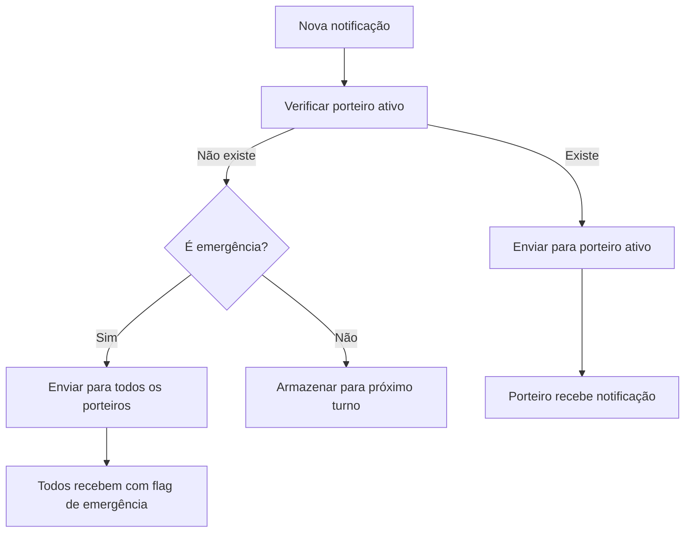

# Sistema de Turnos para Porteiros - Especificação Técnica

## 1. Visão Geral do Projeto

Implementação de um sistema de turnos para porteiros que permite controle de jornada de trabalho (bater ponto) e filtragem inteligente de notificações apenas para o porteiro que está no turno ativo. O sistema funciona como um controle de ponto digital integrado ao app existente.

## 2. Análise da Estrutura Atual

### 2.1 Estrutura de Dados Existente
- **Tabela `profiles`**: Contém dados dos porteiros com `user_type = 'porteiro'` e `building_id`
- **Campo `work_schedule`**: Já existe para definir horários de trabalho (formato: "08:00-18:00")
- **Sistema de notificações**: Implementado via `usePorteiroNotifications` hook
- **Autenticação**: Baseada em Supabase Auth com RLS policies

### 2.2 Limitações Identificadas
- Notificações chegam para todos os porteiros do prédio
- Não há controle de quem está efetivamente trabalhando
- Falta sistema de registro de entrada/saída
- Ausência de validação de turnos sobrepostos

## 3. Especificações do Sistema de Turnos

### 3.1 Funcionalidades Principais

#### 3.1.1 Controle de Ponto
- **Iniciar Turno**: Porteiro registra entrada no trabalho
- **Finalizar Turno**: Porteiro registra saída do trabalho
- **Status em Tempo Real**: Visualização do status atual do turno
- **Histórico**: Registro completo de entradas e saídas

#### 3.1.2 Filtragem de Notificações
- Notificações direcionadas apenas para porteiro em turno ativo
- Sistema de fallback para emergências
- Priorização por proximidade do fim do turno

#### 3.1.3 Validações e Controles
- Prevenção de turnos sobrepostos no mesmo prédio
- Validação de horários de trabalho
- Controle de turnos em aberto
- Alertas para turnos longos (>12h)

## 4. Estrutura do Banco de Dados

### 4.1 Nova Tabela: `porteiro_shifts`

```sql
CREATE TABLE porteiro_shifts (
  id UUID PRIMARY KEY DEFAULT gen_random_uuid(),
  porteiro_id UUID NOT NULL REFERENCES profiles(id),
  building_id UUID NOT NULL REFERENCES buildings(id),
  shift_start TIMESTAMP WITH TIME ZONE NOT NULL,
  shift_end TIMESTAMP WITH TIME ZONE NULL,
  status VARCHAR(20) NOT NULL DEFAULT 'active' CHECK (status IN ('active', 'completed', 'interrupted')),
  notes TEXT,
  created_at TIMESTAMP WITH TIME ZONE DEFAULT NOW(),
  updated_at TIMESTAMP WITH TIME ZONE DEFAULT NOW()
);

-- Índices para performance
CREATE INDEX idx_porteiro_shifts_porteiro_id ON porteiro_shifts(porteiro_id);
CREATE INDEX idx_porteiro_shifts_building_id ON porteiro_shifts(building_id);
CREATE INDEX idx_porteiro_shifts_status ON porteiro_shifts(status);
CREATE INDEX idx_porteiro_shifts_active ON porteiro_shifts(building_id, status) WHERE status = 'active';

-- RLS Policies
ALTER TABLE porteiro_shifts ENABLE ROW LEVEL SECURITY;

CREATE POLICY "porteiro_shifts_select_own" ON porteiro_shifts
  FOR SELECT TO authenticated
  USING (porteiro_id = auth.uid() OR is_current_user_admin_or_porteiro());

CREATE POLICY "porteiro_shifts_insert_own" ON porteiro_shifts
  FOR INSERT TO authenticated
  WITH CHECK (porteiro_id = auth.uid() AND is_current_user_porteiro());

CREATE POLICY "porteiro_shifts_update_own" ON porteiro_shifts
  FOR UPDATE TO authenticated
  USING (porteiro_id = auth.uid() OR is_current_user_admin())
  WITH CHECK (porteiro_id = auth.uid() OR is_current_user_admin());
```

### 4.2 Funções do Banco de Dados

```sql
-- Função para obter porteiro ativo no prédio
CREATE OR REPLACE FUNCTION get_active_porteiro(building_uuid UUID)
RETURNS UUID AS $$
DECLARE
  active_porteiro_id UUID;
BEGIN
  SELECT porteiro_id INTO active_porteiro_id
  FROM porteiro_shifts
  WHERE building_id = building_uuid
    AND status = 'active'
    AND shift_start <= NOW()
  ORDER BY shift_start DESC
  LIMIT 1;
  
  RETURN active_porteiro_id;
END;
$$ LANGUAGE plpgsql SECURITY DEFINER;

-- Função para validar sobreposição de turnos
CREATE OR REPLACE FUNCTION validate_shift_overlap(
  building_uuid UUID,
  porteiro_uuid UUID,
  start_time TIMESTAMP WITH TIME ZONE
)
RETURNS BOOLEAN AS $$
BEGIN
  -- Verificar se há turnos ativos no mesmo prédio
  RETURN NOT EXISTS (
    SELECT 1
    FROM porteiro_shifts
    WHERE building_id = building_uuid
      AND status = 'active'
      AND porteiro_id != porteiro_uuid
      AND shift_start <= start_time
  );
END;
$$ LANGUAGE plpgsql SECURITY DEFINER;

-- Função para finalizar turnos antigos automaticamente
CREATE OR REPLACE FUNCTION auto_close_old_shifts()
RETURNS void AS $$
BEGIN
  UPDATE porteiro_shifts
  SET status = 'interrupted',
      shift_end = NOW(),
      notes = COALESCE(notes || ' | ', '') || 'Turno finalizado automaticamente após 24h',
      updated_at = NOW()
  WHERE status = 'active'
    AND shift_start < NOW() - INTERVAL '24 hours';
END;
$$ LANGUAGE plpgsql SECURITY DEFINER;
```

## 5. Interface do Usuário

### 5.1 Componente Principal: `ShiftControl`

#### 5.1.1 Estados da Interface
- **Fora do Turno**: Botão "Iniciar Turno" + informações do último turno
- **Em Turno**: Cronômetro + botão "Finalizar Turno" + status
- **Carregando**: Indicador de loading durante operações

#### 5.1.2 Elementos Visuais
```typescript
interface ShiftControlProps {
  porteiroId: string;
  buildingId: string;
  onShiftChange?: (isActive: boolean) => void;
}

type ShiftStatus = 'inactive' | 'active' | 'loading';

interface CurrentShift {
  id: string;
  shift_start: string;
  status: 'active' | 'completed' | 'interrupted';
  duration?: string;
}
```

### 5.2 Dashboard de Turnos

#### 5.2.1 Informações Exibidas
- Status atual do turno
- Tempo decorrido no turno atual
- Histórico dos últimos 7 dias
- Estatísticas de horas trabalhadas
- Alertas e notificações

#### 5.2.2 Layout Responsivo
```typescript
interface ShiftDashboard {
  currentShift: CurrentShift | null;
  todayHours: number;
  weekHours: number;
  recentShifts: ShiftHistory[];
  alerts: ShiftAlert[];
}
```

## 6. Lógica de Notificações

### 6.1 Filtro Inteligente

```typescript
// Hook modificado para filtrar notificações
const usePorteiroNotifications = (buildingId: string) => {
  const { user } = useAuth();
  const [isOnDuty, setIsOnDuty] = useState(false);
  
  // Verificar se o porteiro está em turno ativo
  const checkDutyStatus = useCallback(async () => {
    if (!user?.id || !buildingId) return;
    
    const { data: activeShift } = await supabase
      .from('porteiro_shifts')
      .select('id')
      .eq('porteiro_id', user.id)
      .eq('building_id', buildingId)
      .eq('status', 'active')
      .single();
    
    setIsOnDuty(!!activeShift);
  }, [user?.id, buildingId]);
  
  // Só receber notificações se estiver em turno
  const shouldReceiveNotifications = isOnDuty;
  
  return {
    notifications: shouldReceiveNotifications ? notifications : [],
    unreadCount: shouldReceiveNotifications ? unreadCount : 0,
    isOnDuty,
    // ... outros retornos
  };
};
```

### 6.2 Sistema de Fallback

```typescript
// Função para notificações de emergência
const sendEmergencyNotification = async (buildingId: string, message: string) => {
  // 1. Tentar porteiro ativo primeiro
  const activePorteiro = await getActivePorteiro(buildingId);
  
  if (activePorteiro) {
    await sendNotification(activePorteiro, message, 'emergency');
    return;
  }
  
  // 2. Fallback: todos os porteiros do prédio
  const allPorteiros = await getAllPorteirosByBuilding(buildingId);
  await Promise.all(
    allPorteiros.map(porteiro => 
      sendNotification(porteiro.id, message, 'emergency_fallback')
    )
  );
};
```

## 7. Implementação Passo a Passo

### 7.1 Fase 1: Estrutura do Banco de Dados
1. Criar migration para tabela `porteiro_shifts`
2. Implementar funções SQL auxiliares
3. Configurar RLS policies
4. Criar índices para performance
5. Implementar job para limpeza automática

### 7.2 Fase 2: Serviços e Hooks
1. Criar `ShiftService` para operações CRUD
2. Implementar `useShiftControl` hook
3. Modificar `usePorteiroNotifications` para filtrar por turno
4. Criar validações de negócio
5. Implementar cache local para performance

### 7.3 Fase 3: Interface do Usuário
1. Criar componente `ShiftControl`
2. Implementar dashboard de turnos
3. Adicionar indicadores visuais de status
4. Criar modais de confirmação
5. Implementar feedback visual e sonoro

### 7.4 Fase 4: Integração e Testes
1. Integrar com telas existentes do porteiro
2. Implementar testes unitários
3. Testes de integração com notificações
4. Testes de performance com múltiplos porteiros
5. Validação de UX com usuários reais

## 8. Fluxos de Usuário

### 8.1 Fluxo de Iniciar Turno
```mermaid
graph TD
    A[Porteiro abre app] --> B[Tela principal]
    B --> C{Já está em turno?}
    C -->|Não| D[Botão "Iniciar Turno"]
    C -->|Sim| E[Dashboard do turno ativo]
    D --> F[Validar sobreposição]
    F -->|Válido| G[Registrar início do turno]
    F -->|Inválido| H[Mostrar erro]
    G --> I[Atualizar interface]
    I --> J[Iniciar recebimento de notificações]
```

### 8.2 Fluxo de Finalizar Turno
```mermaid
graph TD
    A[Porteiro em turno] --> B[Botão "Finalizar Turno"]
    B --> C[Modal de confirmação]
    C -->|Confirmar| D[Registrar fim do turno]
    C -->|Cancelar| E[Voltar ao dashboard]
    D --> F[Parar recebimento de notificações]
    F --> G[Mostrar resumo do turno]
    G --> H[Voltar à tela inicial]
```

### 8.3 Fluxo de Notificações


## 9. Considerações de Segurança

### 9.1 Validações de Negócio
- Apenas um porteiro ativo por prédio
- Validação de horários de trabalho
- Prevenção de turnos muito longos (>24h)
- Auditoria completa de todas as operações

### 9.2 Segurança de Dados
- RLS policies restritivas
- Criptografia de dados sensíveis
- Logs de auditoria para compliance
- Validação de permissões em tempo real

### 9.3 Recuperação de Falhas
- Sistema de fallback para notificações
- Auto-finalização de turnos órfãos
- Sincronização offline/online
- Backup automático de dados críticos

## 10. Métricas e Monitoramento

### 10.1 KPIs do Sistema
- Tempo médio de turno por porteiro
- Taxa de notificações entregues com sucesso
- Número de conflitos de turno evitados
- Tempo de resposta do sistema

### 10.2 Alertas Automáticos
- Turno muito longo (>12h)
- Prédio sem porteiro ativo
- Falhas na entrega de notificações
- Tentativas de sobreposição de turnos

## 11. Roadmap de Implementação

### 11.1 Sprint 1 (1 semana)
- Criar estrutura do banco de dados
- Implementar funções SQL básicas
- Criar migration e aplicar em desenvolvimento

### 11.2 Sprint 2 (1 semana)
- Desenvolver ShiftService
- Criar hook useShiftControl
- Implementar validações básicas

### 11.3 Sprint 3 (1 semana)
- Criar componente ShiftControl
- Implementar interface básica
- Integrar com tela principal do porteiro

### 11.4 Sprint 4 (1 semana)
- Modificar sistema de notificações
- Implementar filtros por turno ativo
- Criar sistema de fallback

### 11.5 Sprint 5 (1 semana)
- Testes integrados
- Refinamentos de UX
- Deploy em produção
- Monitoramento e ajustes

## 12. Conclusão

O sistema de turnos para porteiros representa uma evolução significativa na gestão de recursos humanos e na eficiência operacional do aplicativo. Com implementação faseada e foco na experiência do usuário, o sistema proporcionará:

- **Controle preciso** de jornadas de trabalho
- **Otimização** do sistema de notificações
- **Redução** de conflitos operacionais
- **Melhoria** na qualidade do atendimento
- **Compliance** com regulamentações trabalhistas

A arquitetura proposta é escalável, segura e mantém compatibilidade com o sistema existente, garantindo uma transição suave e benefícios imediatos para todos os stakeholders.