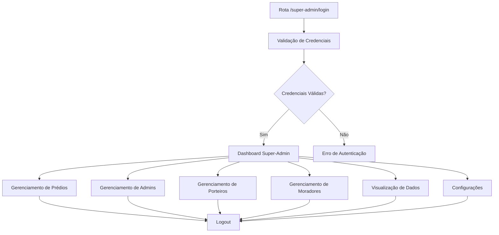

# Sistema de Super-Admin - Porteiro Site

## 1. Visão Geral do Produto

Sistema de administração privilegiada para o Porteiro Site que permite controle total sobre todos os aspectos da plataforma. O super-admin terá acesso exclusivo a funcionalidades de gerenciamento de usuários, prédios e dados do sistema, garantindo supervisão completa da operação.

Este sistema resolve a necessidade de ter um usuário com privilégios máximos para configuração inicial, manutenção e supervisão geral da plataforma, permitindo escalabilidade e controle centralizado.

## 2. Funcionalidades Principais

### 2.1 Papéis de Usuário

| Papel | Método de Registro | Permissões Principais |
|-------|-------------------|----------------------|
| Super-Admin | Criação direta no banco de dados | Acesso total ao sistema, gerenciamento de todos os usuários e dados |
| Admin Regular | Cadastro pelo Super-Admin | Gerenciamento limitado aos prédios atribuídos |
| Porteiro | Cadastro pelo Admin/Super-Admin | Controle de acesso e visitantes |
| Morador | Cadastro pelo Admin/Super-Admin | Acesso às funcionalidades de morador |

### 2.2 Módulos de Funcionalidade

Nosso sistema de super-admin consiste nas seguintes páginas principais:

1. **Login Super-Admin**: autenticação exclusiva, validação de credenciais, redirecionamento seguro.
2. **Dashboard Principal**: visão geral do sistema, estatísticas gerais, acesso rápido às funcionalidades.
3. **Gerenciamento de Prédios**: listagem, criação, edição e remoção de prédios.
4. **Gerenciamento de Administradores**: cadastro, edição e remoção de administradores regulares.
5. **Gerenciamento de Porteiros**: controle completo de usuários porteiros.
6. **Gerenciamento de Moradores**: visualização e controle de todos os moradores.
7. **Visualização de Dados**: relatórios completos, logs do sistema, estatísticas detalhadas.
8. **Configurações do Sistema**: parâmetros globais, configurações de segurança.

### 2.3 Detalhes das Páginas

| Nome da Página | Nome do Módulo | Descrição da Funcionalidade |
|----------------|----------------|-----------------------------|
| Login Super-Admin | Autenticação | Validar credenciais exclusivas, verificar permissões de super-admin, redirecionar para dashboard |
| Dashboard Principal | Visão Geral | Exibir estatísticas do sistema, mostrar atividades recentes, fornecer navegação rápida |
| Gerenciamento de Prédios | CRUD Prédios | Listar todos os prédios, criar novos prédios, editar informações, remover prédios |
| Gerenciamento de Administradores | CRUD Admins | Cadastrar novos administradores, atribuir prédios, editar perfis, desativar contas |
| Gerenciamento de Porteiros | CRUD Porteiros | Visualizar todos os porteiros, criar contas, editar informações, gerenciar turnos |
| Gerenciamento de Moradores | CRUD Moradores | Listar todos os moradores, editar perfis, gerenciar apartamentos, controlar status |
| Visualização de Dados | Relatórios | Gerar relatórios completos, visualizar logs de sistema, exportar dados |
| Configurações | Parâmetros | Configurar parâmetros globais, gerenciar segurança, definir políticas |

## 3. Processo Principal

**Fluxo do Super-Admin:**
1. Acesso à rota exclusiva /super-admin/login
2. Autenticação com credenciais de super-admin
3. Redirecionamento para dashboard principal
4. Navegação entre módulos de gerenciamento
5. Execução de operações administrativas
6. Logout seguro

## 4. Design da Interface do Usuário

### 4.1 Estilo de Design

- **Cores Primárias**: Azul escuro (#1e3a8a) para elementos principais, vermelho (#dc2626) para ações críticas
- **Cores Secundárias**: Cinza (#6b7280) para textos secundários, verde (#059669) para confirmações
- **Estilo de Botões**: Botões arredondados com sombras sutis, estados hover bem definidos
- **Fonte**: Inter ou system-ui, tamanhos de 14px a 24px
- **Layout**: Design baseado em cards, navegação lateral fixa, layout responsivo
- **Ícones**: Lucide React para consistência, estilo outline

### 4.2 Visão Geral do Design das Páginas

| Nome da Página | Nome do Módulo | Elementos da UI |
|----------------|----------------|----------------|
| Login Super-Admin | Formulário de Login | Layout centralizado, campos de email/senha, botão de login destacado, fundo gradiente azul |
| Dashboard Principal | Cards de Estatísticas | Grid de cards com métricas, gráficos simples, navegação lateral, header com logout |
| Gerenciamento de Prédios | Tabela + Formulários | Tabela responsiva, modais para edição, botões de ação coloridos, filtros de busca |
| Gerenciamento de Administradores | Lista + Formulários | Cards de usuários, formulários de cadastro, seleção de prédios, status indicators |
| Gerenciamento de Porteiros | Tabela Avançada | Tabela com paginação, filtros por prédio, modais de edição, controle de turnos |
| Gerenciamento de Moradores | Lista Paginada | Cards de moradores, filtros múltiplos, visualização de apartamentos, status badges |
| Visualização de Dados | Dashboard Analytics | Gráficos interativos, tabelas de dados, filtros de data, botões de exportação |
| Configurações | Formulários | Seções organizadas, switches para configurações, botões de salvar destacados |

### 4.3 Responsividade

O sistema é desktop-first com adaptação para tablets. Inclui navegação lateral colapsável, tabelas responsivas com scroll horizontal e modais adaptáveis para diferentes tamanhos de tela.