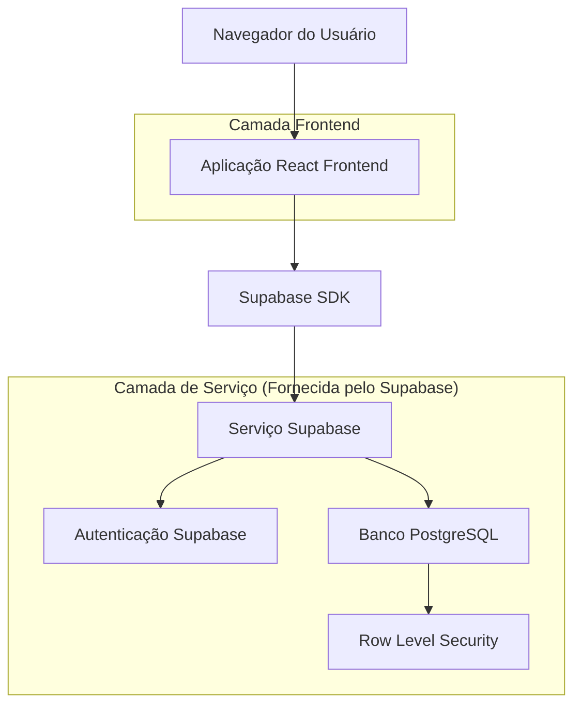
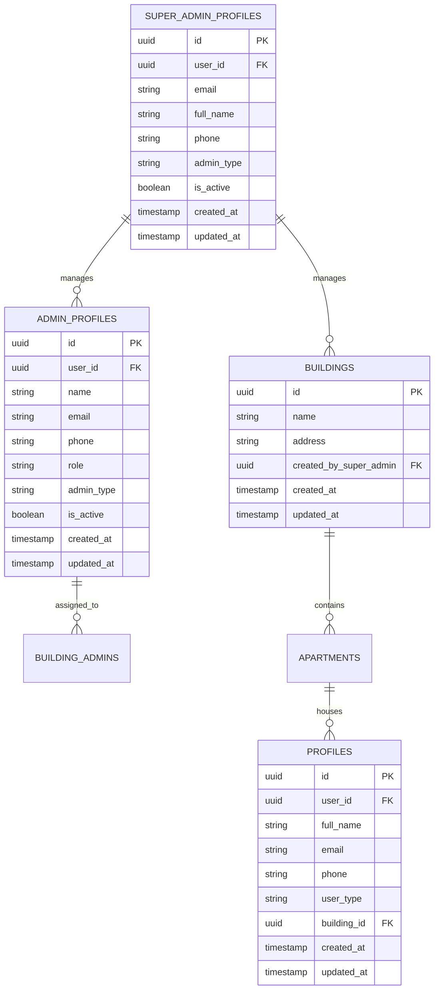

# Arquitetura Técnica - Sistema de Super-Admin

## 1. Design da Arquitetura



## 2. Descrição das Tecnologias

* **Frontend**: React\@19 + Next.js\@15 + TailwindCSS\@4 + TypeScript\@5

* **Backend**: Supabase (PostgreSQL + Auth + RLS)

* **Autenticação**: Supabase Auth com políticas RLS customizadas

* **UI Components**: Lucide React + Sonner (toasts)

## 3. Definições de Rotas

| Rota                     | Propósito                                      |
| ------------------------ | ---------------------------------------------- |
| /super-admin/login       | Página de login exclusiva para super-admin     |
| /super-admin/dashboard   | Dashboard principal com visão geral do sistema |
| /super-admin/buildings   | Gerenciamento completo de prédios              |
| /super-admin/admins      | Cadastro e gerenciamento de administradores    |
| /super-admin/doorkeepers | Gerenciamento de porteiros                     |
| /super-admin/residents   | Visualização e controle de moradores           |
| /super-admin/reports     | Relatórios e visualização de dados             |
| /super-admin/settings    | Configurações globais do sistema               |

## 4. Definições de API

### 4.1 APIs Principais

**Autenticação de Super-Admin**

```
POST /auth/v1/token (Supabase Auth)
```

Request:

| Nome do Parâmetro | Tipo   | Obrigatório | Descrição            |
| ----------------- | ------ | ----------- | -------------------- |
| email             | string | true        | Email do super-admin |
| password          | string | true        | Senha do super-admin |

Response:

| Nome do Parâmetro | Tipo   | Descrição                    |
| ----------------- | ------ | ---------------------------- |
| access\_token     | string | Token JWT de acesso          |
| user              | object | Dados do usuário autenticado |

**Gerenciamento de Prédios**

```
GET /rest/v1/buildings (Supabase REST API)
POST /rest/v1/buildings
PATCH /rest/v1/buildings?id=eq.{id}
DELETE /rest/v1/buildings?id=eq.{id}
```

**Gerenciamento de Administradores**

```
GET /rest/v1/super_admin_profiles
POST /rest/v1/super_admin_profiles
PATCH /rest/v1/super_admin_profiles?id=eq.{id}
```

Exemplo de Request (Criar Admin):

```json
{
  "email": "admin@exemplo.com",
  "full_name": "João Silva",
  "phone": "+5511999999999",
  "admin_type": "regular",
  "assigned_buildings": ["uuid1", "uuid2"]
}
```

## 5. Modelo de Dados

### 5.1 Definição do Modelo de Dados



### 5.2 Linguagem de Definição de Dados (DDL)

**Tabela Super Admin Profiles**

```sql
-- Criar tabela super_admin_profiles
CREATE TABLE super_admin_profiles (
    id UUID PRIMARY KEY DEFAULT gen_random_uuid(),
    user_id UUID REFERENCES auth.users(id) ON DELETE CASCADE,
    email VARCHAR(255) UNIQUE NOT NULL,
    full_name VARCHAR(255) NOT NULL,
    phone VARCHAR(20),
    admin_type VARCHAR(20) DEFAULT 'super_admin' CHECK (admin_type IN ('super_admin')),
    is_active BOOLEAN DEFAULT true,
    created_at TIMESTAMP WITH TIME ZONE DEFAULT NOW(),
    updated_at TIMESTAMP WITH TIME ZONE DEFAULT NOW()
);

-- Criar índices
CREATE INDEX idx_super_admin_profiles_user_id ON super_admin_profiles(user_id);
CREATE INDEX idx_super_admin_profiles_email ON super_admin_profiles(email);
CREATE INDEX idx_super_admin_profiles_active ON super_admin_profiles(is_active);

-- Atualizar tabela admin_profiles para incluir admin_type
ALTER TABLE admin_profiles ADD COLUMN IF NOT EXISTS admin_type VARCHAR(20) DEFAULT 'regular' CHECK (admin_type IN ('regular', 'super_admin'));

-- Função para verificar se usuário é super admin
CREATE OR REPLACE FUNCTION is_super_admin(user_id uuid)
RETURNS boolean AS $$
BEGIN
  RETURN EXISTS (
    SELECT 1 FROM super_admin_profiles 
    WHERE user_id = $1 AND is_active = true
  );
END;
$$ LANGUAGE plpgsql SECURITY DEFINER;

-- Políticas RLS para super_admin_profiles
ALTER TABLE super_admin_profiles ENABLE ROW LEVEL SECURITY;

-- Super admins podem ver todos os perfis de super admin
CREATE POLICY "Super admins can view all super admin profiles" ON super_admin_profiles
  FOR SELECT USING (is_super_admin(auth.uid()));

-- Super admins podem inserir novos super admins
CREATE POLICY "Super admins can insert super admin profiles" ON super_admin_profiles
  FOR INSERT WITH CHECK (is_super_admin(auth.uid()));

-- Super admins podem atualizar perfis de super admin
CREATE POLICY "Super admins can update super admin profiles" ON super_admin_profiles
  FOR UPDATE USING (is_super_admin(auth.uid()));

-- Super admins podem deletar perfis de super admin
CREATE POLICY "Super admins can delete super admin profiles" ON super_admin_profiles
  FOR DELETE USING (is_super_admin(auth.uid()));

-- Atualizar políticas existentes para incluir super admins
DROP POLICY IF EXISTS "Super admins can view all buildings" ON buildings;
CREATE POLICY "Super admins can view all buildings" ON buildings
  FOR SELECT USING (is_super_admin(auth.uid()));

DROP POLICY IF EXISTS "Super admins can insert buildings" ON buildings;
CREATE POLICY "Super admins can insert buildings" ON buildings
  FOR INSERT WITH CHECK (is_super_admin(auth.uid()));

DROP POLICY IF EXISTS "Super admins can update all buildings" ON buildings;
CREATE POLICY "Super admins can update all buildings" ON buildings
  FOR UPDATE USING (is_super_admin(auth.uid()));

DROP POLICY IF EXISTS "Super admins can delete buildings" ON buildings;
CREATE POLICY "Super admins can delete buildings" ON buildings
  FOR DELETE USING (is_super_admin(auth.uid()));

-- Trigger para atualizar updated_at
CREATE OR REPLACE FUNCTION update_updated_at_column()
RETURNS TRIGGER AS $$
BEGIN
    NEW.updated_at = NOW();
    RETURN NEW;
END;
$$ LANGUAGE plpgsql;

CREATE TRIGGER update_super_admin_profiles_updated_at
    BEFORE UPDATE ON super_admin_profiles
    FOR EACH ROW
    EXECUTE FUNCTION update_updated_at_column();

-- Dados iniciais (exemplo)
INSERT INTO super_admin_profiles (user_id, email, full_name, phone, admin_type, is_active)
VALUES 
  -- Substitua pelo user_id real após criar o usuário no Supabase Auth
  ('00000000-0000-0000-0000-000000000000', 'superadmin@porteiroapp.com', 'Super Administrador', '+5511999999999', 'super_admin', true);

-- Permissões para roles anônimo e autenticado
GRANT SELECT ON super_admin_profiles TO anon;
GRANT ALL PRIVILEGES ON super_admin_profiles TO authenticated;
```

**Atualização das Políticas de Segurança**

```sql
-- Atualizar função is_super_admin existente para usar a nova tabela
CREATE OR REPLACE FUNCTION is_super_admin(user_id uuid)
RETURNS boolean AS $$
BEGIN
  RETURN EXISTS (
    SELECT 1 FROM super_admin_profiles 
    WHERE user_id = $1 AND is_active = true
  ) OR EXISTS (
    SELECT 1 FROM admin_profiles 
    WHERE user_id = $1 AND admin_type = 'super_admin' AND is_active = true
  );
END;
$$ LANGUAGE plpgsql SECURITY DEFINER;

-- Política para permitir super admins gerenciarem todos os perfis
CREATE POLICY "Super admins can manage all profiles" ON profiles
  FOR ALL USING (is_super_admin(auth.uid()));

-- Política para permitir super admins gerenciarem todos os admin_profiles
DROP POLICY IF EXISTS "Super admins can view all admin profiles" ON admin_profiles;
CREATE POLICY "Super admins can manage all admin profiles" ON admin_profiles
  FOR ALL USING (is_super_admin(auth.uid()));
```

