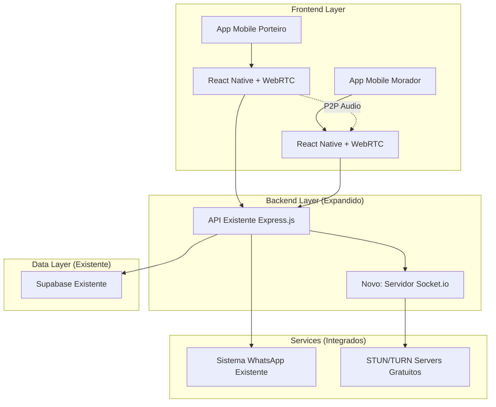
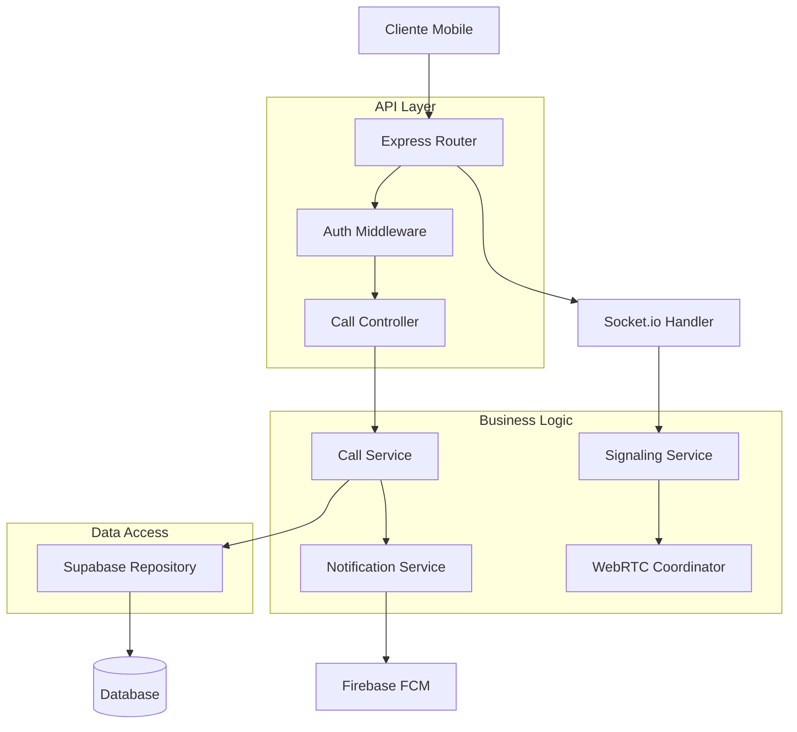
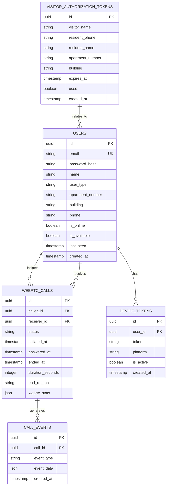

# Arquitetura Técnica - Sistema WebRTC James Avisa

## 1. Design da Arquitetura



## 2. Descrição das Tecnologias

- **Frontend**: React Native + react-native-webrtc + @react-native-firebase/messaging
- **Backend**: Node.js@22 + Express.js@4.18 (já instalado) + Socket.io@4.7 (nova dependência)
- **Database**: Supabase existente (https://ycamhxzumzkpxuhtugxc.supabase.co)
- **Dependências Existentes**: @supabase/supabase-js@2.39, jsonwebtoken@9.0.2, bcrypt@5.1.1, cors@2.8.5
- **Novas Dependências**: socket.io@4.7, simple-peer@9.11
- **Notificações**: Integração com sistema existente de notificações WhatsApp
- **WebRTC**: simple-peer.js + STUN/TURN servers gratuitos

## 3. Definições de Rotas

| Rota | Propósito |
|------|----------|
| /api/webrtc/residents | Listar moradores disponíveis (integra com estrutura existente) |
| /api/webrtc/call/initiate | Iniciar chamada WebRTC |
| /api/webrtc/call/:callId/answer | Responder chamada |
| /api/webrtc/call/:callId/end | Encerrar chamada |
| /api/webrtc/call/history | Histórico de chamadas |
| /api/webrtc/users/status | Status online/offline de usuários |
| /api/webrtc/config | Configurações WebRTC (STUN/TURN) |
| /socket.io/ | Endpoint WebSocket para sinalização |

## 4. Definições de API

### 4.1 APIs Principais

**Autenticação de usuário**
```
POST /api/auth/login
```

Request:
| Nome do Parâmetro | Tipo | Obrigatório | Descrição |
|-------------------|------|-------------|----------|
| email | string | true | Email do usuário |
| password | string | true | Senha do usuário |
| deviceToken | string | false | Token FCM para notificações |

Response:
| Nome do Parâmetro | Tipo | Descrição |
|-------------------|------|----------|
| success | boolean | Status da autenticação |
| token | string | JWT token de sessão |
| user | object | Dados do usuário |
| refreshToken | string | Token para renovação |

Exemplo:
```json
{
  "email": "porteiro@condominio.com",
  "password": "senha123",
  "deviceToken": "fcm_token_here"
}
```

**Iniciar chamada**
```
POST /api/calls/initiate
```

Request:
| Nome do Parâmetro | Tipo | Obrigatório | Descrição |
|-------------------|------|-------------|----------|
| receiverId | string | true | ID do morador destinatário |
| callType | string | true | Tipo: 'audio' |

Response:
| Nome do Parâmetro | Tipo | Descrição |
|-------------------|------|----------|
| callId | string | ID único da chamada |
| socketRoom | string | Sala WebSocket |
| iceServers | array | Configuração STUN/TURN |

**Listar moradores**
```
GET /api/users/residents
```

Response:
| Nome do Parâmetro | Tipo | Descrição |
|-------------------|------|----------|
| residents | array | Lista de moradores |
| total | number | Total de moradores |

**WebSocket Events**
```
// Eventos de sinalização
call:offer - Enviar oferta WebRTC
call:answer - Enviar resposta WebRTC
call:ice-candidate - Trocar ICE candidates
call:end - Encerrar chamada
call:reject - Rejeitar chamada
```

## 5. Arquitetura do Servidor



## 6. Modelo de Dados

### 6.1 Definição do Modelo de Dados



### 6.2 Linguagem de Definição de Dados

**Tabela de Usuários WebRTC (webrtc_users)**
```sql
-- Criar tabela de usuários WebRTC (compatível com sistema existente)
CREATE TABLE webrtc_users (
    id UUID PRIMARY KEY DEFAULT gen_random_uuid(),
    email VARCHAR(255) UNIQUE NOT NULL,
    password_hash VARCHAR(255) NOT NULL,
    name VARCHAR(100) NOT NULL,
    user_type VARCHAR(20) NOT NULL CHECK (user_type IN ('porteiro', 'morador', 'admin')),
    apartment_number VARCHAR(10),
    building VARCHAR(100) NOT NULL,
    phone VARCHAR(20),
    is_online BOOLEAN DEFAULT false,
    is_available BOOLEAN DEFAULT true,
    last_seen TIMESTAMP WITH TIME ZONE DEFAULT NOW(),
    created_at TIMESTAMP WITH TIME ZONE DEFAULT NOW(),
    updated_at TIMESTAMP WITH TIME ZONE DEFAULT NOW()
);

-- Criar índices
CREATE INDEX idx_webrtc_users_email ON webrtc_users(email);
CREATE INDEX idx_webrtc_users_building_type ON webrtc_users(building, user_type);
CREATE INDEX idx_webrtc_users_online_available ON webrtc_users(is_online, is_available);
CREATE INDEX idx_webrtc_users_phone ON webrtc_users(phone);

-- Tabela de Chamadas WebRTC (webrtc_calls)
CREATE TABLE webrtc_calls (
    id UUID PRIMARY KEY DEFAULT gen_random_uuid(),
    caller_id UUID NOT NULL REFERENCES webrtc_users(id),
    receiver_id UUID NOT NULL REFERENCES webrtc_users(id),
    status VARCHAR(20) DEFAULT 'initiated' CHECK (status IN ('initiated', 'ringing', 'answered', 'ended', 'missed', 'rejected')),
    initiated_at TIMESTAMP WITH TIME ZONE DEFAULT NOW(),
    answered_at TIMESTAMP WITH TIME ZONE,
    ended_at TIMESTAMP WITH TIME ZONE,
    duration_seconds INTEGER DEFAULT 0,
    end_reason VARCHAR(50),
    webrtc_stats JSONB,
    created_at TIMESTAMP WITH TIME ZONE DEFAULT NOW()
);

-- Índices para chamadas WebRTC
CREATE INDEX idx_webrtc_calls_caller ON webrtc_calls(caller_id);
CREATE INDEX idx_webrtc_calls_receiver ON webrtc_calls(receiver_id);
CREATE INDEX idx_webrtc_calls_status ON webrtc_calls(status);
CREATE INDEX idx_webrtc_calls_initiated_at ON webrtc_calls(initiated_at DESC);

-- Tabela de Tokens de Dispositivo WebRTC (webrtc_device_tokens)
CREATE TABLE webrtc_device_tokens (
    id UUID PRIMARY KEY DEFAULT gen_random_uuid(),
    user_id UUID NOT NULL REFERENCES webrtc_users(id) ON DELETE CASCADE,
    token VARCHAR(500) NOT NULL,
    platform VARCHAR(20) NOT NULL CHECK (platform IN ('android', 'ios', 'web')),
    is_active BOOLEAN DEFAULT true,
    created_at TIMESTAMP WITH TIME ZONE DEFAULT NOW()
);

-- Índices para tokens WebRTC
CREATE INDEX idx_webrtc_device_tokens_user ON webrtc_device_tokens(user_id);
CREATE INDEX idx_webrtc_device_tokens_active ON webrtc_device_tokens(is_active);
CREATE UNIQUE INDEX idx_webrtc_device_tokens_unique ON webrtc_device_tokens(user_id, token);

-- Tabela de Eventos de Chamada WebRTC (webrtc_call_events)
CREATE TABLE webrtc_call_events (
    id UUID PRIMARY KEY DEFAULT gen_random_uuid(),
    call_id UUID NOT NULL REFERENCES webrtc_calls(id) ON DELETE CASCADE,
    event_type VARCHAR(50) NOT NULL,
    event_data JSONB,
    created_at TIMESTAMP WITH TIME ZONE DEFAULT NOW()
);

-- Índices para eventos WebRTC
CREATE INDEX idx_webrtc_call_events_call ON webrtc_call_events(call_id);
CREATE INDEX idx_webrtc_call_events_type ON webrtc_call_events(event_type);
CREATE INDEX idx_webrtc_call_events_created_at ON webrtc_call_events(created_at DESC);

-- Configurar RLS (Row Level Security) para tabelas WebRTC
ALTER TABLE webrtc_users ENABLE ROW LEVEL SECURITY;
ALTER TABLE webrtc_calls ENABLE ROW LEVEL SECURITY;
ALTER TABLE webrtc_device_tokens ENABLE ROW LEVEL SECURITY;
ALTER TABLE webrtc_call_events ENABLE ROW LEVEL SECURITY;

-- Políticas de segurança WebRTC
CREATE POLICY "WebRTC users can view own data" ON webrtc_users
    FOR SELECT USING (auth.uid() = id);

CREATE POLICY "WebRTC users can update own data" ON webrtc_users
    FOR UPDATE USING (auth.uid() = id);

CREATE POLICY "WebRTC users can view calls they participate" ON webrtc_calls
    FOR SELECT USING (auth.uid() = caller_id OR auth.uid() = receiver_id);

CREATE POLICY "WebRTC users can manage own tokens" ON webrtc_device_tokens
    FOR ALL USING (auth.uid() = user_id);

-- Dados iniciais WebRTC (integração com sistema existente)
-- Inserir usuário porteiro WebRTC de exemplo
INSERT INTO webrtc_users (email, password_hash, name, user_type, building, phone) VALUES 
('porteiro.webrtc@jamesavisa.com', '$2b$10$example_hash', 'João Porteiro WebRTC', 'porteiro', 'Condomínio James Avisa', '+5511999999999');

-- Inserir morador WebRTC de exemplo
INSERT INTO webrtc_users (email, password_hash, name, user_type, apartment_number, building, phone) VALUES 
('morador.webrtc@jamesavisa.com', '$2b$10$example_hash', 'Maria Moradora WebRTC', 'morador', '101', 'Condomínio James Avisa', '+5511888888888');

-- Configuração WebRTC global (pode ser armazenada como configuração do sistema)
-- Servidores STUN/TURN gratuitos para desenvolvimento
-- STUN: stun:stun.l.google.com:19302
-- Para produção, considerar serviços como Twilio TURN ou Metered TURN
```

**Configurações de Permissão Supabase WebRTC**
```sql
-- Conceder permissões básicas para role anon (necessário para webhooks)
GRANT SELECT ON webrtc_users TO anon;
GRANT SELECT ON webrtc_calls TO anon;

-- Conceder permissões completas para role authenticated
GRANT ALL PRIVILEGES ON webrtc_users TO authenticated;
GRANT ALL PRIVILEGES ON webrtc_calls TO authenticated;
GRANT ALL PRIVILEGES ON webrtc_device_tokens TO authenticated;
GRANT ALL PRIVILEGES ON webrtc_call_events TO authenticated;

-- Permissões específicas para integração com sistema existente
-- Permitir que o sistema de visitantes acesse dados de moradores WebRTC
GRANT SELECT ON webrtc_users TO service_role;
GRANT INSERT, UPDATE ON webrtc_calls TO service_role;
```

Esta arquitetura técnica fornece uma base sólida e escalável para implementar o sistema de chamadas WebRTC, com foco em segurança, performance e facilidade de manutenção.