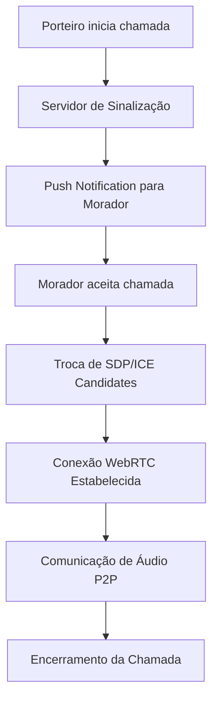
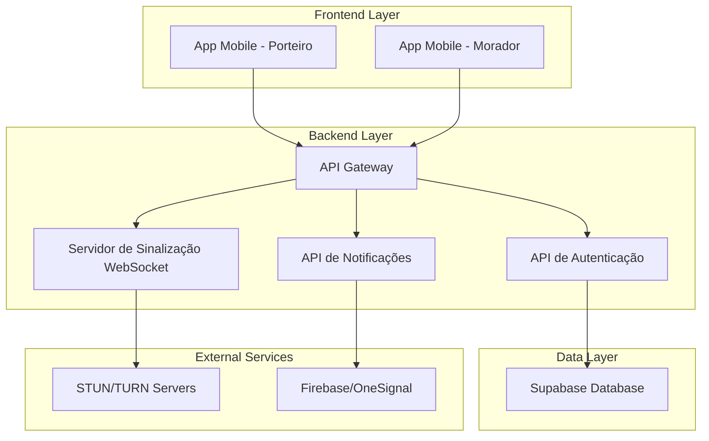
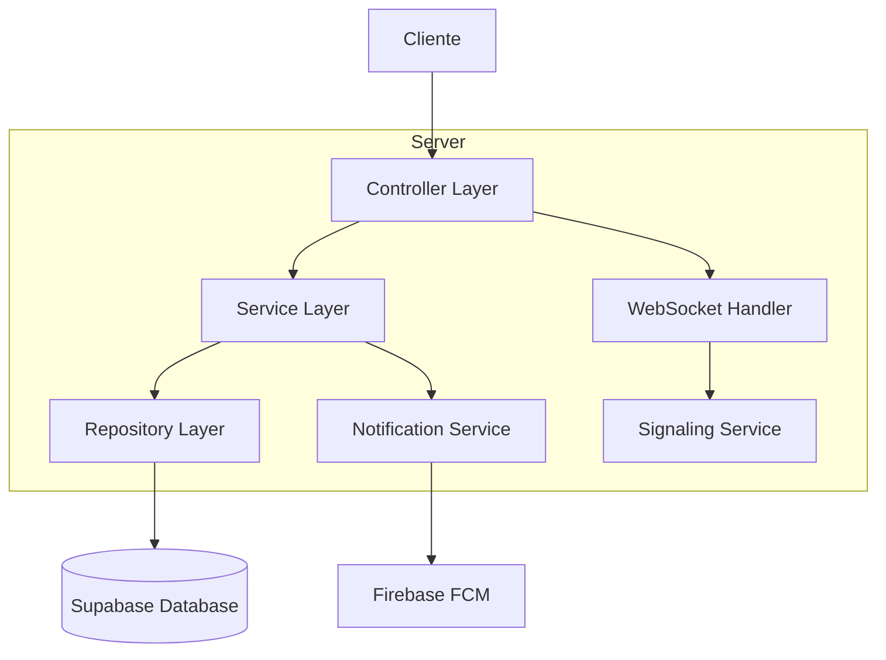
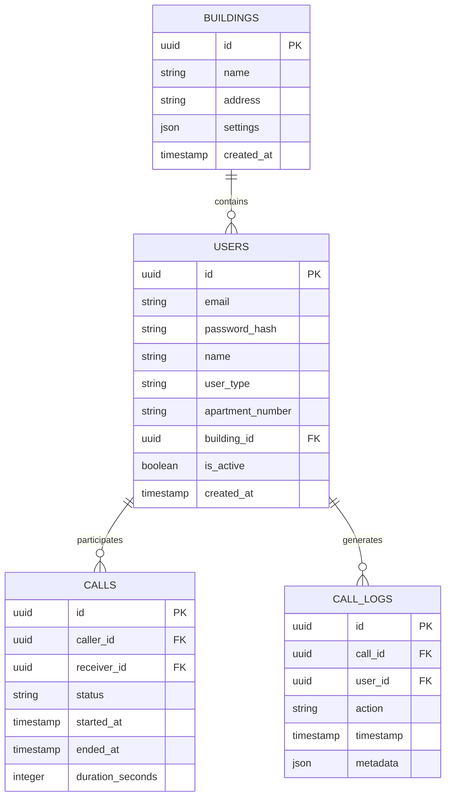

# Planejamento Detalhado - Sistema de Ligações WebRTC para James Avisa

## 1. Visão Geral do Produto

O sistema de ligações WebRTC para o aplicativo James Avisa é uma solução de interfone digital que permite comunicação de áudio em tempo real entre porteiros e moradores. O sistema utiliza tecnologia WebRTC para estabelecer conexões peer-to-peer seguras, proporcionando uma experiência de comunicação eficiente e moderna para condomínios e edifícios residenciais.

- **Objetivo Principal**: Substituir interfones tradicionais por uma solução digital integrada ao ecossistema James Avisa
- **Público-Alvo**: Porteiros autorizados e moradores cadastrados no sistema
- **Valor de Mercado**: Modernização da comunicação predial com redução de custos de infraestrutura física

## 2. Funcionalidades Principais

### 2.1 Papéis de Usuário

| Papel | Método de Registro | Permissões Principais |
|-------|-------------------|----------------------|
| Porteiro | Cadastro administrativo com credenciais específicas | Pode iniciar chamadas, visualizar lista de moradores, acessar histórico de chamadas |
| Morador | Registro via convite do condomínio | Pode receber chamadas, aceitar/recusar ligações, visualizar histórico próprio |
| Administrador | Acesso master do sistema | Gerenciar usuários, configurar permissões, monitorar sistema |

### 2.2 Módulos Funcionais

Nosso sistema de ligações WebRTC consiste nas seguintes páginas principais:

1. **Painel do Porteiro**: lista de moradores, botões de chamada, status de conexão, histórico de chamadas
2. **Interface de Chamada**: controles de áudio, indicadores visuais, botões de aceitar/recusar/encerrar
3. **Painel do Morador**: notificações de chamada, controles de resposta, configurações de disponibilidade
4. **Dashboard Administrativo**: gerenciamento de usuários, logs do sistema, configurações gerais
5. **Página de Configurações**: ajustes de áudio, preferências de notificação, teste de conectividade

### 2.3 Detalhes das Páginas

| Nome da Página | Nome do Módulo | Descrição da Funcionalidade |
|----------------|----------------|-----------------------------|
| Painel do Porteiro | Lista de Moradores | Exibir moradores disponíveis com status online/offline, busca por nome/apartamento |
| Painel do Porteiro | Controles de Chamada | Iniciar chamada de áudio, visualizar status da conexão, encerrar chamada |
| Interface de Chamada | Gerenciamento WebRTC | Estabelecer conexão P2P, controlar qualidade de áudio, detectar falhas de rede |
| Interface de Chamada | Controles de Áudio | Mute/unmute, ajuste de volume, indicador de nível de áudio |
| Painel do Morador | Notificações | Receber alertas de chamada via push notification e interface web |
| Painel do Morador | Resposta de Chamada | Aceitar, recusar ou ignorar chamadas recebidas |
| Dashboard Administrativo | Gerenciamento de Usuários | Cadastrar/remover porteiros e moradores, definir permissões |
| Dashboard Administrativo | Monitoramento | Logs de chamadas, estatísticas de uso, alertas de sistema |
| Configurações | Teste de Conectividade | Verificar conexão WebRTC, testar STUN/TURN servers |
| Configurações | Preferências de Áudio | Configurar dispositivos de entrada/saída, ajustar qualidade |

## 3. Processo Principal

### Fluxo do Porteiro:
1. **Login**: Porteiro faz autenticação no sistema com credenciais específicas
2. **Seleção**: Visualiza lista de moradores e seleciona o destinatário da chamada
3. **Iniciação**: Clica no botão "Chamar" para iniciar o processo de conexão
4. **Aguardo**: Sistema estabelece sinalização e aguarda resposta do morador
5. **Comunicação**: Quando aceita, estabelece conexão WebRTC para áudio
6. **Encerramento**: Finaliza a chamada através do botão dedicado

### Fluxo do Morador:
1. **Notificação**: Recebe push notification e alerta visual/sonoro da chamada
2. **Decisão**: Visualiza identificação do porteiro e decide aceitar/recusar
3. **Resposta**: Clica em aceitar para estabelecer conexão de áudio
4. **Comunicação**: Participa da conversa com controles de áudio disponíveis
5. **Finalização**: Encerra a chamada quando necessário

### Fluxo Técnico de Sinalização:


## 4. Design da Interface do Usuário

### 4.1 Estilo de Design

- **Cores Primárias**: Azul corporativo (#2563EB), Verde de status (#10B981)
- **Cores Secundárias**: Cinza neutro (#6B7280), Vermelho de alerta (#EF4444)
- **Estilo de Botões**: Arredondados com sombra sutil, efeito hover suave
- **Tipografia**: Inter ou Roboto, tamanhos 14px (corpo), 18px (títulos), 24px (cabeçalhos)
- **Layout**: Design card-based com navegação lateral fixa
- **Ícones**: Material Design Icons ou Heroicons para consistência visual

### 4.2 Visão Geral do Design das Páginas

| Nome da Página | Nome do Módulo | Elementos da UI |
|----------------|----------------|----------------|
| Painel do Porteiro | Lista de Moradores | Cards com foto/nome/apartamento, indicadores de status verde/vermelho, botão de chamada azul |
| Interface de Chamada | Controles de Áudio | Botões circulares grandes, indicador de nível de áudio em tempo real, timer de chamada |
| Painel do Morador | Notificações | Modal de chamada recebida com foto do porteiro, botões verde (aceitar) e vermelho (recusar) |
| Dashboard Administrativo | Monitoramento | Gráficos de estatísticas, tabela de logs com filtros, cards de métricas principais |

### 4.3 Responsividade

O sistema é projetado com abordagem mobile-first, garantindo funcionamento otimizado em dispositivos móveis (Android/iOS) e adaptação para desktop. Inclui otimizações para interação touch, gestos intuitivos e interface adaptável a diferentes tamanhos de tela.

## 5. Arquitetura Técnica

### 5.1 Diagrama de Arquitetura



### 5.2 Descrição das Tecnologias

- **Frontend**: React Native para apps móveis, React.js para dashboard web
- **Backend**: Node.js + Express.js para APIs REST
- **WebSocket**: Socket.io para sinalização em tempo real
- **Database**: Supabase (PostgreSQL) para dados estruturados
- **Notificações**: Firebase Cloud Messaging (FCM)
- **WebRTC**: Simple-peer.js para abstração de conexões P2P

### 5.3 Definições de Rotas

| Rota | Propósito |
|------|----------|
| /porteiro/dashboard | Painel principal do porteiro com lista de moradores |
| /porteiro/chamada/:moradorId | Interface de chamada ativa |
| /morador/home | Tela inicial do morador |
| /morador/chamada/:chamadaId | Interface para receber/gerenciar chamadas |
| /admin/usuarios | Gerenciamento de porteiros e moradores |
| /admin/logs | Histórico e monitoramento de chamadas |
| /configuracoes | Ajustes de áudio e conectividade |

### 5.4 Definições de API

#### 4.1 APIs Principais

**Autenticação de usuário**
```
POST /api/auth/login
```

Request:
| Nome do Parâmetro | Tipo | Obrigatório | Descrição |
|-------------------|------|-------------|----------|
| email | string | true | Email do usuário (porteiro/morador) |
| password | string | true | Senha do usuário |
| userType | string | true | Tipo: 'porteiro' ou 'morador' |

Response:
| Nome do Parâmetro | Tipo | Descrição |
|-------------------|------|----------|
| success | boolean | Status da autenticação |
| token | string | JWT token para sessão |
| user | object | Dados do usuário autenticado |

**Iniciar chamada**
```
POST /api/calls/initiate
```

Request:
| Nome do Parâmetro | Tipo | Obrigatório | Descrição |
|-------------------|------|-------------|----------|
| moradorId | string | true | ID do morador destinatário |
| porteiroId | string | true | ID do porteiro que inicia |

Response:
| Nome do Parâmetro | Tipo | Descrição |
|-------------------|------|----------|
| callId | string | Identificador único da chamada |
| signalRoom | string | Sala WebSocket para sinalização |

### 5.5 Arquitetura do Servidor



### 5.6 Modelo de Dados

#### 6.1 Definição do Modelo de Dados



#### 6.2 Linguagem de Definição de Dados

**Tabela de Usuários (users)**
```sql
-- Criar tabela
CREATE TABLE users (
    id UUID PRIMARY KEY DEFAULT gen_random_uuid(),
    email VARCHAR(255) UNIQUE NOT NULL,
    password_hash VARCHAR(255) NOT NULL,
    name VARCHAR(100) NOT NULL,
    user_type VARCHAR(20) NOT NULL CHECK (user_type IN ('porteiro', 'morador', 'admin')),
    apartment_number VARCHAR(10),
    building_id UUID REFERENCES buildings(id),
    is_active BOOLEAN DEFAULT true,
    created_at TIMESTAMP WITH TIME ZONE DEFAULT NOW(),
    updated_at TIMESTAMP WITH TIME ZONE DEFAULT NOW()
);

-- Criar índices
CREATE INDEX idx_users_email ON users(email);
CREATE INDEX idx_users_building_type ON users(building_id, user_type);
CREATE INDEX idx_users_active ON users(is_active);

-- Tabela de Chamadas (calls)
CREATE TABLE calls (
    id UUID PRIMARY KEY DEFAULT gen_random_uuid(),
    caller_id UUID NOT NULL REFERENCES users(id),
    receiver_id UUID NOT NULL REFERENCES users(id),
    status VARCHAR(20) DEFAULT 'initiated' CHECK (status IN ('initiated', 'ringing', 'answered', 'ended', 'missed')),
    started_at TIMESTAMP WITH TIME ZONE DEFAULT NOW(),
    ended_at TIMESTAMP WITH TIME ZONE,
    duration_seconds INTEGER DEFAULT 0,
    created_at TIMESTAMP WITH TIME ZONE DEFAULT NOW()
);

-- Criar índices para chamadas
CREATE INDEX idx_calls_caller ON calls(caller_id);
CREATE INDEX idx_calls_receiver ON calls(receiver_id);
CREATE INDEX idx_calls_status ON calls(status);
CREATE INDEX idx_calls_started_at ON calls(started_at DESC);

-- Dados iniciais
INSERT INTO buildings (name, address, settings) VALUES 
('Edifício Exemplo', 'Rua das Flores, 123', '{"max_porteiros": 3, "call_timeout": 30}');

INSERT INTO users (email, password_hash, name, user_type, building_id) VALUES 
('porteiro@exemplo.com', '$2b$10$...', 'João Porteiro', 'porteiro', (SELECT id FROM buildings LIMIT 1));
```

## 6. Plano de Testes e Validação

### 6.1 Testes de Conectividade
- **Redes Wi-Fi**: Testar em diferentes qualidades de conexão (2.4GHz, 5GHz)
- **Redes Móveis**: Validar funcionamento em 4G/5G com diferentes operadoras
- **Redes Restritas**: Verificar funcionamento através de firewalls corporativos
- **Failover**: Testar transição automática entre STUN e TURN servers

### 6.2 Testes de Qualidade de Áudio
- **Latência**: Medir delay end-to-end (meta: <150ms)
- **Qualidade**: Avaliar clareza de áudio em diferentes condições de rede
- **Eco e Ruído**: Testar cancelamento de eco e supressão de ruído
- **Dispositivos**: Validar com diferentes modelos de smartphones

### 6.3 Testes de Segurança
- **Criptografia**: Verificar DTLS-SRTP para áudio
- **Autenticação**: Testar prevenção de acesso não autorizado
- **Ataques**: Simular tentativas de interceptação e man-in-the-middle
- **Tokens**: Validar expiração e renovação de sessões

### 6.4 Testes de Usabilidade
- **Interface**: Avaliar facilidade de uso para porteiros e moradores
- **Acessibilidade**: Testar com usuários com diferentes necessidades
- **Performance**: Medir tempo de estabelecimento de chamadas
- **Stress**: Testar múltiplas chamadas simultâneas

## 7. Cronograma de Implementação

### Fase 1: Infraestrutura WebRTC (2 semanas)
- **Semana 1**: Configuração de STUN/TURN servers, setup do ambiente de desenvolvimento
- **Semana 2**: Implementação do servidor de sinalização WebSocket, testes básicos de conectividade

### Fase 2: Desenvolvimento Core (3 semanas)
- **Semana 3**: Desenvolvimento das APIs de autenticação e gerenciamento de usuários
- **Semana 4**: Implementação da interface do porteiro e lógica de chamadas
- **Semana 5**: Desenvolvimento da interface do morador e sistema de notificações

### Fase 3: Integração e Testes (1 semana)
- **Semana 6**: Testes integrados, correção de bugs, otimização de performance

### Fase 4: Deploy e Monitoramento (1 semana)
- **Semana 7**: Deploy em produção, configuração de monitoramento, treinamento de usuários

## 8. Considerações Adicionais

### 8.1 Suporte Multiplataforma
- **Android**: Suporte nativo via React Native com otimizações específicas
- **iOS**: Implementação com considerações para App Store guidelines
- **Web**: Dashboard administrativo responsivo para gestão via browser
- **Compatibilidade**: Suporte a versões Android 8+ e iOS 12+

### 8.2 Documentação e Treinamento
- **Manual do Porteiro**: Guia passo-a-passo para uso da funcionalidade
- **Manual do Morador**: Instruções para receber e gerenciar chamadas
- **Documentação Técnica**: APIs, arquitetura e procedimentos de manutenção
- **Vídeos Tutoriais**: Conteúdo visual para facilitar adoção

### 8.3 Backup e Recuperação
- **Dados**: Backup automático diário do banco de dados
- **Logs**: Retenção de 90 dias para auditoria e debugging
- **Failover**: Servidores redundantes para alta disponibilidade
- **Monitoramento**: Alertas automáticos para falhas críticas

### 8.4 Escalabilidade e Performance
- **Arquitetura**: Design preparado para crescimento horizontal
- **Cache**: Implementação de Redis para dados frequentemente acessados
- **CDN**: Distribuição de assets estáticos para melhor performance
- **Métricas**: Monitoramento contínuo de uso e performance do sistema

Este planejamento fornece uma base sólida para implementar um sistema de interfone digital moderno, seguro e eficiente, integrando-se perfeitamente ao ecossistema James Avisa existente.